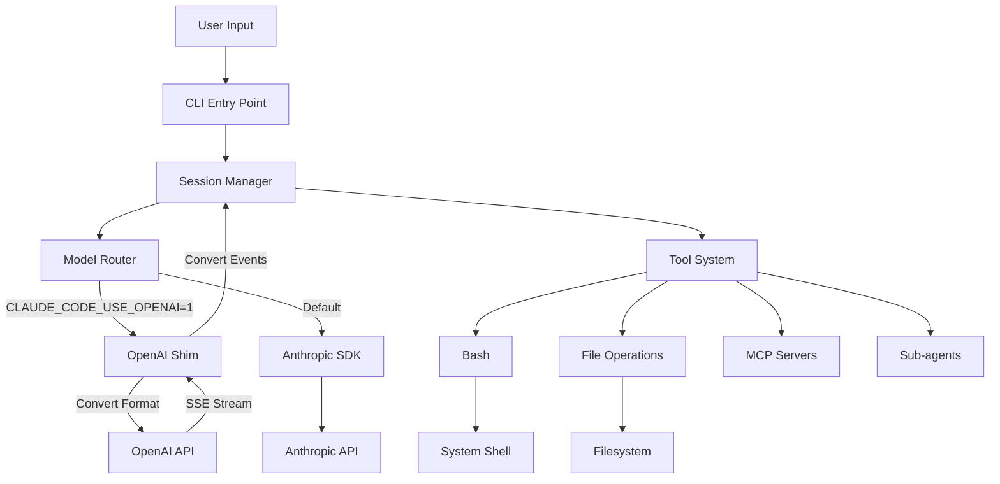

# OpenClaude Architecture Exploration

**Location:** `/home/darkvoid/Boxxed/@formulas/src.rust/src.llamacpp/src.ClaudOpen/openclaude`

**Repository:** https://gitlawb.com/z6MkqDnb7Siv3Cwj7pGJq4T5EsUisECqR8KpnDLwcaZq5TPr/openclaude

**Explored at:** 2026-04-02

---

## Executive Summary

OpenClaude is a **provider-agnostic fork of Claude Code** that replaces Anthropic's API with an OpenAI-compatible shim, enabling use of any OpenAI-compatible LLM (GPT-4o, DeepSeek, Ollama, Gemini, etc.) while maintaining full compatibility with Claude Code's tool system.

### Key Statistics

| Metric | Value |
|--------|-------|
| Files Changed from Original | 6 |
| Lines Added | 786 |
| Dependencies Added | 0 |
| Core Shim File | `src/services/api/openaiShim.ts` (724 lines) |

---

## System Architecture

### High-Level Data Flow



### Provider Routing Architecture

```mermaid
graph LR
    Env[Environment Variables] --> Router[Provider Router]
    
    Router -->|openai| OpenAI[OpenAI Provider]
    Router -->|bedrock| Bedrock[AWS Bedrock]
    Router -->|vertex| Vertex[GCP Vertex]
    Router -->|foundry| Foundry[Azure Foundry]
    Router -->|firstParty| Direct[Direct Anthropic]
    
    OpenAI --> Shim[OpenAI Shim]
    Bedrock --> BedrockSDK[@anthropic-ai/bedrock-sdk]
    Vertex --> VertexSDK[@anthropic-ai/vertex-sdk]
    Foundry --> FoundrySDK[@anthropic-ai/foundry-sdk]
    Direct --> AnthropicSDK[@anthropic-ai/sdk]
```

---

## Core Components

### 1. OpenAI Shim (`src/services/api/openaiShim.ts`)

The heart of OpenClaude — a 724-line translation layer that enables OpenAI-compatible providers.

#### Responsibilities

1. **Message Format Conversion**: Anthropic blocks → OpenAI messages
2. **Tool Call Translation**: `tool_use`/`tool_result` → OpenAI function calls
3. **Stream Event Transformation**: OpenAI SSE → Anthropic stream events
4. **Client Duck-Typing**: Presents as Anthropic SDK to rest of codebase

#### Key Interfaces

```typescript
// Anthropic-format stream events
interface AnthropicStreamEvent {
  type: string
  message?: Record<string, unknown>
  index?: number
  content_block?: Record<string, unknown>
  delta?: Record<string, unknown>
  usage?: Partial<AnthropicUsage>
}

// OpenAI message format
interface OpenAIMessage {
  role: 'system' | 'user' | 'assistant' | 'tool'
  content?: string | Array<{ type: string; text?: string; image_url?: { url: string } }>
  tool_calls?: Array<{
    id: string
    type: 'function'
    function: { name: string; arguments: string }
  }>
  tool_call_id?: string
  name?: string
}
```

#### Message Conversion Flow

```
Anthropic Format                    OpenAI Format
────────────────                    ─────────────
{ role: "user" }              →     { role: "user", content: "..." }
{ role: "assistant", 
  content: [{ type: "text" }] } →  { role: "assistant", content: "..." }
{ role: "assistant",
  content: [{ type: "tool_use",
             id: "abc",
             name: "bash",
             input: {...}] }  →    { role: "assistant",
                                     tool_calls: [{
                                       id: "abc",
                                       function: {
                                         name: "bash",
                                         arguments: "{...}"
                                       }
                                     }] }
{ role: "user",
  content: [{ type: "tool_result",
             tool_use_id: "abc",
             content: "output" }] } → { role: "tool",
                                        tool_call_id: "abc",
                                        content: "output" }
```

#### Streaming Architecture

```typescript
async function* openaiStreamToAnthropic(
  response: Response,
  model: string,
): AsyncGenerator<AnthropicStreamEvent> {
  // 1. Emit message_start
  yield { type: 'message_start', message: {...} }
  
  // 2. Read OpenAI SSE stream
  for each chunk:
    // Text content
    if delta.content:
      yield { type: 'content_block_start', ... }
      yield { type: 'content_block_delta', delta: { text } }
    
    // Tool calls
    if delta.tool_calls:
      yield { type: 'content_block_start', content_block: { type: 'tool_use' } }
      yield { type: 'content_block_delta', delta: { partial_json } }
    
    // Finish
    if finish_reason:
      yield { type: 'content_block_stop' }
      yield { type: 'message_delta', delta: { stop_reason } }
  
  // 3. Emit message_stop
  yield { type: 'message_stop' }
}
```

#### Client Implementation

```typescript
class OpenAIShimMessages {
  async create(params, options) {
    // Convert Anthropic messages to OpenAI format
    const openaiMessages = convertMessages(params.messages, params.system)
    
    // Build OpenAI request body
    const body = {
      model: params.model,
      messages: openaiMessages,
      max_tokens: params.max_tokens,
      stream: params.stream,
      tools: convertTools(params.tools),
      temperature: params.temperature,
      top_p: params.top_p,
    }
    
    // Make HTTP request
    const response = await fetch(`${this.baseUrl}/chat/completions`, {
      method: 'POST',
      headers: { Authorization: `Bearer ${this.apiKey}` },
      body: JSON.stringify(body),
    })
    
    // Return stream or parsed response
    if (params.stream) {
      return new OpenAIShimStream(openaiStreamToAnthropic(response))
    }
    return this._convertNonStreamingResponse(await response.json())
  }
}
```

### 2. Client Router (`src/services/api/client.ts`)

Determines which provider to use based on environment variables.

#### Provider Detection Logic

```typescript
export function getAPIProvider(): APIProvider {
  return isEnvTruthy(process.env.CLAUDE_CODE_USE_OPENAI)
    ? 'openai'
    : isEnvTruthy(process.env.CLAUDE_CODE_USE_BEDROCK)
      ? 'bedrock'
      : isEnvTruthy(process.env.CLAUDE_CODE_USE_VERTEX)
        ? 'vertex'
        : isEnvTruthy(process.env.CLAUDE_CODE_USE_FOUNDRY)
          ? 'foundry'
          : 'firstParty'
}
```

#### Client Creation Flow

```typescript
export async function getAnthropicClient(options): Promise<Anthropic> {
  // OpenAI provider
  if (isEnvTruthy(process.env.CLAUDE_CODE_USE_OPENAI)) {
    const { createOpenAIShimClient } = await import('./openaiShim.js')
    return createOpenAIShimClient(options)
  }
  
  // Bedrock provider
  if (isEnvTruthy(process.env.CLAUDE_CODE_USE_BEDROCK)) {
    const { AnthropicBedrock } = await import('@anthropic-ai/bedrock-sdk')
    return new AnthropicBedrock(bedrockArgs)
  }
  
  // Vertex provider
  if (isEnvTruthy(process.env.CLAUDE_CODE_USE_VERTEX)) {
    const { AnthropicVertex } = await import('@anthropic-ai/vertex-sdk')
    return new AnthropicVertex(vertexArgs)
  }
  
  // Foundry provider
  if (isEnvTruthy(process.env.CLAUDE_CODE_USE_FOUNDRY)) {
    const { AnthropicFoundry } = await import('@anthropic-ai/foundry-sdk')
    return new AnthropicFoundry(foundryArgs)
  }
  
  // Default: First-party Anthropic
  return new Anthropic(clientConfig)
}
```

### 3. Model Configuration (`src/utils/model/configs.ts`)

Maps Claude model tiers to provider-specific model names.

#### Model Tier Mappings

```typescript
export const OPENAI_MODEL_DEFAULTS = {
  opus: 'gpt-4o',           // Best reasoning
  sonnet: 'gpt-4o-mini',    // Balanced
  haiku: 'gpt-4o-mini',     // Fast & cheap
} as const

// Example: Claude 3.7 Sonnet config
export const CLAUDE_3_7_SONNET_CONFIG = {
  firstParty: 'claude-3-7-sonnet-20250219',
  bedrock: 'us.anthropic.claude-3-7-sonnet-20250219-v1:0',
  vertex: 'claude-3-7-sonnet@20250219',
  foundry: 'claude-3-7-sonnet',
  openai: 'gpt-4o-mini',
} as const satisfies ModelConfig
```

#### Model Resolution Flow

```typescript
export function getSmallFastModel(): ModelName {
  if (process.env.ANTHROPIC_SMALL_FAST_MODEL) 
    return process.env.ANTHROPIC_SMALL_FAST_MODEL
  
  // OpenAI provider uses OPENAI_MODEL or default
  if (getAPIProvider() === 'openai') {
    return process.env.OPENAI_MODEL || 'gpt-4o-mini'
  }
  
  // Default Haiku for Anthropic
  return getDefaultHaikuModel()
}

export function getDefaultOpusModel(): ModelName {
  if (getAPIProvider() === 'openai') {
    return process.env.OPENAI_MODEL || 'gpt-4o'
  }
  return 'claude-opus-4-6'  // Anthropic default
}
```

### 4. Provider Detection (`src/utils/model/providers.ts`)

```typescript
export type APIProvider = 
  | 'firstParty'   // Direct Anthropic API
  | 'bedrock'      // AWS Bedrock
  | 'vertex'       // GCP Vertex AI
  | 'foundry'      // Azure Foundry
  | 'openai'       // OpenAI-compatible (OpenClaude)
```

---

## Python Extensions

### Smart Router (`smart_router.py`)

An intelligent multi-provider router that automatically selects the best provider for each request.

#### Architecture

```python
@dataclass
class Provider:
    name: str                        # "openai", "gemini", "ollama"
    ping_url: str                    # Health check URL
    api_key_env: str                 # Env var for API key
    cost_per_1k_tokens: float        # Cost estimate
    big_model: str                   # Model for large requests
    small_model: str                 # Model for small requests
    latency_ms: float = 9999.0       # Measured latency
    healthy: bool = True             # Health status
    request_count: int = 0           # Total requests
    error_count: int = 0             # Total errors
    avg_latency_ms: float = 9999.0   # Rolling average
```

#### Provider Selection Algorithm

```python
def score(self, strategy: str = "balanced") -> float:
    """Lower score = better provider."""
    if not self.healthy or not self.is_configured:
        return float("inf")
    
    latency_score = self.avg_latency_ms / 1000.0
    cost_score = self.cost_per_1k_tokens * 100
    error_penalty = self.error_rate * 500
    
    if strategy == "latency":
        return latency_score + error_penalty
    elif strategy == "cost":
        return cost_score + error_penalty
    else:  # balanced
        return (latency_score * 0.5) + (cost_score * 0.5) + error_penalty

def select_provider(self) -> Optional[Provider]:
    """Pick the best available provider."""
    available = [p for p in self.providers if p.healthy and p.is_configured]
    return min(available, key=lambda p: p.score(self.strategy))
```

#### Routing Flow

```python
async def route(
    self,
    messages: list[dict],
    claude_model: str = "claude-sonnet",
) -> dict:
    # 1. Determine request size
    large = self.is_large_request(messages)
    
    # 2. Filter available providers
    available = [
        p for p in self.providers
        if p.healthy and p.is_configured
    ]
    
    # 3. Select best by score
    provider = min(available, key=lambda p: p.score(self.strategy))
    
    # 4. Map Claude model to provider model
    model = self.get_model_for_provider(provider, claude_model)
    
    return {
        "provider": provider.name,
        "model": model,
        "api_key": provider.api_key,
    }
```

#### Learning from Results

```python
async def record_result(
    self,
    provider_name: str,
    success: bool,
    duration_ms: float,
) -> None:
    """Update provider scores based on actual performance."""
    provider = next(p for p in self.providers if p.name == provider_name)
    
    provider.request_count += 1
    if success:
        # Exponential moving average update
        alpha = 0.3
        provider.avg_latency_ms = (
            alpha * duration_ms + (1 - alpha) * provider.avg_latency_ms
        )
    else:
        provider.error_count += 1
        # Mark unhealthy after 3+ failures with >70% error rate
        if provider.error_rate > 0.7:
            provider.healthy = False
            asyncio.create_task(self._recheck_provider(provider, delay=60))
```

### Ollama Provider (`ollama_provider.py`)

Native Ollama integration with streaming support.

#### Key Functions

```python
async def ollama_chat_stream(
    model: str,
    messages: list[dict],
    system: str | None = None,
    max_tokens: int = 4096,
    temperature: float = 1.0,
) -> AsyncIterator[str]:
    """Stream Ollama responses in Anthropic format."""
    
    # Convert messages
    ollama_messages = anthropic_to_ollama_messages(messages)
    if system:
        ollama_messages.insert(0, {"role": "system", "content": system})
    
    # Build request
    payload = {
        "model": model,
        "messages": ollama_messages,
        "stream": True,
        "options": {"num_predict": max_tokens, "temperature": temperature},
    }
    
    # Stream response
    async with httpx.AsyncClient().stream("POST", 
                                          f"{OLLAMA_BASE_URL}/api/chat", 
                                          json=payload) as resp:
        async for line in resp.aiter_lines():
            chunk = json.loads(line)
            delta = chunk.get("message", {}).get("content", "")
            
            # Emit Anthropic-format events
            yield "event: content_block_delta\n"
            yield f'data: {{"type": "content_block_delta", "delta": {{"text": "{delta}"}}}}\n\n'
```

#### Message Conversion

```python
def anthropic_to_ollama_messages(messages: list[dict]) -> list[dict]:
    """Convert Anthropic messages to Ollama format."""
    ollama_messages = []
    for msg in messages:
        role = msg.get("role", "user")
        content = msg.get("content", "")
        
        if isinstance(content, str):
            ollama_messages.append({"role": role, "content": content})
        elif isinstance(content, list):
            text_parts = []
            for block in content:
                if block.get("type") == "text":
                    text_parts.append(block.get("text", ""))
                elif block.get("type") == "image":
                    text_parts.append("[image]")
            ollama_messages.append({"role": role, "content": "\n".join(text_parts)})
    return ollama_messages
```

---

## Build System

### Build Script (`scripts/build.ts`)

Bundles the TypeScript source into a distributable JS file.

#### Build Configuration

```typescript
const result = await Bun.build({
  entrypoints: ['./src/entrypoints/cli.tsx'],
  outdir: './dist',
  target: 'node',
  format: 'esm',
  splitting: false,
  sourcemap: 'external',
  minify: false,
  naming: 'cli.mjs',
  define: {
    'MACRO.VERSION': JSON.stringify('99.0.0'),
    'MACRO.DISPLAY_VERSION': JSON.stringify(version),
    'MACRO.BUILD_TIME': JSON.stringify(new Date().toISOString()),
  },
  plugins: [
    // Stub out internal-only features
    { name: 'bun-bundle-shim', setup(build) {
      build.onResolve({ filter: /^bun:bundle$/ }, ...)
      build.onLoad({ filter: /.*/, namespace: 'native-stub' }, ...)
    }}
  ],
  external: [
    '@opentelemetry/*',
    '@aws-sdk/*',
    '@azure/identity',
    'google-auth-library',
  ],
})
```

### Feature Flags

Disabled in open build (Anthropic-internal features):

```typescript
const featureFlags = {
  VOICE_MODE: false,
  PROACTIVE: false,
  KAIROS: false,
  BRIDGE_MODE: false,
  DAEMON: false,
  AGENT_TRIGGERS: false,
  MONITOR_TOOL: false,
  // ... and more
}
```

---

## Runtime Diagnostics

### System Check (`scripts/system-check.ts`)

Comprehensive runtime validation.

#### Checks Performed

```typescript
async function main(): Promise<void> {
  results.push(checkNodeVersion())           // Node >= 20
  results.push(checkBunRuntime())             // Bun availability
  results.push(checkBuildArtifacts())         // dist/cli.mjs exists
  results.push(...checkOpenAIEnv())           // Provider env vars
  results.push(await checkBaseUrlReachability())  // API reachable
  results.push(checkOllamaProcessorMode())    // GPU vs CPU mode
}
```

#### Environment Validation

```typescript
function checkOpenAIEnv(): CheckResult[] {
  const useOpenAI = isTruthy(process.env.CLAUDE_CODE_USE_OPENAI)
  
  if (!useOpenAI) {
    return [pass('Provider mode', 'Anthropic login flow enabled')]
  }
  
  const baseUrl = process.env.OPENAI_BASE_URL ?? 'https://api.openai.com/v1'
  const model = process.env.OPENAI_MODEL
  const key = process.env.OPENAI_API_KEY
  
  // Check for placeholder key
  if (key === 'SUA_CHAVE') {
    results.push(fail('OPENAI_API_KEY', 'Placeholder value detected'))
  }
  // Local providers don't need a key
  else if (!key && !isLocalBaseUrl(baseUrl)) {
    results.push(fail('OPENAI_API_KEY', 'Missing key for remote provider'))
  }
  else if (!key) {
    results.push(pass('OPENAI_API_KEY', 'Not required for local providers'))
  }
  
  return results
}
```

### Profile Management

#### Profile File Format

```json
{
  "profile": "ollama",
  "env": {
    "OPENAI_BASE_URL": "http://localhost:11434/v1",
    "OPENAI_MODEL": "llama3.1:8b"
  },
  "createdAt": "2026-04-02T12:00:00.000Z"
}
```

#### Profile Bootstrap (`scripts/provider-bootstrap.ts`)

```typescript
async function main(): Promise<void> {
  // Auto-detect provider
  const provider = parseProviderArg()
  if (provider === 'auto') {
    selected = (await hasLocalOllama()) ? 'ollama' : 'openai'
  }
  
  // Build environment
  if (selected === 'ollama') {
    env.OPENAI_BASE_URL = argBaseUrl || 'http://localhost:11434/v1'
    env.OPENAI_MODEL = argModel || 'llama3.1:8b'
    // No key needed
  } else {
    env.OPENAI_BASE_URL = argBaseUrl || 'https://api.openai.com/v1'
    env.OPENAI_MODEL = argModel || 'gpt-4o'
    env.OPENAI_API_KEY = requiredApiKey
  }
  
  // Persist profile
  writeFileSync('.openclaude-profile.json', JSON.stringify(profile))
}
```

#### Profile Launcher (`scripts/provider-launch.ts`)

```typescript
async function main(): Promise<void> {
  // Load persisted profile or auto-detect
  const persisted = loadPersistedProfile()
  let profile = requestedProfile === 'auto' 
    ? persisted?.profile || (await hasLocalOllama()) ? 'ollama' : 'openai'
    : requestedProfile
  
  // Build environment
  const env = buildEnv(profile, persisted)
  
  // Apply fast mode flags
  if (options.fast) {
    applyFastFlags(env)
  }
  
  // Run diagnostics before launch
  const doctorCode = await runCommand('bun run doctor:runtime', env)
  if (doctorCode !== 0) {
    process.exit(doctorCode)
  }
  
  // Launch application
  await runCommand('bun run dev', env)
}
```

---

## File Structure

```
openclaude/
├── src/
│   ├── services/
│   │   └── api/
│   │       ├── openaiShim.ts       # Core translation layer (724 lines)
│   │       ├── client.ts           # Provider router
│   │       └── ...
│   ├── utils/
│   │   └── model/
│   │       ├── providers.ts        # Provider type definitions
│   │       ├── configs.ts          # Model tier mappings
│   │       ├── model.ts            # Model resolution logic
│   │       └── ...
│   └── ...
├── scripts/
│   ├── build.ts                    # Bun build configuration
│   ├── system-check.ts             # Runtime diagnostics
│   ├── provider-launch.ts          # Profile launcher
│   └── provider-bootstrap.ts       # Profile initializer
├── smart_router.py                 # Multi-provider router
├── ollama_provider.py              # Native Ollama integration
├── package.json                    # Dependencies and scripts
├── bun.lock                        # Bun lockfile
└── README.md                       # User documentation
```

---

## Dependencies

### Production Dependencies (Key)

```json
{
  "@anthropic-ai/sdk": "^0.81.0",
  "@anthropic-ai/bedrock-sdk": "^0.26.0",
  "@anthropic-ai/vertex-sdk": "^0.14.0",
  "@anthropic-ai/foundry-sdk": "^0.2.0",
  "zod": "^3.24.0",
  "ws": "^8.18.0",
  "undici": "^7.3.0"
}
```

### Development Dependencies

```json
{
  "@types/bun": "^1.2.0",
  "@types/node": "^25.5.0",
  "typescript": "^5.7.0"
}
```

**Note:** OpenClaude adds **zero new dependencies** — it only uses the existing Anthropic SDK packages already in Claude Code.

---

## Security Considerations

### API Key Handling

- Keys are read from environment variables only
- Placeholder values (`SUA_CHAVE`) are rejected with clear error messages
- Local providers (Ollama, LM Studio) don't require API keys
- Keys are never logged or persisted (except in optional `.openclaude-profile.json`, which is gitignored)

### Provider Validation

- Provider reachability is checked before launching
- Health status is monitored during operation
- Automatic fallback on provider failure
- Error rate tracking with exponential backoff

---

## Performance Characteristics

### Streaming Latency

- First token latency depends on provider
- OpenAI: ~100-300ms
- DeepSeek: ~200-500ms
- Ollama (local GPU): ~50-200ms
- Ollama (CPU): ~500-2000ms

### Throughput

- OpenAI GPT-4o: ~50-100 tokens/sec
- DeepSeek V3: ~80-120 tokens/sec
- Ollama Llama 3.3 70B (GPU): ~20-40 tokens/sec
- Ollama Llama 3.1 8B (GPU): ~50-80 tokens/sec

### Memory Footprint

- CLI process: ~150-300MB
- Additional memory for large context windows
- No additional overhead from the shim itself

---

## Testing Strategy

### Smoke Test

```bash
bun run build && node dist/cli.mjs --version
```

### Runtime Doctor

```bash
bun run doctor:runtime
```

### Type Checking

```bash
bun run typecheck
```

### Full Hardening Check

```bash
bun run hardening:strict
# Runs: typecheck, smoke, doctor:runtime
```

---

## Extension Points

### Adding a New Provider

1. **Add environment variable detection** in `client.ts`:
```typescript
if (isEnvTruthy(process.env.CLAUDE_CODE_USE_MYPROVIDER)) {
  const { createMyProviderClient } = await import('./myProviderShim.js')
  return createMyProviderClient(options)
}
```

2. **Create the shim** following `openaiShim.ts` pattern:
   - Convert Anthropic messages to provider format
   - Convert provider stream to Anthropic events
   - Return duck-typed client

3. **Add model mappings** in `configs.ts`:
```typescript
export const MYPROVIDER_MODEL_DEFAULTS = {
  opus: 'best-model',
  sonnet: 'balanced-model',
  haiku: 'fast-model',
}
```

### Custom Message Processing

Override `convertMessages()` in the shim:
```typescript
function convertMessages(messages, system): OpenAIMessage[] {
  // Custom conversion logic
  // Handle custom content block types
  // Add provider-specific transformations
}
```

---

## Known Limitations

1. **No Extended Thinking**: Anthropic's thinking mode is not supported (OpenAI uses different reasoning approaches)

2. **No Prompt Caching**: Anthropic-specific cache headers are ignored

3. **No Beta Features**: Anthropic beta headers are not sent

4. **Token Limits**: Defaults to 32K output — some providers may have lower limits

5. **Tool Schema Differences**: Some providers may not support all tool features (strict mode, complex schemas)

---

## References

- [README.md](/home/darkvoid/Boxxed/@formulas/src.rust/src.llamacpp/src.ClaudOpen/openclaude/README.md) — User-facing documentation
- [PLAYBOOK.md](/home/darkvoid/Boxxed/@formulas/src.rust/src.llamacpp/src.ClaudOpen/openclaude/PLAYBOOK.md) — Practical usage guide
- [00-zero-to-openclaude-engineer.md](./00-zero-to-openclaude-engineer.md) — Fundamentals guide
- [production-grade.md](./production-grade.md) — Production deployment guide
