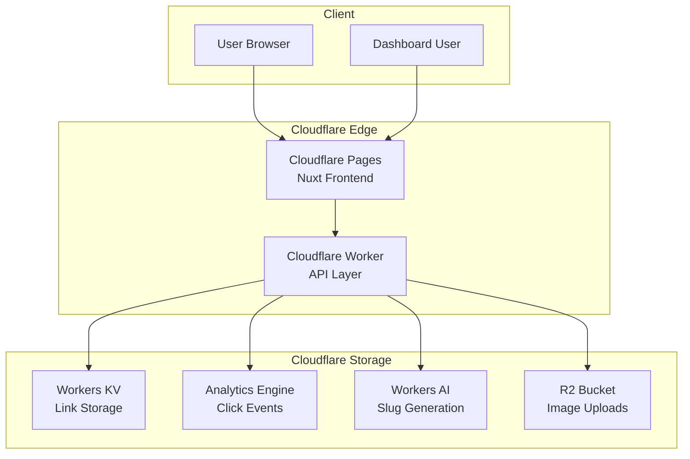
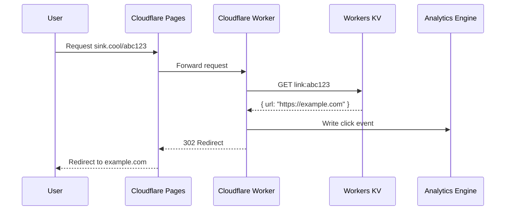
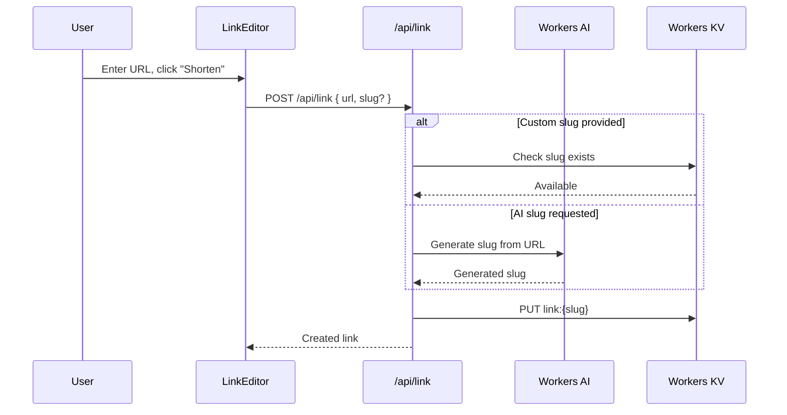
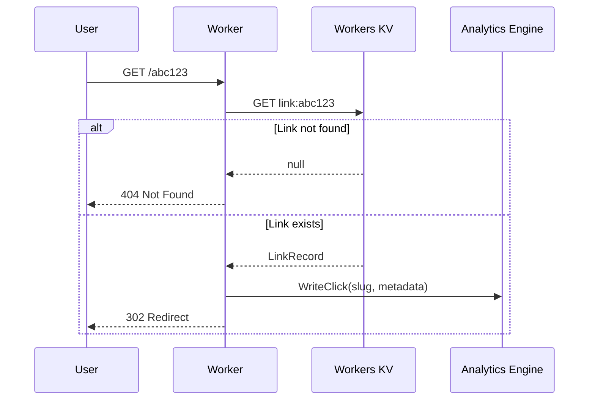

# Sink: Complete Exploration

## Executive Summary

**Sink** is a production-ready URL shortener with real-time analytics, running 100% on Cloudflare's serverless infrastructure. It combines a Nuxt 4 frontend with Cloudflare Workers backend, Workers KV for storage, and Analytics Engine for click tracking.

### Key Innovation

Sink demonstrates how to build a **fully serverless** application that handles:
- URL shortening with custom slugs
- AI-powered slug generation (Cloudflare Workers AI)
- Real-time analytics with 3D globe visualization
- Multi-language dashboard (i18n)
- Device-specific routing (iOS/Android)
- Link expiration
- QR code generation
- OpenGraph social previews

| Aspect | Sink |
|--------|------|
| **Core Innovation** | 100% Cloudflare serverless stack with real-time analytics |
| **Frontend** | Nuxt 4 + Vue 3 + shadcn-vue + TailwindCSS |
| **Backend** | Cloudflare Workers (Hono-like API routes) |
| **Storage** | Workers KV (links), Analytics Engine (events), R2 (uploads) |
| **AI Features** | Workers AI for smart slug generation |
| **Lines of Code** | ~5,000 (application) |
| **Architecture** | Edge-native with file-based routing |

---

## Table of Contents

This exploration consists of multiple deep-dive documents:

### Part 1: Foundations
1. **[Zero to Cloudflare Engineer](00-zero-to-cloudflare-engineer.md)** - Start here if new to Cloudflare
   - What is Cloudflare Workers?
   - Workers KV fundamentals
   - Analytics Engine
   - Edge runtime concepts

### Part 2: Core Implementation
2. **[Storage Engine Deep Dive](01-storage-engine-deep-dive.md)**
   - Workers KV data modeling
   - Link storage schemas
   - Indexing strategies
   - R2 bucket for uploads

3. **[API Layer Deep Dive](02-api-layer-deep-dive.md)**
   - File-based API routing
   - Request validation with Zod
   - Error handling patterns
   - Middleware composition

4. **[Analytics Engine Deep Dive](03-analytics-deep-dive.md)**
   - Event ingestion pipeline
   - Real-time aggregation
   - 3D globe visualization
   - Query optimization

5. **[AI Integration Deep Dive](04-ai-slug-generation.md)**
   - Workers AI integration
   - Prompt engineering for slugs
   - Fallback strategies

### Part 3: Production & Rust
6. **[Rust Revision](rust-revision.md)** - How to replicate in Rust
   - Worker-based Rust implementation
   - valtron executor patterns
   - No async/tokio approach

7. **[Production Grade](production-grade.md)** - Production considerations
   - Multi-region deployment
   - Rate limiting
   - Monitoring & alerting
   - Cost optimization

---

## Repository Structure

```
Sink/
├── app/                        # Nuxt 4 application layer
│   ├── components/
│   │   └── ui/                 # shadcn-vue components (auto-generated)
│   │   ├── home/               # Landing page components
│   │   └── dashboard/          # Dashboard components
│   ├── composables/            # Vue composables (use*)
│   ├── pages/                  # File-based routing
│   │   ├── index.vue           # Landing page
│   │   ├── dashboard/          # Dashboard pages
│   │   └── [slug].vue          # Dynamic redirect routes
│   ├── types/                  # TypeScript type re-exports
│   ├── utils/                  # Client utilities
│   └── lib/                    # Shared helpers
├── layers/
│   └── dashboard/              # Feature layer (extends app/)
│       └── app/components/dashboard/
├── shared/                     # Shared client + server code
│   ├── schemas/                # Zod validation schemas
│   └── types/                  # Shared TypeScript types
├── server/                     # Nitro server (Cloudflare Workers)
│   ├── api/                    # API endpoints
│   │   ├── link/
│   │   │   ├── create.post.ts  # Create short link
│   │   │   ├── list.get.ts     # List links
│   │   │   └── [slug].delete.ts # Delete link
│   │   ├── analytics/
│   │   └── ai/
│   └── utils/                  # Server utilities (auto-imported)
├── tests/                      # Vitest tests
│   ├── api/                    # API integration tests
│   └── utils/                  # Test utilities
├── scripts/                    # Build scripts
│   ├── build-map.js            # 3D globe data
│   ├── build-sphere.js         # Sphere visualization
│   └── build-testimonials.js   # Static data generation
├── i18n/                       # Internationalization
│   └── locales/                # Translation files
├── docs/                       # Documentation
│   ├── deployment/             # Deployment guides
│   └── images/                 # Screenshots
├── public/                     # Static assets
├── worker-configuration.d.ts   # Cloudflare bindings (auto-generated)
├── wrangler.jsonc              # Wrangler configuration
├── nuxt.config.ts              # Nuxt configuration
├── package.json                # Dependencies
└── pnpm-lock.yaml              # pnpm lockfile
```

---

## Architecture

### High-Level Diagram



### Request Flow



---

## Component Breakdown

### Frontend (Nuxt 4)

#### Pages Structure
- **Landing Page** (`index.vue`) - Marketing page with features, stats, testimonials
- **Dashboard** (`/dashboard/*`) - Link management, analytics view
- **Redirect** (`/[slug].vue`) - Handles short link redirects

#### Key Components
- **LinkEditor** - Create/edit short links with AI slug generation
- **LinkTable** - Paginated table with search, filter, sort
- **AnalyticsMap** - Real-time 3D globe showing click locations
- **QRCodeGenerator** - Generate QR codes for links
- **OpenGraphPreview** - Social media preview customization

#### State Management
- **Pinia Stores** - `auth.ts`, `links.ts`, `analytics.ts`
- **Composables** - `useAuthToken()`, `useFetchLinks()`, `useAnalytics()`

### Backend (Cloudflare Workers)

#### API Routes

| Method | Endpoint | Purpose |
|--------|----------|---------|
| POST | `/api/link` | Create short link |
| GET | `/api/link` | List user's links |
| GET | `/api/link/:slug` | Get link details |
| PATCH | `/api/link/:slug` | Update link |
| DELETE | `/api/link/:slug` | Delete link |
| GET | `/api/analytics/:slug` | Get analytics for slug |
| POST | `/api/ai/slug` | Generate AI slug |
| GET | `/api/health` | Health check |

#### Storage Schemas

```typescript
// Link storage in Workers KV
interface LinkRecord {
  id: string           // Unique ID (nanoid)
  slug: string         // Custom or generated slug
  url: string          // Target URL
  createdAt: number    // Unix timestamp
  expiresAt?: number   // Optional expiration
  password?: string    // Optional password protection
  og?: {             // OpenGraph preview
    title: string
    description: string
    image: string
  }
  deviceRouting?: {  // Device-specific URLs
    ios: string
    android: string
  }
}

// Analytics events in Analytics Engine
interface ClickEvent {
  slug: string
  timestamp: number
  country: string
  city: string
  continent: string
  device: 'desktop' | 'mobile' | 'tablet'
  browser: string
  os: string
  referrer: string
}
```

---

## Data Flow

### Creating a Link



### Clicking a Link



---

## External Dependencies

| Dependency | Purpose | Version |
|------------|---------|---------|
| nuxt | Full-stack framework | ^4.3.0 |
| vue | UI framework | ^3.5.x |
| @nuxtjs/i18n | Internationalization | ^10.2.1 |
| pinia | State management | ^0.11.3 |
| shadcn-vue | UI components | ^2.4.3 |
| tailwindcss | Styling | ^4.1.18 |
| lucide-vue-next | Icons | ^0.563.0 |
| @cloudflare/vitest-pool-workers | Testing | ^0.12.9 |
| zod | Schema validation | ^3.24.x |
| nanoid | ID generation | ^5.1.6 |
| qr-code-styling | QR generation | ^1.9.2 |
| d3-geo | Map projections | ^3.1.1 |

---

## Configuration

### Cloudflare Bindings (wrangler.jsonc)

```jsonc
{
  "name": "sink",
  "compatibility_date": "2024-09-26",
  "assets": {
    "directory": ".output/public"
  },
  "observability": {
    "enabled": true
  },
  "analytics_engine_datasets": [
    { "binding": "ANALYTICS", "dataset": "sink_analytics" }
  ],
  "ai": { "binding": "AI" },
  "r2_buckets": [
    { "binding": "R2", "bucket_name": "sink-uploads" }
  ],
  "kv_namespaces": [
    { "binding": "KV", "id": "xxx", "preview_id": "yyy" }
  ]
}
```

### Environment Variables

```bash
# Cloudflare
CLOUDFLARE_ACCOUNT_ID=xxx
CLOUDFLARE_API_TOKEN=xxx

# Application
NUXT_PUBLIC_SITE_URL=https://sink.cool
NUXT_AUTH_SECRET=xxx
NUXT_DASHBOARD_PASSWORD=xxx

# Analytics
NUXT_ANALYTICS_DATASET=sink_analytics
```

---

## Testing

### Test Structure

```typescript
// tests/api/link.spec.ts
import { describe, it, expect, beforeEach } from 'vitest'
import { fetchWithAuth, postJson } from '../utils'

describe('Link API', () => {
  beforeEach(async () => {
    // Reset KV storage
    await KV.delete('link:test')
  })

  it('creates new link', async () => {
    const res = await postJson('/api/link', {
      url: 'https://example.com',
      slug: 'test'
    })
    expect(res.status).toBe(200)
  })
})
```

### Running Tests

```bash
pnpm vitest           # Watch mode
pnpm vitest run       # CI mode
pnpm vitest --reporter=verbose
```

---

## Key Insights

1. **Edge-Native Design** - Everything runs on Cloudflare's edge, no origin server
2. **Multi-Layer Architecture** - Nuxt `layers/` for feature isolation
3. **Schema-First Validation** - Zod schemas in `shared/schemas/` for type safety
4. **Auto-Imported Server Utils** - Clean API without import clutter
5. **Real-Time Analytics** - Analytics Engine for sub-second event writes
6. **AI at the Edge** - Workers AI for on-edge inference

---

## Open Questions

1. How does the 3D globe visualization handle high-volume real-time updates?
2. What's the cost structure at scale for Analytics Engine?
3. How is rate limiting implemented for the API?
4. What's the strategy for multi-region KV consistency?

---

## Rust Revision Notes

For Rust implementation:
- Use `worker` crate for Cloudflare Workers
- Use `valtron` executor instead of async/tokio
- Workers KV has Rust bindings via `worker-kv`
- Analytics Engine uses HTTP write API
- Consider `serde` for schema validation instead of Zod

See [rust-revision.md](./rust-revision.md) for full details.
