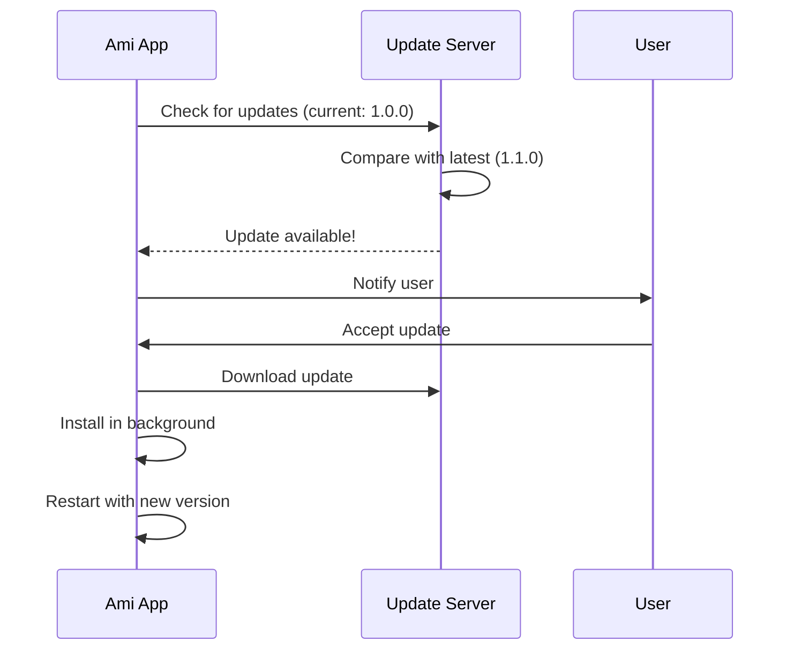

# Zero to Distribution Engineer

## Introduction

This guide takes you from zero knowledge to understanding how software distribution works, using Ami Releases as the case study.

---

## Chapter 1: What is Software Distribution?

### The Problem

You've built an application. Now how do users get it?

**Options:**
1. Send them the source code (they compile it)
2. Send them a binary (they run it)
3. Put it somewhere they can download it
4. Use a package manager

### The Solution: Distribution Repositories

A distribution repository like `ami-releases` exists to:
- Package compiled binaries
- Version them properly
- Make them downloadable
- Handle platform differences

---

## Chapter 2: Package Managers

### What is a Package Manager?

A package manager is like an app store for developers.

**Examples:**
- **Homebrew** (macOS) - `brew install`
- **apt** (Ubuntu) - `apt install`
- **npm** (JavaScript) - `npm install`
- **pip** (Python) - `pip install`

### Homebrew Deep Dive

Homebrew is the most popular package manager for macOS.

**How it works:**

```bash
# User runs:
brew install --cask millionco/ami/ami

# Homebrew does:
1. Looks up the formula (recipe) for "ami"
2. Downloads the artifact (DMG file)
3. Verifies checksum (security)
4. Installs to /Applications
5. Creates symlinks
```

**Formula Example:**

```ruby
cask "ami" do
  version "1.0.0"
  sha256 "abc123..."

  url "https://github.com/millionco/ami-releases/releases/download/v#{version}/Ami-#{version}.dmg"
  name "Ami"
  desc "Run coding agents on your desktop"
  homepage "https://ami.dev"

  app "Ami.app"
end
```

---

## Chapter 3: Release Artifacts

### What is a Release Artifact?

An artifact is the packaged output of your build.

**Common Formats:**

| Platform | Format | Description |
|----------|--------|-------------|
| macOS | .dmg | Disk Image |
| macOS | .app | Application Bundle |
| Windows | .exe | Executable Installer |
| Windows | .msi | Microsoft Installer |
| Linux | .deb | Debian Package |
| Linux | .rpm | RPM Package |
| Cross-platform | .zip | Compressed Archive |

### Building Artifacts

The build process typically:

1. **Compiles** the source code
2. **Bundles** dependencies
3. **Signs** the binary (for security)
4. **Packages** into distributable format
5. **Notarizes** (macOS, for security)

---

## Chapter 4: GitHub Releases

### What are GitHub Releases?

GitHub Releases is a feature for distributing software directly from GitHub.

**Components:**
- **Tag**: Git reference (e.g., `v1.0.0`)
- **Release Notes**: Description of changes
- **Assets**: Binary files attached to the release

### Creating a Release

```bash
# 1. Tag the commit
git tag v1.0.0
git push origin v1.0.0

# 2. CI/CD automatically:
#    - Builds artifacts
#    - Creates GitHub Release
#    - Uploads assets
```

### Release Notes Format

```markdown
## v1.0.0 - 2026-03-28

### New Features
- Initial release of Ami desktop app

### Bug Fixes
- None yet!

### Downloads
- macOS: Ami-1.0.0.dmg
- Windows: Ami-1.0.0.exe
- Linux: Ami-1.0.0.deb
```

---

## Chapter 5: CI/CD for Releases

### What is CI/CD?

**CI** = Continuous Integration (build and test)
**CD** = Continuous Deployment (release to users)

### GitHub Actions Workflow

```yaml
name: Release

on:
  push:
    tags:
      - 'v*'

jobs:
  release:
    runs-on: macos-latest
    steps:
      - uses: actions/checkout@v4

      - name: Build
        run: npm run build

      - name: Create Release
        uses: softprops/action-gh-release@v1
        with:
          files: dist/Ami-*.dmg
```

### Workflow Explanation

1. **Trigger**: When a tag like `v1.0.0` is pushed
2. **Build**: Compile the application
3. **Package**: Create distributable artifacts
4. **Release**: Upload to GitHub Releases
5. **Publish**: Update Homebrew tap

---

## Chapter 6: Auto-Updates

### Why Auto-Updates?

Manual updates are friction. Auto-updates:
- Keep users on latest version
- Fix bugs without user action
- Deliver new features automatically

### How Auto-Updates Work



### Auto-Update Libraries

| Library | Platform | Framework |
|---------|----------|-----------|
| Sparkle | macOS | Native/Electron |
| WinSparkle | Windows | Native/Electron |
| electron-updater | Cross-platform | Electron |
| tauri-updater | Cross-platform | Tauri |

---

## Chapter 7: Code Signing

### What is Code Signing?

Code signing proves the software comes from you and hasn't been tampered with.

### Why Sign Code?

1. **Security**: Users know it's really from you
2. **Trust**: OS doesn't show "Unknown Developer" warning
3. **Requirement**: macOS requires notarization for distribution

### macOS Code Signing

```bash
# Sign the application
codesign --sign "Developer ID Application: Your Name" \
         --timestamp \
         --options runtime \
         Ami.app

# Notarize (submit to Apple for approval)
xcrun notarytool submit Ami.app \
  --apple-id "your@email.com" \
  --team-id "YOUR_TEAM_ID" \
  --wait
```

---

## Chapter 8: Version Numbering

### Semantic Versioning

The standard format: `MAJOR.MINOR.PATCH`

- **MAJOR**: Breaking changes (2.0.0)
- **MINOR**: New features (1.1.0)
- **PATCH**: Bug fixes (1.0.1)

### Examples

| Version | Meaning |
|---------|---------|
| 1.0.0 | First stable release |
| 1.0.1 | Bug fix |
| 1.1.0 | New feature |
| 2.0.0 | Breaking changes |
| 2.0.0-beta.1 | Pre-release |

---

## Chapter 9: Distribution Strategy

### Choosing Distribution Channels

**Factors:**
1. Target audience (developers? consumers?)
2. Platform (macOS? Windows? Linux?)
3. Update frequency
4. Security requirements

### Ami's Strategy

| Channel | Platform | Pros | Cons |
|---------|----------|------|------|
| Homebrew | macOS | Easy updates, dev-friendly | Only macOS, tech users |
| Direct Download | All | Full control | Manual updates |

---

## Chapter 10: Security Considerations

### Supply Chain Security

Protect your distribution pipeline:

1. **Signed commits** - Prove code is from you
2. **Protected branches** - Prevent unauthorized changes
3. **Secret management** - Don't commit API keys
4. **Checksum verification** - Ensure files aren't corrupted

### GitHub Secrets

```yaml
env:
  APPLE_ID: ${{ secrets.APPLE_ID }}
  CERTIFICATE: ${{ secrets.CERTIFICATE }}
```

Never commit:
- API tokens
- Signing certificates
- Private keys

---

## Summary

You now understand:

1. **What distribution is** - Getting software to users
2. **Package managers** - Homebrew, apt, npm
3. **Release artifacts** - DMG, EXE, DEB formats
4. **GitHub Releases** - Hosting and versioning
5. **CI/CD** - Automated builds and releases
6. **Auto-updates** - Keeping users current
7. **Code signing** - Security and trust
8. **Version numbering** - Semantic versioning
9. **Distribution strategy** - Choosing channels
10. **Security** - Protecting your pipeline

---

## Next Steps

To go deeper:
1. Create a Homebrew tap
2. Set up GitHub Actions for releases
3. Implement auto-updates in an app
4. Learn code signing for your platform
