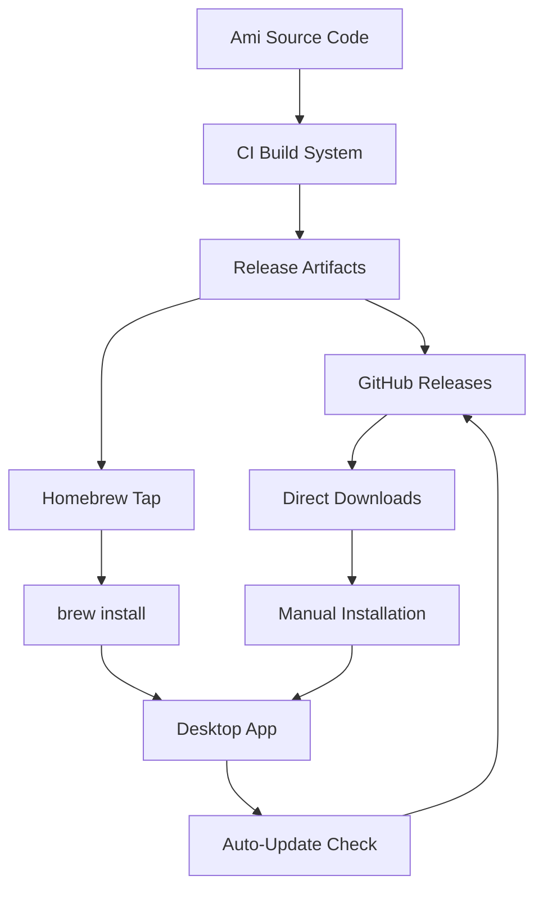
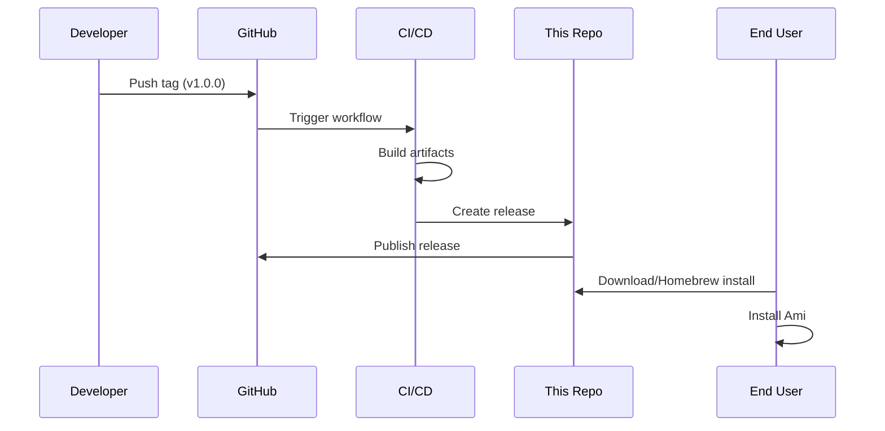

# Ami Releases: Complete Exploration

## Overview

**Ami Releases** is the distribution repository for Ami - a desktop application that runs coding agents locally on your machine. This repository handles the release packaging, distribution, and installation mechanisms for the Ami desktop app.

### Purpose

This repository exists to:
1. Provide installable builds of Ami for different platforms (macOS, Windows, Linux)
2. Manage release artifacts and versioning
3. Handle auto-update mechanisms
4. Provide installation scripts and package definitions (Homebrew, etc.)

### Key Characteristics

| Aspect | Ami Releases |
|--------|-------------|
| **Core Function** | Release distribution and packaging |
| **Platforms** | macOS (Homebrew), Direct Downloads |
| **Type** | Distribution/Packaging Repository |
| **Lines of Code** | ~100 (configuration only) |
| **Purpose** | Distribute Ami desktop app without code changes |
| **Architecture** | Release artifact hosting with installation scripts |

---

## Repository Structure

```
ami-releases/
├── .git/                    # Git repository metadata
├── .github/                 # GitHub configuration
│   └── workflows/           # CI/CD workflows
│       └── release.yml      # Release automation
├── .gitignore              # Git ignore patterns
├── LICENSE                 # License file
├── README.md               # Project documentation
└── SECURITY.md             # Security policy
```

### Directory Breakdown

#### `.github/workflows/`
Contains GitHub Actions workflows for:
- Building release artifacts
- Publishing to package managers (Homebrew)
- Managing release notes and changelogs

#### Root Configuration Files
- `README.md` - Installation instructions and links
- `SECURITY.md` - Security vulnerability reporting process
- `LICENSE` - Software license terms

---

## Installation Mechanisms

### Homebrew (macOS)

```bash
brew install --cask millionco/ami/ami
```

This requires:
1. A Homebrew tap repository (`millionco/ami`)
2. A Cask definition that points to the release artifact
3. SHA-256 checksums for verification

### Manual Download

Releases are hosted on GitHub Releases page:
- URL: https://github.com/millionco/ami-releases/releases
- Formats: DMG (macOS), EXE (Windows), DEB/RPM (Linux)

---

## Architecture Diagram



---

## Release Workflow



---

## Key Files Explained

### README.md

```markdown
# Ami

Run coding agents on your desktop without breaking your flow.

- **Local**: Agents run on your machine with full access and context
- **Native**: Feels like a natural desktop app
- **Flexible**: Handle tasks from seconds to hours
```

This explains the value proposition:
- **Local execution** - No cloud dependencies, full context access
- **Native experience** - Integrated with desktop workflow
- **Flexible duration** - Handle quick tasks and long-running operations

### Installation Section

Provides two installation paths:
1. **Homebrew** - Preferred for macOS users (auto-updates)
2. **Manual download** - For other platforms or offline installation

---

## External Dependencies

| Dependency | Purpose |
|------------|---------|
| GitHub Releases | Artifact hosting |
| Homebrew | macOS package management |
| Electron/Tauri | Desktop app framework (in main repo) |
| Sparkle/Winsparkle | Auto-update framework |

---

## Configuration

### Environment Variables (for builds)
- `GITHUB_TOKEN` - For publishing releases
- `APPLE_ID` / `APPLE_TEAM_ID` - For macOS notarization
- `SIGNING_CERTIFICATE` - For code signing

---

## Testing

As a distribution repository, testing focuses on:
1. **Installation verification** - Ensure installed app launches
2. **Auto-update testing** - Verify update detection and download
3. **Platform compatibility** - Test on supported OS versions

---

## Key Insights

1. **Minimal Code** - This repository contains almost no application code, only packaging configuration
2. **Distribution Focus** - All logic is around getting builds to users
3. **Platform Strategy** - Homebrew for macOS, direct downloads for others
4. **Auto-Update Ready** - Structure supports seamless updates

---

## Open Questions

1. What desktop framework does Ami use? (Electron, Tauri, native?)
2. How is the auto-update mechanism implemented?
3. What is the actual application code repository?

---

## Related Repositories

- **Main Application**: Likely in a private or separate MillionCo repository
- **Homebrew Tap**: `millionco/homebrew-ami` (may be combined)
- **Website**: https://ami.dev

---

## Next Steps for Deep Dive

To fully understand Ami, you would need access to:
1. The main application source code
2. The agent runtime implementation
3. The desktop integration mechanisms

This repository is purely the distribution layer.
