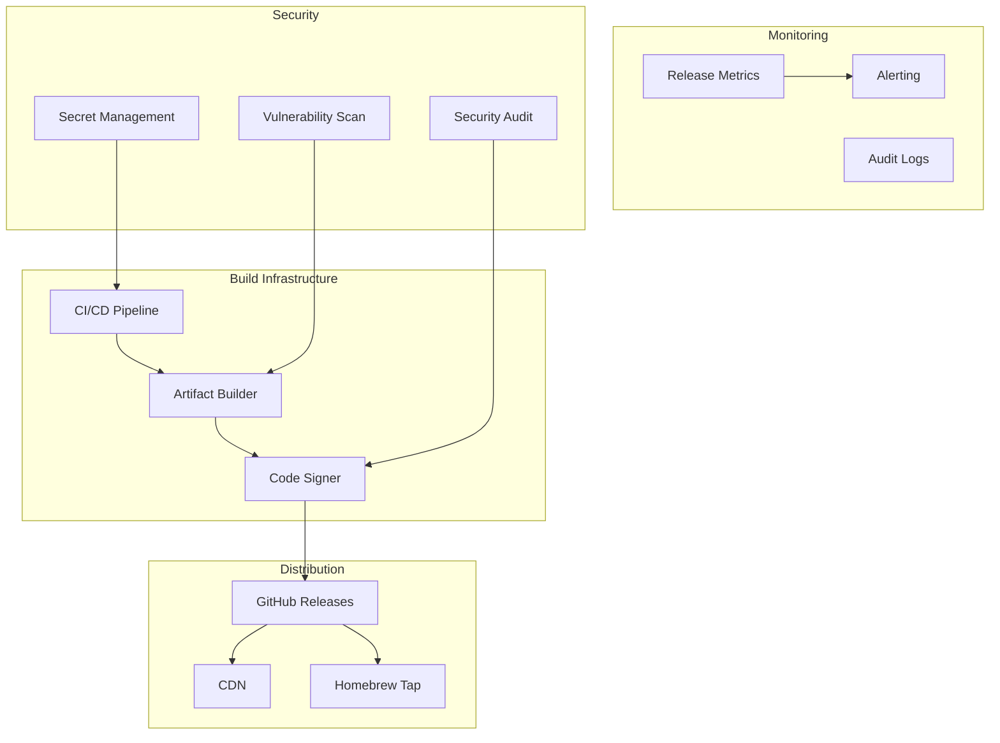
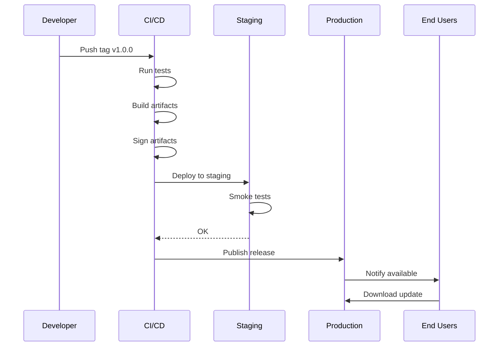
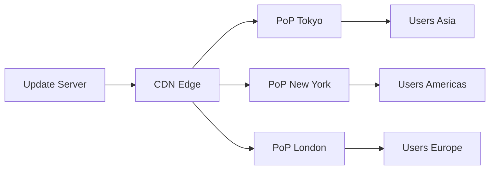

# Production-Grade Ami Distribution System

## Overview

This document describes what it takes to build a production-grade software distribution system like ami-releases at scale. We cover infrastructure, security, monitoring, and operational excellence.

---

## Architecture Overview



---

## Chapter 1: Infrastructure Requirements

### Build Infrastructure

**Requirements:**
1. **Multi-platform builds** - macOS, Windows, Linux
2. **Reproducible builds** - Same source = same binary
3. **Isolated environments** - No dependency contamination
4. **Parallel processing** - Speed up release cycle

**Implementation:**

```yaml
# GitHub Actions Matrix
strategy:
  matrix:
    os: [macos-latest, windows-latest, ubuntu-latest]
    include:
      - os: macos-latest
        target: x86_64-apple-darwin
      - os: windows-latest
        target: x86_64-pc-windows-msvc
      - os: ubuntu-latest
        target: x86_64-unknown-linux-gnu
```

### Storage Requirements

| Artifact Type | Size | Retention |
|---------------|------|-----------|
| DMG (macOS) | ~100MB | All versions |
| EXE (Windows) | ~150MB | All versions |
| DEB (Linux) | ~80MB | Last 10 versions |
| Symbols | ~50MB | All versions |

---

## Chapter 2: Security Deep Dive

### Secret Management

**Never commit:**
- GitHub tokens
- Apple certificates
- Code signing keys
- API credentials

**Use GitHub Secrets:**

```yaml
env:
  APPLE_ID: ${{ secrets.APPLE_ID }}
  APPLE_TEAM_ID: ${{ secrets.APPLE_TEAM_ID }}
  APPLE_CERTIFICATE: ${{ secrets.APPLE_CERTIFICATE }}
  GITHUB_TOKEN: ${{ secrets.GITHUB_TOKEN }}
```

### Certificate Management

```bash
# Import certificate securely
echo "$APPLE_CERTIFICATE" | base64 --decode > certificate.p12
security create-keychain -p "" build.keychain
security import certificate.p12 -k build.keychain -P "$CERT_PASSWORD"
security set-keychain-settings -t 3600 -u build.keychain
security unlock-keychain -p "" build.keychain

# Use for signing
codesign --sign "Developer ID" Ami.app

# Cleanup
security delete-keychain build.keychain
```

### Supply Chain Security

1. **Dependency scanning:**
   ```yaml
   - name: Audit dependencies
     run: cargo audit || npm audit
   ```

2. **Artifact scanning:**
   ```yaml
   - name: Scan for secrets
     run: trufflehog filesystem ./dist
   ```

3. **SBOM generation:**
   ```yaml
   - name: Generate SBOM
     run: cargo sbom > sbom.json
   ```

---

## Chapter 3: Release Workflow

### Pre-Release Checklist

- [ ] All tests pass
- [ ] Security scan clean
- [ ] Dependencies audited
- [ ] Changelog updated
- [ ] Version bumped
- [ ] Release notes reviewed
- [ ] Staging environment tested

### Release Process



### Rollback Strategy

```rust
pub struct RollbackPlan {
    previous_version: Version,
    rollback_trigger: RollbackTrigger,
    communication_plan: CommunicationPlan,
}

pub enum RollbackTrigger {
    CriticalBugReport,
    HighErrorRate(f64),
    SecurityVulnerability,
}

impl RollbackPlan {
    pub fn execute(&self) -> Result<()> {
        // 1. Mark current release as problematic
        // 2. Revert to previous version
        // 3. Notify users
        // 4. Post-mortem
    }
}
```

---

## Chapter 4: Monitoring & Observability

### Key Metrics

| Metric | Target | Alert Threshold |
|--------|--------|-----------------|
| Build time | < 10 min | > 20 min |
| Release success rate | > 99% | < 95% |
| Download error rate | < 1% | > 5% |
| Auto-update success | > 95% | < 80% |

### Logging

```rust
use tracing::{info, warn, error, instrument};

#[instrument(skip(release), fields(version = %release.version))]
pub async fn publish_release(release: &Release) -> Result<()> {
    info!("Starting release publish");

    match upload_artifacts(&release).await {
        Ok(_) => info!("Release published successfully"),
        Err(e) => {
            error!(error = %e, "Release publish failed");
            return Err(e);
        }
    }

    Ok(())
}
```

### Alerting Rules

```yaml
# Prometheus alerting rules
groups:
  - name: release-alerts
    rules:
      - alert: HighReleaseFailureRate
        expr: rate(release_failures_total[1h]) > 0.1
        for: 5m
        annotations:
          summary: "High release failure rate"

      - alert: SlowBuildTime
        expr: histogram_quantile(0.95, build_duration_seconds) > 1200
        for: 10m
        annotations:
          summary: "Build times are slow"
```

---

## Chapter 5: Auto-Update Infrastructure

### Update Server API

```rust
use axum::{Router, routing::get, Json};
use serde::Serialize;

#[derive(Serialize)]
struct UpdateResponse {
    version: String,
    release_notes: String,
    release_date: String,
    artifacts: Vec<Artifact>,
}

#[derive(Serialize)]
struct Artifact {
    platform: String,
    url: String,
    checksum: String,
    size: u64,
}

async fn get_latest_version() -> Json<UpdateResponse> {
    // Fetch from database or cache
    Json(UpdateResponse {
        version: "1.0.0".to_string(),
        release_notes: "Bug fixes and improvements".to_string(),
        release_date: "2026-03-28".to_string(),
        artifacts: vec![],
    })
}

fn app() -> Router {
    Router::new()
        .route("/api/latest", get(get_latest_version))
        .route("/api/release/:version", get(get_release))
}
```

### Update Distribution



### Rate Limiting

```rust
use tower_governor::{GovernorLayer, governor::Quota};
use std::num::NonZeroU32;

let rate_limiter = GovernorLayer::new(
    Quota::per_minute(NonZeroU32::new(60).unwrap())
);

app.layer(rate_limiter)
```

---

## Chapter 6: CDN & Distribution

### CDN Configuration

| Provider | Use Case | Cost |
|----------|----------|------|
| CloudFront | AWS integration | $$ |
| Cloudflare | Global edge, free tier | $ |
| Fastly | Real-time purging | $$$ |

### Cache Strategy

```yaml
# CloudFront cache behavior
DefaultTTL: 86400  # 1 day
MaxTTL: 604800     # 1 week
MinTTL: 0

# Cache key includes:
# - Path
# - Query string (version)
# - Accept header
```

### Geographic Distribution

```rust
pub struct DistributionConfig {
    regions: Vec<Region>,
    failover: FailoverConfig,
}

pub struct Region {
    code: String,      // "us-east-1"
    primary: bool,     // true for main region
    endpoints: Vec<String>,
}
```

---

## Chapter 7: Compliance & Legal

### License Compliance

- [ ] LICENSE file in repository
- [ ] Third-party licenses documented
- [ ] SBOM (Software Bill of Materials) generated
- [ ] Open source attributions included

### Privacy Requirements

- [ ] Privacy policy published
- [ ] Data collection disclosed
- [ ] GDPR compliance (EU users)
- [ ] CCPA compliance (California users)

### Accessibility

- [ ] WCAG 2.1 AA compliance
- [ ] Screen reader support
- [ ] Keyboard navigation
- [ ] High contrast mode

---

## Chapter 8: Disaster Recovery

### Backup Strategy

| Asset | Backup Frequency | Retention |
|-------|------------------|-----------|
| Release artifacts | Every release | Forever |
| Signing certificates | On change | 7 years |
| Database (updates) | Daily | 30 days |
| Logs | Real-time | 90 days |

### Recovery Procedures

```rust
pub struct DisasterRecoveryPlan {
    rto: Duration,  // Recovery Time Objective
    rpo: Duration,  // Recovery Point Objective
}

impl DisasterRecoveryPlan {
    pub async fn restore_from_backup(&self, backup_id: &str) -> Result<()> {
        // 1. Stop all release processes
        // 2. Restore artifacts from backup
        // 3. Restore database
        // 4. Verify integrity
        // 5. Resume operations
    }
}
```

### Failover Configuration

```yaml
# Multi-region failover
primary_region: us-east-1
failover_region: eu-west-1
health_check_interval: 30s
failover_threshold: 3
```

---

## Chapter 9: Cost Optimization

### Cost Breakdown

| Resource | Monthly Cost |
|----------|--------------|
| CI/CD minutes | $50-200 |
| GitHub Storage | $0-50 |
| CDN egress | $100-500 |
| Update server | $20-100 |
| **Total** | **$170-850** |

### Optimization Strategies

1. **Artifact compression** - Reduce storage and egress
2. **CDN caching** - Reduce origin requests
3. **Build caching** - Reduce CI minutes
4. **Retention policies** - Delete old artifacts

---

## Chapter 10: Scaling Considerations

### Handling Growth

| Users/day | Infrastructure |
|-----------|----------------|
| < 100 | GitHub Releases only |
| 100-1000 | + CDN |
| 1000-10000 | + Multi-region |
| > 10000 | + Dedicated infrastructure |

### Performance Targets

| Metric | Target |
|--------|--------|
| Download latency | < 500ms |
| Update check | < 100ms |
| Release publish | < 5 min |
| Build time | < 10 min |

---

## Summary

Building a production-grade distribution system requires:

1. **Robust infrastructure** - Multi-platform, reproducible builds
2. **Strong security** - Secret management, signing, scanning
3. **Comprehensive monitoring** - Metrics, logging, alerting
4. **Reliable auto-updates** - CDN, rate limiting, failover
5. **Disaster recovery** - Backups, failover, runbooks
6. **Compliance** - Licenses, privacy, accessibility
7. **Cost optimization** - Caching, compression, retention

---

## Appendix: Runbooks

### Release Day Runbook

1. **T-24 hours:** Freeze non-essential changes
2. **T-1 hour:** Verify all tests pass
3. **T-0:** Tag and push
4. **T+10 min:** Verify build started
5. **T+30 min:** Verify artifacts built
6. **T+45 min:** Verify signing complete
7. **T+60 min:** Verify release published
8. **T+2 hours:** Monitor error rates
9. **T+24 hours:** Review metrics, close release
