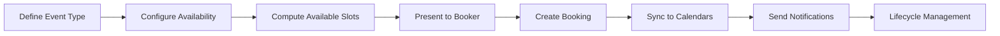
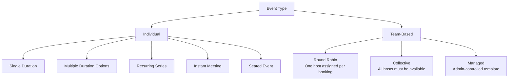
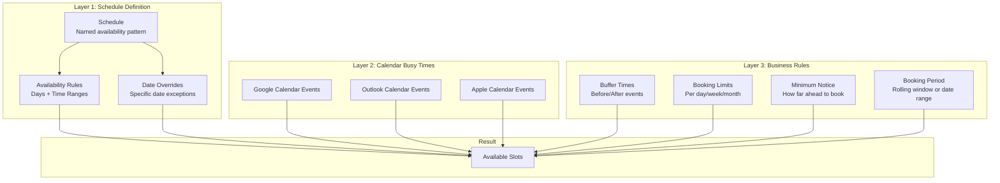
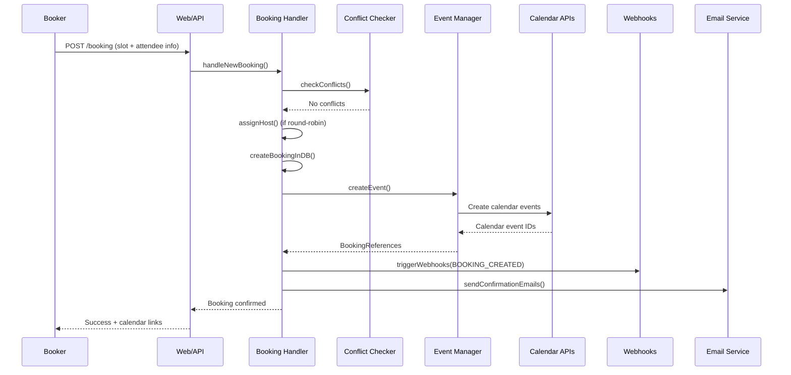
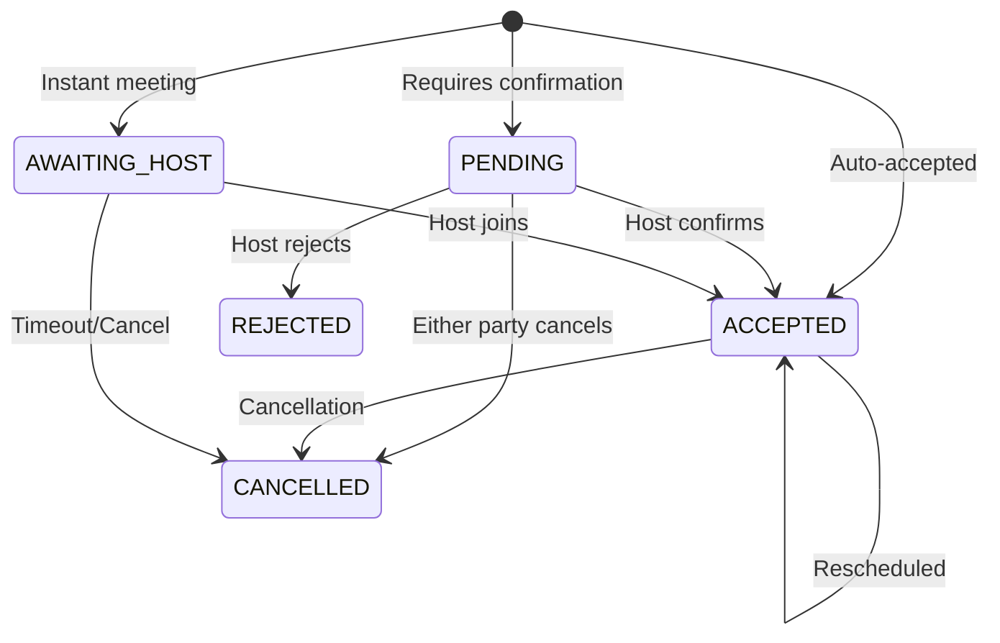
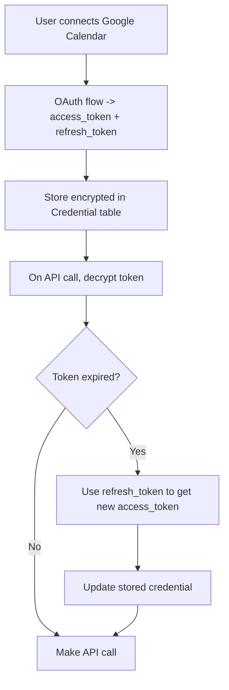
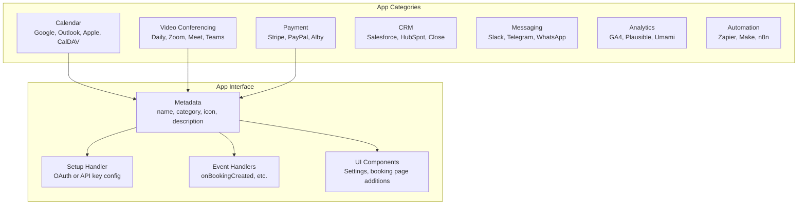
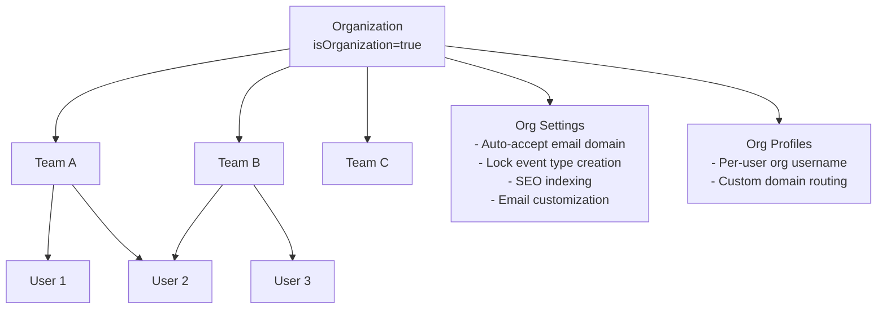
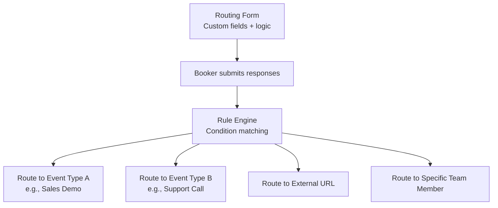
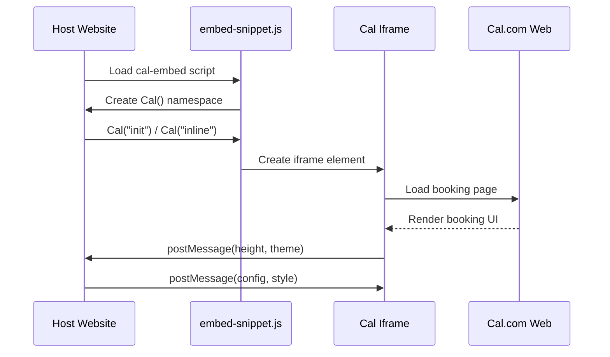

# Zero to Scheduling Engineer

A comprehensive guide to understanding scheduling infrastructure from first principles, using Cal.com as the reference implementation.

## Chapter 1: The Scheduling Problem Domain

### What is Scheduling Software?

At its core, scheduling software solves a **constraint satisfaction problem**: given a set of participants, their availability windows, event duration requirements, and various business rules, find time slots where a meeting can occur.

This sounds simple but becomes remarkably complex when you factor in:

- **Multiple calendars** across providers (Google Calendar, Outlook, Apple Calendar, CalDAV)
- **Timezone handling** across participants in different zones
- **Buffer times** before and after events
- **Booking limits** (max per day/week/month)
- **Round-robin assignment** across team members
- **Recurring events** with individual occurrence management
- **Seat-based events** (webinars, classes)
- **Payment requirements** before confirmation
- **Workflow automation** (reminders, follow-ups)

### The Scheduling Pipeline



Every step in this pipeline involves significant complexity. Let us walk through each one.

## Chapter 2: Event Types - The Scheduling Unit

An **event type** is the fundamental configurable unit. Think of it as a "template" for bookings. In Cal.com, the `EventType` model has 80+ fields, reflecting the enormous configurability required.

### Types of Scheduling



**Individual Events**: The simplest case. One user defines their availability, one booker picks a slot.

**Round-Robin**: A team of hosts takes turns. The assignment algorithm considers:
- **Priority**: Higher priority hosts get first consideration
- **Weight**: Proportional distribution (e.g., senior agent gets 2x bookings)
- **Availability**: Only available hosts are considered
- **Fairness**: Least-recently-booked host wins ties
- **Segment filtering**: Attribute-based routing (e.g., "Spanish-speaking agents only")

**Collective**: All team members must be free simultaneously. The available slots are the intersection of all members' availability.

**Managed**: An admin creates a template event type that propagates to child event types on team members. Changes cascade downward.

### Booking Fields

Modern scheduling goes beyond "pick a time." Event types define custom **booking fields**:

```typescript
// Simplified booking field schema
interface BookingField {
  name: string;
  type: 'text' | 'textarea' | 'select' | 'multiselect' | 'phone' | 'email' | 'boolean' | 'radio';
  label: string;
  required: boolean;
  options?: { label: string; value: string }[];
  placeholder?: string;
  hidden?: boolean;
}
```

These fields collect information from the booker (phone number, company name, meeting agenda) and get passed into calendar events and webhook payloads.

## Chapter 3: Availability - The Constraint System

### The Availability Model

Availability in scheduling is a layered system:



### Computing Free/Busy

The slot computation algorithm:

1. **Start with schedule**: Expand weekly rules into concrete time ranges for the requested date range
2. **Apply date overrides**: Replace schedule rules for specific dates
3. **Fetch busy times**: Query all connected calendars via their APIs
4. **Subtract busy times**: Remove occupied ranges from available ranges
5. **Apply buffers**: Shrink ranges by before/after buffer durations
6. **Apply booking limits**: Check existing booking counts against limits
7. **Apply minimum notice**: Filter out slots too close to "now"
8. **Apply period constraints**: Filter to allowed booking window
9. **Quantize to slot intervals**: Break remaining ranges into fixed-duration slots

### Timezone Challenges

Timezone handling is one of the hardest parts of scheduling:

- A user in New York sets availability 9am-5pm ET
- A booker in Tokyo sees those slots as 10pm-6am JST (next day)
- Daylight Saving Time shifts happen at different dates in different countries
- Some zones have 30-minute or 45-minute offsets (India IST = UTC+5:30, Nepal = UTC+5:45)

Cal.com uses a customized `dayjs` package (`packages/dayjs`) with timezone plugins to handle all conversions. The critical rule: **all times are stored in UTC in the database**, and converted to local time only at display.

### Travel Schedules

A unique Cal.com feature: users can define **travel schedules** that temporarily change their timezone:

```
March 15-20: User normally in New York (ET)
              But traveling to London (GMT)
              Availability shifts accordingly
```

The `TravelSchedule` model stores `(startDate, endDate, timeZone, prevTimeZone)` and the availability engine checks these when computing slots.

## Chapter 4: The Booking Lifecycle

### Creating a Booking



### Booking States



### Seat-Based Bookings

For webinar-style events, multiple bookers can book the same time slot up to a seat limit:

- `seatsPerTimeSlot: 20` allows 20 attendees per slot
- Each attendee gets a `BookingSeat` record
- The slot only disappears from availability when all seats are taken
- Individual attendees can cancel without affecting others

### Recurring Bookings

Recurring events create multiple linked `Booking` records sharing a `recurringEventId`. Each occurrence is independently manageable (can be individually rescheduled or cancelled).

## Chapter 5: Calendar Integration Architecture

### The Calendar Service Pattern

Cal.com abstracts calendar operations through a service interface:

```typescript
interface CalendarService {
  createEvent(event: CalendarEvent): Promise<NewCalendarEventType>;
  updateEvent(uid: string, event: CalendarEvent): Promise<NewCalendarEventType>;
  deleteEvent(uid: string): Promise<void>;
  getAvailability(dateFrom: string, dateTo: string): Promise<EventBusyDate[]>;
  listCalendars(): Promise<IntegrationCalendar[]>;
}
```

Each calendar provider (Google, Outlook, Apple, CalDAV) implements this interface. The `EventManager` (`packages/features/bookings/lib/EventManager.ts`) orchestrates operations across all connected calendars.

### Credential Management

Calendar integrations require OAuth tokens that expire and need refreshing:



### Domain-Wide Delegation

For enterprise organizations, rather than each user connecting individually, an admin can set up **domain-wide delegation** - granting the application access to all users' calendars in the organization through a single service account.

## Chapter 6: The App Store Model

Cal.com's extensibility comes from its app store architecture:



Each app in `packages/app-store/` follows a standard structure:
- `_metadata.ts` - App metadata and configuration
- `api/` - API route handlers (OAuth callbacks, webhooks)
- `lib/` - Business logic (CalendarService implementation, etc.)
- `components/` - React UI components
- `zod.ts` - Validation schemas for credentials

The app store CLI (`packages/app-store-cli`) auto-generates registry files that wire apps into the main application.

## Chapter 7: Webhooks and Workflow Automation

### Webhook System

Cal.com fires webhooks on booking lifecycle events:

- `BOOKING_CREATED`
- `BOOKING_RESCHEDULED`
- `BOOKING_CANCELLED`
- `BOOKING_CONFIRMED`
- `BOOKING_REJECTED`
- `FORM_SUBMITTED` (routing forms)

Webhooks can be configured at user, team, or event type level.

### Workflows (Automations)

The workflow engine provides no-code automation:

```mermaid
flowchart LR
    TRIGGER[Trigger<br/>Before/After event<br/>On booking/cancel] --> ACTIONS

    ACTIONS --> EMAIL_ACTION[Send Email<br/>Custom template]
    ACTIONS --> SMS_ACTION[Send SMS<br/>Twilio integration]
    ACTIONS --> WEBHOOK_ACTION[Fire Webhook<br/>Custom endpoint]

    EMAIL_ACTION --> TEMPLATE[Template System<br/>Variables: {name}, {date}, etc.]
    SMS_ACTION --> TEMPLATE
```

Workflows support timed triggers (e.g., "send reminder 24 hours before event") using scheduled tasks via Trigger.dev.

## Chapter 8: Multi-Tenancy and Organizations

### Organization Hierarchy



A `Team` with `isOrganization=true` acts as the parent entity. Users belong to teams via `Membership`, and have `Profile` records within the organization namespace.

### RBAC (Permission-Based Access Control)

Cal.com implements PBAC through:
- **Built-in roles**: MEMBER, ADMIN, OWNER at team/org level
- **Custom roles**: `Role` model with granular `Permission` entries
- **Permission checks**: Both server-side (tRPC middleware) and client-side

## Chapter 9: Routing Forms - Intake and Assignment

Routing forms are a pre-booking qualification layer:



Routing forms support:
- Custom fields (text, select, phone, email)
- Conditional logic with AND/OR operators
- Attribute-based routing to team members
- Response tracking and analytics

## Chapter 10: The Embed System

Cal.com provides embeddable booking widgets:



Three embed modes:
1. **Inline**: Embedded directly in the page
2. **Modal (Popup)**: Opens in a centered modal overlay
3. **Float Button**: Floating action button that opens a modal

The embed uses a custom message protocol for cross-origin communication between the host page and the Cal.com iframe.

## Summary

Building scheduling infrastructure requires solving problems across multiple domains: time mathematics, distributed calendar synchronization, assignment algorithms, payment processing, notification delivery, and multi-tenant access control. Cal.com's architecture demonstrates how these concerns can be organized into a maintainable monorepo with clear domain boundaries and extensible integration patterns.
