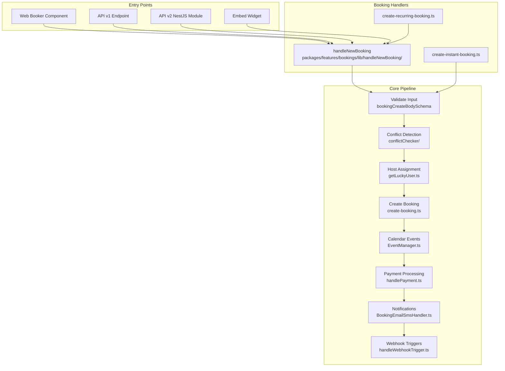
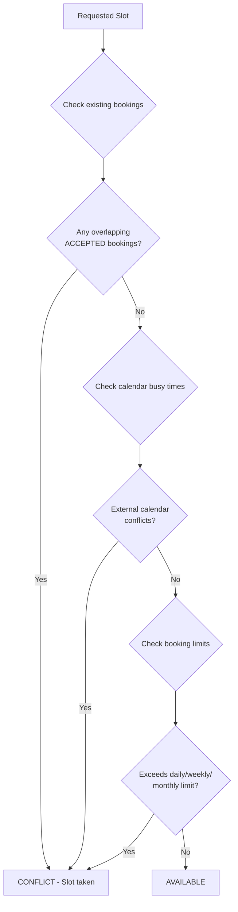
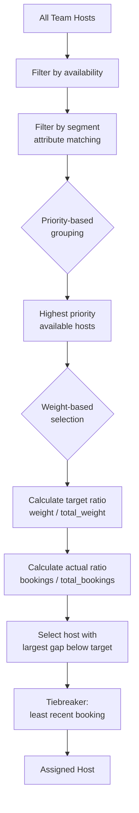
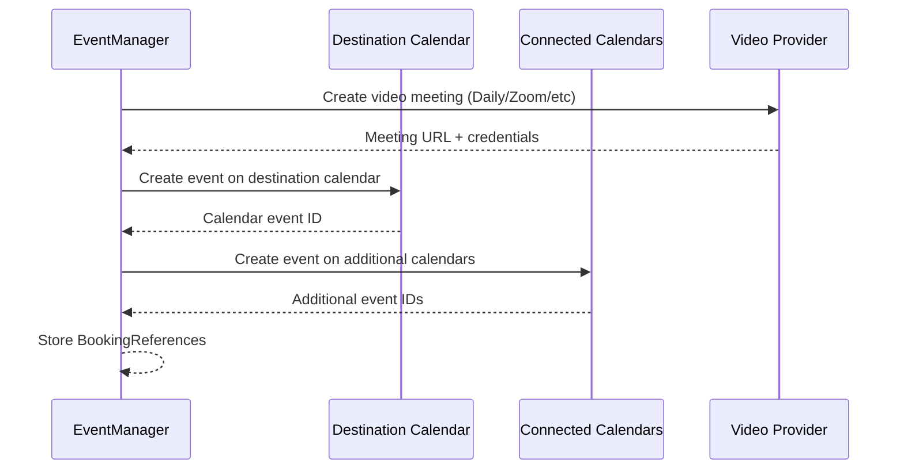
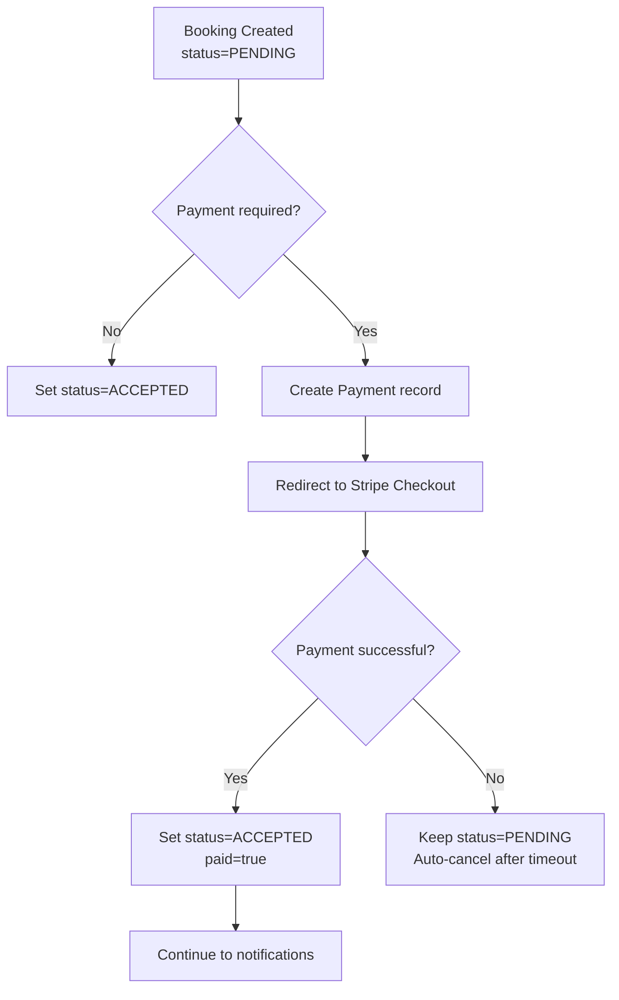
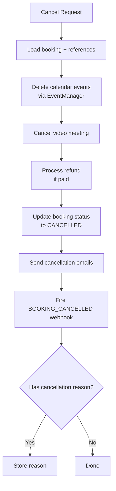
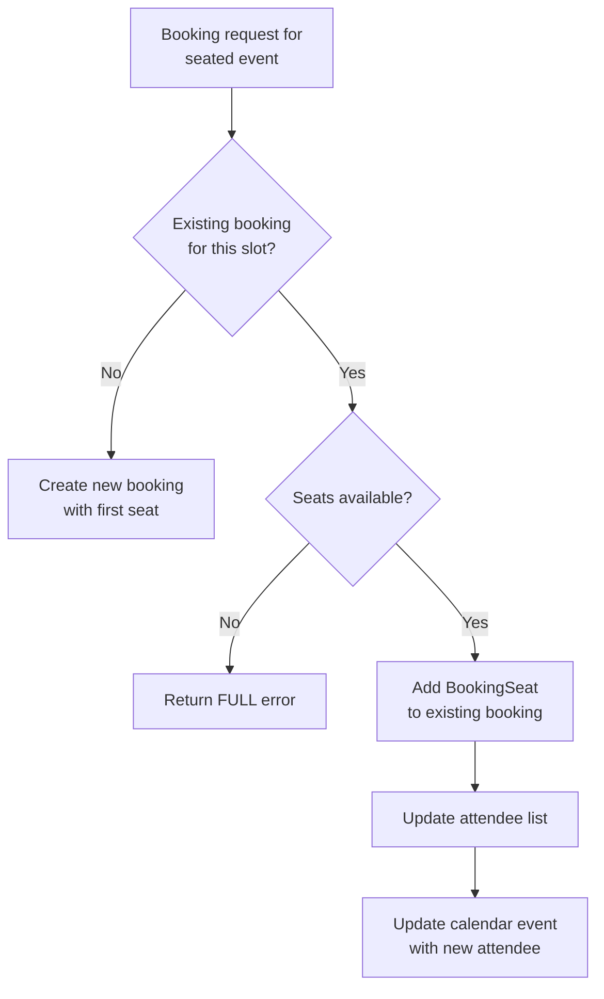
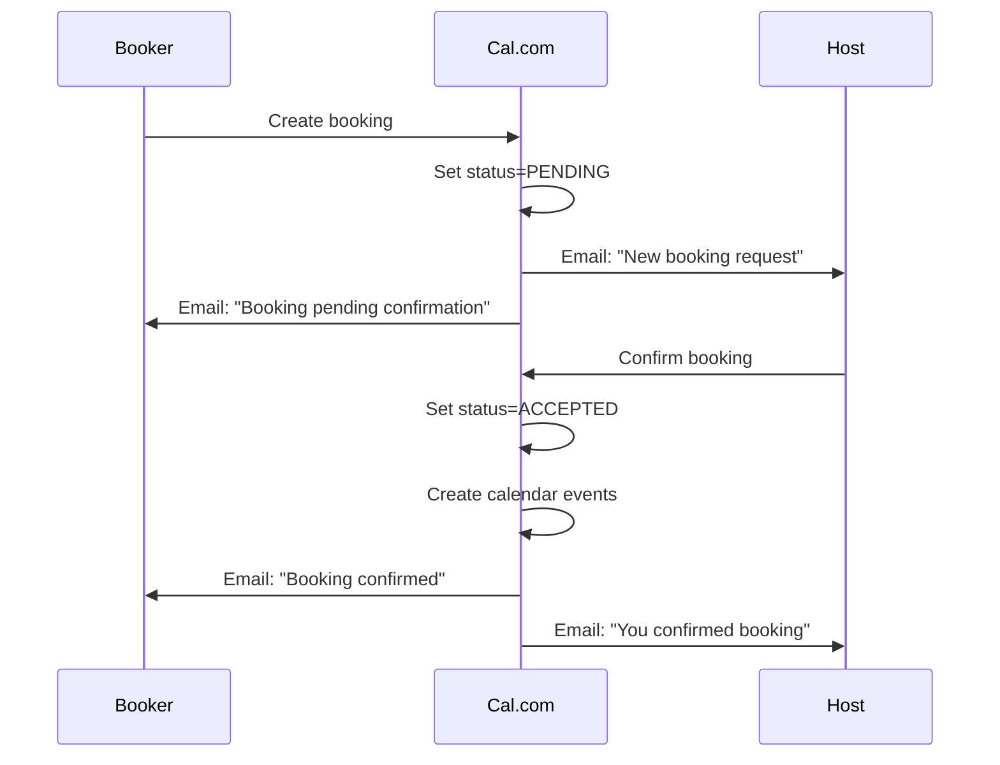

# Booking Engine Deep Dive

The booking engine is the central nervous system of Cal.com. It handles everything from validating incoming booking requests to creating calendar events, processing payments, sending notifications, and managing the full booking lifecycle.

## Architecture Overview



## The handleNewBooking Flow

The primary booking handler lives at `packages/features/bookings/lib/handleNewBooking/`. This is a multi-file module that orchestrates the entire booking creation process.

### Step 1: Input Validation

The booking request is validated against `bookingCreateBodySchema.ts`:

```typescript
// Simplified schema structure
const bookingCreateBody = z.object({
  start: z.string(),          // ISO datetime of slot start
  end: z.string(),            // ISO datetime of slot end
  eventTypeId: z.number(),
  eventTypeSlug: z.string(),
  timeZone: z.string(),
  language: z.string(),
  responses: z.record(z.any()), // Dynamic booking field responses
  metadata: z.record(z.any()).optional(),
  recurringEventId: z.string().optional(),
  hasHashedBookingLink: z.boolean().optional(),
  seatReferenceUid: z.string().optional(),
  orgSlug: z.string().optional(),
});
```

The `getBookingDataSchema` function dynamically constructs the validation schema based on the event type's configured booking fields, ensuring required fields are present and correctly typed.

### Step 2: Event Type Loading and Verification

The handler loads the full event type with all relationships:
- Hosts and their credentials
- Team membership
- Workflow configurations
- Payment settings
- Schedule and availability rules

It verifies the event type exists, is not hidden (unless accessed via hashed link), and belongs to the correct team/user.

### Step 3: Conflict Detection

The conflict checker (`packages/features/bookings/lib/conflictChecker/`) verifies the requested slot is still available:



For **collective events**, all hosts must be available. For **round-robin**, at least one eligible host must be free.

### Step 4: Host Assignment (Round-Robin)

For round-robin events, `getLuckyUser.ts` implements a sophisticated assignment algorithm:



The algorithm ensures fair distribution according to configured weights while respecting priority tiers:

```typescript
// Conceptual algorithm
function getLuckyUser(hosts: Host[], existingBookings: Booking[]) {
  // 1. Group by priority - highest priority first
  const priorityGroups = groupBy(hosts, h => h.priority);
  const topPriority = max(Object.keys(priorityGroups));
  const candidates = priorityGroups[topPriority];

  // 2. Calculate weighted fair share
  const totalWeight = sum(candidates.map(h => h.weight));
  const totalBookings = existingBookings.length;

  // 3. Find most "under-booked" host relative to their weight
  return candidates.reduce((lucky, host) => {
    const targetRatio = host.weight / totalWeight;
    const actualRatio = countBookings(host) / totalBookings;
    const deficit = targetRatio - actualRatio;
    return deficit > lucky.deficit ? { host, deficit } : lucky;
  });
}
```

Additional considerations:
- **No-show tracking**: `includeNoShowInRRCalculation` optionally counts no-shows in the fairness calculation
- **Calibration**: Dynamically adjusts for weight changes mid-cycle
- **RR Reset Interval**: Booking counts reset monthly (configurable)
- **Timestamp basis**: Can use `CREATED_AT` or `START_TIME` for counting

### Step 5: Booking Creation

The `create-booking.ts` module persists the booking to the database:

```typescript
// Simplified booking creation
const booking = await prisma.booking.create({
  data: {
    uid: generateUniqueId(),
    title: eventType.title,
    startTime: slot.start,
    endTime: slot.end,
    userId: assignedHost.id,
    eventTypeId: eventType.id,
    status: requiresConfirmation ? "PENDING" : "ACCEPTED",
    responses: validatedResponses,
    attendees: {
      create: attendeeData,
    },
    metadata: bookingMetadata,
  },
});
```

An **idempotency key** is generated from `(start, end, email, eventTypeId)` to prevent duplicate bookings from network retries.

### Step 6: Calendar Event Creation (EventManager)

The `EventManager.ts` orchestrates creating events on all relevant calendars:



The EventManager:
1. Creates the video conferencing link (if applicable)
2. Creates the event on the host's **destination calendar** (primary output calendar)
3. Optionally creates on additional connected calendars
4. Stores all external IDs as `BookingReference` records for later updates/deletion

### Step 7: Payment Processing

If the event type has a price > 0:



### Step 8: Notification Dispatch

`BookingEmailSmsHandler.ts` handles all notification channels:

- **Email**: Confirmation to attendee, notification to host
- **SMS**: Via configured SMS provider (Twilio)
- **Workflows**: Trigger any configured workflow automations
- **Webhooks**: Fire `BOOKING_CREATED` webhook to all subscribers

## Cancellation Flow

`handleCancelBooking.ts` handles booking cancellations:



Cancellation can be initiated by the host or attendee. The `cancelledBy` field tracks who initiated it.

## Rescheduling Flow

Rescheduling is essentially a cancel-and-rebook operation:

1. The original booking's `uid` is passed as `fromReschedule`
2. A new booking is created for the new time slot
3. The old booking is cancelled (linked via `fromReschedule`)
4. Calendar events are updated rather than deleted/recreated when possible
5. The `rescheduledBy` field tracks the initiator

For round-robin events, `rescheduleWithSameRoundRobinHost` can force keeping the same host.

## Seat Management

Seated events have special handling in `handleSeats/`:



Each seat gets a `BookingSeat` record with:
- Unique `referenceUid` for individual management
- Separate `data` JSON for per-attendee responses
- Independent cancellation capability

## Confirmation Flow

When `requiresConfirmation` is true:



`requiresConfirmationForFreeEmail` is a clever feature that only requires confirmation when the booker uses a free email domain (gmail, outlook, etc.) but auto-accepts company emails.

## Instant Meetings

Instant meetings (`isInstantEvent=true`) provide a "join now" experience:

1. A token is generated with short expiry (`instantMeetingExpiryTimeOffsetInSeconds`)
2. The booking is created with `status=AWAITING_HOST`
3. The booker waits on a holding page
4. When a host accepts, the video call starts immediately
5. If no host accepts before timeout, the booking is auto-cancelled

## Booking Limits

The limit system (`checkBookingLimits.ts`, `checkDurationLimits.ts`) enforces:

```typescript
interface BookingLimits {
  PER_DAY?: number;
  PER_WEEK?: number;
  PER_MONTH?: number;
  PER_YEAR?: number;
}

interface DurationLimits {
  PER_DAY?: number;    // max minutes per day
  PER_WEEK?: number;
  PER_MONTH?: number;
  PER_YEAR?: number;
}
```

Limits can be set at both event type and team level. Team-level limits with `includeManagedEventsInLimits` aggregate across all managed event types.

## Error Handling

The booking engine defines specific error codes:

- `NO_AVAILABLE_USERS_FOUND_ERROR` - No hosts available for the requested time
- `BOOKING_LIMIT_REACHED` - Booking count limit exceeded
- `DURATION_LIMIT_REACHED` - Duration limit exceeded
- `ALREADY_BOOKED` - Slot already taken (conflict)
- `PAYMENT_REQUIRED` - Payment needed but not completed
- `REQUIRES_CONFIRMATION` - Booking created but pending host approval

These error codes are essential for providing clear feedback in the booker UI and API responses.

## Performance Considerations

The booking engine must handle concurrent requests for the same slot. Key strategies:

1. **Idempotency keys** prevent duplicate bookings from retries
2. **Database-level unique constraints** on `Booking.uid` and `Booking.idempotencyKey`
3. **Optimistic concurrency**: The conflict checker runs just before creation, minimizing the race window
4. **`requiresConfirmationWillBlockSlot`**: When confirmation is required, this flag determines whether the slot is immediately blocked or remains available until confirmed

For high-traffic event types (popular webinars, etc.), the seat-based model with atomic seat counting prevents overselling.
