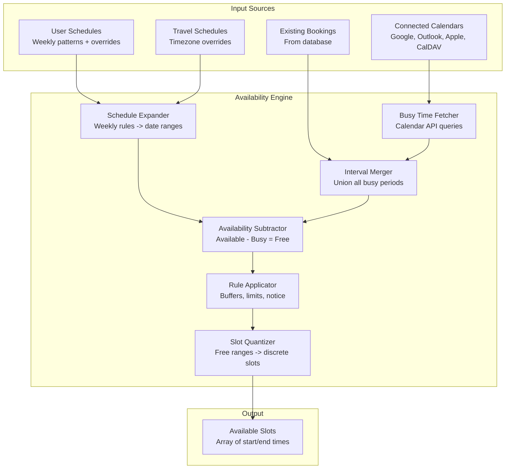
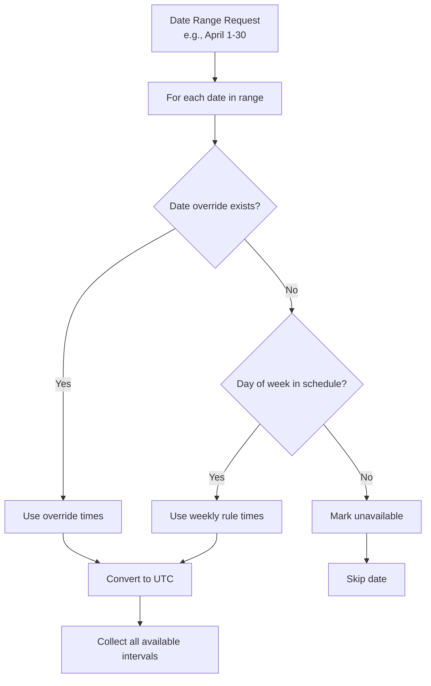
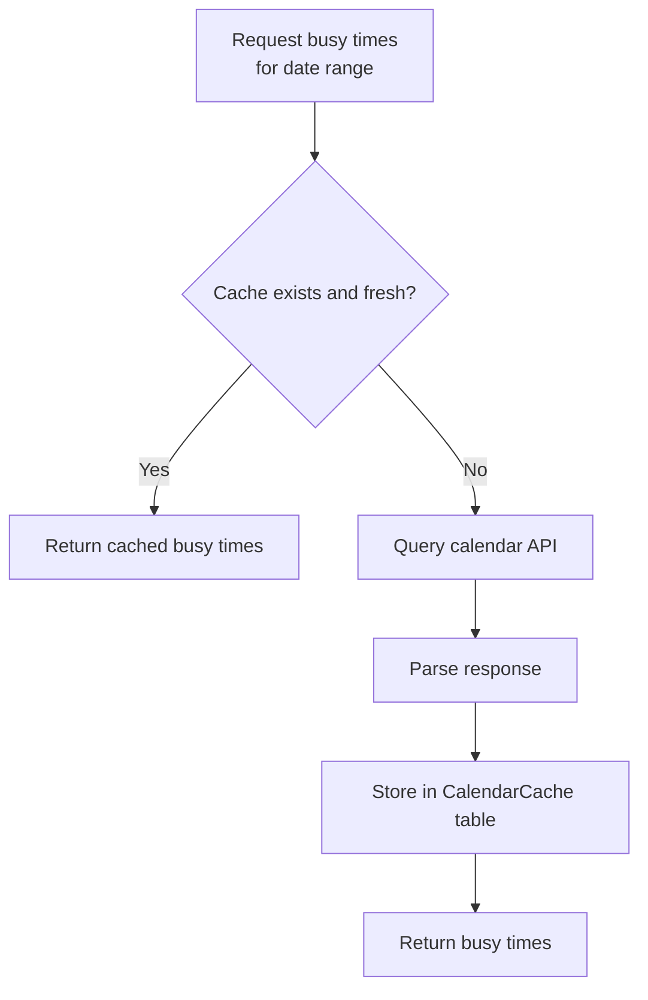
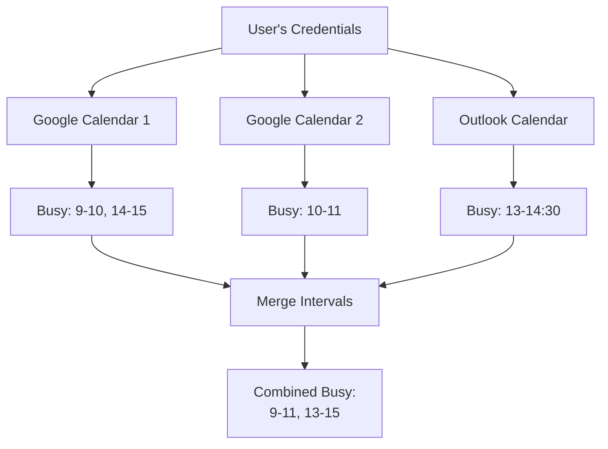
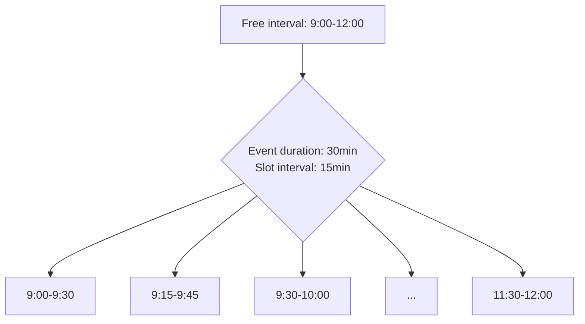
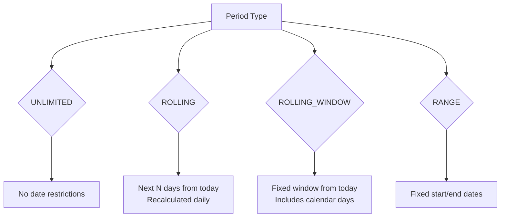
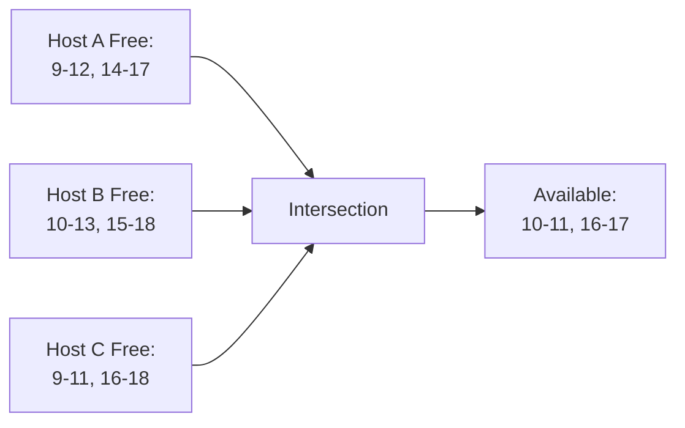
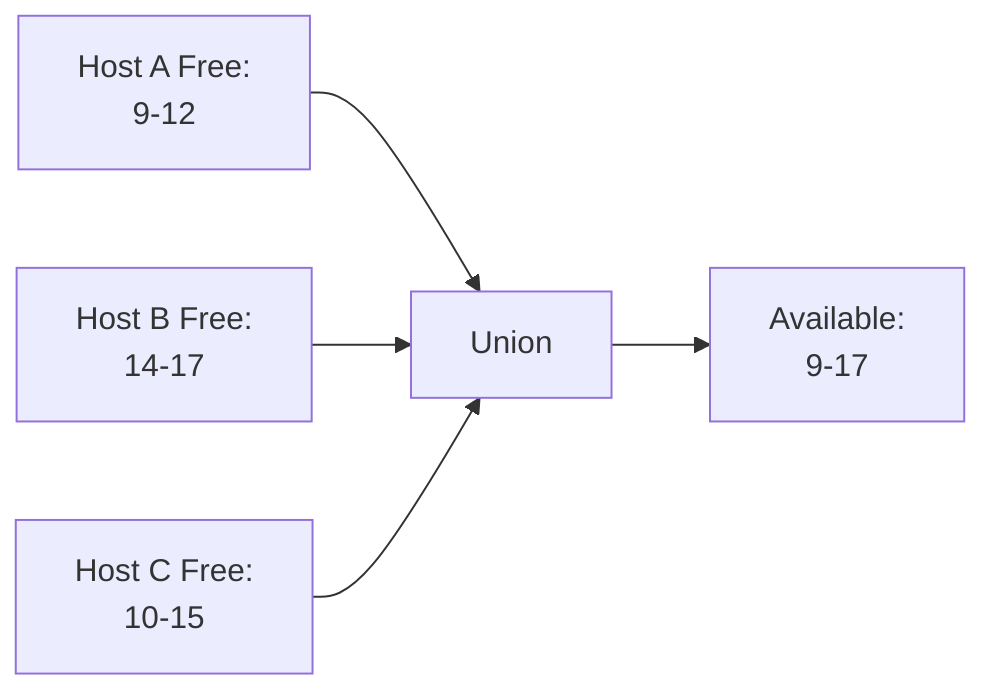
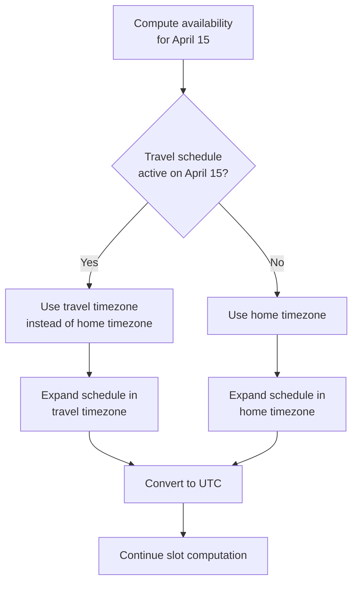
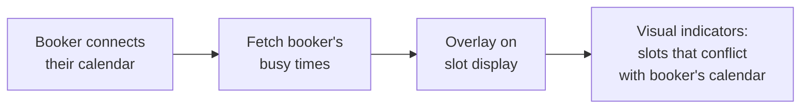

# Availability and Scheduling Deep Dive

The availability system is the computational core that determines which time slots are presented to bookers. It must integrate data from multiple sources, respect complex business rules, and handle timezone conversions correctly across the globe.

## System Architecture



## Schedule Model

### Weekly Availability Rules

A schedule defines recurring weekly availability patterns:

```typescript
// Database model: Availability
{
  days: [1, 2, 3, 4, 5],  // Monday-Friday
  startTime: "09:00",      // In schedule's timezone
  endTime: "17:00",
  scheduleId: 1,
}
```

A user can have multiple schedules (e.g., "Default", "Summer Hours", "Night Shift") and assign different schedules to different event types.

### Date Overrides

Date overrides replace the regular schedule for specific dates:

```typescript
// Override: Available on a Saturday
{
  date: "2026-04-15",
  startTime: "10:00",
  endTime: "14:00",
  scheduleId: 1,
}

// Override: Completely unavailable on a weekday
{
  date: "2026-04-20",
  startTime: "00:00",
  endTime: "00:00",  // Zero-length = unavailable
  scheduleId: 1,
}
```

### Schedule Expansion Algorithm



The timezone conversion step is critical. If a user's schedule says "9am-5pm US/Eastern":
- On a standard time day: 14:00-22:00 UTC
- On a DST day: 13:00-21:00 UTC

The `packages/dayjs` package handles these conversions.

## Calendar Busy Time Fetching

### The CalendarService Interface

Each calendar provider implements busy time fetching:

```typescript
interface CalendarService {
  getAvailability(
    dateFrom: string,
    dateTo: string,
    selectedCalendars: SelectedCalendar[]
  ): Promise<EventBusyDate[]>;
}

interface EventBusyDate {
  start: Date;
  end: Date;
  source?: string;  // Which calendar
}
```

### Calendar Cache

To avoid hammering calendar APIs, Cal.com implements a `CalendarCache` system:



The cache stores raw calendar data with expiry timestamps. Cache invalidation happens on:
- Calendar webhook notifications (push updates)
- Manual refresh
- TTL expiry

### Multi-Calendar Aggregation

A user can have multiple connected calendars. The busy times from all selected calendars are merged:



The interval merging algorithm sorts all intervals by start time and merges overlapping ones:

```typescript
function mergeIntervals(intervals: {start: Date, end: Date}[]) {
  const sorted = intervals.sort((a, b) => a.start - b.start);
  const merged = [sorted[0]];

  for (let i = 1; i < sorted.length; i++) {
    const current = sorted[i];
    const last = merged[merged.length - 1];

    if (current.start <= last.end) {
      last.end = max(last.end, current.end);
    } else {
      merged.push(current);
    }
  }

  return merged;
}
```

## Slot Computation

### Basic Slot Generation

Once free intervals are determined, they are quantized into bookable slots:



The **slot interval** (step size) can differ from the **event duration**. A 60-minute event with 15-minute slot intervals shows start times every 15 minutes, as long as the full duration fits within the free window.

### Buffer Time Application

Buffers create gaps between events:

```
Event duration: 30 min
Before buffer: 10 min
After buffer: 15 min

Effective blocked time: 10 + 30 + 15 = 55 min per booking

If booked at 10:00:
- Buffer zone: 9:50 - 10:00 (before)
- Event: 10:00 - 10:30
- Buffer zone: 10:30 - 10:45 (after)
- Next available slot: 10:45+
```

### Minimum Booking Notice

`minimumBookingNotice` (in minutes) prevents last-minute bookings:

```typescript
const earliestAllowed = dayjs().add(minimumBookingNotice, 'minute');
slots = slots.filter(slot => dayjs(slot.start).isAfter(earliestAllowed));
```

### Booking Period Constraints



### Booking Limit Enforcement

Booking limits are checked during slot computation to hide slots that would exceed limits:

```typescript
// For each candidate slot
async function isSlotAllowed(slot: Slot, limits: BookingLimits) {
  if (limits.PER_DAY) {
    const dayCount = await countBookingsOnDate(slot.start);
    if (dayCount >= limits.PER_DAY) return false;
  }
  if (limits.PER_WEEK) {
    const weekCount = await countBookingsInWeek(slot.start);
    if (weekCount >= limits.PER_WEEK) return false;
  }
  // ... PER_MONTH, PER_YEAR
  return true;
}
```

Duration limits work similarly but sum the total booked duration rather than counting bookings.

## Team Availability

### Collective Events

For collective events, the available slots are the **intersection** of all hosts' availability:



### Round-Robin Events

For round-robin events, the available slots are the **union** of all eligible hosts' availability:



A slot is available if **at least one** eligible host can take it. The actual assignment happens at booking time.

### Host Groups

Host groups allow segmenting a team for different routing scenarios within the same event type:

```
Event Type: "Consultation"
  Group A: "Enterprise" - Host 1, Host 2
  Group B: "SMB" - Host 3, Host 4, Host 5

Routing form routes enterprise leads to Group A
and SMB leads to Group B
```

## Travel Schedule Integration



This ensures a user traveling from New York to Tokyo has their availability correctly shifted - their "9am" becomes 9am Tokyo time rather than 9am New York time.

## Optimized Slot Display

Two optimization features for slot presentation:

### `onlyShowFirstAvailableSlot`

Instead of showing all available slots, only show the earliest one. Useful for support/urgent meeting types where the booker just wants the "next available" time.

### `showOptimizedSlots`

Groups slots to reduce visual clutter, showing representative slots rather than every possible start time.

## Overlay Calendar View

The `useCheckOverlapWithOverlay` hook allows bookers to overlay their own calendar on the slot picker:



This is a UX feature that helps bookers find times that work for them without going back and forth.

## Performance Optimizations

### Calendar Query Batching

When computing availability for a date range, calendar API queries are batched:
- Single API call for the entire date range rather than per-day
- Parallel queries to multiple calendar providers
- Results cached in `CalendarCache`

### Redis Caching

Selected slot data and availability computations can be cached in Redis for high-traffic booking pages:
- Cache key includes event type, date range, and timezone
- Short TTL (minutes) to balance freshness vs. performance
- Invalidated on booking creation/cancellation

### Database Query Optimization

The booking count queries for limits use targeted indexes:
```sql
-- Index on Booking table
@@index([userId, status, startTime])
@@index([eventTypeId, status])
@@index([startTime, endTime, status])
```

These indexes ensure limit checks are fast even with large booking volumes.

## Edge Cases and Complexity

### DST Transitions

When a timezone transitions to/from Daylight Saving Time:
- A day might have 23 or 25 hours
- 2:00 AM might not exist (spring forward) or exist twice (fall back)
- Recurring weekly availability must handle both correctly

### Cross-Midnight Availability

A user might set availability that crosses midnight (e.g., night shift: 10pm-6am). This requires splitting the availability across two calendar days and correctly handling the timezone conversion.

### Simultaneous Bookings

When two bookers attempt to book the same slot simultaneously:
1. Both see the slot as available
2. Both submit booking requests
3. The conflict checker catches the second one
4. The idempotency key prevents duplicates from the same booker

### Calendar Sync Delays

Calendar APIs have inherent latency:
- Google Calendar: Webhook notifications within seconds, but polling can be minutes behind
- Outlook/Exchange: Similar latency characteristics
- CalDAV: Polling-based, can be minutes behind

This means a slot might appear available when it is not. The conflict checker at booking time is the final safety net.
