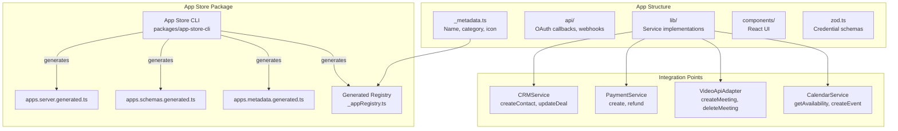
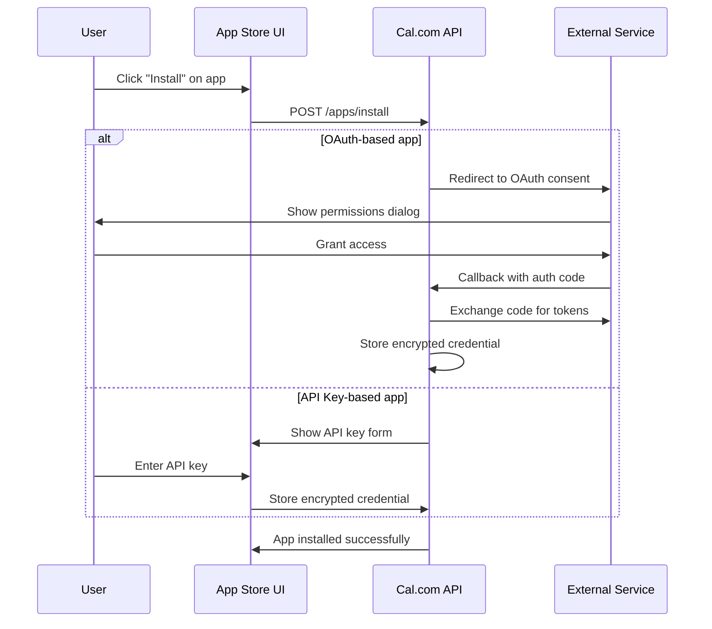
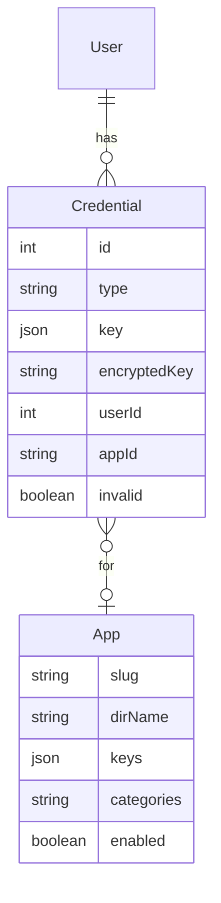
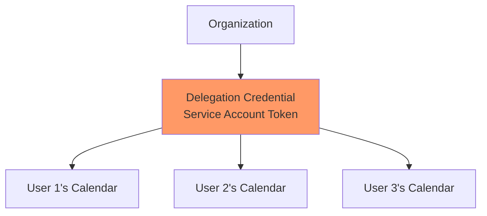
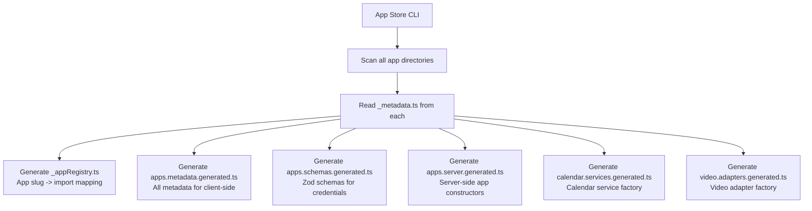
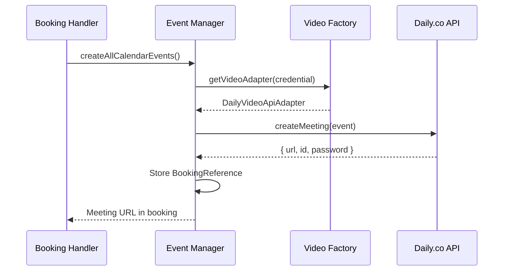
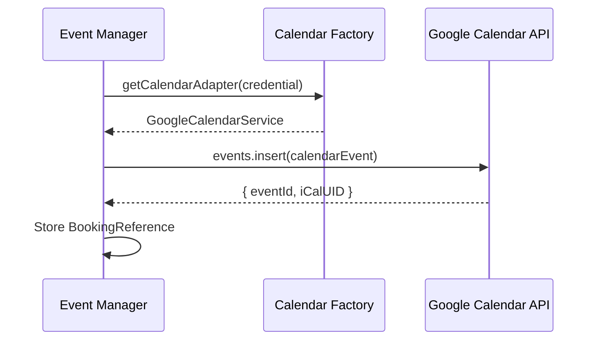
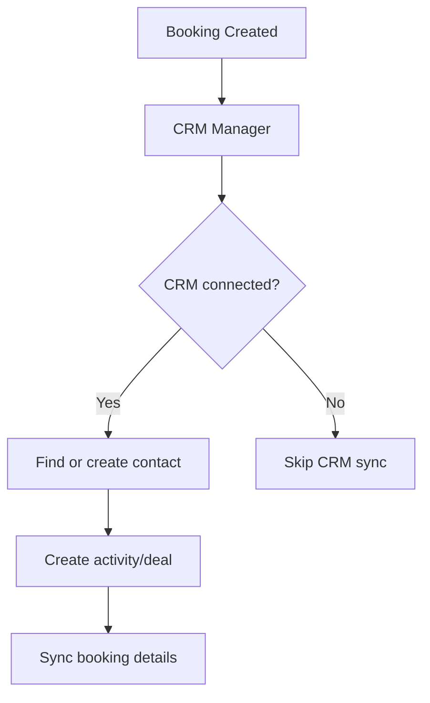
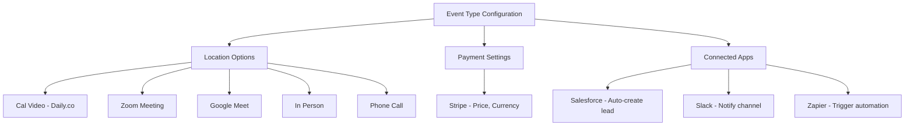
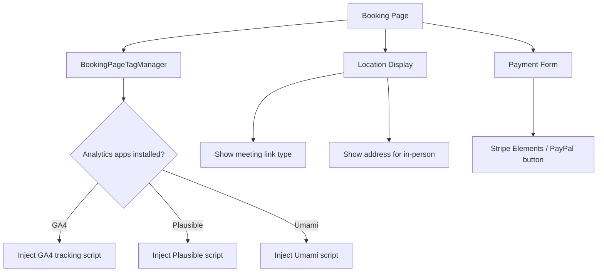

# App Store and Integrations Deep Dive

Cal.com's app store is one of its most distinguishing architectural features. With 150+ integrations, it provides a plugin system that connects scheduling with calendars, video conferencing, payments, CRMs, messaging platforms, analytics, and automation tools.

## App Store Architecture



## App Categories

### Calendar Integrations

| App | Protocol | Notes |
|-----|----------|-------|
| Google Calendar | OAuth 2.0 + Google Calendar API | Primary integration, supports push notifications |
| Outlook/Office 365 | OAuth 2.0 + Microsoft Graph API | Supports both personal and work accounts |
| Apple Calendar | App-specific password + CalDAV | Uses CalDAV protocol under the hood |
| CalDAV | CalDAV protocol | Generic support for any CalDAV server (Nextcloud, Radicale, etc.) |

Calendar apps implement the `CalendarService` interface:

```typescript
interface CalendarService {
  createEvent(event: CalendarEvent): Promise<NewCalendarEventType>;
  updateEvent(uid: string, event: CalendarEvent): Promise<NewCalendarEventType>;
  deleteEvent(uid: string, event: CalendarEvent): Promise<void>;
  getAvailability(
    dateFrom: string,
    dateTo: string,
    selectedCalendars: SelectedCalendar[]
  ): Promise<EventBusyDate[]>;
  listCalendars(): Promise<IntegrationCalendar[]>;
}
```

### Video Conferencing

| App | Notes |
|-----|-------|
| Daily.co | Default/built-in video provider, Cal Video branded |
| Zoom | OAuth integration, automatic meeting creation |
| Google Meet | Via Google Calendar event |
| Microsoft Teams | Via Microsoft Graph API |
| Webex | Cisco Webex integration |
| Jitsi | Self-hosted option |
| Campfire | 37signals video |
| Whereby | Embeddable video rooms |
| Tandem | Team video platform |

Video apps implement the `VideoApiAdapter`:

```typescript
interface VideoApiAdapter {
  createMeeting(event: CalendarEvent): Promise<VideoCallData>;
  updateMeeting(bookingRef: PartialReference, event: CalendarEvent): Promise<VideoCallData>;
  deleteMeeting(uid: string): Promise<void>;
  getAvailability(dateFrom?: string, dateTo?: string): Promise<EventBusyDate[]>;
}
```

### Payment

| App | Notes |
|-----|-------|
| Stripe | Primary payment provider, supports checkout sessions |
| PayPal | PayPal payment integration |
| Alby | Bitcoin Lightning payments |
| BtcPayServer | Self-hosted Bitcoin payments |

### CRM Integrations

| App | Notes |
|-----|-------|
| Salesforce | Full CRM sync, lead/contact creation |
| HubSpot | Contact and deal management |
| Close | CRM sync with close.com |
| Zoho CRM | Zoho ecosystem integration |
| Attio | Modern CRM integration |
| Zoho Bigin | Small business CRM |

### Messaging & Notifications

| App | Notes |
|-----|-------|
| Slack | Channel notifications on bookings |
| Telegram | Bot notifications |
| WhatsApp | Message notifications |
| Signal | Secure messaging notifications |

### Analytics & Tracking

| App | Notes |
|-----|-------|
| Google Analytics 4 | Booking page tracking |
| Plausible | Privacy-focused analytics |
| Umami | Self-hosted analytics |
| Twipla | Website intelligence |

### Automation

| App | Notes |
|-----|-------|
| Zapier | Trigger Zaps on booking events |
| Make (Integromat) | Automation workflows |
| n8n | Self-hosted automation |

## App Lifecycle

### Installation Flow



### Credential Storage



Credentials store OAuth tokens and API keys, encrypted with `CALENDSO_ENCRYPTION_KEY`. The `invalid` flag marks credentials that need re-authentication (expired refresh tokens, revoked access).

### Delegation Credentials

For enterprise organizations, **delegation credentials** allow a single OAuth connection to act on behalf of multiple users:



This avoids requiring each user to individually connect their calendar - the organization admin sets up domain-wide access once.

## Code Generation Pipeline

The app store CLI (`packages/app-store-cli`) generates registry files that wire apps into the application:



These generated files create a type-safe factory pattern where the application can instantiate the correct service based on the app slug.

## App Metadata Structure

Each app defines metadata:

```typescript
// packages/app-store/googlevideo/_metadata.ts (example)
export const metadata = {
  name: "Google Meet",
  description: "Video conferencing by Google",
  type: "google_video",
  variant: "conferencing",
  categories: ["conferencing"],
  logo: "icon.svg",
  publisher: "Cal.com",
  url: "https://meet.google.com",
  isOAuth: true,
  dirName: "googlevideo",
  appData: {
    location: {
      type: "integrations:google:meet",
      label: "Google Meet",
    },
  },
};
```

Key metadata fields:
- `type` - Unique identifier used in credential matching
- `variant` - Determines UI treatment (conferencing, calendar, payment, etc.)
- `categories` - For app store browsing/filtering
- `appData.location` - How the app appears as a meeting location option

## Integration with Booking Flow

### Video Integration



### Calendar Integration



### CRM Integration

CRM integrations hook into the booking lifecycle via the `CrmManager`:



### Webhook Apps (Zapier, Make)

These apps register as webhook subscribers and receive booking events:

```typescript
// Webhook payload structure
interface BookingWebhookPayload {
  triggerEvent: "BOOKING_CREATED" | "BOOKING_RESCHEDULED" | "BOOKING_CANCELLED";
  createdAt: string;
  payload: {
    title: string;
    startTime: string;
    endTime: string;
    attendees: { email: string; name: string }[];
    organizer: { email: string; name: string };
    location: string;
    metadata: Record<string, any>;
    responses: Record<string, any>;
  };
}
```

## App Configuration in Event Types

When creating an event type, users configure which apps apply:



The event type's `metadata.apps` JSON stores per-app configuration that is merged with the app's defaults at booking time.

## Booker-Facing App Components

Some apps contribute UI to the booking page:



## Testing Infrastructure

App store tests use:
- `packages/app-store/tests/` - Shared test utilities
- `packages/app-store/test-setup.ts` - Test environment setup
- Individual app `__tests__/` directories
- Mock credential factories for testing without real API keys

The `delegationCredential.test.ts` at the app-store root tests the delegation credential flow that spans multiple apps.

## Creating a New Integration

The CLI provides scaffolding:

```bash
yarn app-store create
# Interactive prompts for:
# - App name
# - Category (calendar, conferencing, payment, etc.)
# - Auth type (OAuth, API key, none)
```

This generates the directory structure, metadata template, and placeholder files. The developer then implements:

1. `_metadata.ts` - App identity and configuration
2. `lib/CalendarService.ts` or `lib/VideoApiAdapter.ts` - Core service implementation
3. `api/callback.ts` - OAuth callback handler (if OAuth)
4. `zod.ts` - Credential validation schema
5. `components/` - Settings UI components

After implementation, running `yarn app-store:build` regenerates the registry files to include the new app.
