# Organizations and Platform Deep Dive

Cal.com's enterprise features transform it from a personal scheduling tool into a multi-tenant platform capable of serving large organizations with complex access control, provisioning, and white-label requirements.

## Organization Hierarchy

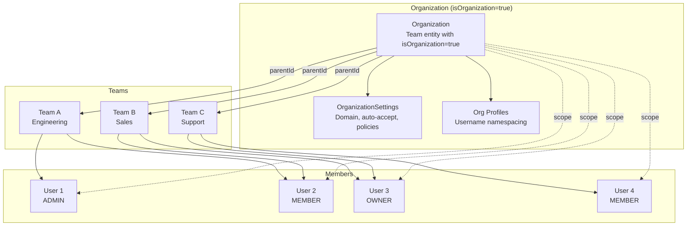

### The Team/Organization Duality

Cal.com uses the same `Team` model for both teams and organizations. The distinction:

| Aspect | Team | Organization |
|--------|------|-------------|
| `isOrganization` | `false` | `true` |
| `parentId` | Points to org | `null` |
| Has `OrganizationSettings` | No | Yes |
| Has `Profile` records | No | Yes (per-user profiles) |
| Can have sub-teams | No | Yes |
| Has domain routing | No | Yes |
| SCIM provisioning | No | Yes |
| SSO/SAML | No | Yes |

### Managed Organizations

An organization can manage other organizations:

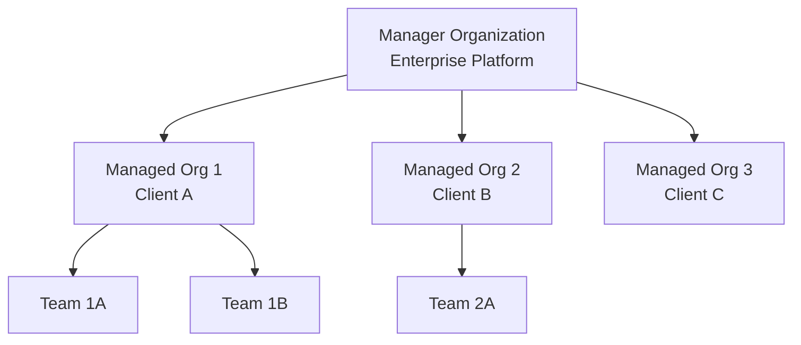

The `ManagedOrganization` model links a child org to its parent manager org. This enables:
- Central billing
- Cross-org administration
- Template propagation

## Profile System

### Username Namespacing

When users join an organization, they get a `Profile` within that org's namespace:

```
Before org: user visits cal.com/john
After joining Acme org: user visits acme.cal.com/john

Profile record:
{
  userId: 1,
  organizationId: 5,
  username: "john",
  uid: "...",
}
```

A user can have profiles in multiple organizations, each with potentially different usernames.

### Domain Routing

Organizations can configure custom domains:

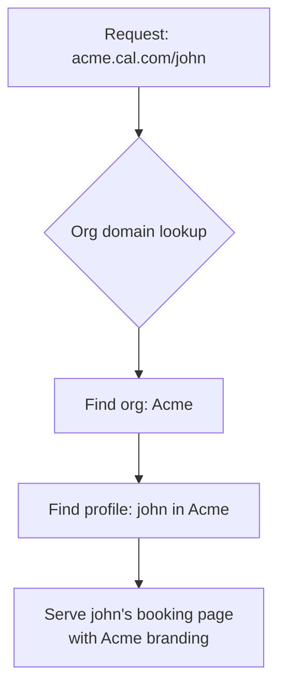

The `orgAutoAcceptEmail` setting auto-approves users with matching email domains (e.g., `@acme.com` users auto-join the Acme org).

## Permission System (PBAC)

### Built-in Roles

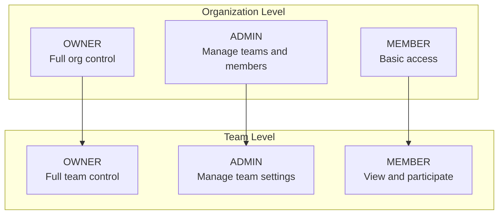

### Custom Roles (PBAC)

The Permission-Based Access Control system allows defining granular custom roles:

```typescript
// Role model
model Role {
  id          String       @id @default(uuid())
  name        String
  description String?
  teamId      Int
  team        Team         @relation(fields: [teamId], references: [id], onDelete: Cascade)
  permissions Permission[]
  memberships Membership[]
}

model Permission {
  id     String @id @default(uuid())
  action String // e.g., "event_type.create", "booking.cancel"
  roleId String
  role   Role   @relation(fields: [roleId], references: [id], onDelete: Cascade)
}
```

Custom roles can be assigned to memberships via `customRoleId`, providing fine-grained control over what team members can do.

## Directory Sync (DSYNC)

DSYNC allows organizations to provision users from identity providers:

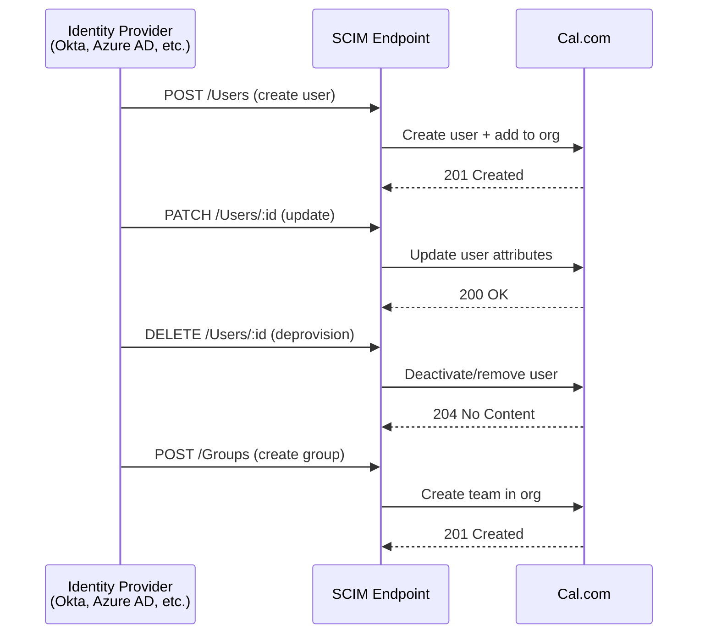

The `DSyncTeamGroupMapping` model maps external group IDs to Cal.com teams.

## SSO / SAML

Single Sign-On support via SAML:

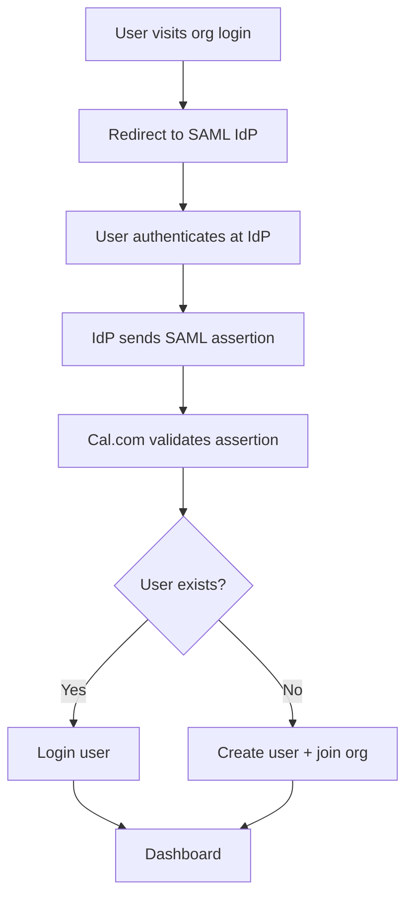

SAML configuration is stored per-organization with IdP metadata, certificate, and login URL.

## Enterprise Features (`packages/ee/`)

```
packages/ee/
  api-keys/           - API key management for organizations
  billing/            - Stripe-based subscription billing
  common/             - Shared enterprise utilities
  deployment/         - Self-hosted deployment features
  dsync/              - Directory sync (SCIM)
  impersonation/      - Admin user impersonation
  integration-attribute-sync/ - Sync user attributes from integrations
  managed-event-types/ - Template event types that cascade to children
  organizations/      - Organization management
  payments/           - Payment processing
  round-robin/        - Advanced round-robin features
  sso/                - SAML/SSO authentication
  teams/              - Team management
  users/              - User management
  workflows/          - Workflow automation
```

### Managed Event Types

Organization admins can create **managed event types** that serve as templates:

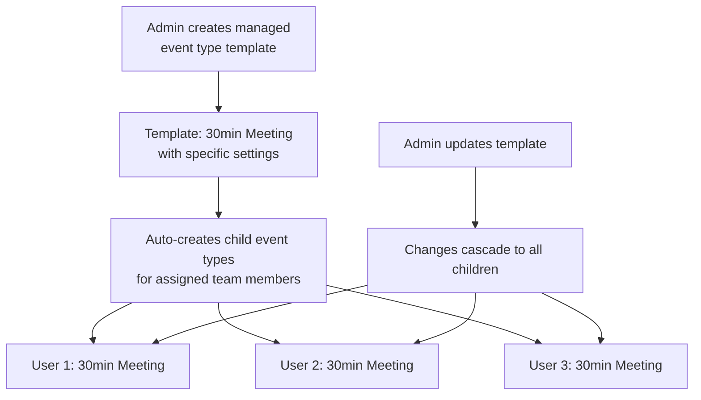

The `parentId` field on `EventType` links children to their managed parent.

### Impersonation

Organization admins can impersonate member users for debugging:

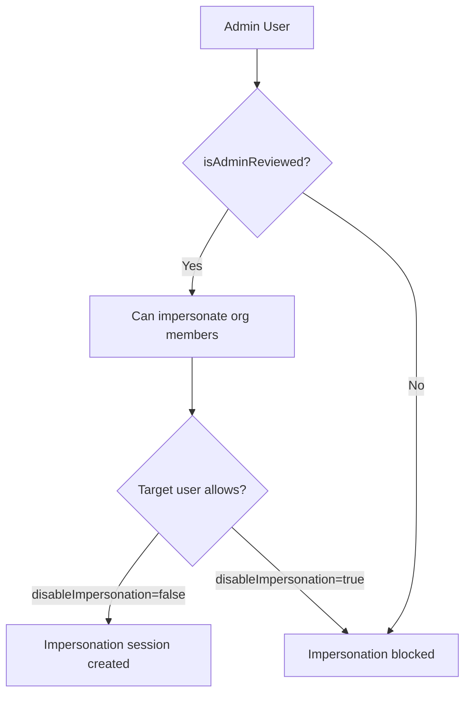

The `isAdminReviewed` flag requires instance-level admin approval before org admins can impersonate.

## Platform API (API v2)

The NestJS API v2 serves platform consumers who embed Cal.com functionality:

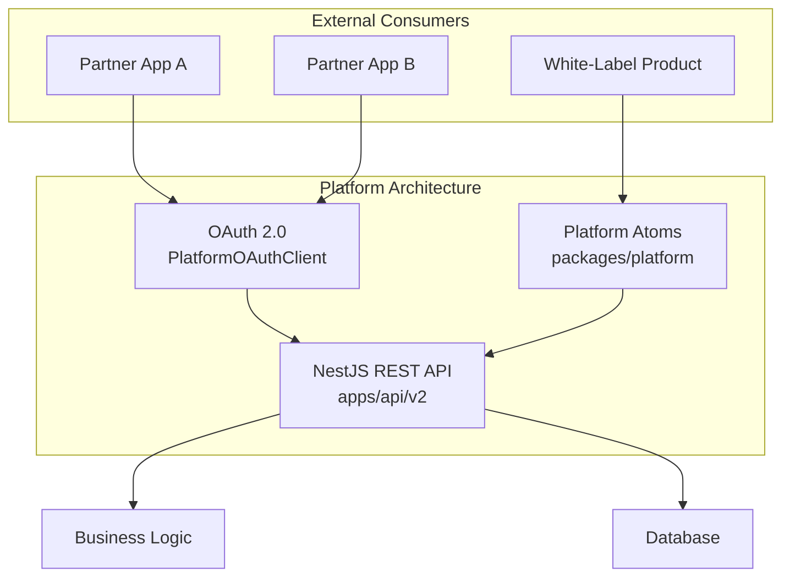

### OAuth Client Model

```typescript
model PlatformOAuthClient {
  id            String    @id @default(uuid())
  name          String
  secret        String
  permissions   Int       @default(0)
  logo          String?
  redirectUris  String[]
  organizationId Int
  organization  Team      @relation(fields: [organizationId], references: [id], onDelete: Cascade)
  createdById   Int?
  createdBy     User?     @relation(fields: [createdById], references: [id])
  // ... access tokens, refresh tokens, etc.
}
```

Partners register OAuth clients, authenticate users through OAuth flows, and access the API on behalf of users.

### Platform Atoms

The `packages/platform/` provides embeddable React components ("Atoms") for white-labeling:

- Booking widgets
- Availability selectors
- Calendar views
- Event type managers

These are published to npm and can be embedded in partner applications with custom styling and branding.

## Attributes and Routing

### Team Member Attributes

Organizations can define custom attributes for team members:

```typescript
model Attribute {
  id     String          @id @default(uuid())
  name   String
  slug   String
  type   AttributeType   // TEXT, NUMBER, SINGLE_SELECT, MULTI_SELECT
  teamId Int
  team   Team            @relation(fields: [teamId], references: [id], onDelete: Cascade)
  options AttributeOption[]
}

model AttributeToUser {
  id          String          @id @default(uuid())
  memberId    Int
  member      Membership      @relation(fields: [memberId], references: [id], onDelete: Cascade)
  attributeOptionId String
  attributeOption   AttributeOption @relation(fields: [attributeOptionId], references: [id], onDelete: Cascade)
}
```

Example attributes:
- Language: English, Spanish, French
- Expertise: Sales, Technical, Billing
- Region: NA, EMEA, APAC
- Seniority: Junior, Senior, Lead

### Attribute-Based Routing

Routing forms use attributes to match bookers with the right team member:

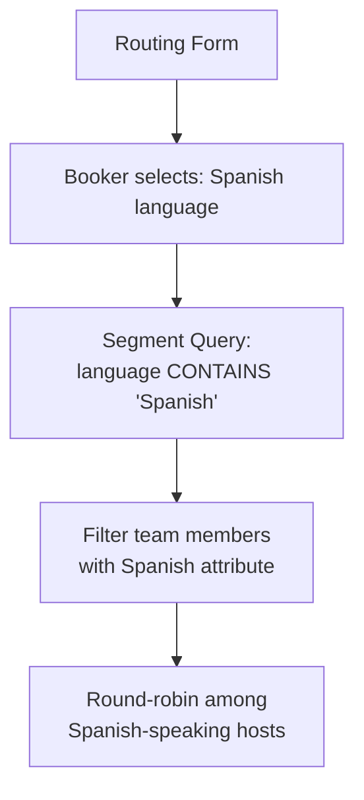

The `rrSegmentQueryValue` JSON on EventType stores these filter expressions.

### Integration Attribute Sync

The `IntegrationAttributeSync` model syncs attributes from external systems:

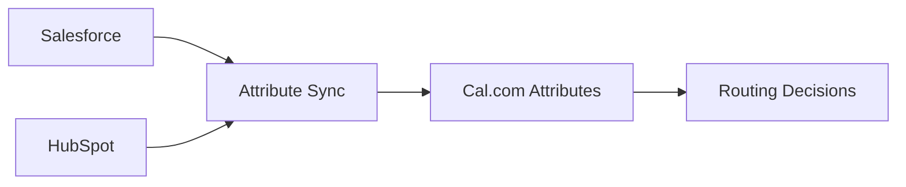

## Billing Architecture

### Team Billing

```typescript
model TeamBilling {
  id           String   @id @default(uuid())
  teamId       Int      @unique
  team         Team     @relation(fields: [teamId], references: [id], onDelete: Cascade)
  stripeCustomerId    String?
  stripeSubscriptionId String?
  plan         String?
  status       String?
}
```

### Organization Billing

Separate billing for organizations with:
- Per-seat pricing
- Feature tier unlocking
- Overage handling for credits (SMS, AI phone calls)
- Monthly proration tracking via `SeatChangeLog` and `MonthlyProration`

### Credit System

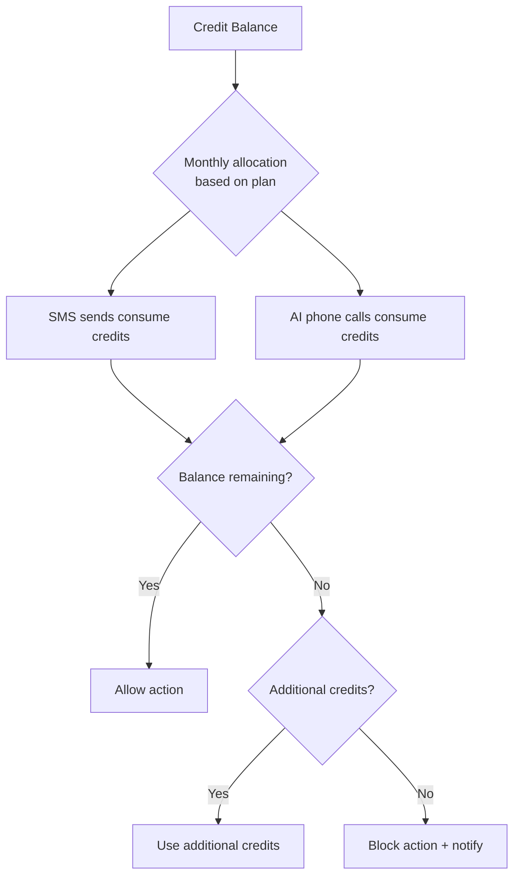

## Organization Onboarding

```typescript
model OrganizationOnboarding {
  id              String   @id @default(uuid())
  name            String
  slug            String?
  logo            String?
  bio             String?
  orgOwnerEmail   String
  invitedMembers  Json?
  teams           Json?
  // ... onboarding state fields
  stripeSubscriptionId    String?
  stripeCustomerId        String?
}
```

The onboarding flow guides new organizations through:
1. Organization details (name, slug, logo)
2. Team creation
3. Member invitation
4. Billing setup
5. Domain configuration
6. SSO setup (optional)

## Multi-Tenancy Data Isolation

Data isolation in Cal.com's multi-tenant model:

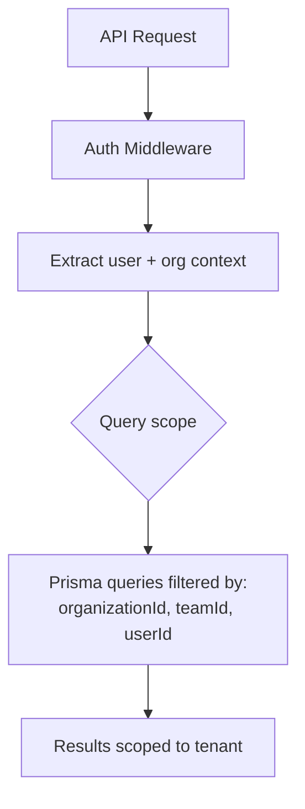

Key isolation boundaries:
- Event types are scoped to user or team
- Bookings reference specific users and event types
- Credentials are per-user or per-team
- Webhooks can be user-level, team-level, or event-type-level
- Routing forms are team-scoped
- Attributes are organization-scoped

The `organizationId` on users and the `parentId` on teams form the primary scoping mechanism. tRPC middleware and NestJS guards enforce access control at the API layer.
