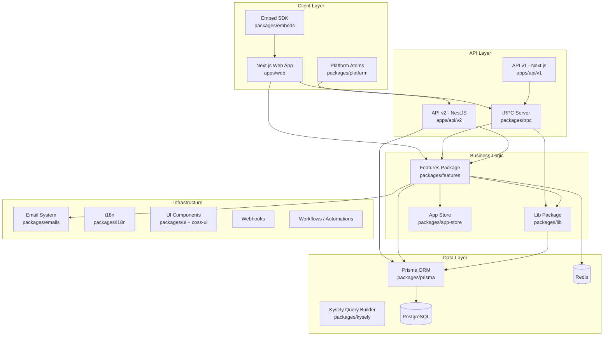
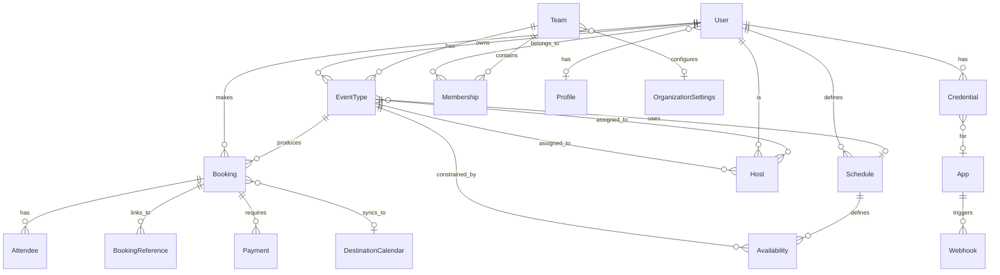

# Cal.com - Open Source Scheduling Infrastructure

## Overview

Cal.com is the open-source alternative to Calendly, providing a comprehensive scheduling platform that allows individuals and organizations to manage event types, availability, bookings, and calendar integrations. It is a full-featured enterprise-grade SaaS with support for teams, organizations, round-robin assignment, routing forms, workflows, payments, embeds, and an extensive app store of integrations.

The project is structured as a **Turborepo monorepo** using Yarn 4 workspaces, with a Next.js 14+ App Router frontend, a tRPC API layer for the web app, and a NestJS-based REST API v2 for platform/external consumers.

## Architecture Overview

## Monorepo Structure

### Apps (`apps/`)

| App | Technology | Purpose |
|-----|-----------|---------|
| `apps/web` | Next.js 14+ (App Router) | Primary web application - booking pages, dashboard, settings |
| `apps/api/v1` | Next.js API Routes | Legacy REST API proxying through tRPC |
| `apps/api/v2` | NestJS | Modern REST API for platform consumers, OAuth-based |

### Core Packages (`packages/`)

| Package | Purpose |
|---------|---------|
| `prisma` | Database schema (3341 lines), migrations, Prisma client, Zod validators |
| `trpc` | tRPC router definitions - viewer, public, logged-in routes |
| `features` | All business logic organized by domain (bookings, availability, calendars, etc.) |
| `lib` | Shared utilities, helpers, constants, calendar service abstractions |
| `app-store` | 100+ integrations (calendars, video, payment, CRM, messaging, analytics) |
| `emails` | Email templates and email manager service |
| `embeds` | Embeddable booking widgets (core JS, React wrapper, snippet loader) |
| `ui` | Shared React component library |
| `coss-ui` | Commercial open-source UI components |
| `i18n` | Internationalization with ~30+ locales |
| `platform` | Platform SDK / Atoms for white-label embedding |
| `kysely` | Type-safe query builder generated from Prisma schema |
| `ee` | Enterprise-edition features (SSO, DSYNC, billing, organizations) |
| `config` | Shared configuration (TypeScript, ESLint) |
| `dayjs` | Customized dayjs with timezone plugins |
| `testing` | Test utilities and helpers |

## Data Model

The Prisma schema defines 80+ models. Key entities:

### Key Models

- **User** - Core user entity with profiles, credentials, teams, schedules
- **EventType** - Configurable booking types (individual, team, round-robin, collective, managed)
- **Booking** - Individual booking instances with status lifecycle (PENDING -> ACCEPTED/REJECTED/CANCELLED)
- **Schedule / Availability** - Working hours and date overrides
- **Host** - Links users to event types with priority, weight (for round-robin)
- **Team / Organization** - Multi-tenant hierarchy with RBAC
- **Credential** - OAuth tokens and API keys for integrations
- **Workflow** - Automated actions triggered by booking events

## Key Subsystems

### 1. Booking Engine
See: [01-booking-engine-deep-dive.md](./01-booking-engine-deep-dive.md)

The booking engine is the core of cal.com. It handles slot computation, conflict detection, booking creation, rescheduling, cancellation, and seat management. Key files:
- `packages/features/bookings/lib/handleNewBooking/` - Multi-file booking creation flow
- `packages/features/bookings/lib/create-booking.ts` - Booking persistence
- `packages/features/bookings/lib/EventManager.ts` - Calendar event lifecycle
- `packages/features/bookings/lib/getLuckyUser.ts` - Round-robin assignment algorithm

### 2. Availability System
See: [02-availability-and-scheduling-deep-dive.md](./02-availability-and-scheduling-deep-dive.md)

Computes available time slots considering schedules, busy times from connected calendars, booking limits, buffer times, timezone handling, and travel schedules.

### 3. App Store & Integrations
See: [03-app-store-and-integrations-deep-dive.md](./03-app-store-and-integrations-deep-dive.md)

150+ integrations organized by category: calendars (Google, Outlook, Apple, CalDAV), video (Daily.co, Zoom, Google Meet), payment (Stripe), CRM (Salesforce, HubSpot, Close), messaging (Slack, Telegram), and more.

### 4. Organizations & Multi-Tenancy
See: [04-organizations-and-platform-deep-dive.md](./04-organizations-and-platform-deep-dive.md)

Enterprise features including organization hierarchy, SCIM/DSYNC provisioning, SSO/SAML, managed event types, domain-wide delegation, and platform OAuth.

## Entry Points

### Web Application
- `apps/web/app/layout.tsx` - Root layout with providers, i18n, theme
- `apps/web/app/page.tsx` - Landing/redirect
- `apps/web/app/(use-page-wrapper)/` - Authenticated dashboard routes
- `apps/web/app/(booking-page-wrapper)/` - Public booking page routes

### tRPC API
- `packages/trpc/server/routers/viewer/` - 40+ domain routers (bookings, eventTypes, availability, teams, etc.)
- `packages/trpc/server/routers/publicViewer/` - Public endpoints (slots, event info)
- `packages/trpc/server/routers/loggedInViewer/` - Authenticated user endpoints

### REST API v2 (NestJS)
- `apps/api/v2/src/main.ts` - NestJS bootstrap
- `apps/api/v2/src/modules/` - 30+ NestJS modules (bookings, event-types, slots, organizations, etc.)

## Technology Stack

| Layer | Technology |
|-------|-----------|
| Frontend | Next.js 14+ (App Router), React 19, TailwindCSS |
| API (internal) | tRPC v10 |
| API (external) | NestJS (v2), Next.js API routes (v1) |
| Database | PostgreSQL via Prisma ORM + Kysely |
| Cache | Redis |
| Email | Custom template system (React Email) |
| Auth | NextAuth.js (email, Google, SAML, AZUREAD) |
| Payments | Stripe |
| Video | Daily.co (primary), Zoom, Google Meet, etc. |
| Monitoring | Sentry, Axiom |
| Task Queue | Trigger.dev |
| Build | Turborepo, Yarn 4 workspaces |
| Testing | Vitest (unit), Playwright (E2E), Checkly (synthetic) |
| Linting | Biome |
| i18n | next-i18next, 30+ locales |
| Deployment | Vercel, Docker |

## Configuration & Environment

The project uses extensive environment variables (~200+). Key categories:

- **Database**: `DATABASE_URL`, `DATABASE_DIRECT_URL`
- **Auth**: `NEXTAUTH_SECRET`, `CALENDSO_ENCRYPTION_KEY`
- **Integrations**: Per-app OAuth credentials (Google, Zoom, Stripe, etc.)
- **Infrastructure**: `REDIS_URL`, `CRON_SECRET`, `DAILY_API_KEY`
- **Feature Flags**: Various `NEXT_PUBLIC_*` toggles

Docker Compose provides: PostgreSQL, Redis, web app, API v2, and Prisma Studio.

## Testing Strategy

- **Unit Tests**: Vitest with `vitest.workspace.ts` configuring per-package test environments
- **Integration Tests**: Prismock for database mocking, vitest-fetch-mock for HTTP
- **E2E Tests**: Playwright with 4 projects (@calcom/web, @calcom/app-store, @calcom/embed-core, @calcom/embed-react)
- **Synthetic Monitoring**: Checkly for production health checks
- **Database Seeds**: `packages/prisma/seed.ts` for development and E2E data

## Key Insights

1. **Massive Scale**: 3341-line Prisma schema, 150+ app integrations, 40+ tRPC routers, 30+ NestJS modules - this is one of the largest open-source TypeScript monorepos.

2. **Dual API Strategy**: The tRPC layer serves the web app (type-safe, co-located), while NestJS API v2 serves platform/external consumers with proper REST conventions and OAuth.

3. **Domain-Driven Feature Packages**: Business logic lives in `packages/features/` organized by domain (bookings, calendars, workflows, etc.) rather than by technical layer, enabling good separation.

4. **Round-Robin Sophistication**: The assignment algorithm (`getLuckyUser.ts`) considers weights, priorities, calibration, no-show tracking, and segment-based filtering.

5. **Enterprise Architecture**: Organization hierarchy (Org -> Team -> User), RBAC with custom roles (PBAC), SCIM provisioning, domain-wide delegation for calendar access.

6. **Embed System**: A sophisticated cross-origin iframe embed system with a custom message protocol for resizing, theming, and routing.

7. **Credit System**: Usage-based billing with credit balances for SMS and AI phone calls, with monthly limits and overage tracking.

8. **Generated Code**: Heavy use of code generation - Prisma client, Zod validators, Kysely types, app store registries, and enum files are all auto-generated.
