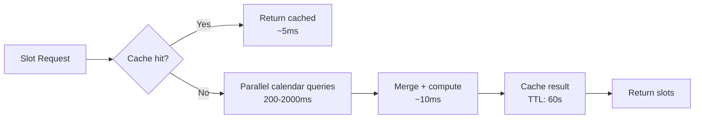
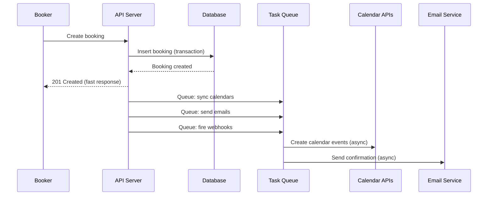
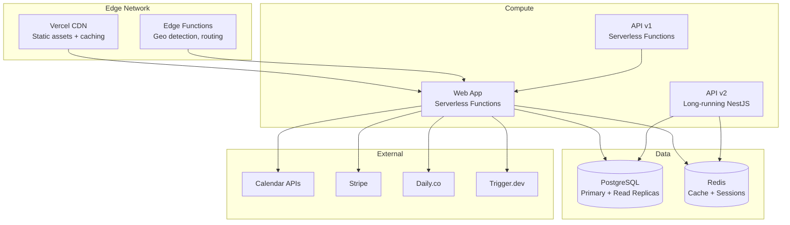
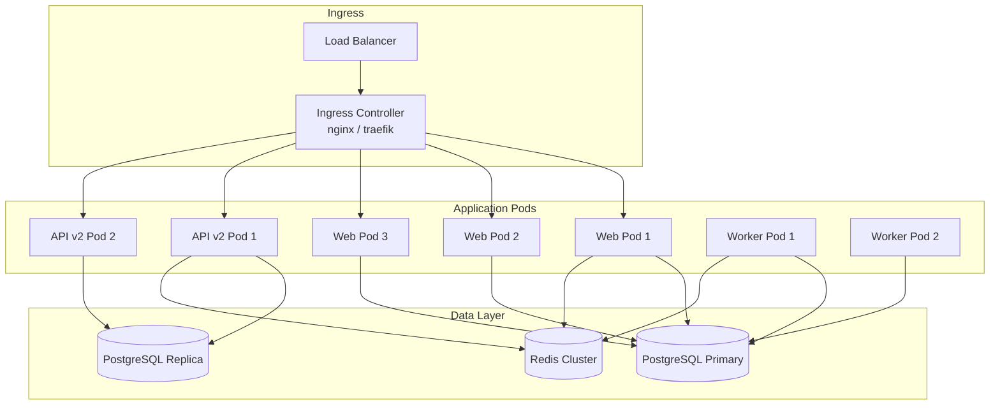
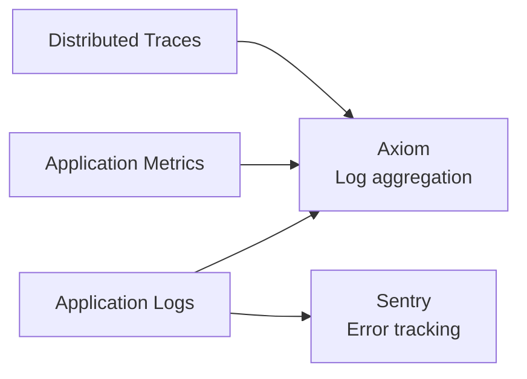

# Production-Grade Considerations

Performance optimization, deployment strategies, monitoring, and scaling considerations for Cal.com.

## Performance Optimization

### Slot Computation Performance

Slot computation is the most latency-sensitive operation -- it runs on every booking page load. Key optimization areas:

#### Calendar API Latency

The biggest bottleneck is fetching busy times from external calendars. Each calendar API call can take 200-2000ms:



**Recommendations:**
- Aggressive caching in Redis with short TTL (30-60 seconds)
- Background refresh workers that pre-warm cache for popular event types
- Calendar webhook subscriptions (Google Calendar push notifications) to invalidate cache on changes
- Stale-while-revalidate pattern: serve cached slots while refreshing in background

#### Database Query Optimization

Booking limit checks require counting existing bookings. With proper indexes:

```sql
-- These indexes from the Prisma schema are critical
@@index([userId, status, startTime])
@@index([eventTypeId, status])
@@index([startTime, endTime, status])
@@index([userId, endTime])
@@index([userId, createdAt])
```

For high-volume users, consider materialized booking count views:

```sql
CREATE MATERIALIZED VIEW booking_counts AS
SELECT
    user_id,
    event_type_id,
    date_trunc('day', start_time) as booking_day,
    COUNT(*) as booking_count,
    SUM(EXTRACT(EPOCH FROM (end_time - start_time)) / 60) as total_minutes
FROM "Booking"
WHERE status = 'accepted'
GROUP BY user_id, event_type_id, booking_day;

-- Refresh periodically or on booking changes
REFRESH MATERIALIZED VIEW CONCURRENTLY booking_counts;
```

### Booking Creation Performance

Booking creation involves multiple external API calls (calendar creation, video meeting, payment). Optimize with:

1. **Non-blocking notification dispatch**: Queue email/SMS/webhook notifications for async processing rather than blocking the booking response
2. **Calendar event creation**: Consider making calendar sync eventually consistent for faster booking confirmation
3. **Database transactions**: Keep transactions narrow -- only lock the booking creation itself, not the calendar sync



### Frontend Performance

Cal.com's Next.js app uses several optimization strategies:

- **Speculation Rules**: Pre-renders navigation targets on hover (`SpeculationRules.tsx`)
- **Font optimization**: Self-hosted Inter + CalSans fonts with `display: swap`
- **Icon sprites**: SVG sprite sheet for icons instead of individual SVG imports
- **Route-based code splitting**: Next.js App Router automatic splitting
- **ISR/SSG**: Static generation for public booking pages where possible

## Deployment Architecture

### Vercel Deployment (Primary)



### Docker Self-Hosted Deployment

The `docker-compose.yml` provides a production-ready setup:

```
Services:
  - database (PostgreSQL)
  - redis (Cache)
  - calcom (Web app - port 3000)
  - calcom-api (API v2 - port 80)
  - studio (Prisma Studio - port 5555, optional)
```

**Production hardening for Docker:**

1. **Multi-stage builds**: The Dockerfile uses multi-stage builds to minimize image size
2. **Non-root user**: Run containers as non-root
3. **Health checks**: Add Docker health check endpoints
4. **Resource limits**: Set memory and CPU limits per container
5. **Volume management**: Persistent volumes for database data
6. **Secret management**: Use Docker secrets or external vault for credentials

### Kubernetes Deployment

For larger scale:



**HPA (Horizontal Pod Autoscaler) recommendations:**
- Web pods: Scale on CPU (70%) and request count
- API pods: Scale on CPU and response latency
- Worker pods: Scale on queue depth

## Monitoring and Observability

### Metrics to Track

| Category | Metric | Alert Threshold |
|----------|--------|-----------------|
| Availability | Slot computation latency (p95) | > 3s |
| Availability | Calendar API error rate | > 5% |
| Booking | Booking creation latency (p95) | > 5s |
| Booking | Booking failure rate | > 2% |
| Booking | Double-booking incidents | > 0 |
| Calendar | Calendar sync failures | > 10% |
| Calendar | Credential refresh failures | > 5% |
| API | Request latency (p95) | > 2s |
| API | Error rate (5xx) | > 1% |
| Database | Query latency (p95) | > 100ms |
| Database | Connection pool utilization | > 80% |
| Redis | Cache hit ratio | < 80% |
| Redis | Memory usage | > 80% |
| Email | Delivery failure rate | > 5% |
| Webhook | Delivery failure rate | > 5% |

### Logging Strategy

Cal.com uses structured logging. Production setup:



Key logging points:
- Booking creation (success/failure with context)
- Calendar API calls (latency, errors)
- Webhook delivery (status, retries)
- Authentication events (login, OAuth flow)
- Rate limiting events

### Health Checks

Implement health check endpoints:

```typescript
// Liveness: Is the process running?
GET /api/health/live -> 200 OK

// Readiness: Can the service handle requests?
GET /api/health/ready -> checks DB connection, Redis connection

// Startup: Has initialization completed?
GET /api/health/startup -> checks migrations applied, cache warmed
```

### Synthetic Monitoring

Cal.com uses Checkly (`__checks__/` directory) for synthetic monitoring:
- Booking page load times across regions
- End-to-end booking flow tests
- API endpoint availability
- Calendar integration health

## Scaling Considerations

### Database Scaling

**Read replicas** for query-heavy operations:
- Slot computation queries (read-only)
- Booking list queries
- Analytics/insights queries
- API v2 read endpoints

**Write optimization:**
- Batch insert for recurring booking creation
- Upsert for calendar cache updates
- Connection pooling (PgBouncer for PostgreSQL)

**Schema considerations at scale:**
- The `Booking` table will be the largest -- partition by `startTime` (monthly)
- `CalendarCache` should have aggressive TTL cleanup
- `WorkflowReminder` needs periodic cleanup of delivered reminders
- Archive old bookings to a separate table/database

### Calendar API Rate Limits

Calendar APIs have strict rate limits:
- Google Calendar: 500 requests per 100 seconds per user
- Microsoft Graph: 10,000 requests per 10 minutes per app
- Apple CalDAV: Varies, generally conservative

**Strategies:**
- Request coalescing: Batch multiple users' queries into fewer API calls
- Exponential backoff with jitter on rate limit errors
- Calendar cache to minimize repeat queries
- Webhook-based updates instead of polling where supported

### Redis Scaling

Redis usage patterns:
- **Slot cache**: Key per `(eventTypeId, dateRange, timezone)`, TTL 60s
- **Rate limiting**: Sliding window counters
- **Session data**: User session storage
- **Queue**: Background job queue (if using Redis-based queue)

For high traffic, use Redis Cluster with consistent hashing.

### CDN and Edge Caching

Public booking pages can be edge-cached:
- Static assets (JS, CSS, fonts): Long TTL, immutable headers
- Booking page HTML: Short TTL (60s) or ISR with on-demand revalidation
- Slot data: Not cacheable at CDN level (user-specific)
- Public event type metadata: Cacheable with short TTL

## Security Considerations

### Authentication

- **NextAuth.js** for web app authentication (session-based)
- **JWT** for API v2 authentication (token-based)
- **OAuth 2.0** for platform API access
- **API keys** for legacy API v1

### Data Protection

- Credential encryption with `CALENDSO_ENCRYPTION_KEY`
- CSP headers (`apps/web/lib/csp.ts`)
- Rate limiting on authentication endpoints
- CORS configuration for embed cross-origin access
- Input validation via Zod schemas at API boundaries

### Vulnerability Mitigations

From recent commits:
- IDOR prevention in PBAC endpoints (role management)
- Bot detection for booking pages
- Cloudflare Turnstile integration for CAPTCHA
- Email verification for bookers
- Debounced forgot-password to prevent enumeration

### Credential Rotation

Calendar OAuth tokens must be refreshed:
- Monitor `Credential.invalid` flag for broken credentials
- Alert on refresh_token failures
- Implement re-authorization flow for expired grants
- Domain-wide delegation reduces individual credential management

## Disaster Recovery

### Backup Strategy

| Component | Backup Method | RPO | RTO |
|-----------|--------------|-----|-----|
| PostgreSQL | Continuous WAL archiving | < 1 min | < 15 min |
| Redis | RDB snapshots | < 5 min | < 5 min |
| File storage | Object storage replication | < 1 min | < 5 min |
| Configuration | Git (infrastructure as code) | 0 | < 30 min |

### Failure Modes

| Failure | Impact | Mitigation |
|---------|--------|------------|
| PostgreSQL down | All operations fail | Automated failover to replica |
| Redis down | Degraded performance, cache miss | Fall back to direct queries |
| Calendar API down | Can't fetch busy times | Serve cached data with warning |
| Email service down | Notifications delayed | Queue with retry |
| Video provider down | Meeting links fail | Fallback video provider |

### Data Consistency

The most critical invariant: **no double bookings**. Ensure:

1. Database-level unique constraints on booking slots
2. Serializable isolation for booking creation transactions
3. Idempotency keys prevent duplicate submissions
4. Post-booking verification that confirms no conflicts were introduced

## Cost Optimization

### Infrastructure Costs

| Component | Cost Driver | Optimization |
|-----------|------------|-------------|
| Compute | Request volume | Serverless scaling (Vercel) |
| Database | Storage + IOPS | Archive old bookings, optimize queries |
| Redis | Memory | Appropriate TTLs, eviction policies |
| Calendar APIs | API calls | Caching, webhook-based updates |
| Email | Send volume | Batch notifications, digest emails |
| Video (Daily.co) | Meeting minutes | Only create rooms on demand |

### Scaling Cost vs. Performance Tradeoffs

- **Calendar cache TTL**: Longer TTL = fewer API calls but staler data
- **Read replicas**: Each replica adds cost but reduces primary load
- **Background workers**: More workers = faster processing but higher cost
- **Edge caching**: Reduces origin requests but adds CDN cost

The key optimization is calendar API caching -- reducing external API calls is both the biggest performance win and the biggest cost saving.
