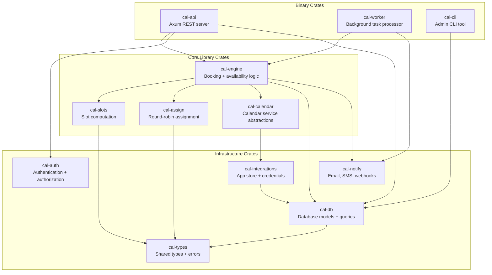

# Rust Revision: Cal.com Scheduling Engine

Translating Cal.com's scheduling core into Rust focuses on the backend systems where Rust's strengths (type safety, performance, concurrency) provide the most value. The frontend (React/Next.js) would remain in TypeScript.

## Crate Architecture



## Workspace Cargo.toml

```toml
[workspace]
members = [
    "crates/cal-api",
    "crates/cal-worker",
    "crates/cal-cli",
    "crates/cal-engine",
    "crates/cal-calendar",
    "crates/cal-slots",
    "crates/cal-assign",
    "crates/cal-db",
    "crates/cal-auth",
    "crates/cal-integrations",
    "crates/cal-notify",
    "crates/cal-types",
]
resolver = "2"

[workspace.dependencies]
tokio = { version = "1", features = ["full"] }
axum = { version = "0.8", features = ["macros"] }
serde = { version = "1", features = ["derive"] }
serde_json = "1"
sqlx = { version = "0.9", features = ["runtime-tokio", "postgres", "chrono", "uuid", "json"] }
chrono = { version = "0.4", features = ["serde"] }
chrono-tz = "0.10"
uuid = { version = "1", features = ["v4", "serde"] }
thiserror = "2"
anyhow = "1"
tracing = "0.1"
tracing-subscriber = { version = "0.3", features = ["env-filter", "json"] }
tower = "0.5"
tower-http = { version = "0.6", features = ["cors", "trace", "compression-gzip"] }
redis = { version = "0.29", features = ["aio", "tokio-comp"] }
reqwest = { version = "0.12", features = ["json", "rustls-tls"] }
```

## Key Type System Designs

### Event Type and Scheduling Type

```rust
// crates/cal-types/src/scheduling.rs

use chrono::{DateTime, NaiveTime, Utc, Weekday};
use serde::{Deserialize, Serialize};

#[derive(Debug, Clone, Serialize, Deserialize)]
pub enum SchedulingType {
    RoundRobin,
    Collective,
    Managed,
}

#[derive(Debug, Clone, Serialize, Deserialize)]
pub enum PeriodType {
    Unlimited,
    Rolling { days: u32 },
    RollingWindow { days: u32 },
    Range { start: DateTime<Utc>, end: DateTime<Utc> },
}

#[derive(Debug, Clone, Serialize, Deserialize)]
pub struct BookingLimits {
    pub per_day: Option<u32>,
    pub per_week: Option<u32>,
    pub per_month: Option<u32>,
    pub per_year: Option<u32>,
}

#[derive(Debug, Clone, Serialize, Deserialize)]
pub struct DurationLimits {
    pub per_day: Option<chrono::Duration>,
    pub per_week: Option<chrono::Duration>,
    pub per_month: Option<chrono::Duration>,
    pub per_year: Option<chrono::Duration>,
}

#[derive(Debug, Clone, Serialize, Deserialize)]
pub struct EventTypeConfig {
    pub id: i32,
    pub title: String,
    pub slug: String,
    pub duration: chrono::Duration,
    pub slot_interval: Option<chrono::Duration>,
    pub scheduling_type: Option<SchedulingType>,
    pub period_type: PeriodType,
    pub booking_limits: Option<BookingLimits>,
    pub duration_limits: Option<DurationLimits>,
    pub minimum_booking_notice: chrono::Duration,
    pub before_event_buffer: chrono::Duration,
    pub after_event_buffer: chrono::Duration,
    pub seats_per_time_slot: Option<u32>,
    pub requires_confirmation: bool,
}
```

### Availability Types

```rust
// crates/cal-types/src/availability.rs

use chrono::{DateTime, NaiveDate, NaiveTime, Utc};
use chrono_tz::Tz;

/// A recurring weekly availability rule
#[derive(Debug, Clone)]
pub struct WeeklyRule {
    pub days: Vec<chrono::Weekday>,
    pub start_time: NaiveTime,
    pub end_time: NaiveTime,
}

/// A date-specific override
#[derive(Debug, Clone)]
pub struct DateOverride {
    pub date: NaiveDate,
    pub ranges: Vec<TimeRange>,
}

/// A contiguous time range in UTC
#[derive(Debug, Clone, Copy, PartialEq, Eq, PartialOrd, Ord)]
pub struct TimeRange {
    pub start: DateTime<Utc>,
    pub end: DateTime<Utc>,
}

impl TimeRange {
    pub fn overlaps(&self, other: &TimeRange) -> bool {
        self.start < other.end && other.start < self.end
    }

    pub fn merge(&self, other: &TimeRange) -> Option<TimeRange> {
        if self.overlaps(other) || self.end == other.start || other.end == self.start {
            Some(TimeRange {
                start: self.start.min(other.start),
                end: self.end.max(other.end),
            })
        } else {
            None
        }
    }

    pub fn duration(&self) -> chrono::Duration {
        self.end - self.start
    }

    pub fn contains(&self, instant: DateTime<Utc>) -> bool {
        self.start <= instant && instant < self.end
    }
}

/// Merged set of non-overlapping time ranges
#[derive(Debug, Clone)]
pub struct TimeRangeSet {
    ranges: Vec<TimeRange>,  // Invariant: sorted, non-overlapping
}

impl TimeRangeSet {
    pub fn new() -> Self {
        Self { ranges: Vec::new() }
    }

    pub fn insert(&mut self, range: TimeRange) {
        self.ranges.push(range);
        self.normalize();
    }

    pub fn subtract(&self, busy: &TimeRangeSet) -> TimeRangeSet {
        let mut result = Vec::new();
        for avail in &self.ranges {
            let mut remaining = vec![*avail];
            for busy_range in &busy.ranges {
                remaining = remaining
                    .into_iter()
                    .flat_map(|r| subtract_range(r, *busy_range))
                    .collect();
            }
            result.extend(remaining);
        }
        TimeRangeSet { ranges: result }
    }

    fn normalize(&mut self) {
        self.ranges.sort_by_key(|r| r.start);
        let mut merged = Vec::new();
        for range in self.ranges.drain(..) {
            if let Some(last) = merged.last_mut() {
                if let Some(combined) = TimeRange::merge(last, &range) {
                    *last = combined;
                    continue;
                }
            }
            merged.push(range);
        }
        self.ranges = merged;
    }
}

fn subtract_range(from: TimeRange, remove: TimeRange) -> Vec<TimeRange> {
    if !from.overlaps(&remove) {
        return vec![from];
    }
    let mut result = Vec::new();
    if from.start < remove.start {
        result.push(TimeRange { start: from.start, end: remove.start });
    }
    if from.end > remove.end {
        result.push(TimeRange { start: remove.end, end: from.end });
    }
    result
}

/// A schedule with timezone context
#[derive(Debug, Clone)]
pub struct Schedule {
    pub id: i32,
    pub timezone: Tz,
    pub weekly_rules: Vec<WeeklyRule>,
    pub date_overrides: Vec<DateOverride>,
}

/// Travel schedule for timezone overrides
#[derive(Debug, Clone)]
pub struct TravelSchedule {
    pub timezone: Tz,
    pub start_date: DateTime<Utc>,
    pub end_date: Option<DateTime<Utc>>,
    pub prev_timezone: Option<Tz>,
}
```

### Booking Types

```rust
// crates/cal-types/src/booking.rs

use chrono::{DateTime, Utc};
use uuid::Uuid;

#[derive(Debug, Clone, Copy, PartialEq, Eq, Serialize, Deserialize)]
pub enum BookingStatus {
    Pending,
    Accepted,
    Rejected,
    Cancelled,
    AwaitingHost,
}

#[derive(Debug, Clone)]
pub struct Booking {
    pub id: i32,
    pub uid: Uuid,
    pub idempotency_key: Option<String>,
    pub user_id: Option<i32>,
    pub event_type_id: Option<i32>,
    pub title: String,
    pub start_time: DateTime<Utc>,
    pub end_time: DateTime<Utc>,
    pub status: BookingStatus,
    pub paid: bool,
    pub location: Option<String>,
    pub cancellation_reason: Option<String>,
    pub cancelled_by: Option<String>,
    pub rescheduled_by: Option<String>,
    pub from_reschedule: Option<String>,
    pub recurring_event_id: Option<String>,
    pub metadata: Option<serde_json::Value>,
    pub responses: Option<serde_json::Value>,
}

#[derive(Debug, Clone)]
pub struct Attendee {
    pub email: String,
    pub name: String,
    pub timezone: String,
    pub phone_number: Option<String>,
    pub locale: Option<String>,
    pub no_show: bool,
}

#[derive(Debug, Clone)]
pub struct BookingCreateRequest {
    pub start: DateTime<Utc>,
    pub end: DateTime<Utc>,
    pub event_type_id: i32,
    pub timezone: String,
    pub language: String,
    pub responses: serde_json::Value,
    pub metadata: Option<serde_json::Value>,
    pub recurring_event_id: Option<String>,
}
```

## Slot Computation Engine

```rust
// crates/cal-slots/src/lib.rs

use cal_types::availability::*;
use cal_types::scheduling::*;
use chrono::{DateTime, Duration, NaiveDate, Utc};
use chrono_tz::Tz;

pub struct SlotComputer {
    pub event_config: EventTypeConfig,
    pub schedule: Schedule,
    pub travel_schedules: Vec<TravelSchedule>,
}

impl SlotComputer {
    /// Compute available slots for a date range
    pub fn compute_slots(
        &self,
        date_from: NaiveDate,
        date_to: NaiveDate,
        busy_times: &TimeRangeSet,
        existing_booking_count: &BookingCountMap,
    ) -> Vec<Slot> {
        // 1. Expand schedule into available time ranges
        let mut available = self.expand_schedule(date_from, date_to);

        // 2. Subtract busy times
        let free = available.subtract(busy_times);

        // 3. Apply buffers (shrink each range)
        let buffered = self.apply_buffers(&free);

        // 4. Quantize into discrete slots
        let mut slots = self.quantize_slots(&buffered);

        // 5. Apply minimum booking notice
        let now = Utc::now();
        let earliest = now + self.event_config.minimum_booking_notice;
        slots.retain(|s| s.start >= earliest);

        // 6. Apply period constraints
        slots = self.apply_period_constraints(slots, now);

        // 7. Apply booking limits
        if let Some(ref limits) = self.event_config.booking_limits {
            slots = self.apply_booking_limits(slots, limits, existing_booking_count);
        }

        slots
    }

    fn expand_schedule(&self, from: NaiveDate, to: NaiveDate) -> TimeRangeSet {
        let mut ranges = TimeRangeSet::new();
        let mut date = from;

        while date <= to {
            let tz = self.effective_timezone(date);

            // Check for date override first
            if let Some(override_rule) = self.schedule.date_overrides
                .iter()
                .find(|o| o.date == date)
            {
                for range in &override_rule.ranges {
                    ranges.insert(*range);
                }
            } else {
                // Use weekly rules
                let weekday = date.weekday();
                for rule in &self.schedule.weekly_rules {
                    if rule.days.contains(&weekday) {
                        let start = date
                            .and_time(rule.start_time)
                            .and_local_timezone(tz)
                            .single()
                            .map(|dt| dt.with_timezone(&Utc));
                        let end = date
                            .and_time(rule.end_time)
                            .and_local_timezone(tz)
                            .single()
                            .map(|dt| dt.with_timezone(&Utc));

                        if let (Some(start), Some(end)) = (start, end) {
                            ranges.insert(TimeRange { start, end });
                        }
                    }
                }
            }

            date = date.succ_opt().unwrap_or(date);
        }

        ranges
    }

    fn effective_timezone(&self, date: NaiveDate) -> Tz {
        let date_utc = date
            .and_hms_opt(12, 0, 0)
            .unwrap()
            .and_utc();

        for travel in &self.travel_schedules {
            let in_range = date_utc >= travel.start_date
                && travel.end_date.map_or(true, |end| date_utc < end);
            if in_range {
                return travel.timezone;
            }
        }

        self.schedule.timezone
    }

    fn quantize_slots(&self, free: &TimeRangeSet) -> Vec<Slot> {
        let interval = self.event_config.slot_interval
            .unwrap_or(self.event_config.duration);
        let duration = self.event_config.duration;
        let mut slots = Vec::new();

        for range in free.iter() {
            let mut start = range.start;
            while start + duration <= range.end {
                slots.push(Slot {
                    start,
                    end: start + duration,
                });
                start = start + interval;
            }
        }

        slots
    }

    // ... other methods
}

#[derive(Debug, Clone)]
pub struct Slot {
    pub start: DateTime<Utc>,
    pub end: DateTime<Utc>,
}
```

## Round-Robin Assignment

```rust
// crates/cal-assign/src/lib.rs

use cal_types::availability::TimeRange;

#[derive(Debug, Clone)]
pub struct HostCandidate {
    pub user_id: i32,
    pub priority: Option<i32>,
    pub weight: u32,
    pub booking_count: u32,
    pub last_booking_at: Option<chrono::DateTime<chrono::Utc>>,
    pub available: bool,
}

pub fn assign_round_robin(
    candidates: &[HostCandidate],
    slot: &TimeRange,
) -> Option<i32> {
    // Filter to available candidates
    let available: Vec<_> = candidates.iter()
        .filter(|c| c.available)
        .collect();

    if available.is_empty() {
        return None;
    }

    // Group by priority - take highest priority group
    let max_priority = available.iter()
        .filter_map(|c| c.priority)
        .max()
        .unwrap_or(0);

    let top_tier: Vec<_> = available.iter()
        .filter(|c| c.priority.unwrap_or(0) == max_priority)
        .collect();

    // Weight-based fair distribution
    let total_weight: u32 = top_tier.iter().map(|c| c.weight).sum();
    let total_bookings: u32 = top_tier.iter().map(|c| c.booking_count).sum();

    if total_bookings == 0 {
        // First booking: pick highest weight
        return top_tier.iter()
            .max_by_key(|c| c.weight)
            .map(|c| c.user_id);
    }

    // Find most under-booked relative to weight target
    top_tier.iter()
        .max_by(|a, b| {
            let a_target = a.weight as f64 / total_weight as f64;
            let a_actual = a.booking_count as f64 / total_bookings as f64;
            let a_deficit = a_target - a_actual;

            let b_target = b.weight as f64 / total_weight as f64;
            let b_actual = b.booking_count as f64 / total_bookings as f64;
            let b_deficit = b_target - b_actual;

            a_deficit.partial_cmp(&b_deficit)
                .unwrap_or(std::cmp::Ordering::Equal)
                .then_with(|| {
                    // Tiebreaker: least recent booking
                    b.last_booking_at.cmp(&a.last_booking_at)
                })
        })
        .map(|c| c.user_id)
}
```

## Error Handling

```rust
// crates/cal-types/src/error.rs

use thiserror::Error;

#[derive(Debug, Error)]
pub enum CalError {
    #[error("no available users found for the requested time slot")]
    NoAvailableUsers,

    #[error("booking limit reached: {limit_type} limit of {limit} exceeded")]
    BookingLimitReached {
        limit_type: String,
        limit: u32,
    },

    #[error("duration limit reached: {limit_type}")]
    DurationLimitReached { limit_type: String },

    #[error("slot already booked")]
    SlotAlreadyBooked,

    #[error("event type not found: {id}")]
    EventTypeNotFound { id: i32 },

    #[error("payment required but not completed")]
    PaymentRequired,

    #[error("booking requires confirmation from host")]
    RequiresConfirmation,

    #[error("calendar operation failed: {source}")]
    CalendarError {
        #[source]
        source: Box<dyn std::error::Error + Send + Sync>,
    },

    #[error("credential invalid or expired for app: {app_slug}")]
    InvalidCredential { app_slug: String },

    #[error("database error: {0}")]
    Database(#[from] sqlx::Error),

    #[error("redis error: {0}")]
    Redis(#[from] redis::RedisError),

    #[error("unauthorized: {reason}")]
    Unauthorized { reason: String },

    #[error("forbidden: {reason}")]
    Forbidden { reason: String },
}

impl CalError {
    pub fn status_code(&self) -> u16 {
        match self {
            Self::NoAvailableUsers | Self::SlotAlreadyBooked => 409,
            Self::BookingLimitReached { .. } | Self::DurationLimitReached { .. } => 429,
            Self::EventTypeNotFound { .. } => 404,
            Self::PaymentRequired => 402,
            Self::RequiresConfirmation => 202,
            Self::InvalidCredential { .. } => 401,
            Self::Unauthorized { .. } => 401,
            Self::Forbidden { .. } => 403,
            _ => 500,
        }
    }
}
```

## Calendar Service Trait

```rust
// crates/cal-calendar/src/lib.rs

use async_trait::async_trait;
use cal_types::availability::TimeRange;

#[derive(Debug, Clone)]
pub struct CalendarEvent {
    pub title: String,
    pub description: Option<String>,
    pub start: chrono::DateTime<chrono::Utc>,
    pub end: chrono::DateTime<chrono::Utc>,
    pub attendees: Vec<CalendarAttendee>,
    pub location: Option<String>,
    pub conference_data: Option<ConferenceData>,
}

#[derive(Debug, Clone)]
pub struct CalendarAttendee {
    pub email: String,
    pub name: String,
    pub optional: bool,
}

#[derive(Debug, Clone)]
pub struct CreatedEvent {
    pub uid: String,
    pub external_id: String,
    pub ical_uid: Option<String>,
}

#[async_trait]
pub trait CalendarService: Send + Sync {
    async fn create_event(&self, event: &CalendarEvent) -> Result<CreatedEvent, CalError>;
    async fn update_event(&self, uid: &str, event: &CalendarEvent) -> Result<CreatedEvent, CalError>;
    async fn delete_event(&self, uid: &str) -> Result<(), CalError>;
    async fn get_busy_times(
        &self,
        from: chrono::DateTime<chrono::Utc>,
        to: chrono::DateTime<chrono::Utc>,
    ) -> Result<Vec<TimeRange>, CalError>;
    async fn list_calendars(&self) -> Result<Vec<Calendar>, CalError>;
}
```

## Dependency Recommendations

| Purpose | Crate | Rationale |
|---------|-------|-----------|
| HTTP framework | `axum` | Best ergonomics for async Rust APIs |
| Database | `sqlx` | Compile-time checked queries, async, PostgreSQL native |
| Time/Date | `chrono` + `chrono-tz` | Comprehensive timezone support |
| Serialization | `serde` + `serde_json` | Standard Rust serialization |
| Error handling | `thiserror` | Derive-based error types |
| Async runtime | `tokio` | Industry standard |
| HTTP client | `reqwest` | For calendar API calls |
| Cache | `redis` | Redis client with async support |
| Email | `lettre` | SMTP email sending |
| OAuth | `oauth2` | OAuth 2.0 client flows |
| UUID | `uuid` | Booking UIDs |
| Tracing | `tracing` | Structured logging |
| Validation | `validator` | Input validation derive macros |
| Config | `config` | Multi-source configuration |
| Templating | `tera` or `askama` | Email templates |
| Task queue | `apalis` or `graphile-worker` | Background job processing |
| iCal | `icalendar` | iCalendar format parsing/generation |
| CalDAV | `reqwest` + custom XML parsing | CalDAV protocol client |

## Performance Considerations

### Slot Computation

The `TimeRangeSet` operations are the hot path. In Rust:
- All time ranges are stack-allocated `Copy` types
- Set operations use sorted vectors for cache-friendly iteration
- No heap allocation for individual intervals
- SIMD-friendly comparison operations

### Calendar API Calls

Use `tokio::join!` to parallelize calendar queries:

```rust
let (google_busy, outlook_busy, caldav_busy) = tokio::join!(
    google_service.get_busy_times(from, to),
    outlook_service.get_busy_times(from, to),
    caldav_service.get_busy_times(from, to),
);
```

### Database Connection Pooling

SQLx provides built-in connection pooling:

```rust
let pool = PgPoolOptions::new()
    .max_connections(20)
    .min_connections(5)
    .acquire_timeout(Duration::from_secs(3))
    .connect(&database_url)
    .await?;
```

### Concurrency Safety

Rust's type system naturally prevents the race conditions that plague the TypeScript version:
- `Send + Sync` bounds on calendar services ensure thread safety
- Database transactions for booking creation prevent double-booking
- `Arc<Mutex<>>` or channels for shared state where needed

## What Stays in TypeScript

The following should remain TypeScript:
- Next.js frontend (React components, pages, layouts)
- Embed SDK (must be JavaScript for browser embedding)
- Platform Atoms (React components for white-labeling)
- Email templates (React Email / JSX-based)

The Rust backend would replace:
- tRPC server -> Axum REST/gRPC API
- NestJS API v2 -> Axum REST API
- Node.js booking handler -> Rust booking engine
- Node.js slot computation -> Rust slot engine
- Node.js calendar services -> Rust calendar service implementations
- Background workers (Trigger.dev) -> Tokio tasks or dedicated worker binary
