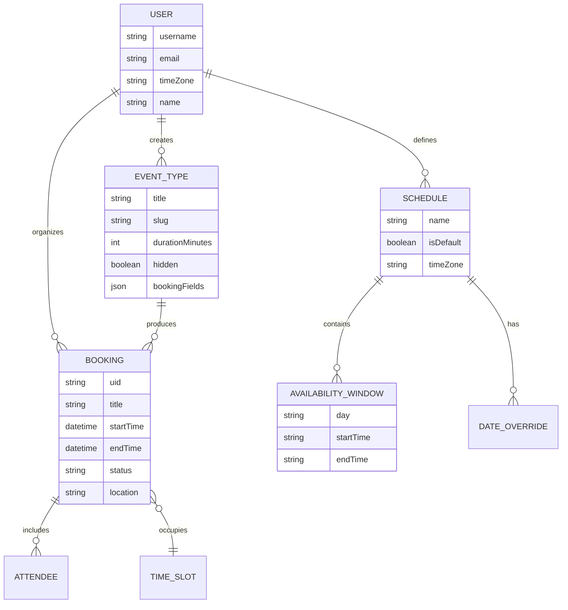
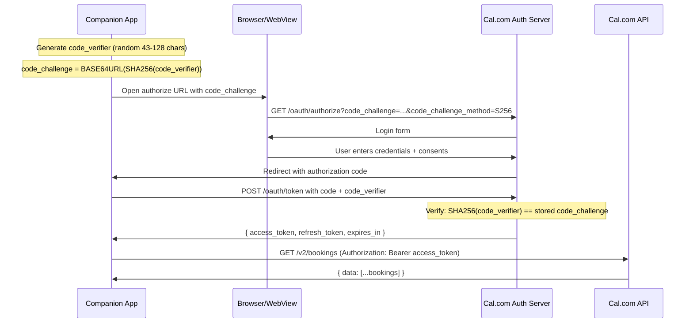
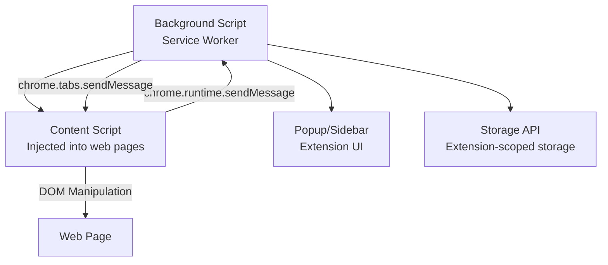
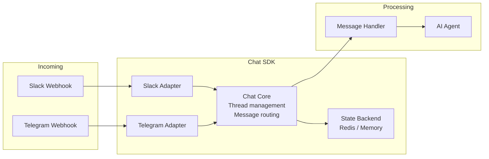

# Zero to Scheduling Companion Engineer

A textbook-style guide covering the domain fundamentals needed to understand and contribute to the Cal.com Companion codebase.

---

## Chapter 1: The Scheduling Domain

### 1.1 What is Calendar Scheduling Software?

Calendar scheduling software automates the process of finding mutual availability and booking meetings. The core problem: given N people with overlapping calendars, find a time slot that works for everyone without a back-and-forth email chain.

**Domain Model:**



### 1.2 Key Concepts

**Event Types** are templates for meetings. A user creates event types like "30-minute consultation" or "Quick 15-min chat" with a fixed duration, then shares a link (`cal.com/username/event-slug`). When someone visits the link, they see available times and can book.

**Schedules** define a user's working hours. A schedule specifies which hours are available on each day of the week (e.g., Mon-Fri 9am-5pm). Date overrides allow exceptions (e.g., "Dec 25: unavailable").

**Availability** is computed dynamically. It is the intersection of:
1. The event type's assigned schedule (working hours)
2. The user's existing calendar events (busy times from connected calendars)
3. Buffer times, minimum notice, and booking limits

**Bookings** are confirmed meetings with a start/end time, attendee list, and optional video conferencing link. Bookings can be in various states: upcoming, past, cancelled, unconfirmed (pending host approval).

### 1.3 Timezone Handling

Timezone management is the single most error-prone aspect of scheduling software. Key rules:

- All times stored in UTC (ISO 8601) in the API
- User-facing times displayed in the user's configured timezone
- The "same day" is different depending on timezone -- March 20 in New York starts 5 hours after March 20 in UTC
- Daylight saving transitions can shift schedules (e.g., PST to PDT moves available times by 1 hour)

```
User in New York (EST = UTC-5):
  "Book at 2pm tomorrow" → 2pm EST = 7pm UTC = 19:00:00Z

User in Tokyo (JST = UTC+9):
  "Book at 2pm tomorrow" → 2pm JST = 5am UTC = 05:00:00Z
```

## Chapter 2: OAuth 2.0 + PKCE

### 2.1 Why OAuth?

Cal.com Companion needs to access a user's Cal.com data (bookings, schedules, event types) without storing their password. OAuth 2.0 solves this by issuing short-lived access tokens through a consent flow.

### 2.2 The PKCE Extension

PKCE (Proof Key for Code Exchange, pronounced "pixy") prevents authorization code interception attacks. It is required for public clients (mobile apps, browser extensions, SPAs) that cannot securely store a client secret.



### 2.3 Token Lifecycle

```
access_token:  Short-lived (15 min - 1 hour)
  - Sent with every API request as Bearer token
  - When expired, use refresh_token to get a new one

refresh_token: Long-lived (30 days - 1 year)
  - Used once to get a new access_token + new refresh_token
  - Previous refresh_token is invalidated (rotation)
  - If compromised, attacker gets limited window

Token storage by platform:
  Mobile:    expo-secure-store (Keychain on iOS, Keystore on Android)
  Extension: chrome.storage.local (extension-scoped, not web-accessible)
  Chat:      Redis with AES-256-GCM encryption
  CLI:       ~/.calcom/config.json (file system)
```

## Chapter 3: React Native + Expo

### 3.1 React Native Fundamentals

React Native renders native UI components using JavaScript. Instead of `<div>`, you use `<View>`; instead of `<span>`, you use `<Text>`. The bridge between JS and native is handled by the framework.

```typescript
// Web (React DOM)
<div style={{ flexDirection: 'row', padding: 16 }}>
  <span>Hello</span>
</div>

// React Native
<View style={{ flexDirection: 'row', padding: 16 }}>
  <Text>Hello</Text>
</View>
```

### 3.2 Expo

Expo is a framework and platform built on top of React Native that provides:

- **Managed build system** (EAS Build) -- builds native apps in the cloud
- **File-based routing** (Expo Router) -- like Next.js but for native apps
- **Standard libraries** -- expo-camera, expo-auth-session, expo-secure-store
- **OTA updates** -- push JS updates without App Store review

### 3.3 Expo Router File Conventions

```
app/
  _layout.tsx          # Root layout (providers, navigation container)
  (tabs)/              # Tab navigator group
    _layout.tsx         # Tab bar configuration
    index.tsx           # First tab (default)
    (bookings)/         # Bookings tab group
      _layout.tsx       # Stack navigator for bookings
      index.tsx         # Bookings list
      booking-detail.tsx  # Booking detail page
  profile-sheet.tsx     # Modal screen (presented as sheet)
  reschedule.tsx        # Modal screen
```

Parentheses `()` create "groups" that affect navigation structure but not URL paths.

### 3.4 NativeWind

NativeWind brings Tailwind CSS to React Native. It compiles Tailwind classes into React Native StyleSheet objects at build time.

```typescript
// With NativeWind
<View className="flex-1 bg-white dark:bg-black p-4">
  <Text className="text-lg font-bold text-gray-900 dark:text-white">
    Cal.com Companion
  </Text>
</View>
```

Dark mode support is automatic via `dark:` prefixes, following the system color scheme.

## Chapter 4: Browser Extension Architecture

### 4.1 Extension Components

A browser extension consists of several isolated JavaScript contexts:



- **Background Script (Service Worker):** Runs persistently. Handles OAuth, API calls, cross-tab coordination. Cannot access DOM.
- **Content Script:** Injected into web pages (Gmail, LinkedIn, Google Calendar). Can manipulate the page's DOM. Communicates with background via message passing.
- **Popup/Sidebar:** Optional UI shown when clicking the extension icon.

### 4.2 WXT Framework

WXT is a next-generation web extension framework that:

- Auto-generates `manifest.json` for each browser from a single config
- Handles Manifest V2 vs V3 differences (Safari uses V2, Chrome uses V3)
- Provides hot module replacement during development
- Supports TypeScript out of the box

```typescript
// wxt.config.ts defines browser-specific behavior
export default defineConfig({
  manifest: {
    permissions: [
      "activeTab",
      "storage",
      // Safari doesn't support Chrome's identity API
      ...(browserTarget !== "safari" ? ["identity"] : []),
    ],
  },
});
```

## Chapter 5: Chat Bot Architecture

### 5.1 The Chat SDK Pattern

The chat bot uses a multi-adapter pattern to support multiple messaging platforms from a single codebase:



Each adapter translates platform-specific message formats into a unified internal format. The `Chat` class manages threads, message history, and handler registration.

### 5.2 AI Tool Calling

The Vercel AI SDK v6 provides a `streamText` function that connects to an LLM and enables tool calling. The agent defines tools with Zod schemas, and the LLM invokes them to interact with the Cal.com API.

```typescript
// Simplified tool definition pattern
const tools = {
  list_bookings: tool({
    description: "List the user's bookings",
    parameters: z.object({
      status: z.enum(["upcoming", "past", "cancelled", "unconfirmed"]),
      take: z.number().optional(),
    }),
    execute: async ({ status, take }) => {
      const bookings = await getBookings(accessToken, { status, take });
      return { bookings, count: bookings.length };
    },
  }),
};

// The LLM decides when to call tools based on the user's message
const result = streamText({
  model: "groq/gpt-oss-120b",
  system: systemPrompt,
  messages: conversationHistory,
  tools,
  maxSteps: 6,
});
```

### 5.3 Streaming and Rich Messages

Both Slack and Telegram render the agent's responses as rich cards with buttons, selects, and links. The Chat SDK provides a unified component model:

```typescript
Card({
  title: "Confirm Booking",
  children: [
    Fields([
      Field({ label: "Event", value: "30 Min Meeting" }),
      Field({ label: "When", value: "Mon Mar 16 at 9:00 AM" }),
    ]),
    Actions([
      Button({ id: "confirm", style: "primary", label: "Confirm" }),
      Button({ id: "cancel", style: "danger", label: "Cancel" }),
    ]),
  ],
})
```

This renders as Slack Block Kit on Slack and inline keyboard buttons on Telegram.

## Chapter 6: TanStack Query and Caching

### 6.1 Server State vs Client State

**Client state** is owned by the UI (form inputs, modal visibility, selected tab).
**Server state** is owned by the API (bookings, schedules, user profile) and cached locally.

TanStack Query manages server state with:
- **Automatic caching** -- responses cached by query key
- **Stale-while-revalidate** -- show cached data immediately, refetch in background
- **Cache invalidation** -- invalidate specific queries on mutations
- **Persistence** -- save cache to AsyncStorage for offline support

### 6.2 Query Key Factory Pattern

The Companion app uses a factory pattern for cache keys to enable granular invalidation:

```typescript
export const queryKeys = {
  bookings: {
    all: ["bookings"] as const,
    lists: () => [...queryKeys.bookings.all, "list"] as const,
    list: (filters: Record<string, unknown>) =>
      [...queryKeys.bookings.lists(), filters] as const,
    detail: (uid: string) =>
      [...queryKeys.bookings.all, "detail", uid] as const,
  },
};

// Usage:
// Invalidate all booking lists (but not details):
queryClient.invalidateQueries({ queryKey: queryKeys.bookings.lists() });

// Invalidate everything related to bookings:
queryClient.invalidateQueries({ queryKey: queryKeys.bookings.all });
```

### 6.3 Offline-First Strategy

```
App opens → Load from AsyncStorage (instant) → Show stale data
              ↓
         Network available? → Refetch in background → Update UI
              ↓
         Network unavailable → Continue showing cached data
              ↓
         Mutation attempted offline → Queue for retry when online
```

## Chapter 7: Home Screen Widgets

### 7.1 iOS Widgets (WidgetKit)

iOS widgets are built with SwiftUI and run in a separate process from the main app. They cannot execute arbitrary code -- they render a timeline of entries that iOS refreshes periodically.

Communication between the React Native app and the SwiftUI widget:
1. App writes booking data to a shared App Group container
2. Widget reads from the shared container and renders
3. App triggers a widget refresh via WidgetKit API

### 7.2 Android Widgets

Android widgets use `react-native-android-widget` which lets you define widget layouts in React Native JSX:

```typescript
function UpcomingBookingsWidget() {
  const bookings = getWidgetBookings(); // Read from shared storage
  return (
    <FlexWidget style={styles.container}>
      {bookings.map(booking => (
        <TextWidget text={booking.title} style={styles.title} />
      ))}
    </FlexWidget>
  );
}
```

## Chapter 8: CLI Design

### 8.1 OpenAPI Code Generation

The CLI uses `@hey-api/openapi-ts` to auto-generate a TypeScript API client from Cal.com's OpenAPI specification. This produces:
- Type definitions for all request/response shapes
- A configured HTTP client with interceptors
- Function signatures matching each API endpoint

### 8.2 Command Pattern

Each CLI command follows a consistent pattern:

```typescript
// commands/bookings/command.ts
export function registerBookingsCommand(program: Command): void {
  const bookings = program
    .command("bookings")
    .description("Manage bookings");

  bookings
    .command("list")
    .option("--status <status>", "Filter by status")
    .option("--take <n>", "Number of results")
    .action(async (opts) => {
      await initializeClient();
      const { data } = await listBookings({ query: opts });
      outputBookings(data);
    });
}
```

### 8.3 Output Modes

The CLI supports three output modes:
- **TTY (human):** Formatted tables with Chalk colors
- **JSON:** Pretty-printed JSON (`--json`)
- **Compact/NDJSON:** Single-line JSON per entry (`--compact`)

The mode is auto-detected: if stdout is not a TTY (e.g., piped to `jq`), JSON mode activates automatically.

---

## Summary

Building a scheduling companion requires understanding:
1. **The scheduling domain** -- event types, schedules, availability, bookings, timezones
2. **OAuth 2.0 + PKCE** -- secure token-based authentication for public clients
3. **React Native + Expo** -- cross-platform mobile development with file-based routing
4. **Browser extension architecture** -- background scripts, content scripts, message passing
5. **AI tool calling** -- LLM agents that invoke typed functions to interact with APIs
6. **Server state caching** -- TanStack Query with persistence for offline-first behavior
7. **Widget systems** -- iOS WidgetKit (SwiftUI) and Android widgets for glanceable information
8. **CLI patterns** -- OpenAPI code generation, Commander.js, output mode detection
