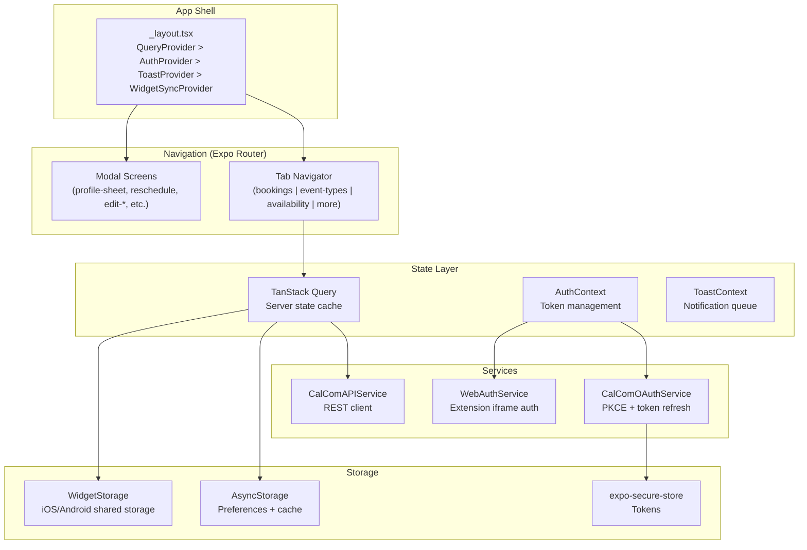
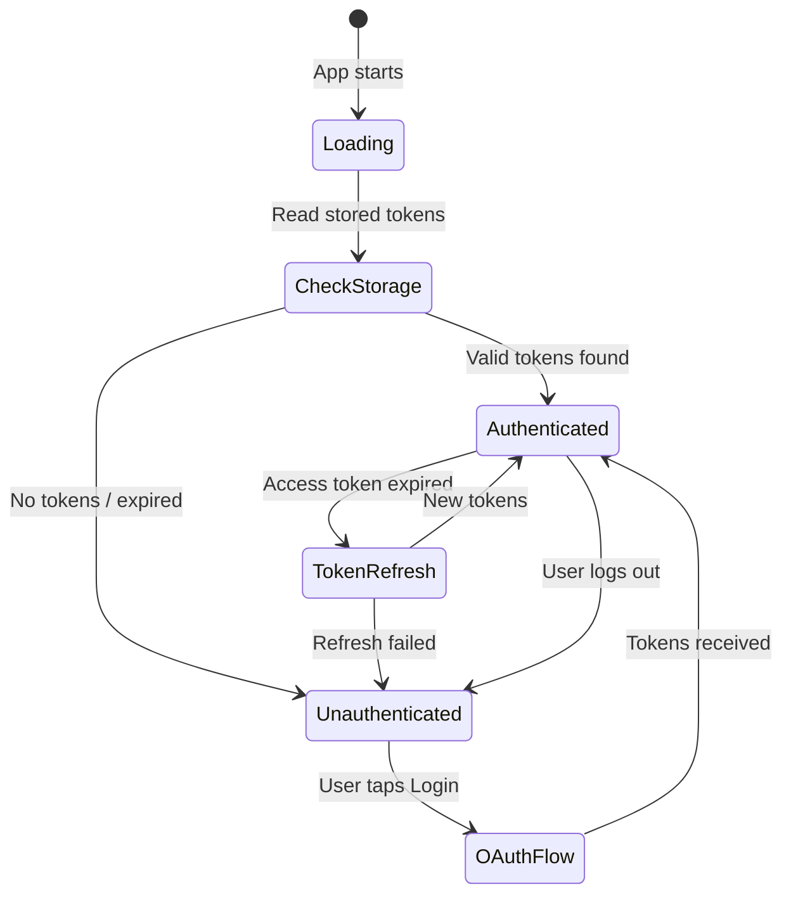
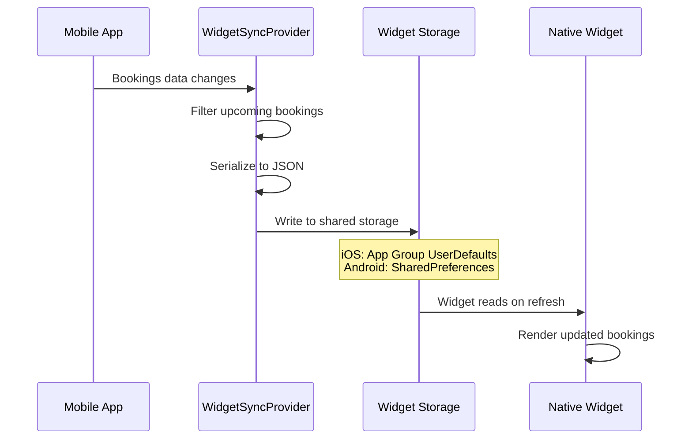

# 01 -- Mobile App Deep Dive

An in-depth exploration of the Expo-based mobile application covering navigation architecture, state management, authentication, platform-specific patterns, widget integration, and caching strategies.

---

## Architecture Overview



## File-Based Routing

The mobile app uses Expo Router's file-based routing, which maps filesystem paths to navigation routes.

### Tab Structure

```
app/
  _layout.tsx                    # Root: Stack navigator (wraps tabs + modals)
  (tabs)/
    _layout.tsx                  # Tab bar configuration
    index.tsx                    # Default tab (redirects to bookings)
    (bookings)/
      _layout.tsx                # Stack navigator within bookings tab
      index.tsx                  # Bookings list (Android)
      index.ios.tsx              # Bookings list (iOS-specific)
      booking-detail.tsx         # Booking detail
      booking-detail.ios.tsx     # Booking detail (iOS-specific)
    (event-types)/
      _layout.tsx                # Stack navigator within event types tab
      index.tsx                  # Event types list
      index.ios.tsx              # Event types list (iOS-specific)
      event-type-detail.tsx      # Event type detail
    (availability)/
      _layout.tsx                # Stack navigator within availability tab
      index.tsx                  # Schedules list
      availability-detail.tsx    # Schedule detail
      availability-detail.ios.tsx
    (more)/
      _layout.tsx                # More tab layout
      index.tsx                  # More options menu
      index.ios.tsx
```

### Modal Screens

Modal screens are declared in the root `_layout.tsx` as `Stack.Screen` entries with `presentation: "modal"` or `"formSheet"`:

```typescript
<Stack.Screen
  name="reschedule"
  options={{
    presentation: Platform.OS === "ios"
      ? isLiquidGlassAvailable()
        ? "formSheet"   // iOS 26+ Liquid Glass
        : "modal"       // iOS <26
      : "containedModal", // Android
    sheetGrabberVisible: Platform.OS === "ios",
    sheetAllowedDetents: [0.8, 0.95],
  }}
/>
```

This pattern is used for all overlay screens: profile-sheet, mark-no-show, view-recordings, add-guests, edit-location, edit-availability-*, meeting-session-details.

### Platform-Specific Files

The `.ios.tsx` suffix is an Expo Router convention that provides a platform-specific implementation. When the app runs on iOS, `booking-detail.ios.tsx` is loaded instead of `booking-detail.tsx`. This allows:

- iOS-specific navigation patterns (large headers, native segmented controls)
- iOS-specific presentation styles (Liquid Glass sheets)
- Platform-optimized list rendering

## Authentication System

### AuthContext Architecture



The `AuthContext` supports two authentication methods:

1. **OAuth (PKCE)** -- Standard flow for mobile app
   - Uses `expo-auth-session` for the OAuth redirect
   - PKCE verifier generated via `expo-crypto`
   - Tokens stored in `expo-secure-store` (Keychain/Keystore)

2. **Web Session** -- For extension iframe embedding
   - When the mobile app runs inside the browser extension iframe
   - Inherits the session token from the parent extension context
   - Uses `WebAuthService` which communicates via `postMessage`

### Token Refresh Flow

```typescript
CalComAPIService.setRefreshTokenFunction(async (refreshToken) => {
  const newTokens = await oauthService.refreshAccessToken(refreshToken);
  // Store new tokens
  await secureStorage.set(ACCESS_TOKEN_KEY, newTokens.accessToken);
  await secureStorage.set(REFRESH_TOKEN_KEY, newTokens.refreshToken);
  // Sync to extension if embedded
  await syncTokensToExtension(newTokens);
  return newTokens;
});
```

The API service automatically attempts a token refresh on 401 responses before surfacing the error to the UI.

## Data Fetching with TanStack Query

### Hook Architecture

Each domain concept has a dedicated hook that wraps TanStack Query:

```
hooks/
  useBookings.ts          # List/filter bookings with pagination
  useEventTypes.ts        # List event types with search/filter
  useSchedules.ts         # List schedules/availability
  useUserProfile.ts       # Current user profile
  useBookingActions.ts    # Cancel, reschedule, mark no-show mutations
  useBookingActionsGating.ts  # Permission checks for actions
  useActiveBookingFilter.tsx  # Booking tab filter state
  useEventTypeFilter.tsx  # Event type search filter
  useNetworkStatus.ts     # Online/offline detection
  useWidgetSync.ts        # Sync bookings to widget storage
  useAppStoreRating.ts    # Prompt for App Store review
  useToast.ts             # Toast notification system
  useUserPreferences.ts   # User settings persistence
```

### Query Configuration

```typescript
// From config/cache.config.ts
const CACHE_CONFIG = {
  defaultStaleTime: 5 * 60 * 1000,           // 5 minutes
  gcTime: 24 * 60 * 60 * 1000,               // 24 hours
  bookings: { staleTime: 5 * 60 * 1000 },     // 5 min (external changes)
  eventTypes: { staleTime: Infinity },         // Only refresh on mutations
  schedules: { staleTime: Infinity },          // Only refresh on mutations
  userProfile: { staleTime: Infinity },        // Only refresh manually
  persistence: {
    storageKey: "cal-companion-query-cache",
    maxAge: 24 * 60 * 60 * 1000,
    throttleTime: 1000,
  },
};
```

The `Infinity` stale time for event types, schedules, and user profiles means TanStack Query never automatically refetches these. They are refreshed only when:
- The user performs a mutation (create/update/delete)
- The user manually pulls to refresh
- The app is foregrounded after being in background

### Cache Persistence

The query cache is persisted to AsyncStorage for offline support:

```typescript
// lib/queryPersister.ts
import { createAsyncStoragePersister } from "@tanstack/react-query-persist-client";

const persister = createAsyncStoragePersister({
  storage: AsyncStorage,
  key: CACHE_CONFIG.persistence.storageKey,
  throttleTime: CACHE_CONFIG.persistence.throttleTime,
});
```

On app launch, the persisted cache is hydrated, giving users instant access to their data even without a network connection.

## Component Architecture

### Key Components

| Component | Purpose |
|---|---|
| `ScreenWrapper` | Consistent screen padding, safe area insets |
| `Header` | Customizable header with search, profile button |
| `SearchHeader` | Animated search bar (iOS-specific behavior) |
| `BookingActionsModal` | Bottom sheet with booking action buttons |
| `LoginScreen` | OAuth login with Cal.com branding |
| `EmptyScreen` | Placeholder for empty states |
| `LoadingSpinner` | Consistent loading indicator |
| `NetworkStatusBanner` | Offline/online status indicator |
| `CacheStatusIndicator` | Debug: shows cache freshness |
| `WidgetSyncProvider` | Syncs booking data to widget storage |

### List Items

Each entity type has a platform-aware list item component:

```
components/
  availability-list-item/
    AvailabilityListItem.tsx        # Android
    AvailabilityListItem.ios.tsx    # iOS (with haptic feedback)
    AvailabilityListItemParts.tsx   # Shared sub-components
    AvailabilityListItemSkeleton.tsx # Loading placeholder
  booking-list-item/
    BookingListItem.tsx
    BookingListItem.ios.tsx
    BookingListItemParts.tsx
    BookingListItemSkeleton.tsx
```

### Dark Mode

The app uses `useColorScheme()` from React Native combined with NativeWind's `dark:` prefix:

```typescript
const colorScheme = useColorScheme();
const isDark = colorScheme === "dark";
const colors = getColors(isDark); // Computed color palette

// In JSX:
<View className="bg-white dark:bg-black">
  <Text className="text-gray-900 dark:text-white">Content</Text>
</View>
```

## Widget Integration

### iOS Widget (SwiftUI + WidgetKit)

Located in `targets/widget/`, the iOS widget is a separate SwiftUI target managed by `@bacons/apple-targets`. It reads booking data from a shared App Group container.

```
targets/widget/
  Sources/
    WidgetBundle.swift        # Widget entry point
    UpcomingBookingsWidget.swift  # Widget view
    BookingData.swift         # Shared data model
  Info.plist
```

### Android Widget

Located in `widgets/`, the Android widget uses `react-native-android-widget`:

```typescript
// widgets/UpcomingBookingsWidget.tsx
export function UpcomingBookingsWidget({ bookings }) {
  return (
    <FlexWidget style={containerStyle}>
      <TextWidget text="Upcoming" style={headerStyle} />
      {bookings.map(b => (
        <FlexWidget key={b.uid}>
          <TextWidget text={b.title} />
          <TextWidget text={formatTime(b.startTime)} />
        </FlexWidget>
      ))}
    </FlexWidget>
  );
}
```

### Widget Sync Flow



## Network Handling

### Network Status Detection

```typescript
// hooks/useNetworkStatus.ts
import NetInfo from "@react-native-community/netinfo";

export function useNetworkStatus() {
  const [isConnected, setIsConnected] = useState(true);

  useEffect(() => {
    const unsubscribe = NetInfo.addEventListener(state => {
      setIsConnected(state.isConnected ?? true);
    });
    return unsubscribe;
  }, []);

  return { isConnected };
}
```

The `NetworkStatusBanner` component shows a persistent banner when offline, and TanStack Query pauses refetches until connectivity is restored.

### Error Handling

The app uses a centralized error utility (`utils/error.ts`) that categorizes API errors:
- **401 Unauthorized** -- Triggers token refresh, then retries
- **429 Rate Limited** -- Queues for retry with backoff
- **5xx Server Error** -- Shows error toast with retry option
- **Network Error** -- Shows offline banner

## Performance Optimizations

1. **React Compiler** -- `babel-plugin-react-compiler` automatically memoizes components and hooks, eliminating manual `useMemo`/`useCallback`
2. **List Skeletons** -- Skeleton placeholders shown during initial data load
3. **Optimistic Updates** -- Booking actions (cancel, reschedule) update the UI immediately, rolling back on API error
4. **Image Caching** -- `expo-image` with built-in memory and disk caching
5. **Web Export** -- `expo export --platform web` produces static assets for the extension iframe

## Services Layer

### CalComAPIService

The main API service (`services/calcom/`) handles:
- Request construction with proper API version headers
- Automatic token attachment
- Token refresh on 401
- Error classification and retry logic
- Request/response type safety via TypeScript generics

### OAuthService

The OAuth service (`services/oauthService.ts`) provides:
- PKCE code challenge/verifier generation
- Authorization URL construction
- Token exchange
- Token refresh
- Cross-platform OAuth flow (native vs extension iframe)

The service auto-detects its execution context:
- **Native app:** Uses `expo-auth-session` for system browser redirect
- **Extension iframe:** Uses `postMessage` to delegate OAuth to the extension's background script
