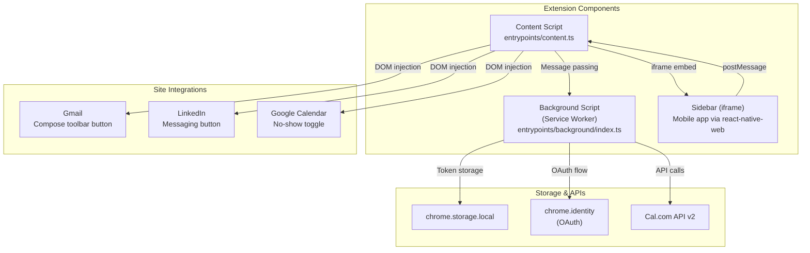
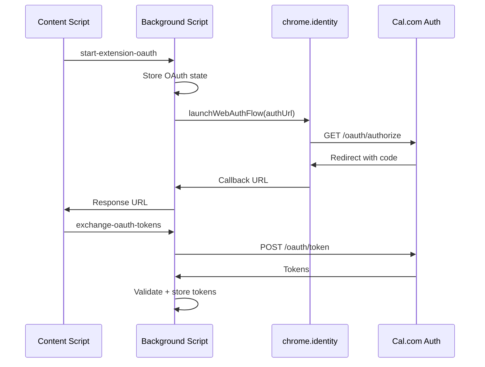
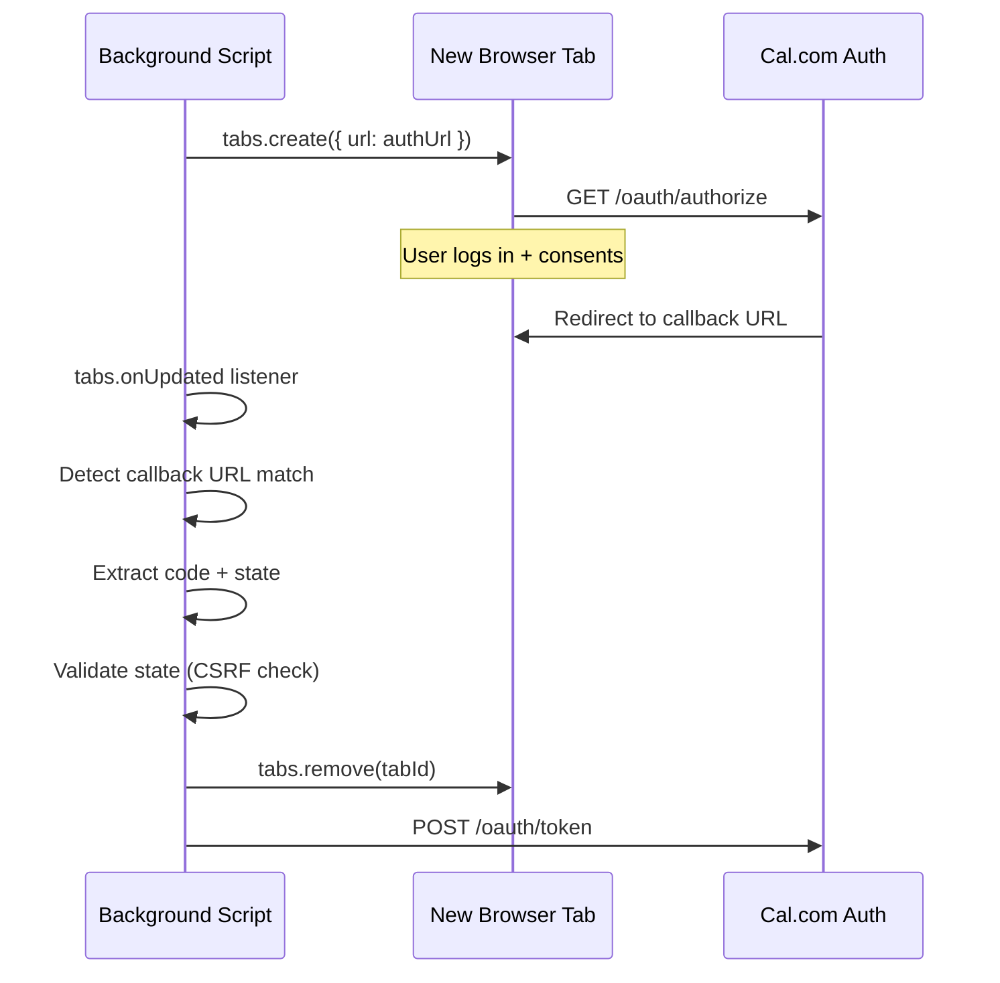

# 02 -- Browser Extension Deep Dive

An in-depth exploration of the WXT-based cross-browser extension covering architecture, content script injection, cross-browser OAuth, and site-specific integrations (Gmail, LinkedIn, Google Calendar).

---

## Architecture Overview



## WXT Framework

### Configuration

The `wxt.config.ts` is the central configuration file that controls manifest generation, Vite configuration, and browser-specific settings.

```typescript
export default defineConfig({
  entrypointsDir: "entrypoints",
  publicDir: "public",
  outDir: ".output",
  manifest: {
    name: browserTarget === "safari" ? "Cal.com" : "Cal.com Companion",
    version: "1.7.6",
    permissions: [
      "activeTab",
      "storage",
      ...(browserTarget !== "safari" ? ["identity"] : []),
    ],
    host_permissions: [
      "https://companion.cal.com/*",
      "https://api.cal.com/*",
      "https://app.cal.com/*",
      "https://mail.google.com/*",
      "https://calendar.google.com/*",
    ],
  },
});
```

### Build Targets

The extension builds for five browser targets from a single codebase:

| Target | OAuth Method | Manifest Version | Notable Differences |
|---|---|---|---|
| Chrome | `chrome.identity.launchWebAuthFlow` | V3 | Default target |
| Brave | `chrome.identity.launchWebAuthFlow` | V3 | Same as Chrome |
| Edge | `chrome.identity.launchWebAuthFlow` | V3 | Different extension ID |
| Firefox | Promise-based `browser.identity` | V3 | `browser` namespace, gecko ID |
| Safari | Tab-based OAuth | V2 | `browserAction` instead of `action` |

Build commands:
```bash
bun run ext:build:chrome     # Chrome
bun run ext:build:firefox    # Firefox
bun run ext:build:safari     # Safari
bun run ext:build:edge       # Edge
bun run ext:build:all:prod   # All browsers (production URLs)
```

### Browser-Specific OAuth Configuration

Each browser requires its own OAuth client ID and redirect URI because the extension ID is browser-specific:

```
Chrome:  https://<chrome-id>.chromiumapp.org/oauth/callback
Brave:   https://<chrome-id>.chromiumapp.org/oauth/callback  (same as Chrome)
Edge:    https://<edge-id>.chromiumapp.org/oauth/callback     (different ID)
Firefox: https://<uuid>.extensions.allizom.org/oauth/callback
Safari:  https://<team>.<bundle>.appextension/oauth/callback
```

Environment variables:
```
EXPO_PUBLIC_CALCOM_OAUTH_CLIENT_ID          # Chrome/Brave default
EXPO_PUBLIC_CALCOM_OAUTH_REDIRECT_URI       # Chrome/Brave default
EXPO_PUBLIC_CALCOM_OAUTH_CLIENT_ID_FIREFOX
EXPO_PUBLIC_CALCOM_OAUTH_REDIRECT_URI_FIREFOX
EXPO_PUBLIC_CALCOM_OAUTH_CLIENT_ID_SAFARI
EXPO_PUBLIC_CALCOM_OAUTH_REDIRECT_URI_SAFARI
EXPO_PUBLIC_CALCOM_OAUTH_CLIENT_ID_EDGE
EXPO_PUBLIC_CALCOM_OAUTH_REDIRECT_URI_EDGE
```

## Background Script

### Message-Based API

The background script (`entrypoints/background/index.ts`) acts as a centralized API gateway. Content scripts and sidebars communicate with it via `chrome.runtime.sendMessage`:

| Action | Purpose | Returns |
|---|---|---|
| `fetch-event-types` | Fetch user's event types | Event type array |
| `start-extension-oauth` | Begin OAuth flow | Response URL |
| `exchange-oauth-tokens` | Exchange auth code for tokens | OAuth tokens |
| `sync-oauth-tokens` | Store tokens from sidebar | Success boolean |
| `clear-oauth-tokens` | Logout | Success boolean |
| `check-auth-status` | Check if user is authenticated | Boolean |
| `get-booking-status` | Get booking details (for no-show) | Booking object |
| `mark-no-show` | Toggle no-show status | Updated booking |
| `icon-clicked` | Toolbar icon was clicked | N/A |

### Cross-Browser API Abstraction

The background script wraps all browser APIs behind helper functions to handle namespace differences:

```typescript
function getBrowserAPI(): typeof chrome {
  // Firefox uses `browser`, Chrome uses `chrome`
  if (typeof browser !== "undefined" && browser?.runtime) {
    return browser;
  }
  return chrome;
}

function getActionAPI(): typeof chrome.action | null {
  const api = getBrowserAPI();
  // Safari uses browserAction (V2), Chrome uses action (V3)
  return api?.action || (api as any)?.browserAction || null;
}
```

### Rate Limiting

Token operations are rate-limited to prevent abuse:

```typescript
const TOKEN_RATE_LIMIT_WINDOW_MS = 60000;  // 1 minute
const TOKEN_RATE_LIMIT_MAX_OPS = 5;         // 5 ops per minute

function isRateLimited(): boolean {
  const now = Date.now();
  // Purge old timestamps
  while (timestamps.length > 0 && timestamps[0] < now - WINDOW) {
    timestamps.shift();
  }
  return timestamps.length >= MAX_OPS;
}
```

### Token Validation

Before storing tokens, the background script validates them by calling the Cal.com `/me` endpoint:

```typescript
async function validateTokens(tokens: OAuthTokens): Promise<boolean> {
  const response = await fetchWithTimeout(`${API_BASE_URL}/me`, {
    headers: {
      Authorization: `Bearer ${tokens.accessToken}`,
      "cal-api-version": "2024-06-11",
    },
  });
  return response.ok;
}
```

## OAuth Flows

### Chrome/Edge/Brave Flow

Uses `chrome.identity.launchWebAuthFlow` which opens a separate OAuth popup window managed by the browser:



### Firefox Flow

Firefox uses the same API but returns a Promise instead of using a callback:

```typescript
const result = identityAPI.launchWebAuthFlow({
  url: authUrl,
  interactive: true,
}) as Promise<string | undefined>;

result.then((responseUrl) => {
  // Process response
});
```

### Safari Flow (Tab-Based)

Safari does not support `chrome.identity`, so the extension opens a new tab and monitors its URL for the OAuth redirect:



The Safari flow includes:
- 5-minute timeout
- Tab removal detection (user closes tab = cancelled)
- State parameter validation to prevent CSRF attacks
- URL origin + path matching (not just prefix) for security

## Content Script

### Sidebar Injection

When the user clicks the extension icon, the content script injects the mobile app as an iframe sidebar:

```
+------------------------------------------+
|  Web Page (Gmail, LinkedIn, etc.)        |
|                                          |
|                              +---------+ |
|                              | Cal.com | |
|                              | Sidebar | |
|                              | (iframe)| |
|                              |         | |
|                              | Bookings| |
|                              | Events  | |
|                              | Avail.  | |
|                              +---------+ |
+------------------------------------------+
```

The sidebar iframe loads the mobile app's web export (`companion.cal.com` in production, `localhost:8081` in dev), which renders via `react-native-web`.

### Restricted URL Handling

The content script cannot inject into browser-internal pages. The extension detects these and opens the Cal.com app page instead:

```typescript
const restrictedPatterns = [
  /^chrome:\/\//i,
  /^chrome-extension:\/\//i,
  /^edge:\/\//i,
  /^about:/i,
  /^brave:\/\//i,
  /^moz-extension:\/\//i,
  /^safari-extension:\/\//i,
  /^file:\/\//i,
  /^data:/i,
  /^blob:/i,
];
```

## Site-Specific Integrations

### Gmail Integration

The extension injects a Cal.com button into the Gmail compose toolbar. When clicked, it shows a dropdown of the user's event types. Selecting one inserts a formatted booking link into the email body.

**DOM Selectors:** The extension targets Gmail's compose toolbar using CSS selectors that identify the compose form's action buttons area.

### LinkedIn Integration

Located in `lib/linkedin.ts`, the LinkedIn integration:

1. **Detects messaging compositors** using selectors like `.msg-form__left-actions`
2. **Injects a button** next to the emoji picker
3. **Shows a dropdown menu** of event types on click
4. **Inserts a formatted link** into the message input

The integration handles:
- Small and large button sizes based on context
- Menu positioning relative to the button
- Clipboard copy with notification toast
- Cache for event types (5-minute TTL)

```typescript
const CONSTANTS = {
  CACHE_DURATION: 5 * 60 * 1000,
  BUTTON_SIZES: {
    SMALL: { button: 24, icon: 14 },
    LARGE: { button: 32, icon: 18 },
  },
  SELECTORS: {
    LEFT_ACTIONS: ".msg-form__left-actions",
    EMOJI_BUTTON: "div:has(> span.artdeco-hoverable-trigger button.emoji-hoverable-trigger)",
    CAL_BUTTON: ".cal-companion-linkedin-button",
  },
};
```

### Google Calendar No-Show Integration

Located in `lib/google-calendar.ts`, this integration adds a "No Show" toggle button next to attendees in Google Calendar event popups.

**How it works:**
1. Monitors DOM mutations for Google Calendar event popups
2. Extracts the event's booking UID from the event description
3. Checks with the Cal.com API if the booking exists
4. Injects toggle buttons next to each attendee
5. Clicking toggles the attendee's no-show status via the API

**Caching:**
```typescript
const bookingStatusCache = new Map<string, {
  data: Map<string, boolean>;  // email -> isNoShow
  timestamp: number;
}>();
const CACHE_TTL = 30000; // 30 seconds
```

## Security Considerations

### CSRF Protection

All OAuth flows use a `state` parameter:
1. Random state generated before starting OAuth
2. State stored in `chrome.storage.local`
3. On callback, state from URL is compared to stored state
4. Mismatch = possible CSRF attack, flow aborted

### Token Storage

Tokens are stored in `chrome.storage.local`, which is:
- Scoped to the extension (web pages cannot access)
- Encrypted at rest by the browser
- Synced across devices (if Chrome sync is enabled)

### Input Validation

The background script validates all incoming data:
```typescript
function safeParseOAuthTokens(jsonString: string): OAuthTokens | null {
  // Validates it's a plain object (not null, array, or primitive)
  // Validates required fields (accessToken, tokenType are strings)
  // Validates optional field types
  // Returns null on any validation failure
}
```

## Build Configuration

### Vite Configuration

The WXT config includes Vite settings for React Native Web compatibility:

```typescript
vite: () => ({
  resolve: {
    alias: {
      "react-native": "react-native-web",
    },
  },
  define: {
    global: "globalThis",
    __DEV__: JSON.stringify(false),
    "import.meta.env.BROWSER_TARGET": JSON.stringify(browserTarget),
  },
  optimizeDeps: {
    include: ["react-native-web"],
    esbuildOptions: {
      loader: { ".js": "jsx" },
    },
  },
}),
```

### Store vs Dev Builds

The `BUILD_FOR_STORE` environment variable controls:
- **Store builds:** Point iframe to `https://companion.cal.com`, exclude localhost permissions
- **Dev builds:** Point iframe to `http://localhost:8081`, include localhost in CSP

```typescript
content_security_policy: {
  extension_pages: !isBuildForStore
    ? "frame-src 'self' https://companion.cal.com http://localhost:*"
    : "frame-src 'self' https://companion.cal.com",
}
```
