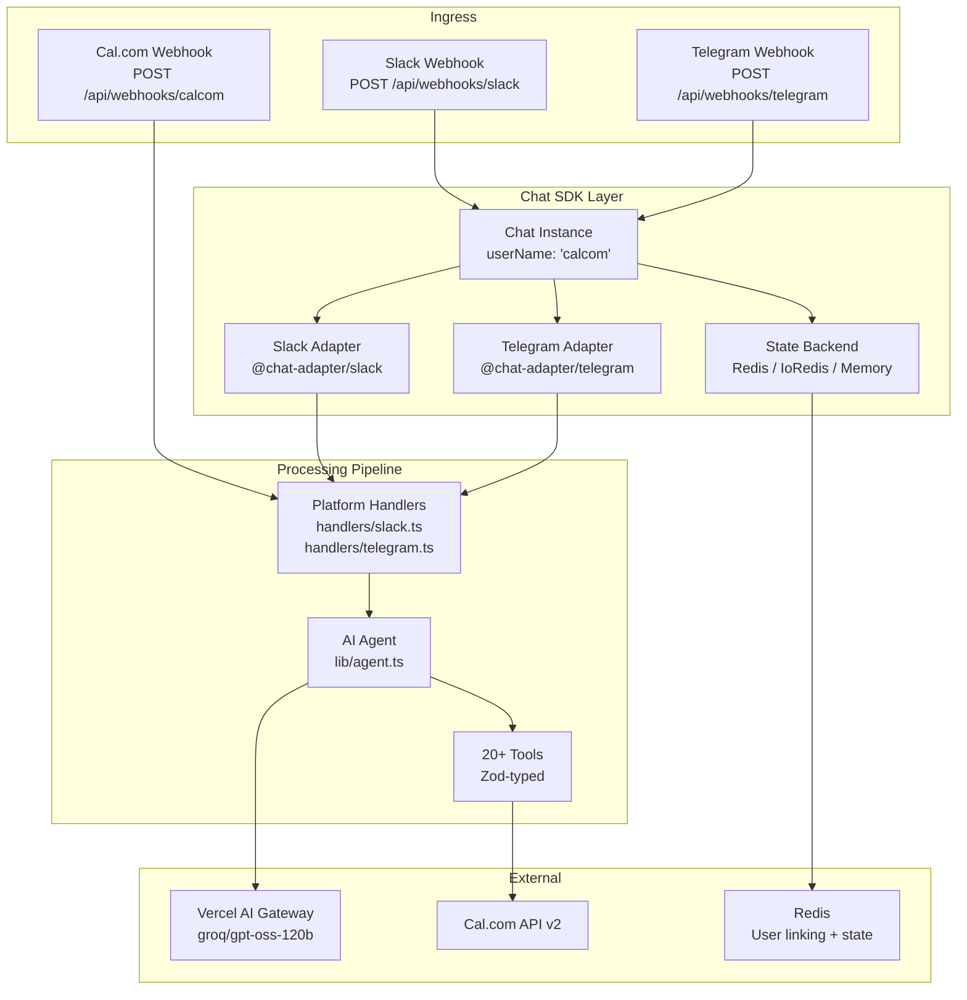

# 03 -- Chat Bot Deep Dive

An in-depth exploration of the AI-powered chat bot covering the Chat SDK, Vercel AI agent system, multi-platform adapters (Slack/Telegram), tool definitions, streaming, state management, and webhook processing.

---

## Architecture Overview



## Chat SDK Initialization

The bot is initialized as a singleton to survive Next.js hot reloads:

```typescript
// lib/bot.ts
const globalForBot = globalThis as unknown as {
  _slackAdapter?: ReturnType<typeof createSlackAdapter>;
  _chatBot?: Chat;
};

if (!globalForBot._slackAdapter) {
  globalForBot._slackAdapter = createSlackAdapter({
    clientId: process.env.SLACK_CLIENT_ID,
    clientSecret: process.env.SLACK_CLIENT_SECRET,
    encryptionKey: process.env.SLACK_ENCRYPTION_KEY,
  });
}

if (!globalForBot._chatBot) {
  const state = process.env.REDIS_URL
    ? process.env.REDIS_USE_IOREDIS === "true"
      ? createIoRedisState({ url: REDIS_URL, keyPrefix: "chat-sdk" })
      : createRedisState({ url: REDIS_URL, keyPrefix: "chat-sdk" })
    : createMemoryState();

  globalForBot._chatBot = new Chat({
    userName: "calcom",
    adapters: { slack: slackAdapter, telegram: telegramAdapter },
    state,
    streamingUpdateIntervalMs: 400,
  });
}
```

### Hot Reload Handler Cleanup

Next.js dev mode re-executes modules on HMR. Without cleanup, handlers would stack:

```typescript
const b = bot as unknown as Record<string, unknown>;
for (const key of Object.keys(b)) {
  const val = b[key];
  if (key.endsWith("Handlers") && Array.isArray(val)) {
    val.length = 0; // Clear existing handlers
  }
}
```

## Webhook Processing

### Route Handler

```typescript
// app/api/webhooks/[platform]/route.ts
export const maxDuration = 120; // 2 min for LLM streaming

export async function POST(request, context) {
  const { platform } = await context.params;

  // Deduplicate Slack events (message + app_mention)
  if (platform === "slack") {
    const body = await request.text();
    const payload = JSON.parse(body);
    if (isSlackMessageWithBotMention(payload)) {
      return new Response(null, { status: 200 }); // Skip, app_mention handles it
    }
  }

  const response = await handler(requestToHandle, {
    waitUntil: (task) => waitUntil(task), // Vercel background processing
  });

  return response;
}
```

### Slack Event Deduplication

Slack sends both `message` and `app_mention` events for the same @mention. The bot filters out `message` events containing bot mentions to prevent double-processing:

```typescript
function isSlackMessageWithBotMention(payload: SlackPayload): boolean {
  const event = payload.event;
  if (event?.type !== "message" || !event.text) return false;
  const botUserId = payload.authorizations?.find(a => a.is_bot)?.user_id;
  return botUserId ? event.text.includes(`<@${botUserId}>`) : false;
}
```

## AI Agent System

### System Prompt Architecture

The system prompt (`agent.ts: getSystemPrompt()`) is 700+ lines and dynamically generated based on:

1. **Platform** (Slack vs Telegram) -- formatting rules differ
2. **User context** -- pre-verified email, username, timezone
3. **Current time** -- both UTC and user's local timezone

Key sections:
- **Booking flow decision tree** -- Whose calendar? Yours vs theirs? ASAP vs scheduled?
- **Tool chaining rules** -- Minimize round-trips with multi-step execution
- **Cancellation protocol** -- Identify booking, confirm, handle recurring
- **Rescheduling protocol** -- Identify, check availability, confirm
- **Availability checking** -- Distinguish "show my hours" vs "am I free at 2pm?"
- **Profile management** -- Timezone abbreviation resolution
- **Custom booking fields** -- Type-specific handling (text, select, phone, etc.)

### Tool Definitions

The agent defines 20+ tools using the Vercel AI SDK's `tool()` function with Zod schemas. Each tool wraps a Cal.com API call:

```typescript
const tools = {
  list_bookings: tool({
    description: "List bookings with optional filters",
    parameters: z.object({
      status: z.enum(["upcoming", "past", "cancelled", "unconfirmed"]),
      take: z.number().optional().describe("Max results"),
      skip: z.number().optional(),
      afterStart: z.string().optional().describe("ISO 8601 datetime"),
      beforeEnd: z.string().optional(),
      sortStart: z.enum(["asc", "desc"]).optional(),
    }),
    execute: async ({ status, take, skip, afterStart, beforeEnd, sortStart }) => {
      const token = await getValidAccessToken(teamId, userId);
      const bookings = await getBookings(token, {
        status, take, skip, afterStart, beforeEnd, sortStart,
      });
      // Post-process: filter org bookings, compute hasMore
      return { bookings, count, hasMore };
    },
  }),

  book_meeting_public: tool({
    description: "Book a meeting on someone else's calendar",
    parameters: z.object({
      username: z.string(),
      eventSlug: z.string(),
      startTime: z.string().describe("UTC ISO 8601"),
      attendeeName: z.string(),
      attendeeEmail: z.string().email(),
      attendeePhoneNumber: z.string().optional(),
      bookingFieldsResponses: z.record(z.unknown()).optional(),
      guestEmails: z.array(z.string()).optional(),
    }),
    execute: async (params) => {
      const result = await createBookingPublic(params);
      return { booking: result, bookingUrl: result.meetingUrl };
    },
  }),

  // ... 18+ more tools
};
```

### Agent Execution

The agent runs with `streamText` from the Vercel AI SDK:

```typescript
export async function runAgentStream(params: {
  platform: string;
  messages: ModelMessage[];
  userContext?: UserContext;
  teamId: string;
  userId: string;
  lookupPlatformUser: LookupPlatformUserFn;
  toolContext: ToolContextEntry[];
}) {
  const model = getModel();            // "groq/gpt-oss-120b"
  const fallbacks = getFallbackModels(); // Optional fallback models

  const result = streamText({
    model,
    experimental_fallbackModels: fallbacks,
    system: getSystemPrompt(platform, userContext),
    messages: historyWithContext,
    tools,
    maxSteps: MAX_AGENT_STEPS,       // 6 steps max
    stopSequence: stepCountIs(MAX_AGENT_STEPS),
  });

  return result;
}
```

### Tool Context Caching

Between conversation turns, tool results are cached in Redis so the agent can reference previous API responses:

```typescript
interface ToolContextEntry {
  toolName: string;
  result: unknown;
  timestamp: number;
}

// Injected into system prompt as [CACHED TOOL DATA]
const contextBlock = toolContext.map(entry =>
  `[${entry.toolName}] ${JSON.stringify(entry.result)}`
).join("\n");
```

This enables multi-turn flows like:
1. User: "Book with @peer"
2. Agent calls `list_event_types_by_username` -- result cached
3. User: "The 30 min one"
4. Agent reads cached event types, finds match, calls `check_availability_public`

## User Linking and State

### Encrypted Redis Storage

User data is encrypted at rest using AES-256-GCM:

```typescript
function encryptData(plaintext: string): string {
  const key = getEncryptionKey(); // SHA-256 of SLACK_ENCRYPTION_KEY
  const iv = randomBytes(12);     // 96-bit IV
  const cipher = createCipheriv("aes-256-gcm", key, iv);
  const encrypted = Buffer.concat([cipher.update(plaintext, "utf8"), cipher.final()]);
  const authTag = cipher.getAuthTag();
  return `enc:${iv.toString("base64url")}:${authTag.toString("base64url")}:${encrypted.toString("base64url")}`;
}
```

Stored format: `enc:<iv>:<authTag>:<ciphertext>`

Legacy plaintext entries (pre-encryption) are transparently read and re-encrypted on next write.

### LinkedUser Structure

```typescript
interface LinkedUser {
  accessToken: string;
  refreshToken: string;
  calcomEmail: string;
  calcomUsername: string;
  calcomTimeZone: string;
  calcomOrganizationId: number | null;
  linkedAt: string;
  tokenExpiresAt: number;
}
```

### Redis Key Schema

```
chat-sdk:linked:<teamId>:<userId>     → Encrypted LinkedUser JSON
chat-sdk:email-idx:<email>            → { teamId, userId }
chat-sdk:booking-flow:<teamId>:<userId> → Booking flow state
chat-sdk:cancel-flow:<teamId>:<userId>  → Cancel flow state
chat-sdk:reschedule-flow:<teamId>:<userId> → Reschedule flow state
chat-sdk:tool-ctx:<teamId>:<userId>   → Tool context cache
```

### Atomic Email Index

When relinking (user changes Cal.com account), the email index must be updated atomically:

```lua
-- CAS_DEL_SCRIPT: Delete only if current owner matches
if redis.call("GET", KEYS[1]) == ARGV[1] then
  return redis.call("DEL", KEYS[1])
else
  return 0
end
```

## Platform Handlers

### Slack Handler

The Slack handler (`handlers/slack.ts`) registers slash commands and interactive component handlers:

**Slash Commands:**
- `/cal availability` -- Check availability (event type picker or AI agent)
- `/cal book <username>` -- Book with another user
- `/cal bookings` -- List upcoming bookings
- `/cal cancel` -- Cancel a booking (picker flow)
- `/cal reschedule` -- Reschedule a booking (picker flow)
- `/cal event-types` -- List event types
- `/cal schedules` -- Show working hours
- `/cal profile` -- Show linked Cal.com profile
- `/cal link` / `/cal unlink` -- Connect/disconnect Cal.com account
- `/cal help` -- Show help card

**Interactive Components:**
- `select_slot` -- User picked a time slot
- `confirm_booking` / `cancel_booking` -- Booking confirmation
- `cancel_bk` -- User selected a booking to cancel
- `cancel_confirm` / `cancel_all` / `cancel_back` -- Cancel flow
- `reschedule_bk` -- User selected a booking to reschedule
- `reschedule_select_slot` / `reschedule_confirm` / `reschedule_back` -- Reschedule flow
- `select_availability_event_type` -- Availability check event type picker
- `select_book_event_type` / `select_book_slot` / `confirm_book` -- Public booking flow

### Telegram Handler

The Telegram handler (`handlers/telegram.ts`) registers bot commands:
- `/start`, `/help` -- Help card
- `/link`, `/unlink` -- Account linking
- `/bookings` -- Upcoming bookings
- `/availability` -- Check availability
- `/book <username>` -- Book with user
- `/cancel`, `/reschedule` -- Manage bookings
- `/eventtypes` -- List event types
- `/schedules` -- Working hours
- `/profile` -- Profile info

Telegram uses inline keyboard buttons instead of Slack's Block Kit modals.

## Notification Cards

The `notifications.ts` module defines rich card templates for all bot responses:

```typescript
bookingCreatedCard(webhook)        // New booking notification
bookingCancelledCard(webhook)      // Cancellation notification
bookingRescheduledCard(webhook)    // Reschedule notification
bookingReminderCard(webhook)       // Upcoming meeting reminder
bookingConfirmedCard(webhook)      // Booking confirmed notification
upcomingBookingsCard(bookings)     // List of upcoming bookings
availabilityCard(slots, ...)       // Interactive slot picker
helpCard()                         // Help/command reference
profileCard(linked)                // User profile display
eventTypesListCard(eventTypes)     // Event type listing
schedulesListCard(schedules)       // Schedules/working hours
cancelBookingPickerCard(bookings)  // Cancel flow: pick booking
cancelConfirmCard(title, ...)      // Cancel flow: confirm
rescheduleBookingPickerCard(bookings)  // Reschedule flow: pick booking
rescheduleSlotPickerCard(slots, ...)   // Reschedule flow: pick new time
```

Each card function returns a platform-agnostic `Card` object that the adapter converts to Slack Block Kit or Telegram inline keyboards.

## Cal.com API Client

### Retry Logic

```typescript
async function fetchWithRetry(url, init, maxRetries = 2) {
  for (let attempt = 0; attempt <= maxRetries; attempt++) {
    try {
      const res = await fetch(url, {
        ...init,
        signal: AbortSignal.timeout(10_000), // 10s timeout
      });

      if ([500, 502, 503, 504].includes(res.status) && attempt < maxRetries) {
        await sleep(500 * 3 ** attempt); // 500ms, 1500ms, 4500ms
        continue;
      }
      return res;
    } catch (err) {
      if (attempt < maxRetries) {
        await sleep(500 * 3 ** attempt);
      }
    }
  }
  throw new CalcomApiError("Request failed after retries");
}
```

### API Functions

The client (`lib/calcom/client.ts`) exposes typed functions for every API endpoint the agent uses:

```
getBookings(token, opts)           // GET /v2/bookings
getBooking(token, uid)             // GET /v2/bookings/:uid
createBooking(token, input)        // POST /v2/bookings
createBookingPublic(input)         // POST /v2/bookings (no auth)
cancelBooking(token, uid, opts)    // DELETE /v2/bookings/:uid
rescheduleBooking(token, uid, opts)  // PATCH /v2/bookings/:uid/reschedule
confirmBooking(token, uid)         // POST /v2/bookings/:uid/confirm
declineBooking(token, uid, opts)   // POST /v2/bookings/:uid/decline
markNoShow(token, uid, opts)       // POST /v2/bookings/:uid/mark-absent
addBookingAttendee(token, uid, input)  // POST /v2/bookings/:uid/attendees
getAvailableSlotsPublic(opts)      // GET /v2/slots/available (no auth)
getEventTypesByUsername(username)   // GET /v2/event-types (public)
getSchedules(token)                // GET /v2/schedules
getSchedule(token, id)             // GET /v2/schedules/:id
createSchedule(token, input)       // POST /v2/schedules
updateSchedule(token, id, input)   // PATCH /v2/schedules/:id
deleteSchedule(token, id)          // DELETE /v2/schedules/:id
createEventType(token, input)      // POST /v2/event-types
updateEventType(token, id, input)  // PATCH /v2/event-types/:id
deleteEventType(token, id)         // DELETE /v2/event-types/:id
getMe(token)                       // GET /v2/me
updateMe(token, input)             // PATCH /v2/me
getBusyTimes(token, opts)          // GET /v2/calendars/busy-times
getCalendarLinks(token)            // GET /v2/calendars/links
```

## Streaming and Response Delivery

### Slack Streaming

The Chat SDK uses a "post-then-edit" pattern for streaming on Slack:
1. Post initial message with "Thinking..." text
2. As the LLM streams tokens, periodically edit the message
3. `streamingUpdateIntervalMs: 400` controls update frequency
4. Final edit includes rich card (Block Kit) if applicable

### Telegram Streaming

Similar pattern but uses Telegram's `editMessageText` API. The `TELEGRAM_TYPING_REFRESH_MS: 4000` sends typing indicators every 4 seconds to keep the "typing..." indicator visible.

### Error Handling

The bot handles multiple error categories:

```typescript
// AI errors
if (isAIRateLimitError(error)) {
  reply("Rate limited, please try again in a moment");
}
if (isAIToolCallError(error)) {
  reply("Tool execution failed, retrying...");
}

// Cal.com API errors
if (error instanceof CalcomApiError) {
  if (error.statusCode === 401) {
    // Show reconnect button
  }
}

// Chat SDK errors
if (error instanceof LockError) {
  // Another request is processing for this thread
}
if (error instanceof RateLimitError) {
  // Platform rate limit (Slack/Telegram)
}
```

## Cal.com Webhook Integration

The bot also receives Cal.com webhooks for booking notifications:

```typescript
// app/api/webhooks/calcom/route.ts
export async function POST(request) {
  const payload = await request.json();

  switch (payload.triggerEvent) {
    case "BOOKING_CREATED":
      return sendNotification(bookingCreatedCard(payload));
    case "BOOKING_CANCELLED":
      return sendNotification(bookingCancelledCard(payload));
    case "BOOKING_RESCHEDULED":
      return sendNotification(bookingRescheduledCard(payload));
    case "BOOKING_CONFIRMED":
      return sendNotification(bookingConfirmedCard(payload));
  }
}
```

These notifications are pushed to the user's linked Slack/Telegram channel as rich cards.

## AI Model Configuration

```typescript
// lib/ai-provider.ts
const DEFAULT_MODEL = "groq/gpt-oss-120b";

export function getModel(): string {
  return process.env.AI_MODEL ?? DEFAULT_MODEL;
}

export function getFallbackModels(): string[] | undefined {
  const raw = process.env.AI_FALLBACK_MODELS;
  return raw?.split(",").map(m => m.trim()).filter(Boolean);
}
```

Supported via Vercel AI Gateway:
- `groq/gpt-oss-120b` (default -- fast)
- `anthropic/claude-sonnet-4.6`
- `openai/gpt-4o`
- `google/gemini-2.0-flash`
