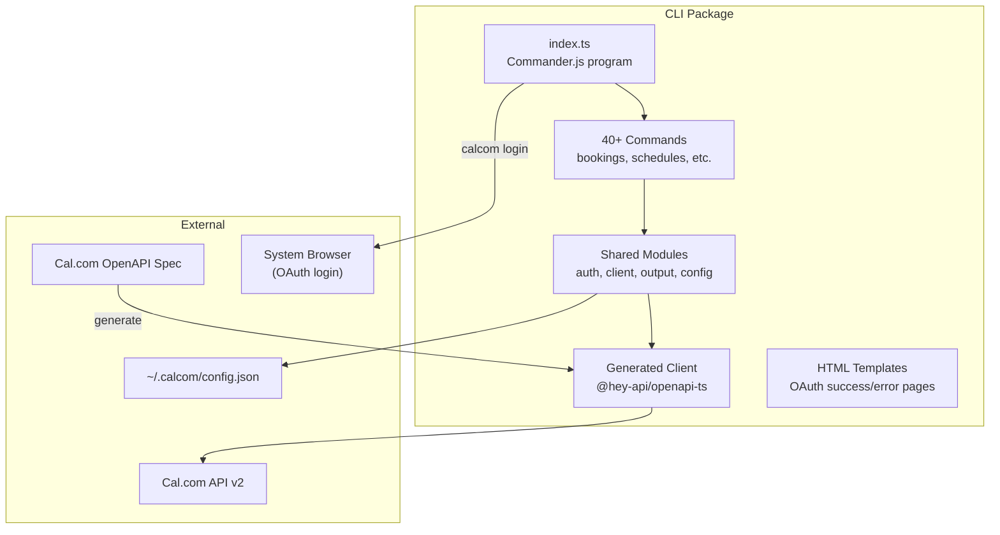
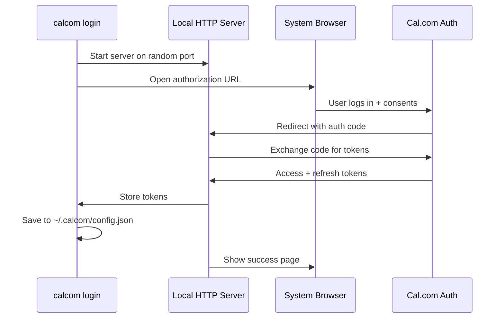

# 04 -- CLI Deep Dive

An in-depth exploration of the `@calcom/cli` package covering OpenAPI code generation, command architecture, authentication, output formatting, and the dry-run system.

---

## Architecture Overview



## Code Generation Pipeline

### OpenAPI Client Generation

The CLI uses `@hey-api/openapi-ts` (v0.94.0) to generate a TypeScript HTTP client from Cal.com's OpenAPI specification:

```bash
# packages/cli/package.json
"scripts": {
  "generate": "openapi-ts",
  "build": "yarn generate && tsc -p tsconfig.json && cp -r src/templates dist/"
}
```

This produces:
- `src/generated/client.gen.ts` -- Configured fetch client with interceptors
- `src/generated/types.gen.ts` -- TypeScript types for all request/response schemas
- `src/generated/services.gen.ts` -- Typed function for each API endpoint

### Generated Client Configuration

```typescript
// src/shared/client.ts
import { client } from "../generated/client.gen";

export async function initializeClient(): Promise<void> {
  client.setConfig({
    baseUrl: getApiUrl(),
    throwOnError: true,
  });

  client.interceptors.request.use(async (request) => {
    // Dry-run check BEFORE auth
    if (isDryRunMode()) {
      const body = await request.clone().json().catch(() => null);
      outputJson({ dryRun: true, method: request.method, url: request.url, body });
      throw new DryRunAbort();
    }

    const token = await getAuthToken();
    request.headers.set("Authorization", `Bearer ${token}`);
    request.headers.set("Content-Type", "application/json");
    return request;
  });
}
```

## Command Architecture

### Command Pattern

Each command follows a consistent four-file structure:

```
src/commands/<resource>/
  command.ts    # Commander.js command registration + action handlers
  index.ts      # Re-exports
  output.ts     # Human-readable output formatting (tables, chalk colors)
  types.ts      # TypeScript interfaces for command-specific data
```

### Example: Bookings Command

```typescript
// src/commands/bookings/command.ts
export function registerBookingsCommand(program: Command): void {
  const bookings = program
    .command("bookings")
    .description("Manage your bookings");

  bookings
    .command("list")
    .description("List bookings")
    .option("--status <status>", "Filter: upcoming, past, cancelled, recurring")
    .option("--take <n>", "Number of results", "25")
    .option("--skip <n>", "Skip results for pagination")
    .option("--sort-start <dir>", "Sort by start time: asc, desc")
    .option("--after-start <date>", "Filter: bookings after this date")
    .option("--before-end <date>", "Filter: bookings before this date")
    .option("--attendee-email <email>", "Filter by attendee email")
    .option("--attendee-name <name>", "Filter by attendee name")
    .option("--json", "Output as JSON")
    .action(async (opts) => {
      await initializeClient();
      const { data } = await getBookingsV2({
        query: {
          status: opts.status,
          take: parseInt(opts.take),
          skip: opts.skip ? parseInt(opts.skip) : undefined,
          sortStart: opts.sortStart,
          afterStart: opts.afterStart,
          beforeEnd: opts.beforeEnd,
          attendeeEmail: opts.attendeeEmail,
          attendeeName: opts.attendeeName,
        },
      });
      if (opts.json || isGlobalJsonMode()) {
        outputJson(data);
      } else {
        outputBookingsList(data);
      }
    });

  bookings
    .command("get <uid>")
    .description("Get booking details")
    .action(async (uid, opts) => {
      await initializeClient();
      const { data } = await getBookingV2({ path: { bookingUid: uid } });
      outputBookingDetail(data);
    });

  bookings
    .command("cancel <uid>")
    .description("Cancel a booking")
    .option("--reason <reason>", "Cancellation reason")
    .option("--cancel-subsequent", "Cancel subsequent recurring bookings")
    .action(async (uid, opts) => {
      await initializeClient();
      await cancelBookingV2({
        path: { bookingUid: uid },
        body: {
          cancellationReason: opts.reason,
          cancelSubsequentBookings: opts.cancelSubsequent,
        },
      });
      outputSuccess("Booking cancelled");
    });
}
```

### Full Command List

The CLI registers 40+ top-level commands in `src/index.ts`:

**User Management:**
- `login` -- OAuth browser flow
- `logout` -- Clear stored tokens
- `me` -- Show/update profile
- `agenda` -- Today's schedule
- `ooo` -- Out-of-office settings
- `timezones` -- List supported timezones

**Core Resources:**
- `bookings` -- List, get, create, cancel, reschedule, mark-absent
- `event-types` -- List, get, create, update, delete
- `schedules` -- List, get, create, update, delete
- `slots` -- Check available time slots
- `calendars` -- Connected calendars
- `destination-calendars` -- Default calendars
- `selected-calendars` -- Calendar selection
- `conferencing` -- Video conferencing apps
- `webhooks` -- Webhook management
- `routing-forms` -- Form routing rules
- `private-links` -- Private booking links
- `verified-resources` -- Verified domains/resources
- `stripe` -- Stripe integration
- `api-keys` -- API key management
- `oauth` -- OAuth client management

**Team Resources:**
- `teams` -- Team management
- `team-event-types` -- Team event types
- `team-schedules` -- Team schedules
- `team-roles` -- Team member roles
- `team-workflows` -- Team automation workflows
- `team-conferencing` -- Team conferencing
- `team-routing-forms` -- Team routing forms
- `team-stripe` -- Team Stripe settings
- `team-event-type-webhooks` -- Team event type webhooks
- `team-event-type-private-links` -- Team private links
- `team-verified-resources` -- Team verified resources

**Organization Resources:**
- `org-users` -- Organization user management
- `org-bookings` -- Organization booking queries
- `org-webhooks` -- Organization webhooks
- `org-roles` -- Organization roles
- `org-memberships` -- Organization memberships
- `org-overview` -- Organization overview
- `org-attributes` -- Organization attributes
- `org-routing-forms` -- Organization routing forms
- `org-user-ooo` -- Organization user OOO
- `org-user-schedules` -- Organization user schedules
- `org-team-verified-resources` -- Organization team verified resources
- `managed-orgs` -- Managed organization operations
- `delegation-credentials` -- Delegation credentials

**Introspection:**
- `schema` -- API schema introspection

## Authentication

### OAuth Login Flow



The login command:
1. Starts a temporary HTTP server on a random port
2. Opens the system browser with the Cal.com authorization URL
3. Listens for the OAuth callback
4. Exchanges the authorization code for tokens
5. Validates the tokens by calling `/v2/me`
6. Stores tokens in `~/.calcom/config.json`
7. Serves an HTML success/error page to the browser
8. Shuts down the HTTP server

### Token Storage

```typescript
// src/shared/config.ts
const CONFIG_DIR = path.join(os.homedir(), ".calcom");
const CONFIG_FILE = path.join(CONFIG_DIR, "config.json");

interface Config {
  accessToken: string;
  refreshToken: string;
  apiUrl: string;
  expiresAt?: number;
}

export async function getAuthToken(): Promise<string> {
  const config = loadConfig();
  if (isExpired(config)) {
    const newTokens = await refreshToken(config.refreshToken);
    saveConfig({ ...config, ...newTokens });
    return newTokens.accessToken;
  }
  return config.accessToken;
}
```

## Output System

### Output Modes

The CLI supports three output modes, auto-detected based on context:

```typescript
// src/shared/output.ts
export function stdoutIsTTY(): boolean {
  return process.stdout.isTTY === true;
}

// Auto-detection in preAction hook:
const globalJson = opts.json === true
  || process.env.CAL_OUTPUT === "json"
  || !stdoutIsTTY()     // Piped output → JSON
  || compact
  || dryRun;
```

**Human Mode (TTY):**
```
$ calcom bookings list
┌─────────────────────────────────┬─────────────┬──────────────┐
│ Title                           │ When        │ Attendees    │
├─────────────────────────────────┼─────────────┼──────────────┤
│ Product Discussion              │ Mar 20 2pm  │ John, Jane   │
│ Quick Sync                      │ Mar 21 10am │ Bob          │
└─────────────────────────────────┴─────────────┴──────────────┘
```

**JSON Mode (`--json`):**
```json
{
  "status": "success",
  "data": [
    { "uid": "abc123", "title": "Product Discussion", ... },
    { "uid": "def456", "title": "Quick Sync", ... }
  ]
}
```

**Compact Mode (`--compact`):**
```
{"uid":"abc123","title":"Product Discussion",...}
{"uid":"def456","title":"Quick Sync",...}
```

### Output Formatting

Each command's `output.ts` defines human-readable formatters:

```typescript
// src/commands/bookings/output.ts
import chalk from "chalk";

export function outputBookingsList(data: BookingsResponse): void {
  for (const booking of data.bookings) {
    console.log(chalk.bold(booking.title));
    console.log(`  ${chalk.gray("When:")} ${formatTime(booking.startTime)}`);
    console.log(`  ${chalk.gray("With:")} ${booking.attendees.map(a => a.name).join(", ")}`);
    console.log();
  }
}
```

## Dry-Run System

The `--dry-run` flag intercepts API requests before they are sent, displaying what would be executed:

```typescript
// src/shared/client.ts
class DryRunAbort extends Error {
  constructor() {
    super("dry-run");
    this.name = "DryRunAbort";
  }
}

client.interceptors.request.use(async (request) => {
  if (isDryRunMode()) {
    let body;
    try { body = await request.clone().json(); } catch {}

    outputJson({
      dryRun: true,
      method: request.method,
      url: request.url,
      body: body ?? null,
    });

    throw new DryRunAbort(); // Abort request
  }
  // ... normal auth flow
});
```

Usage:
```bash
$ calcom --dry-run bookings cancel abc123 --reason "scheduling conflict"
{
  "dryRun": true,
  "method": "DELETE",
  "url": "https://api.cal.com/v2/bookings/abc123",
  "body": {
    "cancellationReason": "scheduling conflict"
  }
}
```

## Schema Introspection

The `schema` command lets users explore the API schema:

```bash
$ calcom schema bookings list
# Shows the request/response schema for the bookings list endpoint
```

This is implemented by walking the generated OpenAPI types and displaying field names, types, and descriptions.

## Error Handling

```typescript
// src/shared/errors.ts
program.parseAsync(process.argv).catch((err: Error) => {
  const globalJson = isGlobalJsonMode();
  if (globalJson) {
    console.error(JSON.stringify({
      status: "error",
      error: { message: err.message },
    }));
  } else {
    console.error(`Error: ${err.message}`);
  }
  process.exit(1);
});
```

Errors are formatted according to the output mode -- JSON for piped/scripted usage, plain text for interactive TTY.

## Build and Distribution

### Build Process

```bash
yarn generate    # Run openapi-ts to generate client
tsc -p tsconfig.json  # Compile TypeScript
cp -r src/templates dist/  # Copy HTML templates
```

### npm Distribution

```json
{
  "name": "@calcom/cli",
  "bin": { "calcom": "./dist/index.ts" },
  "files": ["dist"],
  "engines": { "node": ">=18" }
}
```

Installation: `npm install -g @calcom/cli`

### API Version Header

All requests include the Cal.com API version header for stability:

```typescript
request.headers.set("cal-api-version", "2024-08-13");
```

This pins the CLI to a specific API version, preventing breaking changes from affecting users until the CLI is updated.
