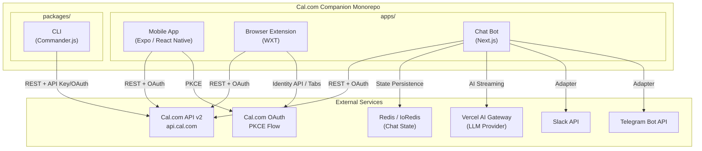
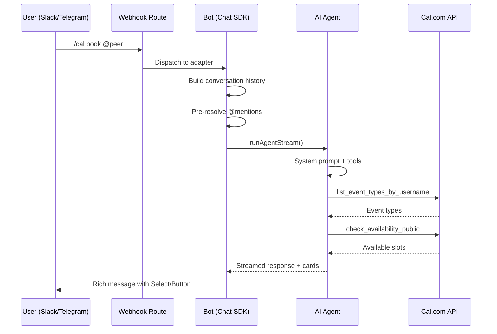

# Cal.com Companion -- Main Exploration

## Overview

Cal.com Companion is an official multi-platform scheduling companion for [Cal.com](https://cal.com), the open-source Calendly alternative. It ships as a single monorepo containing **four distinct applications** that all integrate with the Cal.com API v2:

1. **Mobile App** (iOS/Android) -- A native Expo + React Native app for managing bookings, event types, availability, and home-screen widgets.
2. **Browser Extension** (Chrome, Firefox, Safari, Edge, Brave) -- A WXT-based cross-browser extension that injects Cal.com features into Gmail, LinkedIn, and Google Calendar.
3. **Chat Bot** (Slack/Telegram) -- A Next.js-hosted AI scheduling assistant that uses the Vercel AI SDK with LLM tool-calling to manage bookings conversationally.
4. **CLI** (`@calcom/cli`) -- A Commander.js-based command-line tool auto-generated from the Cal.com OpenAPI specification.

The project is a Bun-based monorepo using workspaces (`apps/*` and `packages/*`), with Biome for linting/formatting and Husky for pre-commit hooks.

## Architecture



## Project Structure

```
companion/
  apps/
    mobile/             # Expo Router (React Native) -- iOS, Android, Web
      app/              # File-based routing (tabs, modals, sheets)
      components/       # Shared React Native components
      hooks/            # Custom hooks (useBookings, useSchedules, etc.)
      services/         # Cal.com API client, OAuth, WebAuth
      contexts/         # Auth, Query (TanStack), Toast providers
      config/           # Cache configuration (TanStack Query)
      constants/        # Colors, timezones
      utils/            # Formatters, storage, widget sync
      widgets/          # Android home-screen widget
      targets/widget/   # iOS WidgetKit target (SwiftUI)
    extension/          # WXT browser extension
      entrypoints/
        background/     # Service worker (OAuth, API calls)
        content.ts      # Content script (sidebar, Gmail, LinkedIn, GCal)
      lib/              # Google Calendar, LinkedIn integration modules
      types/            # Booking, OAuth, Google Calendar types
    chat/               # Next.js chat bot
      app/api/          # Webhook routes, OAuth callback routes
      lib/              # Agent, bot, notifications, calcom client
        agent.ts        # AI agent with 20+ tools (book, cancel, etc.)
        bot.ts          # Chat SDK initialization (Slack + Telegram)
        calcom/         # Cal.com API client with retry logic
        handlers/       # Slack and Telegram platform handlers
  packages/
    cli/                # @calcom/cli NPM package
      src/
        commands/       # 40+ CLI commands (bookings, schedules, etc.)
        shared/         # Auth, API client, config, output formatting
        generated/      # Auto-generated from OpenAPI spec
```

## Component Breakdown

### 1. Mobile App (`apps/mobile`)

**Tech Stack:** Expo 55 (canary), React Native 0.83, Expo Router 7, NativeWind (Tailwind), TanStack Query 5

The mobile app uses file-based routing with Expo Router. The main navigation is a tab-based layout with four sections:

| Tab | Purpose |
|---|---|
| Bookings | List, view, cancel, reschedule, add guests, mark no-show |
| Event Types | Browse/edit event types (duration, recurrence, limits) |
| Availability | Manage schedules, working hours, date overrides |
| More | Profile, settings, additional options |

**Key Architectural Decisions:**
- **Platform-specific files** (`.ios.tsx` vs `.tsx`) for iOS-specific UI (native sheet modals with `expo-glass-effect`, iOS segmented controls)
- **TanStack Query** with persistent cache (AsyncStorage) for offline-first behavior; cache keys are factory-patterned (`queryKeys.bookings.list(filters)`)
- **OAuth via PKCE** using `expo-auth-session` with secure token storage in `expo-secure-store`
- **Widget sync** for both iOS (SwiftUI WidgetKit via `@bacons/apple-targets`) and Android (`react-native-android-widget`)
- **React Compiler** integration via `babel-plugin-react-compiler` for automatic memoization

See: [01-mobile-app-deep-dive.md](./01-mobile-app-deep-dive.md)

### 2. Browser Extension (`apps/extension`)

**Tech Stack:** WXT 0.20, React Native Web, Chrome Extension APIs

The extension runs across all Chromium browsers (Chrome, Brave, Edge), Firefox, and Safari with a single codebase. It uses WXT, a next-generation web extension framework that handles the manifest differences.

**Features:**
- **Sidebar** -- Clicking the toolbar icon opens a sidebar that renders the mobile app via `react-native-web` in an iframe
- **Gmail integration** -- Injects a Cal.com button in the Gmail compose toolbar for inserting scheduling links
- **LinkedIn integration** -- Injects a Cal.com button in LinkedIn messaging for sharing booking links
- **Google Calendar no-show** -- Adds "Mark No Show" toggles next to attendees in Google Calendar event popups for Cal.com bookings

**Cross-Browser OAuth:**
- Chrome/Edge/Brave: `chrome.identity.launchWebAuthFlow`
- Firefox: Promise-based `browser.identity.launchWebAuthFlow`
- Safari: Custom tab-based OAuth flow with redirect URL monitoring

See: [02-browser-extension-deep-dive.md](./02-browser-extension-deep-dive.md)

### 3. Chat Bot (`apps/chat`)

**Tech Stack:** Next.js 16, Vercel AI SDK v6, Chat SDK (custom adapters), Redis, Zod

The chat bot is the most architecturally complex component. It is an AI-powered scheduling assistant deployed on Vercel, handling both Slack and Telegram via a unified Chat SDK.

**Architecture Flow:**



**AI Agent Tools (20+):** `list_bookings`, `book_meeting`, `book_meeting_public`, `cancel_booking`, `reschedule_booking`, `check_availability`, `check_availability_public`, `list_event_types`, `list_event_types_by_username`, `list_schedules`, `get_schedule`, `create_schedule`, `update_schedule`, `delete_schedule`, `create_event_type`, `update_event_type`, `delete_event_type`, `get_my_profile`, `update_my_profile`, `lookup_platform_user`, `mark_no_show`, `confirm_booking`, `decline_booking`, `add_booking_attendee`, `get_busy_times`, `get_calendar_links`

**Key Design Patterns:**
- **System prompt engineering** -- A 700+ line system prompt with platform-aware formatting (Slack mrkdwn vs Telegram Markdown), booking flow decision trees, ASAP scheduling logic, and custom booking field handling
- **Tool context caching** -- Persisted tool results in Redis for multi-turn conversations
- **Encrypted state** -- OAuth tokens encrypted at rest with AES-256-GCM before writing to Redis
- **Streaming with fallback** -- Slack/Telegram support streaming updates via post-then-edit pattern

See: [03-chat-bot-deep-dive.md](./03-chat-bot-deep-dive.md)

### 4. CLI (`packages/cli`)

**Tech Stack:** Commander.js 12, `@hey-api/openapi-ts` for auto-generated client, Chalk 4

The CLI provides 40+ commands covering the full Cal.com API v2 surface. Commands are auto-generated from the OpenAPI specification using `@hey-api/openapi-ts`, then wrapped with Commander.js for argument parsing and output formatting.

**Command Categories:**
- **User:** `me`, `login`, `logout`, `agenda`, `ooo`, `timezones`
- **Bookings:** `bookings` (list, get, create, cancel, reschedule, mark-absent)
- **Event Types:** `event-types` (list, get, create, update, delete)
- **Schedules:** `schedules` (list, get, create, update, delete)
- **Teams:** `teams`, `team-event-types`, `team-schedules`, `team-roles`, `team-workflows`
- **Org:** `org-users`, `org-bookings`, `org-webhooks`, `org-roles`, `org-memberships`, `org-overview`, `org-attributes`, `org-routing-forms`
- **Infrastructure:** `webhooks`, `calendars`, `conferencing`, `slots`, `stripe`, `oauth`, `api-keys`, `routing-forms`, `private-links`, `verified-resources`, `schema`

**Key Features:**
- `--json` / `--compact` flags for machine-readable output (NDJSON-friendly)
- `--dry-run` flag to inspect API requests without executing
- OAuth browser-based login flow with local HTTP callback server
- Auto-detection of TTY for output formatting

See: [04-cli-deep-dive.md](./04-cli-deep-dive.md)

## Entry Points

| Application | Entry Point | Runtime |
|---|---|---|
| Mobile App | `apps/mobile/app/_layout.tsx` | Expo (Metro bundler) |
| Browser Extension | `apps/extension/entrypoints/background/index.ts` + `content.ts` | Service Worker + Content Script |
| Chat Bot | `apps/chat/app/api/webhooks/[platform]/route.ts` | Next.js (Vercel) |
| CLI | `packages/cli/src/index.ts` | Node.js |

## Data Flow

### Authentication Flow

```mermaid
flowchart LR
    subgraph "Mobile / Extension"
        A[User taps Login] --> B[PKCE Code Challenge]
        B --> C[Cal.com OAuth Consent]
        C --> D[Authorization Code]
        D --> E[Token Exchange]
        E --> F[Access + Refresh Tokens]
        F --> G[Secure Storage]
    end

    subgraph "Chat Bot"
        H[/cal link] --> I[Generate Auth URL]
        I --> J[User visits URL]
        J --> K[Cal.com OAuth Consent]
        K --> L[Callback with code]
        L --> M[Token Exchange]
        M --> N[Encrypted Redis Storage]
    end

    subgraph "CLI"
        O[calcom login] --> P[Open browser]
        P --> Q[Local HTTP server]
        Q --> R[Authorization Code]
        R --> S[Token Exchange]
        S --> T[~/.calcom/config.json]
    end
```

### Cal.com API Integration

All four apps communicate with `api.cal.com` using Cal.com API v2 (`cal-api-version: 2024-08-13`). The API client implementations share common patterns:

- **Retry logic** with exponential backoff for 5xx status codes
- **Request timeout** (10-30s depending on platform)
- **Token refresh** when access tokens expire
- **Error handling** with typed error classes

## Dependencies

### Runtime Dependencies (Key)

| Package | Used By | Purpose |
|---|---|---|
| `expo` (55.0.0-canary) | Mobile | React Native framework |
| `expo-router` | Mobile | File-based navigation |
| `@tanstack/react-query` | Mobile | Server state management + caching |
| `nativewind` | Mobile | Tailwind CSS for React Native |
| `wxt` | Extension | Cross-browser extension framework |
| `react-native-web` | Extension | React Native components in browser |
| `next` (16.1.6) | Chat | Server framework + API routes |
| `ai` (6.0.116) | Chat | Vercel AI SDK for LLM streaming |
| `chat` (4.19.0) | Chat | Chat SDK for multi-platform bots |
| `@chat-adapter/slack` | Chat | Slack platform adapter |
| `@chat-adapter/telegram` | Chat | Telegram platform adapter |
| `redis` (5.11.0) | Chat | State persistence |
| `commander` (12.1.0) | CLI | Argument parsing |
| `@hey-api/openapi-ts` | CLI | API client code generation |
| `zod` | Mobile, Chat | Runtime validation |

### Dev Dependencies

| Package | Purpose |
|---|---|
| `@biomejs/biome` (2.3.10) | Linting + formatting (replaces ESLint + Prettier) |
| `husky` (9.0.11) | Git hooks |
| `typescript` (5.9.3) | Type checking |
| `babel-plugin-react-compiler` | React Compiler (auto-memoization) |

## Configuration

### Environment Variables

The project uses `EXPO_PUBLIC_` prefixed variables (shared between mobile and extension via Expo's env system):

| Variable | App | Purpose |
|---|---|---|
| `EXPO_PUBLIC_CALCOM_OAUTH_CLIENT_ID` | Mobile, Extension | OAuth client ID |
| `EXPO_PUBLIC_CALCOM_OAUTH_REDIRECT_URI` | Mobile, Extension | OAuth redirect URI |
| `EXPO_PUBLIC_CACHE_*` | Mobile, Extension | Cache stale times |
| `EXPO_PUBLIC_COMPANION_DEV_URL` | Extension | Dev iframe URL |
| `SLACK_CLIENT_ID`, `SLACK_CLIENT_SECRET` | Chat | Slack app credentials |
| `SLACK_ENCRYPTION_KEY` | Chat | AES-256-GCM key for Redis encryption |
| `TELEGRAM_BOT_TOKEN` | Chat | Telegram bot credentials |
| `REDIS_URL` | Chat | Redis connection string |
| `AI_MODEL`, `AI_FALLBACK_MODELS` | Chat | LLM model selection |
| `CALCOM_API_URL` | Chat, CLI | API base URL override |
| `CALCOM_OAUTH_*` | Chat | OAuth config for account linking |

### Cache Configuration

The mobile app uses a sophisticated cache config (`config/cache.config.ts`) with TanStack Query:

- **Bookings:** 5 min stale time (external changes expected)
- **Event Types:** Infinity (only refresh on mutations)
- **Schedules:** Infinity (only refresh on mutations)
- **User Profile:** Infinity (rarely changes)
- **GC Time:** 24 hours (full offline support window)
- **Persistence:** AsyncStorage with 1s throttle

## Testing

The project uses **Vitest** for the CLI package (`packages/cli/vitest.config.mts`) and has CI checks via GitHub Actions:

- **Lint:** `biome lint .` + React Compiler lint
- **Type Check:** `tsc --noEmit` for all workspaces
- **Build:** Expo web export + WXT extension build
- **Security Audit:** Dependency vulnerability scanning

CI runs on Blacksmith runners (2-4 vCPU Ubuntu) with Bun caching.

## Key Insights

1. **Shared UI via React Native Web** -- The extension sidebar renders the mobile app's React Native components via `react-native-web`, achieving code reuse across platforms without a separate extension UI.

2. **AI Agent as Primary Chat Interface** -- The chat bot is not just a command handler; it is a full AI agent with 20+ tools, 700+ line system prompt, and multi-step reasoning. Slash commands (`/cal book`) dispatch to the agent, which chains tool calls to minimize user round-trips.

3. **Encrypted State Management** -- The chat bot encrypts all OAuth tokens at rest in Redis using AES-256-GCM with key derivation from `SLACK_ENCRYPTION_KEY`. Legacy plaintext entries are transparently migrated on read.

4. **Browser-Specific OAuth** -- The extension implements three distinct OAuth flows (Chrome identity API, Firefox promise-based, Safari tab-monitoring) unified behind a single interface.

5. **OpenAPI-Driven CLI** -- The CLI auto-generates its API client from the Cal.com OpenAPI spec, then wraps each endpoint with Commander.js commands. This means new API endpoints get CLI support almost automatically.

6. **Canary Dependencies** -- The mobile app uses Expo canary builds (`-canary-20251230-fc48ddc`), indicating active development on cutting-edge Expo features (likely iOS 26 Liquid Glass support via `expo-glass-effect`).

7. **Widget Architecture** -- Both iOS (SwiftUI WidgetKit) and Android (React Native widget) home-screen widgets are supported, with a shared sync mechanism that pushes booking data to native widget storage.

## Related Deep Dives

- [00-zero-to-scheduling-companion-engineer.md](./00-zero-to-scheduling-companion-engineer.md) -- Domain fundamentals
- [01-mobile-app-deep-dive.md](./01-mobile-app-deep-dive.md) -- Mobile app architecture, navigation, caching, widgets
- [02-browser-extension-deep-dive.md](./02-browser-extension-deep-dive.md) -- WXT framework, content scripts, cross-browser OAuth
- [03-chat-bot-deep-dive.md](./03-chat-bot-deep-dive.md) -- AI agent, Chat SDK, tool system, streaming
- [04-cli-deep-dive.md](./04-cli-deep-dive.md) -- OpenAPI generation, command structure, output modes
- [rust-revision.md](./rust-revision.md) -- Idiomatic Rust translation considerations
- [production-grade.md](./production-grade.md) -- Performance, deployment, monitoring, scaling
