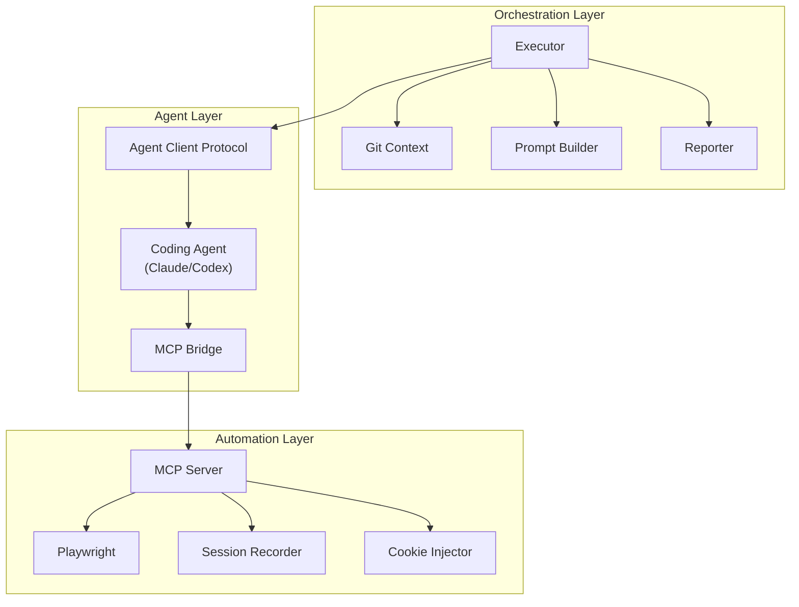
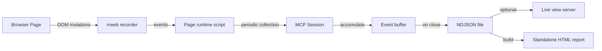
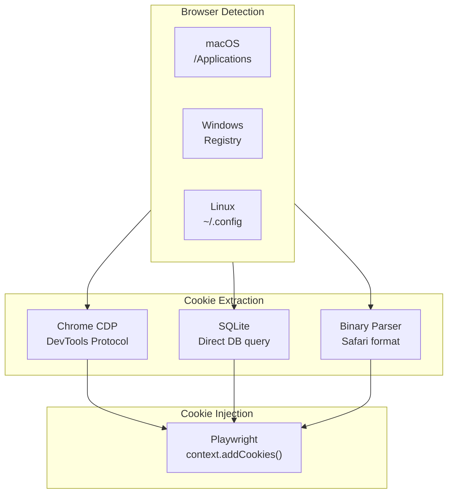
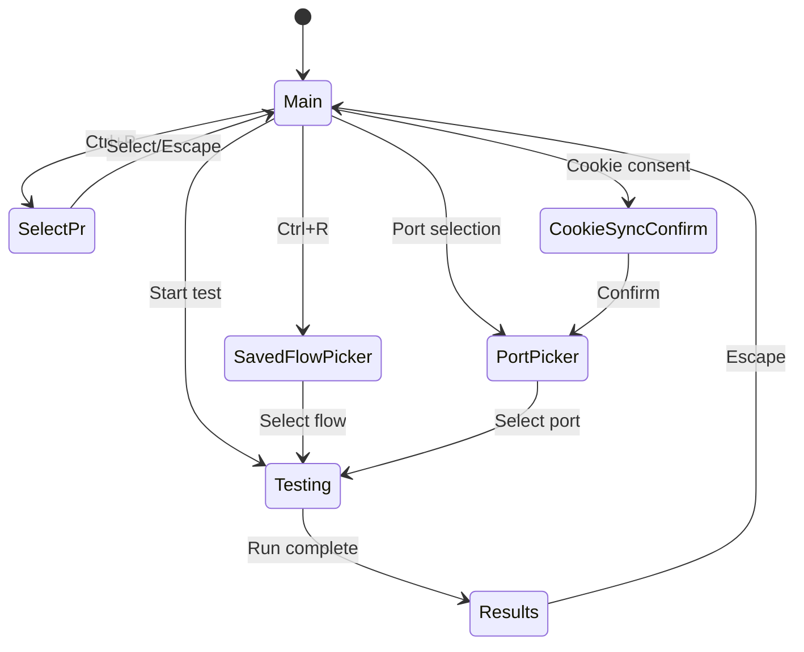
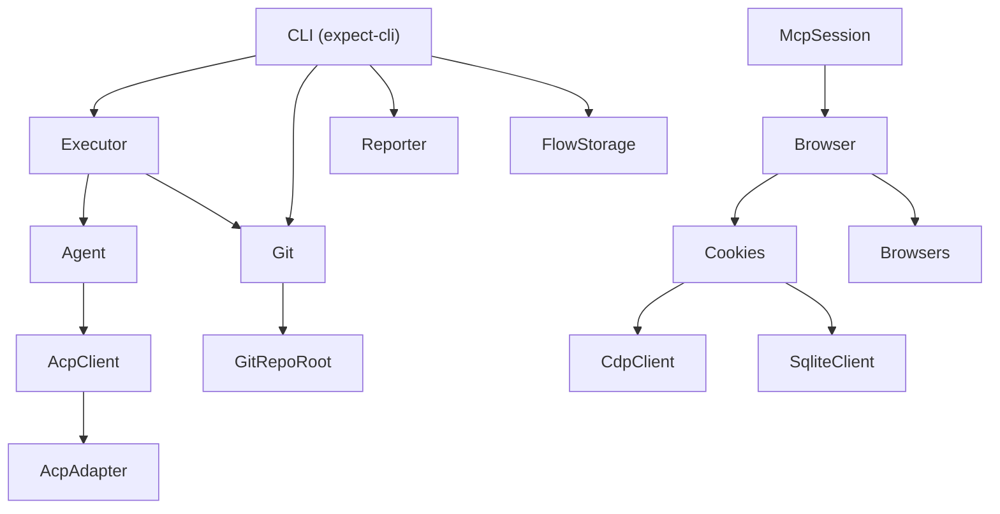

# Zero to AI-Driven Browser Testing Engineer

## Chapter 1: The Problem Space

### Why Browser Testing Exists

Web applications are complex systems where code changes can produce unexpected visual, behavioral, and functional regressions. A developer modifies a CSS class, and a button becomes invisible. A backend change alters an API response shape, and the dashboard shows empty data. A form validation update blocks legitimate users from submitting.

Traditional testing strategies address this through:

- **Unit tests** -- Verify individual functions in isolation
- **Integration tests** -- Verify component interactions
- **End-to-end (E2E) tests** -- Drive a real browser to verify user-facing behavior

E2E tests are the most faithful to real user experience but also the most expensive to write, maintain, and run. Test scripts break when selectors change, when workflows evolve, or when the application's structure is refactored. The maintenance burden scales with application size.

### The AI Testing Hypothesis

What if an AI agent could look at your code changes, understand what changed, figure out what to test, and execute those tests in a real browser -- without any pre-written test scripts?

This is the hypothesis behind Expect. Instead of maintaining a test suite, you describe (or let the AI infer) what needs verification, and the agent:

1. Reads the git diff to understand what changed
2. Derives which user flows are affected
3. Opens a browser and navigates to the relevant pages
4. Interacts with the UI (clicking, typing, navigating)
5. Asserts that the expected behavior occurs
6. Reports pass/fail with evidence (screenshots, ARIA trees, console logs)

### Key Terminology

| Term | Definition |
|---|---|
| **Coding agent** | An AI assistant that operates in a terminal (Claude Code, Codex CLI, Cursor) |
| **MCP (Model Context Protocol)** | A protocol for exposing tools to AI agents |
| **ACP (Agent Client Protocol)** | A protocol for controlling coding agents programmatically |
| **ARIA tree** | Accessibility tree representing the semantic structure of a web page |
| **Snapshot** | An ARIA tree capture of the current page state with element references |
| **Ref** | A short identifier (e.g., `e4`) assigned to interactive elements in a snapshot |
| **Session recording** | An rrweb-captured replay of all DOM mutations during a test |
| **Test plan** | A structured set of steps the agent will execute |
| **Execution event** | A structured marker emitted by the agent during test execution |
| **Saved flow** | A reusable test sequence persisted for repeated runs |

## Chapter 2: The Architecture of AI Browser Testing

### The Three-Layer Stack



**Layer 1: Orchestration** -- Gathers git context, builds the execution prompt, manages the lifecycle of a test run, and generates reports.

**Layer 2: Agent** -- Communicates with the AI coding agent through ACP. The agent receives the prompt, reasons about what to test, and calls browser tools via MCP.

**Layer 3: Automation** -- Exposes browser capabilities as MCP tools. Handles Playwright browser management, page snapshots, code execution, cookie injection, and session recording.

### How These Layers Communicate

The communication chain uses two distinct protocols:

```
Orchestration --[ACP/NDJSON]--> Agent --[MCP/stdio]--> Browser
```

**ACP (Agent Client Protocol)** uses NDJSON (newline-delimited JSON) over a subprocess's stdin/stdout to send prompts and receive streaming session updates. Each update is a typed event: agent message chunks, tool calls, tool results, plan updates, etc.

**MCP (Model Context Protocol)** is how the coding agent calls browser tools. The MCP server runs as a subprocess with tools registered for `open`, `playwright`, `screenshot`, `console_logs`, `network_requests`, `performance_metrics`, and `close`.

### The Snapshot-Ref Pattern

Traditional browser automation uses CSS selectors or XPath to locate elements:

```javascript
// Fragile -- breaks when class names change
await page.click('.btn-primary.submit-form');
// Fragile -- breaks when DOM structure changes
await page.click('//div[@id="form"]/button[2]');
```

Expect uses a fundamentally different approach based on ARIA accessibility trees:

```
- navigation
  - link "Home" [ref=e1]
  - link "About" [ref=e2]
- main
  - heading "Welcome"
  - textbox "Email" [ref=e3]
  - button "Submit" [ref=e4]
```

The agent reads the tree, understands the semantic structure, and uses refs to interact:

```javascript
await ref('e3').fill('user@example.com');
await ref('e4').click();
```

This is more robust because:
- Refs are assigned to semantic roles, not CSS classes
- The tree represents what the user perceives, not implementation details
- If a button moves in the DOM but keeps the same label, the ref still works
- The agent can reason about the tree using its understanding of web UIs

## Chapter 3: Effect-TS as a Foundation

Expect is built entirely on Effect-TS, a TypeScript framework for building robust, composable applications. Understanding Effect-TS patterns is essential to understanding Expect.

### Services and Dependency Injection

Every major component is an Effect Service:

```typescript
export class Browser extends ServiceMap.Service<Browser>()("@browser/Browser", {
  make: Effect.gen(function* () {
    // Yield dependencies at construction time
    const cookiesService = yield* Cookies;

    // Define methods
    const createPage = Effect.fn("Browser.createPage")(function* (url, options) {
      // Implementation using Playwright
    });

    return { createPage, snapshot, act } as const;
  }),
}) {
  static layer = Layer.effect(this)(this.make);
}
```

Key patterns:
- `ServiceMap.Service` defines an Effect service with a `make` property
- Dependencies are yielded at construction time (not per-method)
- Methods use `Effect.fn` which automatically creates tracing spans
- `static layer` defines how the service is provided to consumers

### Error Modeling

Every failure mode has its own typed error class:

```typescript
export class BrowserLaunchError extends Schema.ErrorClass<BrowserLaunchError>(
  "BrowserLaunchError"
)({
  _tag: Schema.tag("BrowserLaunchError"),
  cause: Schema.String,
}) {
  message = `Failed to launch browser: ${this.cause}`;
}
```

Errors are caught specifically, never broadly:

```typescript
// GOOD: catch the specific error
Effect.catchTag("BrowserLaunchError", (error) => handleLaunchFailure(error));

// BAD: catch all errors (hides bugs)
Effect.catchAll(() => Effect.succeed(undefined));
```

### Streaming with Effect Streams

Agent output is modeled as an Effect Stream:

```typescript
agent.stream(options).pipe(
  Stream.mapAccum(
    () => initial,
    (executed, part) => {
      const next = executed.addEvent(part);
      return [next, [next]] as const;
    },
  ),
);
```

This accumulates streaming agent updates into an `ExecutedTestPlan` that grows with each event, providing real-time progress to the UI.

## Chapter 4: The Execution Lifecycle

### Step 1: Context Gathering

When a user runs `expect`, the first thing that happens is git context gathering:

```typescript
const gatherContext = Effect.fn("Executor.gatherContext")(function* (changesFor) {
  const currentBranch = yield* git.getCurrentBranch;
  const mainBranch = yield* git.getMainBranch;
  const changedFiles = yield* git.getChangedFiles(changesFor);
  const diffPreview = yield* git.getDiffPreview(changesFor);
  const recentCommits = yield* git.getRecentCommits(commitRange);
  return { currentBranch, mainBranch, changedFiles, recentCommits, diffPreview };
});
```

The `ChangesFor` type is a tagged union that determines what scope of changes to analyze:

- `WorkingTree` -- Unstaged changes in the working directory
- `Branch` -- All changes between current branch and main
- `Changes` -- Both committed and uncommitted changes
- `Commit` -- A specific commit hash

### Step 2: Prompt Construction

The execution prompt is a ~250-line document that instructs the agent on:

1. **Available MCP tools** and how to use them
2. **Snapshot-driven workflow** -- always snapshot first, then use refs
3. **Execution strategy** -- assertion depth, scope strategies
4. **Structured output format** -- `STEP_START|id|title`, `STEP_DONE|id|summary`, etc.
5. **Recovery policies** -- how to handle blocked steps
6. **Environment context** -- base URL, headed mode, cookie config
7. **Git context** -- changed files, recent commits, diff preview

The prompt includes scope-specific strategies:

```typescript
case "Branch":
  return [
    "- Be thorough. Catch regressions before merge.",
    "- Aim for 5-8 total tested flows.",
    "- Include edge cases relevant to the changes.",
  ];
case "WorkingTree":
  return [
    "- Start with the exact user-requested flow.",
    "- Test 2-3 follow-up flows.",
    "- Watch for partially-implemented features.",
  ];
```

### Step 3: Agent Execution

The agent receives the prompt and begins executing. It uses MCP tools to:

1. **Open a browser** -- `open(url, { headed, cookies })`
2. **Take snapshots** -- `screenshot({ mode: 'snapshot' })` returns the ARIA tree
3. **Execute Playwright code** -- `playwright({ code: "await ref('e3').fill('test')" })`
4. **Check console** -- `console_logs({ type: 'error' })`
5. **Check network** -- `network_requests({ method: 'POST' })`
6. **Close session** -- `close()` flushes recordings

Throughout execution, the agent emits structured markers in its text output. These are parsed and accumulated into the `ExecutedTestPlan`.

### Step 4: Event Accumulation

The `ExecutedTestPlan.addEvent()` method processes each `AcpSessionUpdate`:

- **Agent message chunks** -- Accumulated as `AgentText`, scanned for step markers
- **Agent thought chunks** -- Accumulated as `AgentThinking`
- **Tool calls** -- Recorded as `ToolCall` events
- **Tool call updates** -- Updated when results arrive (`ToolResult`)
- **Markers in text** -- Parsed and applied (`StepStarted`, `StepCompleted`, `StepFailed`)

### Step 5: Reporting

When the stream completes, the Reporter generates a `TestReport` containing:
- Summary text
- Step statuses (passed/failed/skipped)
- Screenshot paths
- Full event log

The report can be displayed in the TUI, printed as plain text in CI, or posted as a GitHub PR comment.

## Chapter 5: Session Recording

Every test run produces a session recording using rrweb:



The recording system works by:

1. Injecting a runtime script into every page via `context.addInitScript()`
2. The script starts rrweb recording and exposes `getEvents()` / `getAllEvents()` via `window.__EXPECT_RUNTIME__`
3. Events are collected periodically (poll interval) or on-demand
4. On session close, all events are written as NDJSON
5. An HTML report is generated with an embedded rrweb player
6. Optionally, a live view server streams events to the Expect website for real-time viewing

## Chapter 6: Cookie Extraction

One of Expect's differentiating features is the ability to test authenticated flows by extracting cookies from the user's installed browsers.

### Why This Matters

Most web applications require authentication. Without cookies, the agent can only test public pages. With cookie extraction, the agent can:

- Navigate to a dashboard that requires login
- Test user-specific features
- Verify flows that depend on session state

### How It Works



Each browser type has a specialized extractor:

- **Chromium (Chrome, Edge, Brave, Arc)** -- Primary: connect via CDP to the browser's DevTools endpoint. Fallback: read the SQLite cookie database directly (requires handling encrypted cookie values)
- **Firefox** -- Query `moz_cookies` table in the profile's `cookies.sqlite`
- **Safari** -- Parse Apple's proprietary binary cookie format (`Cookies.binarycookies`)

## Chapter 7: The Terminal UI

The CLI uses React + Ink for terminal rendering, providing a full-screen TUI experience:

### Screen Architecture



Each screen is a React component rendered by the App router. Navigation state is managed by a Zustand store with typed `Screen` variants (tagged union).

### Component Library

The CLI includes a custom component library for terminal rendering:
- `ScreenHeading` -- Consistent screen headers
- `HintBar` -- Keyboard shortcut hints
- `SearchBar` -- Fuzzy search with scoring
- `RuledBox` -- Bordered content areas
- `Spinner` / `TextShimmer` -- Loading indicators
- `Image` -- Inline terminal images (iTerm2/Kitty)
- `Clickable` -- Mouse-interactive elements
- `Modeline` -- Status bar with git state and version info

## Chapter 8: Testing Methodology

### The Assertion-First Philosophy

Expect's prompt instructs the agent to follow assertion-first testing:

1. Before acting, note what should change
2. After acting, confirm it actually changed
3. Check at least two independent signals per step
4. Verify absence when relevant (delete operations)
5. Use `playwright` to return structured evidence

This is more rigorous than "navigate and eyeball" testing.

### Scope-Aware Strategy

The testing depth scales with the scope of changes:

| Scope | Strategy | Flow Count |
|---|---|---|
| Working Tree | Quick validation of in-progress changes | 2-3 flows |
| Commit | Focused verification of one commit's impact | 2-4 flows |
| Changes | Committed + uncommitted as one body | 2-4 flows |
| Branch | Thorough pre-merge regression testing | 5-8 flows |

### Recovery and Resilience

The agent is instructed to:
- Take fresh snapshots when blocked
- Retry once with new evidence
- Classify failures with categories (app-bug, env-issue, auth-blocked, etc.)
- Stop after 4 failed attempts
- Never repeat the same failing action without new evidence

## Chapter 9: Deployment Models

### Developer Workstation

The primary deployment model. Developer runs `expect` in their terminal after making changes. The agent uses the developer's browser session cookies for authenticated testing.

### CI/CD Pipeline

```yaml
- name: Run expect tests
  run: npx expect-cli --ci -m "test all changes from main"
```

In CI mode, Expect runs headless, skips cookie extraction, auto-confirms prompts, and enforces a 30-minute timeout. Results can be posted as PR comments via the GitHub integration.

### Agent-Driven

When another AI coding agent (e.g., Claude Code) is making changes, it can invoke `expect` as a tool to validate its own work. The `isRunningInAgent()` detection automatically enables headless mode.

## Chapter 10: The Effect-TS Service Graph

Understanding the full dependency graph helps navigate the codebase:



Each arrow represents a `Layer.provide()` dependency. The layer system ensures services are constructed exactly once and in the correct order.

## Summary

AI-driven browser testing with Expect combines several sophisticated subsystems:

1. **Git context analysis** to understand what changed
2. **Prompt engineering** to instruct the agent effectively
3. **Agent protocol (ACP)** to communicate with coding agents
4. **Browser automation (MCP + Playwright)** to drive real browsers
5. **ARIA snapshot system** for robust element interaction
6. **Cookie extraction** for authenticated testing
7. **Session recording (rrweb)** for replay and debugging
8. **Terminal UI (React + Ink)** for developer experience

The key insight is that Expect doesn't try to replace traditional E2E testing -- it fills the gap between "no tests" and "full test suite" by making verification as easy as running a single command.
