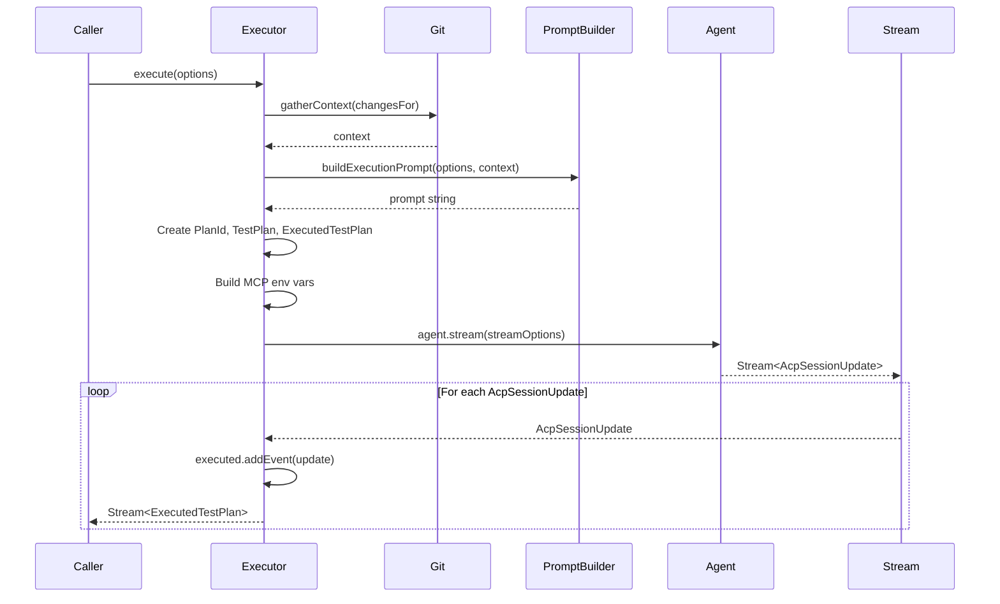
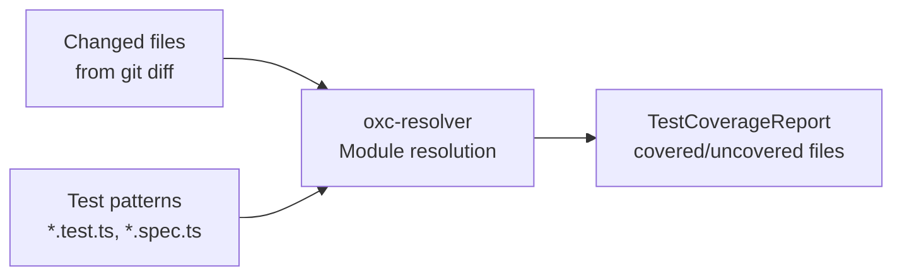

# Supervisor Deep Dive -- Orchestration and Execution

## Overview

The `@expect/supervisor` package is the orchestration brain of Expect. It owns all state management, agent lifecycle, git operations, and report generation. The CLI is deliberately a stateless renderer of supervisor state. This document explores the supervisor's architecture, execution flow, and design decisions in depth.

## Package Structure

```
packages/supervisor/
  src/
    index.ts                    # Public API exports
    executor.ts                 # Core execution orchestration
    planner.ts                  # (Currently disabled) AI test plan generation
    reporter.ts                 # TestReport generation from ExecutedTestPlan
    constants.ts                # Configuration constants
    flow-storage.ts             # Saved flow persistence
    github.ts                   # GitHub PR integration
    json.ts                     # JSON utilities
    project-preferences.ts      # Per-project settings persistence
    prompt-history.ts           # Prompt history storage
    remote-branches.ts          # Remote branch fetching
    saved-flow-file.ts          # Saved flow file format
    test-coverage.ts            # Test coverage analysis
    types.ts                    # Shared type definitions
    updates.ts                  # Update checking
    git/
      errors.ts                 # Git-specific errors
      git.ts                    # Git service (core)
      index.ts                  # Re-exports
    utils/
      categorize-changed-files.ts  # File change categorization
      command-exists.ts            # CLI command detection
      ensure-state-dir.ts         # .expect directory management
      serialize-tool-result.ts    # Tool result serialization
```

## The Executor Service

The `Executor` is the most important service in the supervisor. It orchestrates the entire test execution lifecycle.

### Service Definition

```typescript
export class Executor extends ServiceMap.Service<Executor>()("@supervisor/Executor", {
  make: Effect.gen(function* () {
    const agent = yield* Agent;
    const git = yield* Git;

    const gatherContext = Effect.fn("Executor.gatherContext")(function* (changesFor) {
      // ... gather git context
    });

    const execute = Effect.fn("Executor.execute")(function* (options: ExecuteOptions) {
      // ... build prompt, stream agent, accumulate events
    }, Stream.unwrap);

    return { execute } as const;
  }),
}) {
  static layer = Layer.effect(this)(this.make).pipe(Layer.provide(NodeServices.layer));
}
```

Key design decisions:

1. **Dependencies at construction** -- `Agent` and `Git` are yielded once during service construction, not per method call
2. **Stream.unwrap** -- The `execute` method returns a `Stream` that must be unwrapped, allowing the caller to control when streaming begins
3. **Minimal public API** -- Only `execute` is exposed; `gatherContext` is internal

### Context Gathering

The executor's first job is gathering git context for the execution prompt:

```typescript
const gatherContext = Effect.fn("Executor.gatherContext")(function* (changesFor: ChangesFor) {
  const currentBranch = yield* git.getCurrentBranch;
  const mainBranch = yield* git.getMainBranch;
  const changedFiles = yield* git.getChangedFiles(changesFor);
  const diffPreview = yield* git.getDiffPreview(changesFor);

  const commitRange =
    changesFor._tag === "Branch" || changesFor._tag === "Changes"
      ? `${changesFor.mainBranch}..HEAD`
      : changesFor._tag === "Commit"
        ? `-1 ${changesFor.hash}`
        : `HEAD~${EXECUTION_RECENT_COMMIT_LIMIT}..HEAD`;

  const recentCommits = yield* git.getRecentCommits(commitRange);

  return {
    currentBranch,
    mainBranch,
    changedFiles: changedFiles.slice(0, EXECUTION_CONTEXT_FILE_LIMIT),
    recentCommits: recentCommits.slice(0, EXECUTION_RECENT_COMMIT_LIMIT),
    diffPreview,
  };
});
```

Context is bounded by constants:
- `EXECUTION_CONTEXT_FILE_LIMIT = 12` -- Maximum changed files in the prompt
- `EXECUTION_RECENT_COMMIT_LIMIT = 5` -- Maximum recent commits
- `DIFF_PREVIEW_CHAR_LIMIT = 12_000` -- Maximum diff preview length

### Execution Flow



The execution method creates several critical objects:

1. **PlanId** -- A branded UUID identifying this test run
2. **Replay output path** -- `${cwd}/.expect/replays/${planId}.ndjson`
3. **Synthetic TestPlan** -- A plan with the user's instruction as both title and rationale, with empty steps (the agent creates steps dynamically)
4. **Initial ExecutedTestPlan** -- Seeded with a `RunStarted` event

### MCP Environment Setup

The executor configures the MCP browser server via environment variables:

```typescript
const mcpEnv = [{ name: EXPECT_REPLAY_OUTPUT_ENV_NAME, value: replayOutputPath }];
if (options.liveViewUrl) {
  mcpEnv.push({ name: EXPECT_LIVE_VIEW_URL_ENV_NAME, value: options.liveViewUrl });
}
if (options.cookieBrowserKeys.length > 0) {
  mcpEnv.push({
    name: EXPECT_COOKIE_BROWSERS_ENV_NAME,
    value: options.cookieBrowserKeys.join(","),
  });
}
```

These environment variables are passed to the ACP session, which forwards them to the MCP browser subprocess.

### Stream Accumulation

The core streaming logic uses `Stream.mapAccum`:

```typescript
return agent.stream(streamOptions).pipe(
  Stream.mapAccum(
    () => initial,
    (executed, part) => {
      const next = executed.addEvent(part);
      return [next, [next]] as const;
    },
  ),
  Stream.mapError((reason) => new ExecutionError({ reason })),
);
```

`mapAccum` maintains an accumulator (`ExecutedTestPlan`) across the stream. Each incoming `AcpSessionUpdate` is folded into the accumulator via `addEvent()`, and the updated plan is emitted downstream. This gives the UI a continuously-updating view of execution progress.

### Error Handling

Execution errors are wrapped in `ExecutionError` with a discriminated `reason` union:

```typescript
export class ExecutionError extends Schema.ErrorClass<ExecutionError>("@supervisor/ExecutionError")({
  _tag: Schema.tag("ExecutionError"),
  reason: Schema.Union([
    AcpStreamError,
    AcpSessionCreateError,
    AcpProviderUnauthenticatedError,
    AcpProviderUsageLimitError,
  ]),
}) {
  displayName = this.reason.displayName ?? `Browser testing failed`;
  message = this.reason.message;
}
```

Each variant has a user-facing `displayName` for TUI rendering.

## The Git Service

The Git service wraps `simple-git` in Effect, providing typed operations with proper error handling.

### Service Architecture

```typescript
export class Git extends ServiceMap.Service<Git>()("@supervisor/Git", {
  make: Effect.gen(function* () {
    const fileSystem = yield* FileSystem.FileSystem;

    const raw = (options: { args: string[]; operation: string; trim?: boolean }) =>
      Effect.gen(function* () {
        const repoRoot = yield* GitRepoRoot;
        return yield* Effect.tryPromise({
          try: () => simpleGit(repoRoot).raw(options.args),
          catch: (cause) => new GitError({ operation: options.operation, cause }),
        }).pipe(Effect.map(options.trim ? Str.trim : F.identity));
      });

    // ... operations built on raw()
  }),
});
```

`GitRepoRoot` is a context service (just a string) that scopes all git operations to a specific repository. This is provided via `Git.withRepoRoot(cwd)`:

```typescript
static withRepoRoot = (cwd: string) => <A, E, R>(effect: Effect.Effect<A, E, R>) =>
  Effect.gen(function* () {
    const repoRoot = yield* getRepoRoot(cwd);
    return yield* effect.pipe(Effect.provideService(GitRepoRoot, repoRoot));
  });
```

### Main Branch Detection

The main branch detection cascades through several strategies:

```typescript
const getMainBranch = raw({
  args: ["symbolic-ref", "refs/remotes/origin/HEAD"],
  operation: "getting main branch",
}).pipe(
  Effect.map((ref) => ref.replace("refs/remotes/origin/", "")),
  Effect.catchTag("GitError", () =>
    raw({ args: ["revparse", "--verify", "origin/main"] }).pipe(Effect.as("main")),
  ),
  Effect.catchTag("GitError", () =>
    raw({ args: ["rev-parse", "--verify", "main"] }).pipe(Effect.as("main")),
  ),
  Effect.catchTag("GitError", () => Effect.succeed(FALLBACK_PRIMARY_BRANCH)),
);
```

Priority: `origin/HEAD` symbolic ref -> `origin/main` verification -> local `main` verification -> fallback `"main"`.

### Changed Files by Scope

The `getChangedFiles` method adapts to the `ChangesFor` variant:

- **WorkingTree** -- `git diff --name-status HEAD` (unstaged changes)
- **Branch** -- `git diff --name-status ${mainBranch}..HEAD` (branch diff)
- **Changes** -- Combines branch diff and working tree diff
- **Commit** -- `git diff --name-status ${hash}~1..${hash}` (single commit)

### State Fingerprinting

Git state is fingerprinted for change detection:

```typescript
const fingerprint = crypto
  .createHash("sha256")
  .update(JSON.stringify({ changedFiles, diffContent, commitHash }))
  .digest("hex")
  .slice(0, 16);
```

This fingerprint is compared against a saved fingerprint to determine if the current state has already been tested, preventing redundant test runs.

## The Reporter Service

The Reporter converts an `ExecutedTestPlan` into a `TestReport`:

```typescript
export class Reporter extends ServiceMap.Service<Reporter>()("@supervisor/Reporter", {
  make: Effect.gen(function* () {
    const report = Effect.fn("Reporter.report")(function* (executed: ExecutedTestPlan) {
      const failedSteps = executed.events.filter((event) => event._tag === "StepFailed");
      const completedSteps = executed.events.filter((event) => event._tag === "StepCompleted");
      const runFinished = executed.events.find((event) => event._tag === "RunFinished");

      const summary = runFinished
        ? runFinished.summary
        : failedSteps.length > 0
          ? `${failedSteps.length} step(s) failed, ${completedSteps.length} passed`
          : `${completedSteps.length} step(s) completed`;

      const screenshotPaths = executed.events
        .filter((event) =>
          event._tag === "ToolResult" && event.toolName.endsWith("__screenshot") && !event.isError
        )
        .map((event) => event._tag === "ToolResult" ? event.result : "")
        .filter(Boolean);

      return new TestReport({
        ...executed,
        summary,
        screenshotPaths,
        pullRequest: Option.none(),
        testCoverageReport: executed.testCoverage,
      });
    });

    return { report } as const;
  }),
});
```

The Reporter extracts:
- **Summary** from `RunFinished` event, or generates one from step counts
- **Screenshot paths** from tool results whose tool name ends with `__screenshot`
- **Step statuses** by scanning the event log for `StepCompleted`, `StepFailed`, `StepSkipped`

## Test Coverage Analysis

The `TestCoverage` service analyzes which changed files have corresponding test files:



This information is included in the prompt so the agent prioritizes testing files without existing test coverage.

## Flow Storage

Saved flows allow reusing test sequences across runs:

```typescript
export interface SavedFlowFileData {
  title: string;
  slug: string;
  userInstruction: string;
  steps: SavedFlowStep[];
  environment: SavedFlowEnvironment;
}
```

Flows are persisted in `.expect/flows/` as JSON files. The CLI provides a flow picker screen to browse and select saved flows.

## GitHub Integration

The `Github` service handles posting test results as PR/commit comments:

```typescript
export class Github extends ServiceMap.Service<Github>()("@supervisor/Github", {
  make: Effect.gen(function* () {
    const commentOnCommit = Effect.fn("Github.commentOnCommit")(function* (options) {
      // Uses `gh` CLI to post comments
    });
    const commentOnPr = Effect.fn("Github.commentOnPr")(function* (options) {
      // Posts test report as PR comment
    });
    return { commentOnCommit, commentOnPr } as const;
  }),
});
```

## The Planner (Disabled)

The codebase contains a `Planner` service that is currently fully commented out. It was designed to use an AI agent to generate a structured `TestPlan` before execution, using a sentinel file written by the agent. The current architecture skips this step -- the agent creates steps dynamically during execution and reports them via structured markers.

This suggests the team found that:
1. Pre-planning added latency without sufficient value
2. Dynamic step creation during execution is more flexible
3. The agent can adapt its plan as it discovers the application's actual state

## Design Patterns

### 1. Tagged Union for Variants

`ChangesFor` uses `Schema.TaggedUnion` for compile-time exhaustive handling:

```typescript
export const ChangesFor = Schema.TaggedUnion({
  WorkingTree: {},
  Branch: { mainBranch: Schema.String },
  Changes: { mainBranch: Schema.String },
  Commit: { hash: Schema.String },
});
```

### 2. Branded Types for IDs

```typescript
export const PlanId = Schema.String.pipe(Schema.brand("PlanId"));
export const StepId = Schema.String.pipe(Schema.brand("StepId"));
export const DraftId = Schema.String.pipe(Schema.brand("DraftId"));
```

This prevents accidentally passing a `PlanId` where a `StepId` is expected.

### 3. Immutable Update via Class Methods

`ExecutedTestPlan` is immutable -- every mutation returns a new instance:

```typescript
addEvent(update: AcpSessionUpdate): ExecutedTestPlan {
  // ... always returns new ExecutedTestPlan({...})
}

applyMarker(marker: ExecutionEvent): ExecutedTestPlan {
  // ... always returns new ExecutedTestPlan({...})
}
```

This enables safe accumulation in `Stream.mapAccum` without mutation concerns.

### 4. Layer Composition

The supervisor's layer graph:

```typescript
Executor.layer
  -> Layer.provide(NodeServices.layer)  // provides FileSystem, Process, etc.

Git.layer
  -> Layer.provide(NodeServices.layer)
  // + requires GitRepoRoot context

Reporter.layer
  // (no dependencies)
```

The CLI composes these layers when running tests, providing `GitRepoRoot` via `Git.withRepoRoot(cwd)`.

## Constants and Configuration

```typescript
export const EXPECT_STATE_DIR = ".expect";
export const TESTED_FINGERPRINT_FILE = "tested-fingerprint";
export const EXECUTION_CONTEXT_FILE_LIMIT = 12;
export const EXECUTION_RECENT_COMMIT_LIMIT = 5;
export const EXPECT_REPLAY_OUTPUT_ENV_NAME = "EXPECT_REPLAY_OUTPUT";
```

The `.expect/` directory contains:
- `replays/` -- rrweb session recordings (NDJSON + HTML)
- `flows/` -- Saved test flows (JSON)
- `logs.md` -- Debug logs from Effect logger
- `tested-fingerprint` -- Hash of last tested state

## Summary

The supervisor package embodies the "stateless renderer, stateful core" architecture. All git operations, agent lifecycle management, prompt construction, stream accumulation, and report generation live here. The CLI simply calls `Executor.execute()`, subscribes to the resulting stream of `ExecutedTestPlan` snapshots, and renders each one. This separation enables both interactive TUI and headless CI execution from identical core logic.
