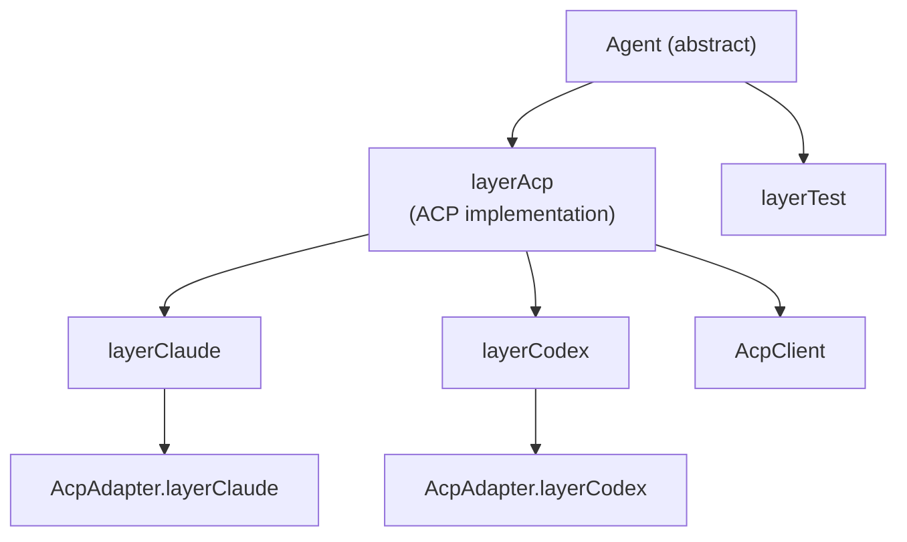
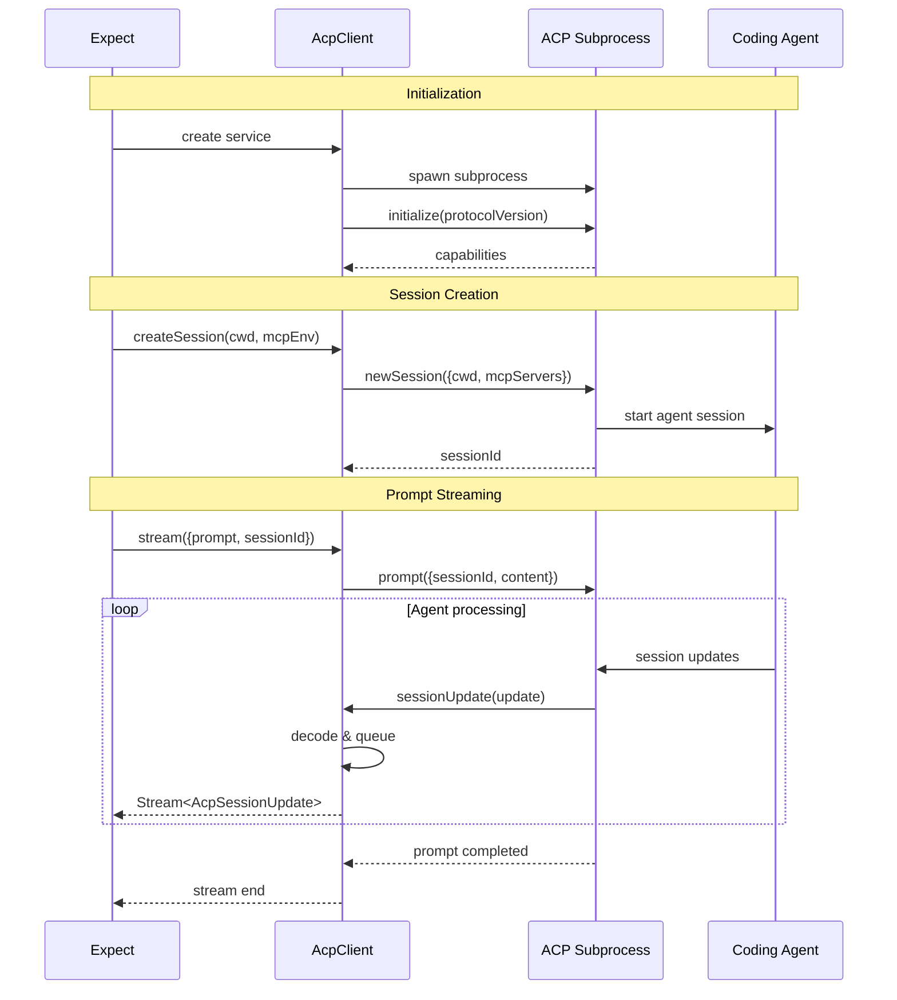
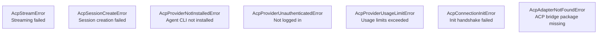

# Agent Protocol Deep Dive -- ACP, Sessions, and Streaming

## Overview

The `@expect/agent` package abstracts how Expect communicates with AI coding agents. Rather than calling LLM APIs directly, Expect uses the **Agent Client Protocol (ACP)** to spawn the actual coding agent (Claude Code or Codex CLI) as a subprocess. This gives the agent its full context, tools, and capabilities rather than a stripped-down API call.

## Package Structure

```
packages/agent/
  src/
    index.ts                # Public exports
    agent.ts                # Abstract Agent service
    acp-client.ts           # ACP protocol implementation
    detect-agents.ts        # CLI agent detection
    types.ts                # AgentStreamOptions
    schemas/
      ai-sdk.ts             # AI SDK schema definitions
      index.ts              # Schema exports
  tests/
    agent.test.ts           # Agent service tests
    detect-agents.test.ts   # Detection tests
    fixtures/
      claude-simple.jsonl       # Fixture: simple Claude session
      claude-with-tools.jsonl   # Fixture: Claude with tool calls
      codex-session.jsonl       # Fixture: Codex session
      codex-simple.jsonl        # Fixture: simple Codex session
      codex-with-tools.jsonl    # Fixture: Codex with tool calls
```

## The Agent Service

The `Agent` is an abstract service with two implementations:

```typescript
export class Agent extends ServiceMap.Service<
  Agent,
  {
    readonly stream: (options: AgentStreamOptions) => Stream.Stream<
      AcpSessionUpdate,
      AcpStreamError | AcpSessionCreateError | AcpProviderUnauthenticatedError | AcpProviderUsageLimitError
    >;
    readonly createSession: (cwd: string) => Effect.Effect<
      SessionId,
      AcpSessionCreateError | AcpProviderUnauthenticatedError | AcpProviderUsageLimitError
    >;
  }
>()("@expect/Agent") {
  static layerAcp = Layer.effect(Agent)(/* ... */);
  static layerCodex = Agent.layerAcp.pipe(Layer.provide(AcpAdapter.layerCodex));
  static layerClaude = Agent.layerAcp.pipe(Layer.provide(AcpAdapter.layerClaude));
  static layerFor = (backend: AgentBackend) =>
    backend === "claude" ? Agent.layerClaude : Agent.layerCodex;
  static layerTest = (fixturePath: string) => /* ... */;
}
```

The abstract interface has two methods:
- `stream(options)` -- Send a prompt and receive a stream of `AcpSessionUpdate` events
- `createSession(cwd)` -- Create a new agent session in a given directory

### Layer Hierarchy



### Test Layer

The test layer replays JSONL fixture files as if they were live agent streams:

```typescript
static layerTest = (fixturePath: string) =>
  Layer.effect(Agent, Effect.gen(function* () {
    const fs = yield* FileSystem.FileSystem;
    const decode = Schema.decodeSync(AcpSessionUpdate);
    return Agent.of({
      stream: () =>
        fs.stream(fixturePath).pipe(
          Stream.decodeText(),
          Stream.splitLines,
          Stream.map((line) => decode(JSON.parse(line))),
          Stream.orDie,
        ),
      createSession: () => Effect.die("not supported for test layer"),
    });
  }));
```

This enables deterministic testing of the entire execution pipeline without a real AI agent.

## The ACP Client

### Architecture



### Subprocess Management

The ACP client spawns the adapter as a child process:

```typescript
const childProcess = yield* ChildProcess.make(adapter.bin, adapter.args, {
  env: adapter.env,
  extendEnv: true,
}).pipe(spawner.spawn);
```

Communication happens via stdin/stdout using NDJSON (newline-delimited JSON). The `acp.ndJsonStream` utility wraps the raw byte streams:

```typescript
const readable = Stream.toReadableStream(childProcess.stdout);
const writable = new WritableStream<Uint8Array>({
  write: (chunk) => void Queue.offerUnsafe(writableQueue, chunk),
});
const ndJsonStream = acp.ndJsonStream(writable, readable);
const connection = new acp.ClientSideConnection((_agent) => client, ndJsonStream);
```

### Session Updates Queue

Each session has its own `Queue` for receiving updates:

```typescript
const sessionUpdatesMap = new Map<
  SessionId,
  Queue.Queue<AcpSessionUpdate, SessionQueueError>
>();
```

When the ACP adapter calls `sessionUpdate`, the update is decoded and pushed to the session's queue:

```typescript
const client: acp.Client = {
  requestPermission: (params) => Promise.resolve({
    outcome: { outcome: "selected", optionId: /* auto-approve */ },
  }),
  sessionUpdate: async ({ sessionId, update }) => {
    const updatesQueue = sessionUpdatesMap.get(SessionId.makeUnsafe(sessionId));
    const decoded = Schema.decodeUnknownSync(AcpSessionUpdate)(update);
    Queue.offerUnsafe(updatesQueue, decoded);
  },
};
```

Note the `requestPermission` handler auto-approves all permission requests (allowing tools to execute without user confirmation).

### MCP Server Configuration

When creating a session, the ACP client configures an MCP browser server:

```typescript
const browserMcpBinPath = fileURLToPath(new URL("./browser-mcp.js", import.meta.url));

const buildMcpServers = (env) => [{
  command: process.execPath,
  args: [browserMcpBinPath],
  env: [...env],
  name: "browser",
}];
```

The MCP server runs as a subprocess of the ACP adapter, which is itself a subprocess of Expect. The chain is:

```
expect (CLI) -> ACP adapter (subprocess) -> MCP browser server (sub-subprocess)
```

### Inactivity Watchdog

The stream includes a 3-minute inactivity timeout:

```typescript
const ACP_STREAM_INACTIVITY_TIMEOUT_MS = 3 * 60 * 1000;

const checkInactivity = Effect.gen(function* () {
  yield* Effect.sleep(Duration.millis(ACP_STREAM_INACTIVITY_TIMEOUT_MS));
  const lastActivity = yield* Ref.get(lastActivityAt);
  const elapsed = Date.now() - lastActivity;
  return elapsed >= ACP_STREAM_INACTIVITY_TIMEOUT_MS;
});
```

If the agent produces no output for 3 minutes, the stream is failed with an error. This prevents hanging sessions.

### FiberMap for Concurrent Streams

The ACP client uses `FiberMap` to manage concurrent stream fibers:

```typescript
const streamFiberMap = yield* FiberMap.make<SessionId>();

// When starting a stream:
yield* Effect.tryPromise({
  try: () => connection.prompt({ sessionId, prompt: [...] }),
  catch: (cause) => new AcpStreamError({ cause }),
}).pipe(
  FiberMap.run(streamFiberMap, sessionId, { startImmediately: true }),
);
```

Each session gets its own fiber. If a new prompt is sent to the same session, the previous fiber is automatically cancelled.

## The ACP Adapter

The `AcpAdapter` resolves the binary path for each agent provider:

### Claude Adapter

```typescript
static layerClaude = Layer.effect(AcpAdapter)(
  Effect.gen(function* () {
    const spawner = yield* ChildProcessSpawner.ChildProcessSpawner;

    // Assert authenticated
    yield* ChildProcess.make("claude", ["auth", "status"]).pipe(
      spawner.string,
      Effect.flatMap(Schema.decodeEffect(Schema.fromJsonString(AuthSchema))),
      Effect.flatMap(({ loggedIn }) =>
        loggedIn ? Effect.void
                 : new AcpProviderUnauthenticatedError({ provider: "claude" }).asEffect(),
      ),
      Effect.catchReason("PlatformError", "NotFound", () =>
        new AcpProviderNotInstalledError({ provider: "claude" }).asEffect(),
      ),
    );

    return yield* Effect.try({
      try: () => {
        const binPath = require.resolve("@zed-industries/claude-agent-acp/dist/index.js");
        return AcpAdapter.of({
          provider: "claude",
          bin: process.execPath,
          args: [binPath],
          env: {},
        });
      },
      catch: (cause) => new AcpAdapterNotFoundError({ packageName: "...", cause }),
    });
  }),
);
```

The Claude adapter:
1. Checks if `claude` CLI is installed (via `which`)
2. Verifies authentication via `claude auth status`
3. Resolves the ACP bridge package `@zed-industries/claude-agent-acp`
4. Returns the Node.js binary path + ACP bridge script

### Codex Adapter

```typescript
static layerCodex = Layer.effect(AcpAdapter)(
  Effect.try({
    try: () => {
      const binPath = require.resolve("@zed-industries/codex-acp/bin/codex-acp.js");
      return AcpAdapter.of({
        provider: "codex",
        bin: process.execPath,
        args: [binPath],
        env: {},
      });
    },
    catch: (cause) => new AcpAdapterNotFoundError({ packageName: "...", cause }),
  }),
);
```

The Codex adapter is simpler -- it doesn't check authentication and directly resolves the ACP bridge.

## ACP Session Update Types

The `AcpSessionUpdate` schema is a discriminated union of update types:

```mermaid
graph TB
    AcpSessionUpdate["AcpSessionUpdate (union)"]
    AcpSessionUpdate --> AgentMsg["AcpAgentMessageChunk\nsessionUpdate: agent_message_chunk"]
    AcpSessionUpdate --> AgentThought["AcpAgentThoughtChunk\nsessionUpdate: agent_thought_chunk"]
    AcpSessionUpdate --> UserMsg["AcpUserMessageChunk\nsessionUpdate: user_message_chunk"]
    AcpSessionUpdate --> ToolCall["AcpToolCall\nsessionUpdate: tool_call"]
    AcpSessionUpdate --> ToolUpdate["AcpToolCallUpdate\nsessionUpdate: tool_call_update"]
    AcpSessionUpdate --> Plan["AcpPlanUpdate\nsessionUpdate: plan"]
    AcpSessionUpdate --> Commands["AcpAvailableCommandsUpdate"]
    AcpSessionUpdate --> Mode["AcpCurrentModeUpdate"]
    AcpSessionUpdate --> Config["AcpConfigOptionUpdate"]
    AcpSessionUpdate --> Session["AcpSessionInfoUpdate"]
    AcpSessionUpdate --> Usage["AcpUsageUpdate"]
```



Each update type has a `sessionUpdate` discriminator field. The most important ones for Expect:

### AcpAgentMessageChunk

Agent text output. Contains a `content` block with text that may include step markers:

```typescript
{
  sessionUpdate: "agent_message_chunk",
  content: { type: "text", text: "STEP_START|step-01|Verify login page" },
  messageId: "msg_123"
}
```

### AcpToolCall

When the agent starts a tool call:

```typescript
{
  sessionUpdate: "tool_call",
  toolCallId: "tc_456",
  title: "browser__screenshot",
  kind: "execute",
  status: "pending",
  rawInput: { mode: "snapshot" }
}
```

### AcpToolCallUpdate

When a tool call completes:

```typescript
{
  sessionUpdate: "tool_call_update",
  toolCallId: "tc_456",
  title: "browser__screenshot",
  status: "completed",
  rawOutput: { tree: "...", refs: {...} }
}
```

### Content Blocks

Content can be text, images, resource links, or resources:

```typescript
const AcpContentBlock = Schema.Union([
  Schema.Struct({ type: Schema.Literal("text"), text: Schema.String }),
  Schema.Struct({ type: Schema.Literal("image"), data: Schema.String, mimeType: Schema.String }),
  Schema.Struct({ type: Schema.Literal("resource_link"), uri: Schema.String }),
  Schema.Struct({ type: Schema.Literal("resource"), uri: Schema.String }),
]);
```

### Tool Call Content (Structured)

Tool calls can include structured content showing what the tool did:

```typescript
const AcpToolCallContent = Schema.Union([
  Schema.Struct({ type: Schema.Literal("content"), content: AcpContentBlock }),
  Schema.Struct({
    type: Schema.Literal("diff"),
    path: Schema.String,
    oldText: Schema.optional(Schema.NullOr(Schema.String)),
    newText: Schema.optional(Schema.NullOr(Schema.String)),
  }),
  Schema.Struct({ type: Schema.Literal("terminal"), terminalId: Schema.String }),
]);
```

## Error Taxonomy

The agent package defines a precise error hierarchy:



Each error has a user-friendly `displayName` and detailed `message`:

```typescript
export class AcpProviderNotInstalledError extends Schema.ErrorClass<...>(...) {
  displayName = `${Str.capitalize(this.provider)} is not installed`;
  message = Match.value(this.provider).pipe(
    Match.when("claude", () =>
      "Claude Code is not installed. Install it from https://code.claude.com/..."),
    Match.when("codex", () =>
      "Codex CLI is not installed. Install it with `npm install -g @openai/codex`..."),
    Match.orElse(() => "Your coding agent CLI is not installed..."),
  );
}
```

## Agent Detection

The `detect-agents.ts` module checks which agent CLIs are available:

```typescript
const WHICH_COMMAND = process.platform === "win32" ? "where" : "which";

const isCommandAvailable = (command: string): boolean => {
  try {
    execSync(`${WHICH_COMMAND} ${command}`, { stdio: "pipe" });
    return true;
  } catch {
    return false;
  }
};

export const detectAvailableAgents = (): SupportedAgent[] =>
  SUPPORTED_AGENTS.filter(isCommandAvailable);
```

This is used by the CLI's init command to determine which agent to configure.

## AgentStreamOptions

The options passed to `agent.stream()`:

```typescript
export class AgentStreamOptions extends Schema.Class<AgentStreamOptions>("AgentStreamOptions")({
  cwd: Schema.String,
  sessionId: Schema.Option(Schema.String.pipe(Schema.brand("SessionId"))),
  prompt: Schema.String,
  systemPrompt: Schema.Option(Schema.String),
  mcpEnv: Schema.optional(Schema.Array(Schema.Struct({
    name: Schema.String,
    value: Schema.String,
  }))),
}) {}
```

- `cwd` -- Working directory for the agent session
- `sessionId` -- Optional: reuse an existing session
- `prompt` -- The full execution prompt
- `systemPrompt` -- Optional system prompt override
- `mcpEnv` -- Environment variables passed to MCP servers

## Summary

The agent protocol layer provides a clean abstraction over coding agent communication:

1. **Abstract Agent service** -- Hides provider differences behind a common `stream()` interface
2. **ACP protocol** -- Spawns the actual coding agent as a subprocess with full capabilities
3. **NDJSON streaming** -- Efficient, typed event stream from agent to Expect
4. **Session management** -- Per-session queues with inactivity watchdog
5. **MCP integration** -- Browser tools configured at session creation
6. **Precise errors** -- Each failure mode (not installed, not authenticated, usage limit) has a specific error type with user-friendly messaging
7. **Test infrastructure** -- JSONL fixture replay for deterministic testing
