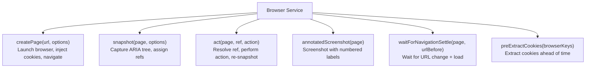
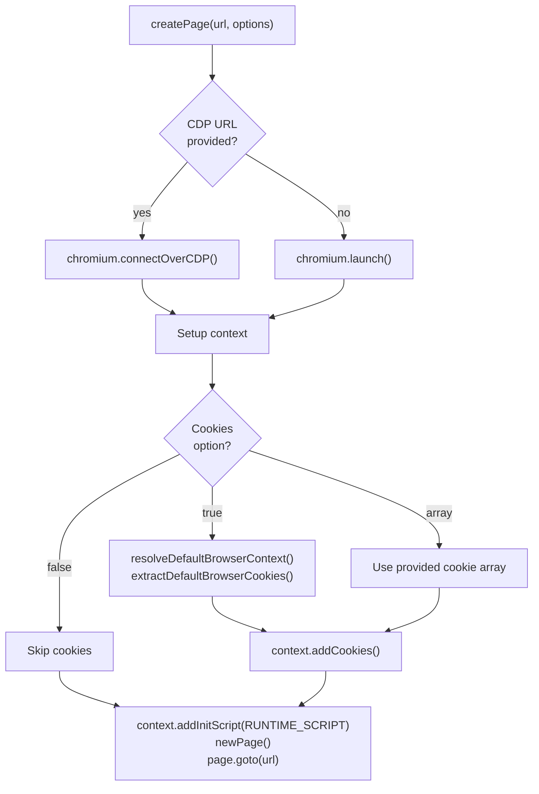
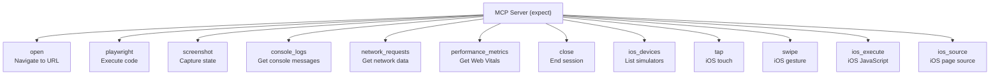
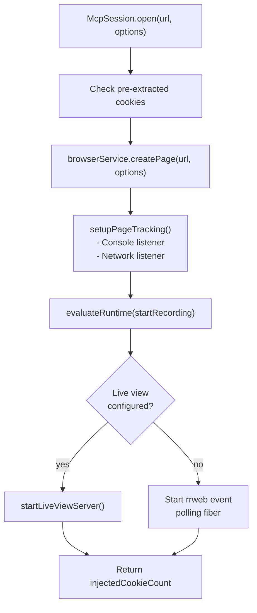
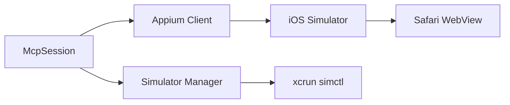

# Browser Automation Deep Dive -- Playwright, MCP, Snapshots, and Recording

## Overview

The `@expect/browser` package is the automation engine. It manages Playwright browser instances, exposes browser capabilities as MCP tools, captures ARIA snapshots for element interaction, records sessions with rrweb, and supports iOS Simulator testing via Appium. This package is where the AI agent's intentions become real browser actions.

## Package Structure

```
packages/browser/
  src/
    browser.ts                  # Core Browser service
    cdp-discovery.ts            # Auto-discover Chrome DevTools endpoints
    constants.ts                # Configuration constants
    diff.ts                     # Snapshot diffing
    errors.ts                   # Error definitions
    index.ts                    # Public exports
    recorder.ts                 # rrweb event collection
    replay-viewer.ts            # HTML replay viewer generation
    rrvideo.ts                  # Video rendering from recordings
    types.ts                    # Type definitions
    runtime/
      index.ts                  # Browser-injected runtime script
    ios/
      appium.ts                 # Appium integration for iOS
      constants.ts              # iOS constants
      errors.ts                 # iOS errors
      ios-simulator.ts          # Simulator management
      webdriver-client.ts       # WebDriver protocol client
    mcp/
      constants.ts              # MCP env variable names
      errors.ts                 # MCP errors
      index.ts                  # MCP public exports
      live-view-server.ts       # Live replay streaming server
      mcp-session.ts            # Session lifecycle management
      runtime.ts                # ManagedRuntime for MCP
      server.ts                 # MCP tool registration
      start.ts                  # Entry point for MCP subprocess
      viewer-events.ts          # Live viewer event types
    utils/
      action-error.ts           # Action error formatting
      compact-tree.ts           # ARIA tree compaction
      create-locator.ts         # Ref -> Playwright Locator resolution
      evaluate-runtime.ts       # Runtime script evaluation
      find-cursor-interactive.ts # Cursor-interactive element detection
      get-indent-level.ts       # ARIA tree indentation parsing
      parse-aria-line.ts        # ARIA line parsing
      resolve-locator.ts        # Locator resolution strategies
      resolve-nth-duplicates.ts # Duplicate ref handling
      snapshot-stats.ts         # Snapshot statistics computation
  scripts/
    build-runtime.js            # Bundles runtime script for injection
```

## The Browser Service

The `Browser` service wraps Playwright with Effect-TS and adds the snapshot-ref system.

### Core Methods



### Page Creation

`createPage` handles several scenarios:



Key features:
- **CDP connection** -- Connect to existing Chrome via DevTools WebSocket
- **Cookie injection** -- Extract from installed browsers and inject into Playwright context
- **Runtime injection** -- Add rrweb recording + performance metrics script
- **Video recording** -- Configure Playwright video capture
- **Locale handling** -- Read locale from Chrome profile

### The Snapshot System

The snapshot system is the core innovation that makes AI browser testing robust.

```mermaid
graph LR
    Page["Playwright Page"]
    ARIA["page.locator(selector)\n.ariaSnapshot()"]
    Parse["Parse ARIA lines\nExtract role + name"]
    Assign["Assign refs\nto interactive elements"]
    Filter["Filter by depth\nand interactivity"]
    Cursor["Find cursor-interactive\nelements"]
    Compact["Compact tree\n(optional)"]
    Result["SnapshotResult\n{tree, refs, stats, locator}"]

    Page --> ARIA --> Parse --> Assign --> Filter --> Cursor --> Compact --> Result
```



#### Ref Assignment

Not all elements get refs. The logic:

```typescript
const shouldAssignRef = (role: string, name: string, interactive?: boolean): boolean => {
  if (INTERACTIVE_ROLES.has(role)) return true;  // Always ref interactive elements
  if (interactive) return false;                  // In interactive-only mode, skip non-interactive
  return CONTENT_ROLES.has(role) && name.length > 0;  // Content elements need names
};
```

Interactive roles include: `button`, `link`, `textbox`, `checkbox`, `radio`, `combobox`, `slider`, `tab`, etc.

Content roles include: `heading`, `cell`, `listitem`, `img`, `alert`, etc.

#### Ref Format

Refs follow the pattern `e1`, `e2`, ..., `eN`:

```
- navigation
  - link "Home" [ref=e1]
  - link "About" [ref=e2]
- main
  - heading "Welcome"
  - textbox "Email" [ref=e3]
  - button "Submit" [ref=e4]
```

#### RefMap Structure

```typescript
interface RefMap {
  [ref: string]: {
    role: string;
    name: string;
    selector?: string;  // For cursor-interactive elements
  };
}
```

#### Locator Resolution

The `createLocator` function returns a function that resolves refs to Playwright Locators:

```typescript
const locator = createLocator(page, refs);
const element = yield* locator("e4");  // Returns Playwright Locator
await element.click();
```

Resolution uses Playwright's ARIA role/name matching:

```typescript
page.getByRole(entry.role, { name: entry.name, exact: true })
```

For elements with duplicate names, `resolveNthDuplicates` adds `:nth()` suffixes.

#### Cursor-Interactive Elements

Beyond ARIA roles, the snapshot system detects elements that are interactive via CSS cursor:

```typescript
const findCursorInteractive = async (page, selector) => {
  // Evaluates in-page JavaScript to find elements with cursor: pointer
  // that aren't already captured by ARIA roles
};
```

This catches custom interactive elements (divs with click handlers, canvas elements, etc.) that don't have semantic ARIA roles.

#### Snapshot Options

```typescript
interface SnapshotOptions {
  selector?: string;      // CSS selector scope (default: "body")
  timeout?: number;       // Timeout in ms
  maxDepth?: number;      // Maximum tree depth
  interactive?: boolean;  // Only show interactive elements
  cursor?: boolean;       // Include cursor-interactive elements
  compact?: boolean;      // Compress whitespace
}
```

### Annotated Screenshots

The `annotatedScreenshot` method produces a PNG with numbered labels overlaid on interactive elements:

```typescript
const annotatedScreenshot = Effect.fn("Browser.annotatedScreenshot")(function* (page, options) {
  const snapshotResult = yield* snapshot(page, options);
  const labelPositions = [];

  for (const [ref, entry] of Object.entries(snapshotResult.refs)) {
    const locator = yield* snapshotResult.locator(ref);
    const box = yield* Effect.tryPromise(() => locator.boundingBox());
    if (!box) continue;
    labelPositions.push({ label: ++counter, x: box.x, y: box.y });
  }

  yield* injectOverlayLabels(page, labelPositions);
  const screenshot = yield* Effect.tryPromise(() => page.screenshot({ fullPage }));
  yield* evaluateRuntime(page, "removeOverlay", OVERLAY_CONTAINER_ID);

  return { screenshot, annotations };
});
```

The overlay is injected as a DOM element, the screenshot is taken, then the overlay is removed.

## The MCP Server

### Tool Registration

The MCP server registers tools that the AI agent can call:



### The `playwright` Tool

The most powerful tool -- executes arbitrary Playwright code with access to the current session:

```typescript
server.registerTool("playwright", {
  inputSchema: {
    code: z.string().describe("Playwright code to execute"),
  },
}, ({ code }) => runMcp(Effect.gen(function* () {
  const session = yield* McpSession;
  const sessionData = yield* session.requireSession();

  const ref = (refId: string) => {
    if (!sessionData.lastSnapshot)
      throw new Error("No snapshot taken yet. Call screenshot with mode 'snapshot' first.");
    return Effect.runSync(sessionData.lastSnapshot.locator(refId));
  };

  const userFunction = new AsyncFunction("page", "context", "browser", "ref", code);
  const result = await userFunction(sessionData.page, sessionData.context, sessionData.browser, ref);
  return jsonResult(result);
})));
```

The agent receives four globals:
- `page` -- Current Playwright `Page`
- `context` -- Current `BrowserContext`
- `browser` -- Playwright `Browser` instance
- `ref` -- Function that resolves snapshot ref IDs to Locators

### The `screenshot` Tool

Three modes:

| Mode | Returns | Use Case |
|---|---|---|
| `screenshot` | PNG image (base64) | Visual inspection |
| `snapshot` | ARIA tree + refs + stats | Element interaction |
| `annotated` | PNG with labels + annotation list | Understanding page layout |

### Tool Annotations

Tools are annotated for parallel execution:

```typescript
server.registerTool("screenshot", {
  annotations: { readOnlyHint: true },
  // ...
});

server.registerTool("close", {
  annotations: { destructiveHint: true },
  // ...
});
```

Read-only tools can be executed in parallel by the Claude Agent SDK.

## The MCP Session

The `McpSession` service manages the full lifecycle of a browser testing session.

### State Management

```typescript
const sessionRef = yield* Ref.make<BrowserSessionData | undefined>(undefined);
const iosSessionRef = yield* Ref.make<IosSessionData | undefined>(undefined);
const liveViewRef = yield* Ref.make<LiveViewHandle | undefined>(undefined);
const pollingFiberRef = yield* Ref.make<Fiber.Fiber<unknown> | undefined>(undefined);
const preExtractedCookiesRef = yield* Ref.make<Cookie[] | undefined>(undefined);
```

All state is held in `Ref` (Effect's mutable reference type), allowing concurrent access from different tool calls.

### Cookie Pre-Extraction

Cookies are extracted eagerly when the session starts:

```typescript
if (!cookiesDisabled) {
  yield* browserService.preExtractCookies(cookieBrowserKeys).pipe(
    Effect.tap((cookies) => Ref.set(preExtractedCookiesRef, cookies)),
    Effect.catchCause((cause) => Effect.logWarning("Cookie pre-extraction failed", { cause })),
    Effect.forkDetach,
  );
}
```

This runs in a detached fiber so it doesn't block session creation. When `open` is called, pre-extracted cookies are used immediately if available.

### Session Open Flow



### Page Tracking

Console and network events are captured per-page:

```typescript
const setupPageTracking = (page: Page, sessionData: BrowserSessionData) => {
  page.on("console", (message) => {
    sessionData.consoleMessages.push({
      type: message.type(),
      text: message.text(),
      timestamp: Date.now(),
    });
  });
  page.on("request", (request) => {
    sessionData.networkRequests.push({
      url: request.url(),
      method: request.method(),
      status: undefined,
      resourceType: request.resourceType(),
      timestamp: Date.now(),
    });
  });
  page.on("response", (response) => {
    const entry = sessionData.networkRequests.find(
      (e) => e.url === response.url() && e.status === undefined,
    );
    if (entry) entry.status = response.status();
  });
};
```

### Session Close and Artifact Persistence

Closing a session triggers a comprehensive cleanup:

1. Collect final rrweb events from the page
2. Write NDJSON replay file
3. Generate HTML replay report
4. Write NDJSON.js wrapper for inline embedding
5. Copy artifacts to `/tmp/expect-replays/` for CI access
6. Write steps.json with test execution state
7. Close the browser
8. Retrieve Playwright video path
9. Copy video to `/tmp`

All steps have error handling that logs failures but doesn't crash.

## The Runtime Script

A JavaScript runtime is injected into every page via `context.addInitScript()`:

```typescript
yield* Effect.tryPromise({
  try: () => context.addInitScript(RUNTIME_SCRIPT),
  catch: toBrowserLaunchError,
});
```

The runtime provides:

- **rrweb recording** -- Starts and manages DOM mutation recording
- **Event collection** -- `getEvents()` returns accumulated events since last call
- **Performance metrics** -- Collects Core Web Vitals (FCP, LCP, CLS, INP)
- **Overlay injection** -- Renders numbered labels on elements for annotated screenshots
- **Overlay removal** -- Cleans up after screenshot

The runtime is built from `src/runtime/index.ts` by `scripts/build-runtime.js` into a single script string stored in `src/generated/runtime-script.ts`.

## Live View Server

The live view feature streams test execution to the Expect website for real-time viewing:

```typescript
const startLiveViewServer = Effect.fn("startLiveViewServer")(function* (options) {
  // Creates a Hono HTTP server
  // Proxies rrweb events to the Expect website
  // Provides WebSocket endpoint for live event streaming
});
```

The live view URL is configured via `EXPECT_LIVE_VIEW_URL_ENV_NAME`. When active, rrweb events are pushed to the server in real-time instead of being polled periodically.

## iOS Simulator Support

Expect supports testing on iOS Simulators via Appium:



iOS-specific MCP tools:
- `ios_devices` -- List available simulators
- `tap(x, y)` -- Touch tap at coordinates
- `swipe(startX, startY, endX, endY)` -- Swipe gesture
- `ios_execute(script)` -- Run JavaScript in Safari
- `ios_source` -- Get page HTML source

## Error Definitions

```typescript
export class BrowserLaunchError extends Schema.ErrorClass<...>(...) { ... }
export class CdpConnectionError extends Schema.ErrorClass<...>(...) { ... }
export class NavigationError extends Schema.ErrorClass<...>(...) { ... }
export class SnapshotTimeoutError extends Schema.ErrorClass<...>(...) { ... }
export class RecorderInjectionError extends Schema.ErrorClass<...>(...) { ... }
export class SessionLoadError extends Schema.ErrorClass<...>(...) { ... }
export class McpSessionNotOpenError extends Schema.ErrorClass<...>(...) { ... }
```

## CDP Auto-Discovery

The `cdp-discovery.ts` module can auto-discover running Chrome DevTools endpoints:

```typescript
export const autoDiscoverCdp = Effect.fn("autoDiscoverCdp")(function* () {
  // Queries common CDP ports (9222, etc.)
  // Returns WebSocket endpoint URL
});
```

This enables the `cdp: "auto"` option in the `open` tool.

## Snapshot Statistics

Each snapshot includes computed statistics:

```typescript
interface SnapshotStats {
  totalElements: number;
  interactiveElements: number;
  contentElements: number;
  maxDepth: number;
}
```

These help the agent understand page complexity without needing a visual screenshot.

## Summary

The browser automation package is the most complex component in Expect. It bridges the gap between an AI agent's high-level intentions ("click the submit button") and real browser actions. The snapshot-ref system provides a semantic, robust interface for element interaction. The MCP server exposes these capabilities as standard tools. Session recording captures everything for debugging and replay. And the iOS support extends testing beyond desktop browsers.
