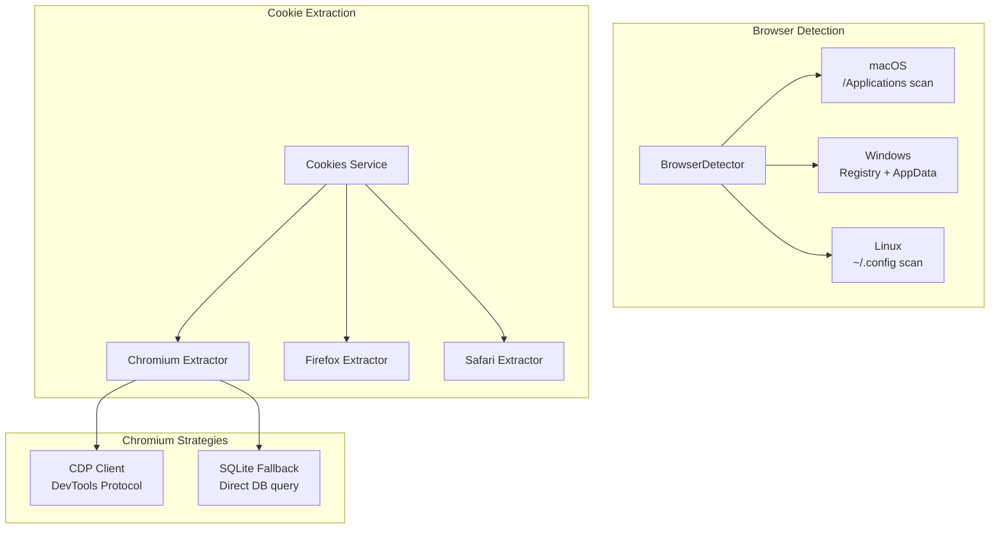
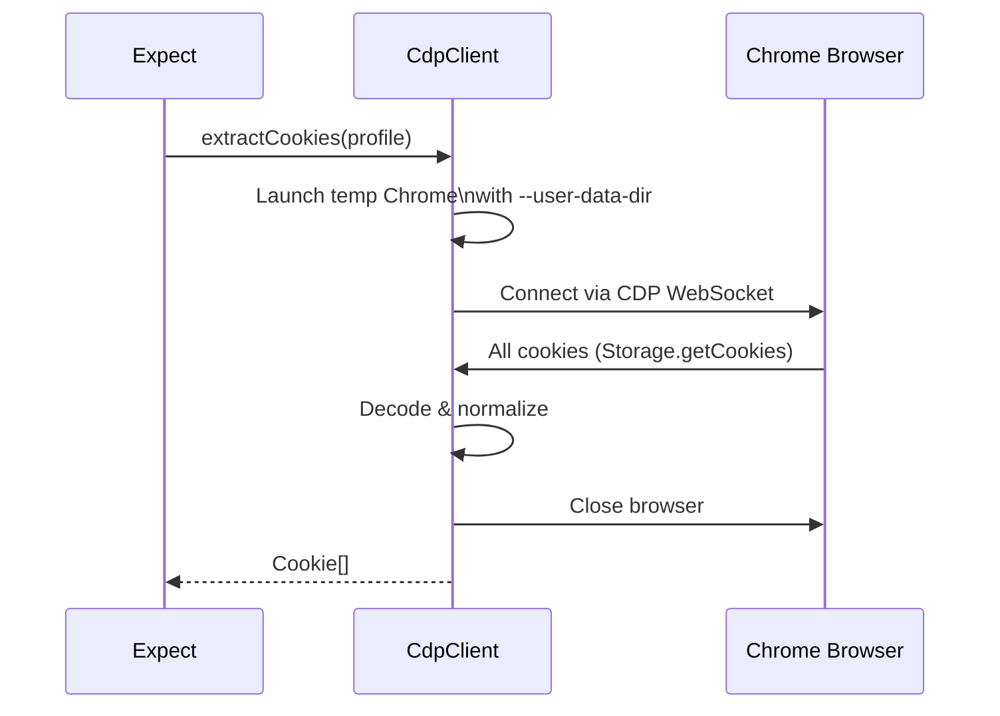
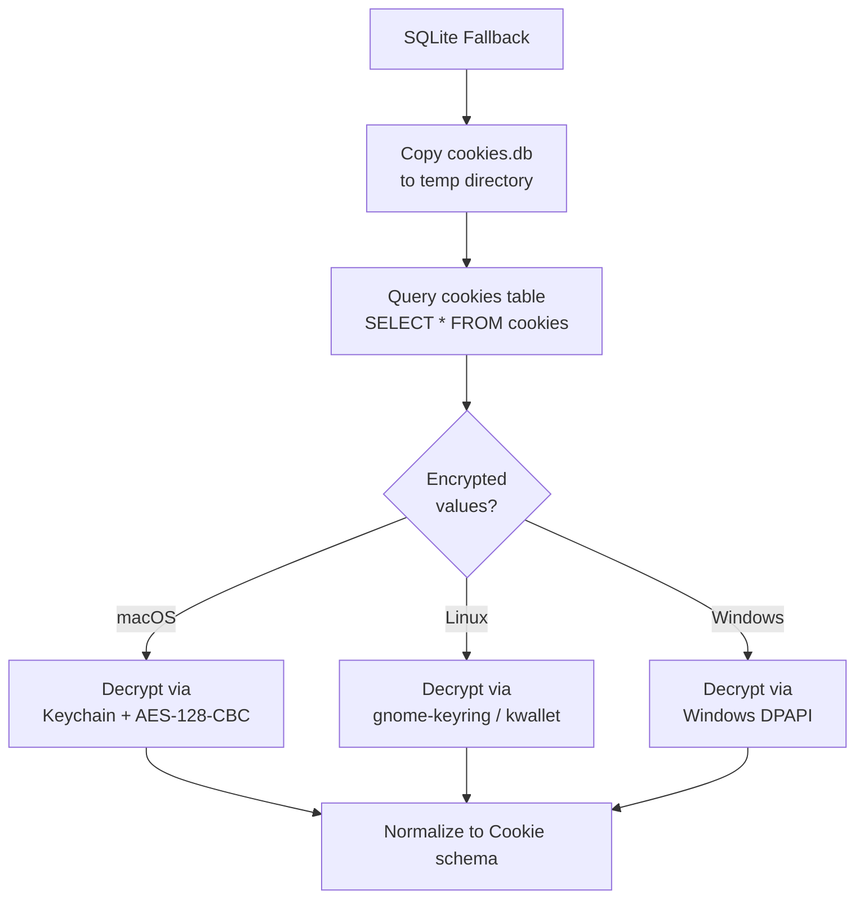
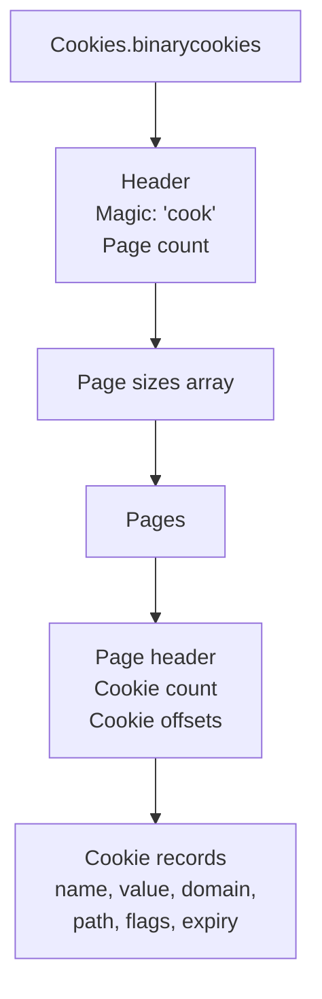
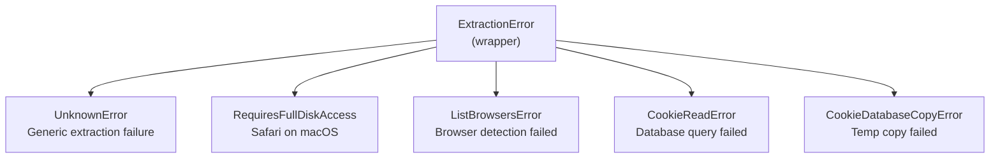

# Cookie Extraction Deep Dive -- Cross-Browser Authentication

## Overview

The `@expect/cookies` package extracts cookies from the user's installed browsers so that AI-driven browser tests can run with real authentication state. This is one of Expect's differentiating features -- without it, the agent can only test public pages. With it, authenticated flows (dashboards, user settings, admin panels) become testable.

## Package Structure

```
packages/cookies/
  src/
    index.ts                    # Public exports
    cookies.ts                  # Main Cookies service
    types.ts                    # Browser, Cookie, SameSitePolicy schemas
    errors.ts                   # Error definitions
    browser-config.ts           # Browser profile configuration
    browser-detector.ts         # Platform-specific browser detection
    cdp-client.ts               # Chrome DevTools Protocol client
    chromium-sqlite.ts          # SQLite fallback for Chromium
    chromium.ts                 # Chromium extraction logic
    firefox.ts                  # Firefox extraction logic
    safari.ts                   # Safari extraction logic
    sqlite-client.ts            # SQLite query abstraction
    layers.ts                   # Layer composition
    utils/
      binary-cookies.ts         # Apple binary cookie parser
      chromium-normalize.ts     # Chromium cookie normalization
      crypto.ts                 # Chromium cookie decryption
```

## Architecture



## The Cookie Type System

### Browser Variants

```typescript
export const Browser = Schema.TaggedUnion({
  ChromiumBrowser: {
    key: Schema.String,           // "chrome", "edge", "brave", "arc"
    profilePath: Schema.String,   // Path to profile directory
    executablePath: Schema.String, // Path to browser executable
    locale: Schema.optional(Schema.String),
  },
  FirefoxBrowser: {
    profilePath: Schema.String,   // Path to profile directory
  },
  SafariBrowser: {
    cookieFilePath: Schema.Option(Schema.String), // Path to Cookies.binarycookies
  },
});
```

### Cookie Schema

```typescript
export class Cookie extends Schema.Class<Cookie>("@cookies/Cookie")({
  name: Schema.String,
  value: Schema.String,
  domain: Schema.String,
  path: Schema.String,
  expires: Schema.optional(Schema.Number),   // Unix timestamp
  secure: Schema.Boolean,
  httpOnly: Schema.Boolean,
  sameSite: Schema.optional(SameSitePolicy), // "None" | "Lax" | "Strict"
}) {
  get playwrightFormat() {
    // Converts to Playwright's cookie format
    return {
      name: this.name,
      value: this.value,
      domain: this.domain,
      path: this.path,
      expires: this.expires ?? -1,
      secure: this.secure,
      httpOnly: this.httpOnly,
      sameSite: this.sameSite ?? "None",
    };
  }
}
```

The `playwrightFormat` getter enables direct injection via `context.addCookies()`.

## The Cookies Service

The main service dispatches to browser-specific extractors:

```typescript
export class Cookies extends ServiceMap.Service<Cookies>()("@cookies/Cookies", {
  make: Effect.gen(function* () {
    const cdpClient = yield* CdpClient;
    const sqliteClient = yield* SqliteClient;
    const sqliteFallback = yield* ChromiumSqliteFallback;
    const fs = yield* FileSystem.FileSystem;

    const extract = (browser: Browser) =>
      Match.valueTags(browser, {
        ChromiumBrowser: extractChromium,
        FirefoxBrowser: extractFirefox,
        SafariBrowser: extractSafari,
      });

    return { extract } as const;
  }),
});
```

`Match.valueTags` provides exhaustive pattern matching on the tagged union -- the TypeScript compiler ensures every variant is handled.

## Chromium Cookie Extraction

Chromium browsers (Chrome, Edge, Brave, Arc) use a two-strategy approach:

### Strategy 1: CDP (Chrome DevTools Protocol)

The primary strategy connects to a running Chrome instance via CDP:



The CDP approach:
1. Launches a headless Chrome with the user's profile directory
2. Connects via CDP WebSocket (port 9222 or similar)
3. Calls `Storage.getCookies` to get all cookies
4. Normalizes the raw CDP cookie format to the `Cookie` schema
5. Closes the temporary browser

Advantages: Gets all cookies including encrypted ones (Chrome handles decryption).
Disadvantages: Requires the browser executable, temporarily locks the profile.

### Strategy 2: SQLite Fallback

When CDP fails (browser not running, port conflicts, etc.), the SQLite fallback directly queries the cookie database:



The SQLite fallback:
1. Copies the cookie database to a temp directory (avoids locking the live database)
2. Queries the `cookies` table
3. Handles encrypted cookie values (Chromium encrypts cookie values at rest)
4. Normalizes to the `Cookie` schema

Cookie encryption varies by platform:
- **macOS** -- AES-128-CBC with key from Keychain (`Chrome Safe Storage`)
- **Linux** -- AES-128-CBC with key from gnome-keyring or kwallet
- **Windows** -- DPAPI (Data Protection API)

### Fallback Chain

```typescript
const extractChromium = (browser) =>
  cdpClient.extractCookies({
    key: browser.key,
    profilePath: browser.profilePath,
    executablePath: browser.executablePath,
  }).pipe(
    // Catch all CDP failures
    Effect.catchTags({
      TimeoutError: (cause) => new ExtractionError({...}).asEffect(),
      SchemaError: (cause) => new ExtractionError({...}).asEffect(),
      SocketError: (cause) => new ExtractionError({...}).asEffect(),
      HttpClientError: (cause) => new ExtractionError({...}).asEffect(),
      PlatformError: (cause) => new ExtractionError({...}).asEffect(),
    }),
    // Try SQLite fallback on ExtractionError
    Effect.catchTag("ExtractionError", (cdpError) =>
      Effect.gen(function* () {
        yield* Effect.logWarning("CDP extraction failed, trying SQLite fallback", {
          browser: browser.key,
          error: cdpError.message,
        });
        return yield* sqliteFallback.extract(browser);
      }).pipe(
        // If fallback also fails, propagate the original CDP error
        Effect.catchTag("ExtractionError", () => cdpError.asEffect()),
      ),
    ),
  );
```

This cascade ensures the best possible extraction while gracefully falling back.

## Firefox Cookie Extraction

Firefox stores cookies in an SQLite database at `{profilePath}/cookies.sqlite`:

```typescript
const extractFirefox = (browser) =>
  Effect.gen(function* () {
    const cookieDbPath = path.join(browser.profilePath, "cookies.sqlite");

    // Copy to temp to avoid locking the live database
    const { tempDatabasePath } = yield* sqliteClient.copyToTemp(
      cookieDbPath,
      "cookies-firefox-",
      "cookies.sqlite",
      "firefox",
    );

    const rows = yield* sqliteClient.query(
      tempDatabasePath,
      `SELECT name, value, host, path, expiry, isSecure, isHttpOnly, sameSite
       FROM moz_cookies ORDER BY expiry DESC`,
      "firefox",
    );

    return yield* Effect.forEach(rows, (row) =>
      Schema.decodeUnknownEffect(FirefoxCookieRow)(row).pipe(
        Effect.map(firefoxRowToCookie),
      ),
    );
  }).pipe(Effect.scoped);
```

The Firefox extraction:
1. Locates `cookies.sqlite` in the profile directory
2. Copies it to a temp directory (Firefox may have the file locked)
3. Queries `moz_cookies` table
4. Decodes each row through the `FirefoxCookieRow` schema
5. Converts to the common `Cookie` type

### Firefox Schema Transforms

Firefox stores data in formats that need conversion:

```typescript
const FirefoxExpiry = Schema.Union([Schema.Number, Schema.BigInt, Schema.String]).pipe(
  Schema.decodeTo(Schema.optional(Schema.Number), {
    decode: SchemaGetter.transform((value) => {
      const milliseconds = Number(value);
      if (Number.isNaN(milliseconds) || milliseconds <= 0) return undefined;
      return Math.floor(milliseconds / MS_PER_SECOND);
    }),
    encode: SchemaGetter.transform((value) => (value ?? 0) * MS_PER_SECOND),
  }),
);

const FirefoxSameSite = Schema.Union([Schema.Number, Schema.BigInt, Schema.String]).pipe(
  Schema.decodeTo(Schema.optional(SameSitePolicy), {
    decode: SchemaGetter.transform((value) => {
      const numeric = Number(value);
      if (numeric === SAME_SITE_STRICT) return "Strict";
      if (numeric === SAME_SITE_LAX) return "Lax";
      if (numeric === SAME_SITE_NONE) return "None";
      return undefined;
    }),
  }),
);
```

These use Effect Schema's `decodeTo` transformer to handle Firefox's numeric representations of boolean flags and sameSite policies.

## Safari Cookie Extraction

Safari uses Apple's proprietary binary cookie format (`Cookies.binarycookies`):

```typescript
const extractSafari = (browser) =>
  Effect.gen(function* () {
    if (Option.isNone(browser.cookieFilePath)) {
      return yield* new ExtractionError({
        reason: new RequiresFullDiskAccess(),
      }).asEffect();
    }

    const data = yield* fs.readFile(browser.cookieFilePath.value);
    return parseBinaryCookies(Buffer.from(data)).filter(
      (cookie) => Boolean(cookie.name) && Boolean(cookie.domain),
    );
  });
```

The binary cookie format is parsed by `parseBinaryCookies()` in `utils/binary-cookies.ts`. This is a custom parser for Apple's undocumented format:



Safari cookie extraction requires **Full Disk Access** on macOS because the cookie file is in a protected directory. If the permission isn't granted, a `RequiresFullDiskAccess` error is raised.

## Browser Detection

The `BrowserDetector` identifies installed browsers and their profile paths:

### macOS Detection

```
Chrome:      ~/Library/Application Support/Google/Chrome/
Edge:        ~/Library/Application Support/Microsoft Edge/
Brave:       ~/Library/Application Support/BraveSoftware/Brave-Browser/
Arc:         ~/Library/Application Support/Arc/User Data/
Firefox:     ~/Library/Application Support/Firefox/Profiles/
Safari:      ~/Library/Cookies/Cookies.binarycookies
```

### Windows Detection

```
Chrome:      %LOCALAPPDATA%\Google\Chrome\User Data\
Edge:        %LOCALAPPDATA%\Microsoft\Edge\User Data\
Brave:       %LOCALAPPDATA%\BraveSoftware\Brave-Browser\User Data\
Firefox:     %APPDATA%\Mozilla\Firefox\Profiles\
```

### Linux Detection

```
Chrome:      ~/.config/google-chrome/
Chromium:    ~/.config/chromium/
Brave:       ~/.config/BraveSoftware/Brave-Browser/
Firefox:     ~/.mozilla/firefox/
```

### Profile Detection

Chromium browsers can have multiple profiles. The detector reads `Local State` JSON to discover all profiles and their names.

## Error Hierarchy



## SQLite Client

The `SqliteClient` service provides an abstraction over SQLite database access:

```typescript
export class SqliteClient extends ServiceMap.Service<SqliteClient>()("@cookies/SqliteClient", {
  make: Effect.gen(function* () {
    const copyToTemp = Effect.fn("SqliteClient.copyToTemp")(function* (
      sourcePath, prefix, filename, browser
    ) {
      // Copy database + WAL/SHM files to temp directory
      // Returns temp path
    });

    const query = Effect.fn("SqliteClient.query")(function* (
      databasePath, sql, browser
    ) {
      // Execute SQL query and return rows
    });

    return { copyToTemp, query } as const;
  }),
});
```

Database copies include WAL (Write-Ahead Logging) and SHM (Shared Memory) files to ensure consistent reads:

```
cookies.sqlite
cookies.sqlite-wal
cookies.sqlite-shm
```

## Cookie Deduplication

When extracting from multiple profiles, cookies may overlap. The `Browser` service in `packages/browser` handles deduplication:

```typescript
const dedupCookies = (cookies: Cookie[]) =>
  Arr.dedupeWith(
    cookies,
    (cookieA, cookieB) =>
      cookieA.name === cookieB.name &&
      cookieA.domain === cookieB.domain &&
      cookieA.path === cookieB.path,
  );
```

The preferred profile's cookies come first, so they win in deduplication.

## Layer Composition

```typescript
export class Cookies extends ServiceMap.Service<Cookies>()("@cookies/Cookies", {
  // ...
}) {
  static layer = Layer.effect(this, this.make).pipe(
    Layer.provide(CdpClient.layer),
    Layer.provide(SqliteClient.layer),
    Layer.provide(ChromiumSqliteFallback.layer),
    Layer.provide(NodeServices.layer),
  );

  static layerTest = Layer.effect(this, this.make).pipe(
    Layer.provide(CdpClient.layerTest),  // Test CDP client
    Layer.provide(SqliteClient.layer),
    Layer.provide(ChromiumSqliteFallback.layer),
    Layer.provide(NodeServices.layer),
  );
}
```

The `layerTest` provides a mock CDP client for testing without a real browser.

## Platform-Specific Considerations

### macOS

- Safari requires Full Disk Access (TCC permission)
- Chromium cookies are encrypted with Keychain-stored keys
- Arc browser uses a non-standard profile path structure

### Windows

- Chromium cookies are encrypted with Windows DPAPI
- Browser paths use `%LOCALAPPDATA%` and `%APPDATA%` environment variables
- No Safari support

### Linux

- Chromium cookies may be encrypted with gnome-keyring or kwallet
- Some distributions store browsers in non-standard locations
- No Safari support

## Summary

Cookie extraction is deceptively complex. What seems like "just reading a database" involves:

1. **Platform-specific browser detection** across macOS, Windows, and Linux
2. **Multiple extraction strategies** (CDP primary, SQLite fallback)
3. **Encrypted cookie values** requiring platform-specific decryption
4. **Binary format parsing** for Safari's proprietary cookie file
5. **Database locking** -- copying databases to temp directories to avoid conflicts
6. **Profile management** -- handling multiple browser profiles and default selection
7. **Permission handling** -- Full Disk Access for Safari on macOS

The Effect-TS service architecture keeps this complexity manageable through composable layers, precise error types, and clean service boundaries.
