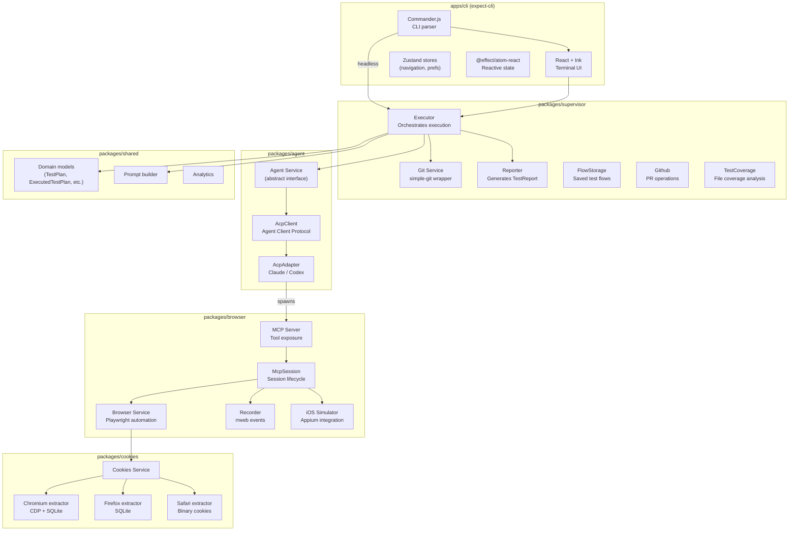
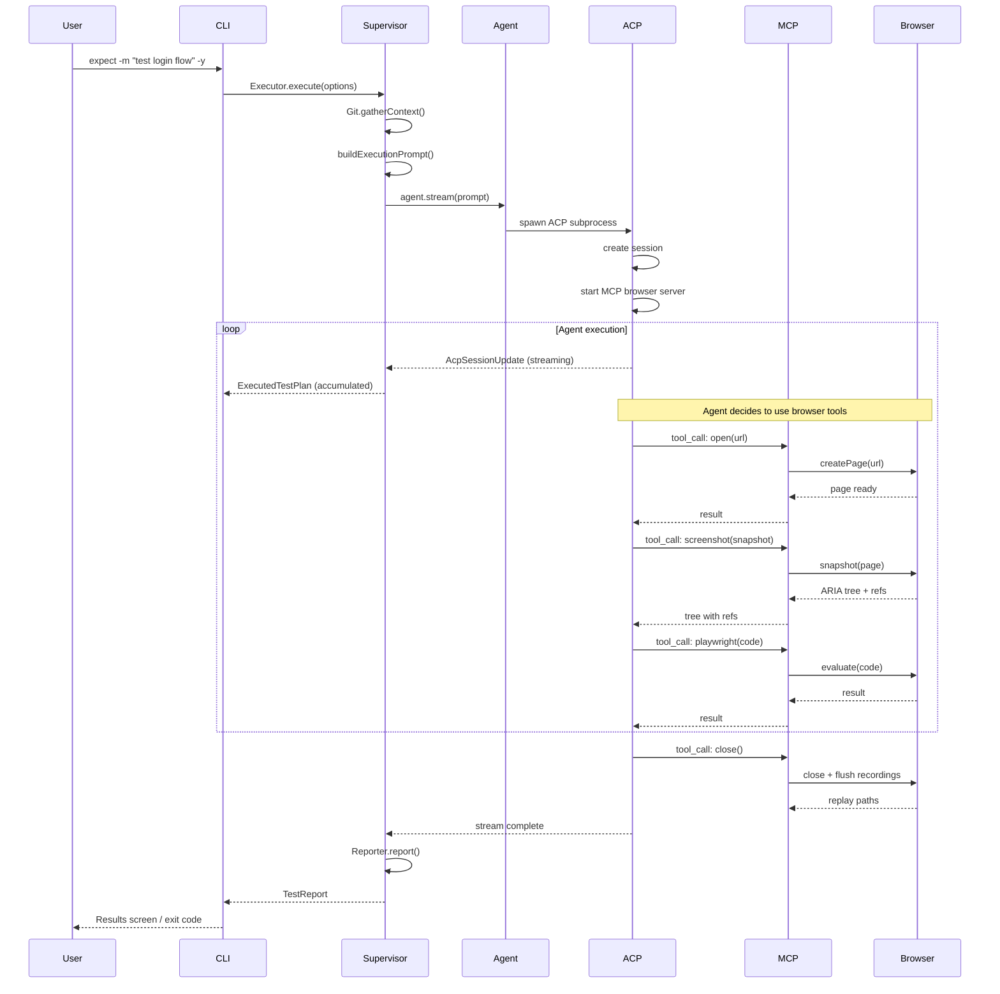

# Expect -- AI-Powered Browser Testing for Code Changes

## Overview

Expect is a CLI tool by Million Software that lets coding agents (Claude Code, Codex CLI, Cursor) automatically test code changes in a real browser. The developer runs `expect` in their terminal, the tool analyzes git changes (unstaged, branch diff, or specific commits), an AI agent generates and executes a test plan against a live Playwright browser instance, and results are displayed with pass/fail status and rrweb session recordings.

**Homepage:** https://expect.dev
**License:** FSL-1.1-MIT (Functional Source License, converting to MIT)
**Version:** 0.0.15

### Core Value Proposition

Traditional browser testing requires writing and maintaining test scripts. Expect inverts this: the developer describes what changed, the AI agent derives what to test, then executes those tests in a real browser. This is particularly valuable for developers already using AI coding agents -- Expect extends the agent's reach from code generation into verification.

## Architecture



## Monorepo Structure

```
expect/
  apps/
    cli/                    # expect-cli -- the main CLI entry point
      src/
        index.tsx           # Commander.js program definition
        components/         # React/Ink terminal UI components
          app.tsx            # Root component with screen router
          screens/           # Full-screen TUI views
          ui/                # Reusable UI primitives
        commands/            # CLI subcommands (init, add, audit)
        data/                # Effect Atoms and runtime state
        hooks/               # React hooks for git, ports, browsers
        stores/              # Zustand stores (navigation, preferences)
        utils/               # Utility functions
    website/                # Next.js marketing site (expect.dev)
  packages/
    agent/                  # @expect/agent -- LLM backend abstraction
    browser/                # @expect/browser -- Playwright + MCP server
    cookies/                # @expect/cookies -- Browser cookie extraction
    shared/                 # @expect/shared -- Domain models, prompts
    supervisor/             # @expect/supervisor -- Orchestration layer
    video/                  # Remotion-based video rendering
    expect-skill/           # Agent skill package for coding agents
  playground/
    minecraft-ui/           # Demo Next.js app for testing
```

## Component Breakdown

### 1. CLI Application (`apps/cli`)

The CLI is the user-facing entry point. It uses **Commander.js** for argument parsing and **React + Ink** for the terminal UI. Key modes:

- **Interactive TUI mode** -- Full-screen terminal app with screens for main menu, PR selection, port picking, test execution, and results display
- **Headless mode** -- Triggered by `--ci` flag, running in an agent, or non-interactive terminal. Outputs structured text instead of TUI
- **Subcommands** -- `expect init`, `expect add github-action`, `expect add skill`, `expect audit`

State management is split between:
- **Zustand** for navigation/preferences (imperative, synchronous)
- **@effect/atom-react** for Effect-TS integration (reactive, effectful)

### 2. Supervisor (`packages/supervisor`)

The orchestration brain. Key services:

- **Executor** -- Gathers git context (changed files, diff, commits), builds the execution prompt, streams agent responses, and accumulates them into an `ExecutedTestPlan`
- **Git** -- Wraps `simple-git` as an Effect service with `GitRepoRoot` context. Handles branch detection, diff generation, file stats, fingerprinting
- **Reporter** -- Converts an `ExecutedTestPlan` into a `TestReport` with summary and screenshot paths
- **FlowStorage** -- Persists and retrieves saved test flows (reusable test sequences)
- **Github** -- GitHub API operations for PR comments with test results
- **TestCoverage** -- Analyzes which changed files have corresponding test files

See [01-supervisor-deep-dive.md](./01-supervisor-deep-dive.md) for details.

### 3. Agent (`packages/agent`)

Abstracts the AI coding agent backend through the **Agent Client Protocol (ACP)**.

- **Agent** -- Abstract service interface with `stream()` and `createSession()`. Has `layerClaude` and `layerCodex` implementations
- **AcpClient** -- Manages the ACP subprocess lifecycle, session creation, and streaming. Uses `FiberMap` for concurrent session streams with inactivity watchdog
- **AcpAdapter** -- Resolves the ACP binary for each provider (Claude Code, Codex CLI). Validates authentication before starting

The ACP protocol uses NDJSON over stdin/stdout to communicate with the agent subprocess. Sessions are identified by branded `SessionId` strings.

See [02-agent-protocol-deep-dive.md](./02-agent-protocol-deep-dive.md) for details.

### 4. Browser (`packages/browser`)

Playwright-based browser automation exposed as an MCP server.

- **Browser** -- Core service providing `createPage()`, `snapshot()`, `act()`, `annotatedScreenshot()`. The snapshot system parses ARIA accessibility trees, assigns element refs, and supports cursor-interactive element discovery
- **McpSession** -- Manages browser session lifecycle, rrweb recording, console/network capture, live view server, and artifact persistence
- **MCP Server** -- Registers tools (`open`, `playwright`, `screenshot`, `console_logs`, `network_requests`, `performance_metrics`, `close`, and iOS tools) for the agent to call
- **Recorder** -- Collects rrweb events from the page for session replay
- **iOS Support** -- Appium-based iOS Simulator testing via `tap`, `swipe`, `ios_execute` tools

See [03-browser-automation-deep-dive.md](./03-browser-automation-deep-dive.md) for details.

### 5. Cookies (`packages/cookies`)

Extracts cookies from installed browsers so tests run with real authentication state.

- **Chromium** -- CDP-based extraction with SQLite fallback for offline profiles
- **Firefox** -- Direct SQLite query against `cookies.sqlite`
- **Safari** -- Binary cookie file parser (`Cookies.binarycookies`)
- **Browser detection** -- Platform-specific browser profile discovery

See [04-cookie-extraction-deep-dive.md](./04-cookie-extraction-deep-dive.md) for details.

### 6. Shared (`packages/shared`)

Domain models and cross-cutting concerns:

- **Models** -- Rich Effect Schema classes: `TestPlan`, `TestPlanStep`, `ExecutedTestPlan`, `TestReport`, `GitState`, `ChangesFor`, execution events (`StepStarted`, `StepCompleted`, `StepFailed`, etc.)
- **Prompts** -- The `buildExecutionPrompt()` function that constructs the comprehensive prompt sent to the AI agent, including MCP tool instructions, assertion depth guidelines, scope strategies, and stability heuristics
- **Analytics** -- Event tracking
- **Observability** -- Agent logger, error handler, tracing

## Data Flow



## Execution Event Protocol

The agent communicates test progress through structured marker lines embedded in its text output:

```
STEP_START|step-01|Verify login page loads
STEP_DONE|step-01|Login page renders with email and password fields
ASSERTION_FAILED|step-02|Expected dashboard redirect but got 404
STEP_SKIPPED|step-03|Requires auth credentials not available
RUN_COMPLETED|passed|3 steps passed, 0 failed
```

These markers are parsed by `parseMarker()` in `models.ts` and converted to typed `ExecutionEvent` union members. The `ExecutedTestPlan.addEvent()` method processes raw `AcpSessionUpdate` events and accumulates them, splitting agent text to extract embedded markers via `finalizeTextBlock()`.

## Key Technologies

| Technology | Purpose |
|---|---|
| Effect-TS v4 (beta) | Core framework -- services, errors, streams, layers, schemas |
| React + Ink | Terminal UI rendering |
| Playwright | Browser automation |
| MCP (Model Context Protocol) | Tool exposure to AI agents |
| ACP (Agent Client Protocol) | Communication with coding agents |
| rrweb | Session recording and replay |
| simple-git | Git operations |
| Commander.js | CLI argument parsing |
| Zustand | UI state management |
| Remotion | Video rendering from recordings |
| Turbo | Monorepo build orchestration |
| Vite | Build tooling (via vite-plus) |

## Configuration

- **`pnpm-workspace.yaml`** -- Workspace definition: `packages/*`, `apps/*`, `playground/*`
- **`turbo.json`** -- Build task graph with 20 concurrency
- **`.expect/`** -- Runtime state directory (replays, logs, fingerprints)
- **`EXPECT_REPLAY_OUTPUT_ENV_NAME`** -- Where to write rrweb replay files
- **`EXPECT_LIVE_VIEW_URL_ENV_NAME`** -- Live replay viewer URL
- **`EXPECT_COOKIE_BROWSERS_ENV_NAME`** -- Comma-separated browser keys for cookie extraction
- **`EXPECT_CDP_URL_ENV_NAME`** -- CDP endpoint for connecting to existing Chrome

## Testing Strategy

- **Unit tests** with Vitest via `@effect/vitest` for Effect integration
- **E2E tests** in `packages/browser/tests/` using real Playwright browser instances
- **CI matrix** -- Ubuntu, Windows, macOS on GitHub Actions
- **Fixture-based agent tests** -- JSONL fixtures simulating ACP streams for deterministic testing
- **Test layer pattern** -- `Agent.layerTest(fixturePath)` replays recorded agent interactions

## Key Insights

1. **Effect-TS permeates everything** -- This is one of the most thorough Effect-TS codebases in production. Every service, error, schema, and async operation uses Effect. The team follows Effect v4 patterns meticulously (ServiceMap.Service, Schema.ErrorClass, Effect.fn with spans).

2. **Stateless CLI, stateful supervisor** -- The CLI is deliberately a "dumb renderer." All state management, agent lifecycle, and git operations live in the supervisor. This separation enables both interactive TUI and headless CI execution from the same core logic.

3. **ACP as agent abstraction** -- Rather than calling LLM APIs directly, Expect communicates through the Agent Client Protocol, which spawns the actual coding agent (Claude/Codex) as a subprocess. This means the agent runs with its full context, tools, and capabilities -- not a stripped-down API call.

4. **MCP for browser tools** -- The browser is exposed to the agent via MCP (Model Context Protocol), the same protocol used by Claude Code for tool integration. This is architecturally elegant: the agent doesn't know it's talking to a special browser -- it just uses standard MCP tools.

5. **Snapshot-driven testing** -- Rather than fragile CSS selectors, Expect uses Playwright's ARIA snapshot API to build accessibility trees, assigns refs to interactive elements, and the agent uses `ref('e4')` to interact. This is inherently more robust than selector-based approaches.

6. **Cookie extraction is surprisingly complex** -- Supporting Chrome (CDP + SQLite fallback), Firefox (SQLite), Safari (binary cookie format), and Edge across macOS/Windows/Linux requires per-platform, per-browser extraction logic. The cookies package is one of the most intricate parts of the codebase.

7. **The prompt is the product** -- `buildExecutionPrompt()` in `prompts.ts` is ~250 lines of carefully crafted instructions that define the agent's testing behavior: assertion depth, scope strategies, recovery policies, stability heuristics, and structured output format. This prompt engineering is the core IP.

## Related Documents

- [00-zero-to-browser-testing-engineer.md](./00-zero-to-browser-testing-engineer.md) -- Fundamentals of AI-driven browser testing
- [01-supervisor-deep-dive.md](./01-supervisor-deep-dive.md) -- Orchestration, git context, and execution flow
- [02-agent-protocol-deep-dive.md](./02-agent-protocol-deep-dive.md) -- ACP, session management, and agent streaming
- [03-browser-automation-deep-dive.md](./03-browser-automation-deep-dive.md) -- Playwright, MCP tools, snapshots, and recording
- [04-cookie-extraction-deep-dive.md](./04-cookie-extraction-deep-dive.md) -- Cross-browser cookie extraction
- [rust-revision.md](./rust-revision.md) -- Idiomatic Rust translation considerations
- [production-grade.md](./production-grade.md) -- Performance, deployment, and scaling
