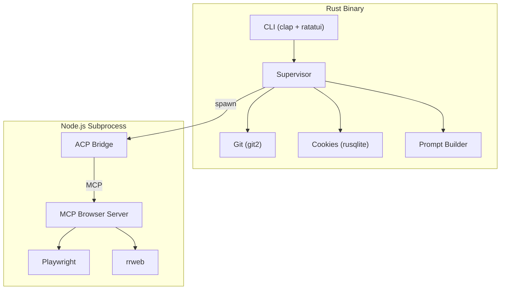

# Rust Revision -- Expect

## Overview

Expect is a TypeScript monorepo built entirely on Effect-TS. Translating it to Rust requires mapping Effect's service/layer/stream/error patterns to Rust equivalents. The project is heavily I/O-bound (subprocess management, browser automation, file system, network) with concurrent streaming at its core.

## Why Rust Would Make Sense

1. **Single binary distribution** -- Currently requires Node.js + pnpm. A Rust binary would be self-contained
2. **Startup latency** -- Node.js cold start adds ~200-500ms. Rust would be near-instant
3. **Memory efficiency** -- The ACP subprocess chain (Expect -> ACP adapter -> Agent -> MCP server) is memory-heavy
4. **Cookie database access** -- Direct SQLite access without Node.js binding overhead
5. **Cross-platform TUI** -- Ratatui provides native terminal rendering without React/Ink overhead

## Why Rust Would Be Challenging

1. **Playwright has no Rust equivalent** -- The entire browser automation layer depends on Playwright's Chromium integration
2. **MCP SDK** -- The MCP server uses `@modelcontextprotocol/sdk` which is JavaScript-only
3. **ACP protocol** -- The `@agentclientprotocol/sdk` is JavaScript-only
4. **Effect-TS patterns** -- The codebase uses Effect v4's most advanced features (ServiceMap, Schema, Streams, Layers) which have no direct Rust equivalent
5. **rrweb** -- Session recording is a JavaScript library with no Rust port

## Crate Breakdown

### Workspace Structure

```toml
[workspace]
members = [
    "crates/expect-cli",
    "crates/expect-supervisor",
    "crates/expect-agent",
    "crates/expect-browser",
    "crates/expect-cookies",
    "crates/expect-shared",
]
```

### `expect-shared` -- Domain Models

Maps the Effect Schema classes to Rust types:

```rust
use serde::{Deserialize, Serialize};
use uuid::Uuid;

/// Branded type for plan IDs
#[derive(Debug, Clone, PartialEq, Eq, Hash, Serialize, Deserialize)]
pub struct PlanId(String);

#[derive(Debug, Clone, PartialEq, Eq, Hash, Serialize, Deserialize)]
pub struct StepId(String);

/// Tagged union for changes scope
#[derive(Debug, Clone, Serialize, Deserialize)]
#[serde(tag = "_tag")]
pub enum ChangesFor {
    WorkingTree,
    Branch { main_branch: String },
    Changes { main_branch: String },
    Commit { hash: String },
}

/// Test plan step
#[derive(Debug, Clone, Serialize, Deserialize)]
pub struct TestPlanStep {
    pub id: StepId,
    pub title: String,
    pub instruction: String,
    pub expected_outcome: String,
    pub route_hint: Option<String>,
    pub status: StepStatus,
    pub summary: Option<String>,
    pub started_at: Option<chrono::DateTime<chrono::Utc>>,
    pub ended_at: Option<chrono::DateTime<chrono::Utc>>,
}

#[derive(Debug, Clone, Copy, Serialize, Deserialize)]
#[serde(rename_all = "lowercase")]
pub enum StepStatus {
    Pending,
    Active,
    Passed,
    Failed,
    Skipped,
}

/// Execution events (tagged union)
#[derive(Debug, Clone, Serialize, Deserialize)]
#[serde(tag = "_tag")]
pub enum ExecutionEvent {
    RunStarted { plan: TestPlan },
    StepStarted { step_id: StepId, title: String },
    StepCompleted { step_id: StepId, summary: String },
    StepFailed { step_id: StepId, message: String },
    StepSkipped { step_id: StepId, reason: String },
    ToolCall { tool_name: String, input: serde_json::Value },
    ToolProgress { tool_name: String, output_size: usize },
    ToolResult { tool_name: String, result: String, is_error: bool },
    AgentThinking { text: String },
    AgentText { text: String },
    RunFinished { status: RunStatus, summary: String },
}
```

**Crate recommendations:**
- `serde` + `serde_json` -- Serialization (replaces Effect Schema)
- `chrono` -- DateTime handling
- `uuid` -- ID generation
- `thiserror` -- Error definitions

### `expect-cookies` -- Browser Cookie Extraction

This is the most straightforward crate to implement in Rust:

```rust
use thiserror::Error;

#[derive(Debug, Error)]
pub enum ExtractionError {
    #[error("Cookie database not found for {browser}")]
    DatabaseNotFound { browser: String },
    #[error("Cookie read failed: {cause}")]
    ReadFailed { cause: String },
    #[error("Requires Full Disk Access for Safari")]
    RequiresFullDiskAccess,
    #[error("Browser detection failed: {cause}")]
    DetectionFailed { cause: String },
}

#[derive(Debug, Clone)]
pub struct Cookie {
    pub name: String,
    pub value: String,
    pub domain: String,
    pub path: String,
    pub expires: Option<i64>,
    pub secure: bool,
    pub http_only: bool,
    pub same_site: Option<SameSite>,
}

#[derive(Debug, Clone)]
pub enum SameSite {
    None,
    Lax,
    Strict,
}

/// Browser profile variants
#[derive(Debug, Clone)]
pub enum BrowserProfile {
    Chromium {
        key: String,
        profile_path: PathBuf,
        executable_path: PathBuf,
        locale: Option<String>,
    },
    Firefox {
        profile_path: PathBuf,
    },
    Safari {
        cookie_file_path: Option<PathBuf>,
    },
}

pub trait CookieExtractor {
    fn extract(&self, profile: &BrowserProfile) -> Result<Vec<Cookie>, ExtractionError>;
}
```

**Crate recommendations:**
- `rusqlite` -- SQLite access (replaces SqliteClient)
- `aes` + `cbc` -- AES-128-CBC decryption for Chromium
- `security-framework` (macOS) -- Keychain access
- `dpapi` (Windows) -- DPAPI decryption
- `nom` or manual parsing -- Safari binary cookie format
- `directories` -- Platform-specific directory paths

### `expect-agent` -- Agent Protocol

The ACP protocol requires subprocess management and NDJSON streaming:

```rust
use tokio::process::{Command, Child};
use tokio::io::{AsyncBufReadExt, AsyncWriteExt, BufReader};
use tokio_stream::StreamExt;

pub struct AcpClient {
    child: Child,
    sessions: HashMap<SessionId, mpsc::UnboundedSender<AcpSessionUpdate>>,
}

impl AcpClient {
    pub async fn new(adapter: AcpAdapter) -> Result<Self, AcpError> {
        let child = Command::new(&adapter.bin)
            .args(&adapter.args)
            .stdin(std::process::Stdio::piped())
            .stdout(std::process::Stdio::piped())
            .stderr(std::process::Stdio::piped())
            .spawn()?;

        // Start NDJSON reader on stdout
        // Start stderr logger
        // Initialize ACP connection

        Ok(Self { child, sessions: HashMap::new() })
    }

    pub fn stream(
        &mut self,
        options: StreamOptions,
    ) -> impl Stream<Item = Result<AcpSessionUpdate, AcpError>> {
        // Create session if needed
        // Send prompt
        // Return receiver as stream with inactivity timeout
    }
}

/// ACP session update types
#[derive(Debug, Clone, Deserialize)]
#[serde(tag = "sessionUpdate")]
pub enum AcpSessionUpdate {
    #[serde(rename = "agent_message_chunk")]
    AgentMessageChunk { content: ContentBlock },
    #[serde(rename = "agent_thought_chunk")]
    AgentThoughtChunk { content: ContentBlock },
    #[serde(rename = "tool_call")]
    ToolCall {
        tool_call_id: String,
        title: String,
        raw_input: Option<serde_json::Value>,
    },
    #[serde(rename = "tool_call_update")]
    ToolCallUpdate {
        tool_call_id: String,
        status: Option<String>,
        raw_output: Option<serde_json::Value>,
    },
    // ... other variants
}
```

**Crate recommendations:**
- `tokio` -- Async runtime for subprocess and stream management
- `tokio-stream` -- Stream utilities
- `ndjson` or manual -- NDJSON parsing
- `which` -- Command detection (replaces `which`/`where`)

### `expect-browser` -- Browser Automation

This is the hardest crate because Playwright has no Rust equivalent. Options:

#### Option A: chromiumoxide (CDP-only)

```rust
use chromiumoxide::{Browser, BrowserConfig};

pub struct ExpectBrowser {
    browser: Browser,
    page: Page,
}

impl ExpectBrowser {
    pub async fn create_page(&self, url: &str) -> Result<Page, BrowserError> {
        let page = self.browser.new_page(url).await?;
        // Inject runtime script
        // Setup console/network listeners
        Ok(page)
    }

    pub async fn snapshot(&self, page: &Page) -> Result<SnapshotResult, BrowserError> {
        // CDP doesn't have ariaSnapshot() -- would need custom implementation
        // Alternative: use Accessibility.getFullAXTree CDP command
        unimplemented!("ARIA snapshot requires Playwright or custom implementation")
    }
}
```

Limitation: `chromiumoxide` provides CDP access but not Playwright's high-level API. The ARIA snapshot functionality would need to be reimplemented.

#### Option B: playwright-rust (Playwright bindings)

There is no mature Playwright Rust binding. The recommended approach would be to:

1. Ship the Playwright MCP server as a Node.js subprocess
2. Communicate via MCP protocol from Rust
3. Keep the Rust crate focused on MCP client, not direct browser control

```rust
pub struct BrowserMcpClient {
    process: Child,
    transport: StdioTransport,
}

impl BrowserMcpClient {
    pub async fn call_tool(
        &self,
        name: &str,
        args: serde_json::Value,
    ) -> Result<serde_json::Value, McpError> {
        // Send MCP tool call via stdio
        // Parse response
    }
}
```

#### Option C: Hybrid architecture

Keep the MCP browser server in TypeScript/Node.js and build the rest in Rust. The Rust binary would:
1. Parse CLI arguments
2. Gather git context
3. Spawn the ACP adapter (which spawns the MCP server)
4. Stream and process events
5. Render TUI or output results

This is the most pragmatic approach since the browser automation layer has deep JavaScript dependencies (Playwright, rrweb, MCP SDK).

### `expect-supervisor` -- Orchestration

```rust
pub struct Executor {
    agent: Box<dyn Agent>,
    git: GitService,
}

impl Executor {
    pub fn execute(
        &self,
        options: ExecuteOptions,
    ) -> impl Stream<Item = Result<ExecutedTestPlan, ExecutionError>> {
        // Gather context
        let context = self.git.gather_context(&options.changes_for)?;

        // Build prompt
        let prompt = build_execution_prompt(&options, &context);

        // Stream agent and accumulate
        let initial = ExecutedTestPlan::new(plan);
        self.agent.stream(prompt).scan(initial, |plan, update| {
            *plan = plan.add_event(update);
            Some(plan.clone())
        })
    }
}

pub struct GitService {
    repo_root: PathBuf,
}

impl GitService {
    pub fn get_changed_files(&self, scope: &ChangesFor) -> Result<Vec<ChangedFile>, GitError> {
        // Use git2 crate for git operations
    }
}
```

**Crate recommendations:**
- `git2` -- Native git operations (replaces simple-git)
- `sha2` -- SHA-256 fingerprinting

### `expect-cli` -- Terminal UI

```rust
use ratatui::{Frame, Terminal};
use crossterm::event::{Event, KeyCode};

pub enum Screen {
    Main,
    Testing { changes_for: ChangesFor, instruction: String },
    Results { report: TestReport },
    PrPicker,
    SavedFlowPicker,
}

pub struct App {
    screen: Screen,
    executor: Executor,
}

impl App {
    pub fn render(&self, frame: &mut Frame) {
        match &self.screen {
            Screen::Main => self.render_main(frame),
            Screen::Testing { .. } => self.render_testing(frame),
            Screen::Results { report } => self.render_results(frame, report),
            // ...
        }
    }
}
```

**Crate recommendations:**
- `ratatui` -- Terminal UI framework (replaces React + Ink)
- `crossterm` -- Terminal event handling
- `clap` -- CLI argument parsing (replaces Commander.js)
- `indicatif` -- Progress bars and spinners

## Type System Considerations

### Effect Service -> Rust Trait

Effect's `ServiceMap.Service` maps to Rust traits + dependency injection:

```rust
// TypeScript: ServiceMap.Service
// Rust: trait + struct with dependencies

pub trait Agent: Send + Sync {
    fn stream(&self, options: StreamOptions) -> BoxStream<'_, Result<AcpSessionUpdate, AgentError>>;
}

pub struct ClaudeAgent {
    acp_client: AcpClient,
}

impl Agent for ClaudeAgent {
    fn stream(&self, options: StreamOptions) -> BoxStream<'_, Result<AcpSessionUpdate, AgentError>> {
        self.acp_client.stream(options).boxed()
    }
}
```

### Effect Schema -> serde

Effect Schema's type-safe serialization maps directly to serde:

```rust
// TypeScript: Schema.TaggedUnion
// Rust: #[serde(tag = "...")] enum

#[derive(Deserialize)]
#[serde(tag = "_tag")]
pub enum ChangesFor {
    WorkingTree,
    Branch { main_branch: String },
}
```

### Effect.fn with spans -> tracing

Effect's `Effect.fn` with automatic span creation maps to the `tracing` crate:

```rust
use tracing::instrument;

#[instrument(name = "Executor.gatherContext")]
async fn gather_context(&self, changes_for: &ChangesFor) -> Result<Context, GitError> {
    // ...
}
```

### Effect Error Channel -> Result<T, E>

Effect's typed error channel maps directly to Rust's `Result`:

```rust
// TypeScript: Effect.Effect<Cookie[], ExtractionError>
// Rust: Result<Vec<Cookie>, ExtractionError>

// TypeScript: Effect.catchTag("ExtractionError", ...)
// Rust: match result { Err(ExtractionError::ReadFailed { .. }) => ... }
```

### Effect Stream -> tokio_stream

```rust
// TypeScript: Stream.Stream<AcpSessionUpdate, AcpStreamError>
// Rust: impl Stream<Item = Result<AcpSessionUpdate, AcpError>>
```

### Effect Layer -> Builder pattern / DI container

```rust
// TypeScript: Layer.provide(CdpClient.layer)
// Rust: struct construction with dependencies

let cookies_service = CookiesService::new(
    cdp_client,
    sqlite_client,
    sqlite_fallback,
);
```

### Option -> Option

Effect's `Option` maps directly to Rust's `Option<T>`. No translation needed.

### Branded types -> Newtype pattern

```rust
// TypeScript: Schema.String.pipe(Schema.brand("PlanId"))
// Rust: newtype wrapper

#[derive(Debug, Clone, PartialEq, Eq, Hash)]
pub struct PlanId(String);

impl PlanId {
    pub fn new() -> Self {
        Self(Uuid::new_v4().to_string())
    }
}
```

## Error Handling Strategy

Use `thiserror` for error definitions with `anyhow` at the binary boundary:

```rust
// Library errors (precise)
#[derive(Debug, Error)]
pub enum AgentError {
    #[error("Stream failed: {cause}")]
    StreamFailed { cause: String },
    #[error("{provider} is not installed")]
    ProviderNotInstalled { provider: String },
    #[error("{provider} is not authenticated")]
    ProviderUnauthenticated { provider: String },
    #[error("Usage limits exceeded for {provider}")]
    UsageLimitExceeded { provider: String },
}

// Binary boundary (ergonomic)
fn main() -> anyhow::Result<()> {
    // ...
}
```

## Concurrency Model

Effect's fiber-based concurrency maps to Tokio tasks:

```rust
// TypeScript: Effect.forkDetach
// Rust: tokio::spawn

// TypeScript: FiberMap
// Rust: HashMap<SessionId, JoinHandle<()>>

// TypeScript: Queue.unbounded
// Rust: mpsc::unbounded_channel

// TypeScript: Ref.make
// Rust: Arc<Mutex<T>> or tokio::sync::watch
```

## Recommended Architecture

Given the heavy JavaScript dependencies (Playwright, MCP SDK, ACP SDK, rrweb), the most pragmatic Rust architecture is:



The Rust binary handles:
- CLI parsing and TUI rendering
- Git context gathering
- Cookie extraction
- Prompt construction
- ACP subprocess management and stream processing
- Report generation

The Node.js subprocess handles:
- ACP adapter (communicating with Claude/Codex)
- MCP browser server (Playwright, rrweb)

This gives the performance and distribution benefits of Rust where they matter most (startup, CLI, git, cookies) while keeping the JavaScript-dependent browser automation layer unchanged.

## Summary

A Rust revision of Expect would focus on:
1. **CLI and TUI** -- Replace Commander.js/React+Ink with clap/ratatui
2. **Git operations** -- Replace simple-git with git2
3. **Cookie extraction** -- Replace Node.js SQLite/crypto with rusqlite/aes
4. **Supervisor orchestration** -- Replace Effect streams with tokio streams
5. **Keep browser automation in Node.js** -- No mature Rust alternative to Playwright exists

The Effect-TS patterns (Services, Layers, Schemas, Streams, typed errors) have clean Rust equivalents (traits, builders, serde, tokio-stream, thiserror). The main gap is Playwright, which would remain as a Node.js subprocess.
