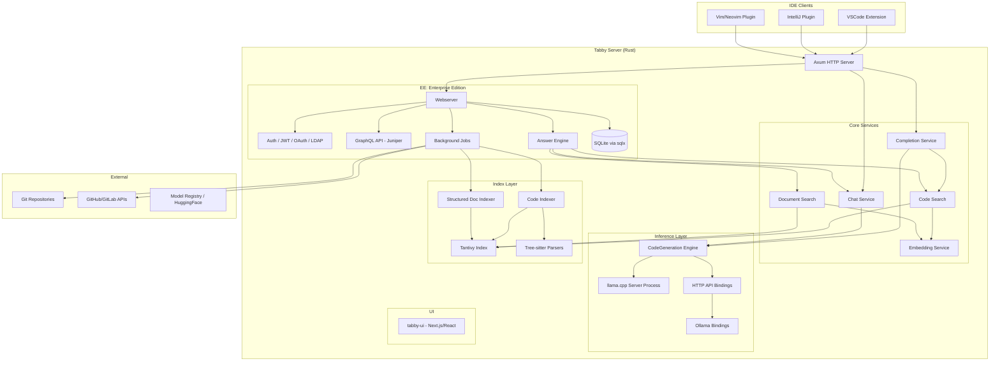
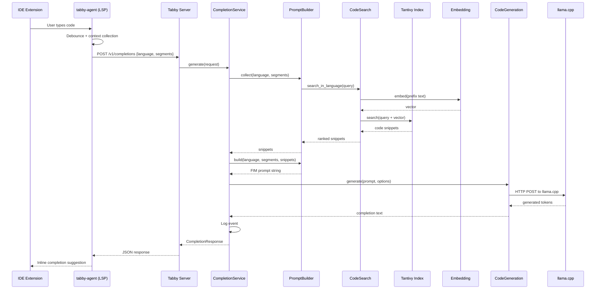

# Zero to Tabby Engineer: A Comprehensive Fundamentals Guide

## What is Tabby?

Tabby is a **self-hosted, open-source AI coding assistant** that serves as an alternative to GitHub Copilot. Unlike cloud-dependent solutions, Tabby runs entirely on your own infrastructure -- no external database management systems, no cloud API calls for inference, and no data leaving your network. It provides code completion (autocomplete), chat-based coding assistance, and an "Answer Engine" for engineering teams -- all backed by LLMs running on consumer-grade GPUs or CPUs.

The project is written primarily in **Rust** for the backend (server, inference orchestration, indexing) with **TypeScript/React** for the web UI and IDE extensions (VSCode, IntelliJ, Vim/Neovim).

---

## 1. Core Concepts You Must Understand

### 1.1 LLM Inference for Code Completion

**What it is:** A Large Language Model (LLM) takes a text prompt and predicts the next tokens (words/characters). For code completion, the "prompt" is the code surrounding the cursor -- the prefix (code before cursor) and suffix (code after cursor).

**Fill-in-the-Middle (FIM):** Most code completion models use a FIM format. Instead of just left-to-right generation, the model is trained with a special template:

```
<prefix_token>{code before cursor}<suffix_token>{code after cursor}<middle_token>
```

The model then generates the code that should appear between the prefix and suffix. This is how Tabby's `completion_prompt.rs` works -- it builds prompts using configurable FIM templates like `<pre>{prefix}<mid>{suffix}<end>`.

**Key parameters:**
- **Temperature:** Controls randomness. Lower = more deterministic. Higher = more creative/random.
- **Max decoding tokens:** Maximum number of tokens the model will generate per completion.
- **Top-k / Top-p sampling:** Strategies for selecting the next token from the probability distribution.

### 1.2 Retrieval Augmented Generation (RAG) for Code

Tabby does not just send raw prefix/suffix to the model. It augments the prompt with **relevant code snippets** retrieved from your repository index. This is the core innovation:

1. The user's code context (prefix) is used as a search query
2. Tabby searches its **Tantivy index** (a Rust full-text search engine similar to Apache Lucene) for relevant code chunks
3. The most relevant snippets are prepended to the prompt, giving the model more context
4. The model generates more accurate, repository-aware completions

This is implemented in `CompletionService` and `PromptBuilder` within `crates/tabby/src/services/completion/`.

### 1.3 Embedding Models

Embedding models convert text into dense numerical vectors. Tabby uses embedding models to:
- Create vector representations of code chunks during indexing
- Compare semantic similarity between the user's current code and indexed repository content
- Power the RAG pipeline for both code completion and the Answer Engine

### 1.4 The OpenAPI / REST Contract

Tabby exposes an OpenAPI-compliant REST API. The primary endpoints are:

| Endpoint | Purpose |
|----------|---------|
| `POST /v1/completions` | Code completion (FIM) |
| `POST /v1/chat/completions` | Chat-based assistance (OpenAI-compatible) |
| `POST /v1/events` | Log client-side events (telemetry) |
| `GET /v1/health` | Health check and server status |
| `GET /v1beta/models` | List available models |
| `GET /v1beta/server_setting` | Server configuration |

IDE plugins communicate with these endpoints via HTTP.

### 1.5 llama.cpp Integration

Tabby uses **llama.cpp** as its primary local inference backend. llama.cpp is a C++ library for running GGUF-format LLM models efficiently on various hardware:
- **CUDA** for NVIDIA GPUs
- **ROCm** for AMD GPUs
- **Metal** for Apple Silicon
- **Vulkan** for cross-platform GPU
- **CPU** fallback for any system

The `crates/llama-cpp-server` crate wraps llama.cpp as an HTTP server process that Tabby launches and communicates with internally.

### 1.6 Tantivy: The Search Engine

**Tantivy** is a full-text search library written in Rust (analogous to Apache Lucene in Java). Tabby uses it to:
- Index source code from git repositories
- Index structured documents (issues, pull requests, web pages)
- Provide fast fuzzy search for RAG code completion
- Support the Answer Engine's document retrieval

The indexing system (`crates/tabby-index/`) uses **tree-sitter** to parse source code into ASTs and extract meaningful code chunks (functions, classes, type definitions) for indexing.

### 1.7 Tree-sitter for Code Intelligence

**Tree-sitter** is an incremental parsing framework. Tabby uses tree-sitter grammars for multiple languages (Rust, Python, Java, Go, TypeScript, C, C++, Ruby, Kotlin, Scala) to:
- Parse source files into Abstract Syntax Trees (ASTs)
- Extract "tags" -- named code entities like functions, classes, methods
- Generate code chunks that are meaningful units for indexing

### 1.8 GraphQL for Enterprise Features

The Enterprise Edition (EE) uses **Juniper** (a Rust GraphQL library) to expose a rich GraphQL API for:
- User management and authentication
- Repository configuration
- Analytics and usage reports
- Thread-based conversations
- Background job management

### 1.9 SQLite for Persistence

The EE stores all its data in **SQLite** via the `sqlx` crate. Tables include:
- Users, invitations, refresh tokens
- OAuth credentials (GitHub, GitLab, Google)
- Repository configurations
- Job run history
- Thread conversations and messages
- Server settings

---

## 2. Architecture Overview



---

## 3. The Workspace Structure

### Rust Crates (Backend)

| Crate | Purpose |
|-------|---------|
| `crates/tabby` | Main binary -- CLI, HTTP server, route handlers, service orchestration |
| `crates/tabby-common` | Shared types, configs, API definitions, path utilities |
| `crates/tabby-inference` | Abstract inference traits (`CompletionStream`, `ChatCompletionStream`, `Embedding`, `CodeGeneration`) |
| `crates/tabby-index` | Code and document indexing using Tantivy + tree-sitter |
| `crates/tabby-git` | Git repository operations (file listing, grep, blame, diffs) |
| `crates/tabby-download` | Model download management |
| `crates/tabby-crawler` | Web page crawling for document indexing |
| `crates/llama-cpp-server` | llama.cpp process management and HTTP bindings |
| `crates/http-api-bindings` | HTTP client for remote model APIs (OpenAI-compatible, Ollama) |
| `crates/ollama-api-bindings` | Ollama-specific API client |
| `crates/aim-downloader` | File download utility with checksum verification |
| `crates/hash-ids` | Short ID generation for entities |
| `crates/tabby-index-cli` | CLI tool for inspecting Tantivy indexes |
| `crates/sqlx-migrate-validate` | SQLite migration validation |

### Enterprise Edition Crates

| Crate | Purpose |
|-------|---------|
| `ee/tabby-webserver` | Enterprise webserver: auth, GraphQL, background jobs, answer engine |
| `ee/tabby-schema` | GraphQL schema definitions (Juniper), policy layer, DAO layer |
| `ee/tabby-db` | SQLite database access layer (all table operations) |
| `ee/tabby-db-macros` | Procedural macros for database operations |

### TypeScript Packages (Frontend/Clients)

| Package | Purpose |
|---------|---------|
| `clients/vscode` | VSCode extension |
| `clients/tabby-agent` | Language Server Protocol (LSP) agent shared across IDE clients |
| `clients/tabby-chat-panel` | Shared chat panel component |
| `clients/tabby-openapi` | Generated OpenAPI TypeScript client |
| `clients/tabby-threads` | Thread communication utilities |
| `clients/intellij` | IntelliJ platform plugin |
| `ee/tabby-ui` | Web dashboard UI (Next.js + React + Tailwind + shadcn/ui) |
| `ee/tabby-email` | Email template generation |

---

## 4. Request Flow: Code Completion

This is the most critical path in Tabby. Here is exactly what happens when a developer types code:



### Step-by-step Breakdown:

1. **IDE triggers completion:** The extension detects a typing pause and collects the prefix (code before cursor), suffix (code after cursor), filepath, git URL, and any LSP-provided declarations.

2. **LSP agent sends request:** The `tabby-agent` formats a `CompletionRequest` with language, segments (prefix/suffix/filepath/declarations/clipboard), and optional debug flags.

3. **Server receives request:** The Axum HTTP handler deserializes the request and passes it to `CompletionService::generate()`.

4. **RAG snippet retrieval:** The `PromptBuilder` uses the prefix text as a search query against the Tantivy index. The embedding model converts the query to a vector, and both text search and vector similarity are used to find relevant code chunks from the repository.

5. **Prompt construction:** The prefix, suffix, and retrieved snippets are assembled into a FIM prompt using the model's prompt template. Snippets are inserted as comment blocks before the prefix.

6. **LLM inference:** The `CodeGeneration` engine clips the prompt to `max_input_length`, sends it to the underlying `CompletionStream` (llama.cpp, Ollama, or HTTP API), and collects generated tokens.

7. **Post-processing:** CRLF line endings are normalized. The generated text is wrapped in a `CompletionResponse` with a unique completion ID.

8. **Event logging:** The completion event (prompt, response, user agent) is logged for analytics.

---

## 5. Key Algorithms and Concepts

### 5.1 Fill-in-the-Middle (FIM) Prompt Templates

Different models use different special tokens for FIM. Tabby abstracts this with configurable templates:

```
Template: "<pre>{prefix}<mid>{suffix}<end>"
Result:   "<pre>def hello():\n    <mid>\n    return 'world'<end>"
```

The `PromptBuilder` in `completion_prompt.rs` handles:
- Injecting retrieved snippets as language-appropriate comments before the prefix
- Applying the FIM template
- Respecting `max_input_length` by clipping from the beginning of the prefix

### 5.2 RAG Code Search Pipeline

1. **Code Indexing (offline):** Background jobs iterate through configured git repositories, parse each file with tree-sitter, extract tagged code entities (functions, classes, etc.), and index them in Tantivy with both full-text and embedding vectors.

2. **Query time:** The user's current code prefix is used as a search query. The system:
   - Performs text-based search in the Tantivy index
   - Optionally performs embedding-based semantic search
   - Fuses results using score-based ranking
   - Returns the top-K most relevant snippets

3. **Prompt augmentation:** Snippets are formatted as comments in the target language and prepended to the prefix, giving the model repository-specific context.

### 5.3 Tree-sitter Tag Extraction

The `crates/tabby-index/src/code/intelligence.rs` module uses tree-sitter's **tag query** system:
- Each language has a `.scm` query file defining patterns for extractable entities
- Tags include: function definitions, class definitions, module declarations
- Each tag produces a code chunk with: the tag name, the body text, line range, and file path
- These chunks become the atomic units stored in the Tantivy index

### 5.4 Next Edit Suggestion Mode

Beyond standard FIM completion, Tabby supports **next edit suggestion** mode:
- The client sends edit history (original code, diff of edits, current version)
- A specialized prompt builder creates a prompt that shows the edit pattern
- The model predicts what the user will edit next based on the pattern of recent changes
- This is useful for repetitive refactoring tasks

### 5.5 Decoding and Token Generation

The `CodeGeneration` engine in `tabby-inference` implements:
- **Streaming generation:** Tokens are generated one at a time
- **Stop conditions:** Generation stops on end-of-sequence tokens, newlines (for single-line completions), or when certain language-specific patterns indicate completion end
- **Trie-based incremental decoding:** The `decoding.rs` module uses a trie data structure for efficient incremental text decoding from token IDs

---

## 6. The Enterprise Edition (EE)

### 6.1 Authentication Stack

The EE supports multiple authentication methods:

| Method | Implementation |
|--------|---------------|
| **JWT tokens** | `jwt.rs` -- Bearer token auth for API access |
| **OAuth** | GitHub, GitLab, Google, and generic OIDC providers |
| **LDAP** | Enterprise directory integration via `ldap3` crate |
| **Password** | Local user/password with reset flow |
| **Invitation** | Email-based user invitation system |

### 6.2 Answer Engine

The Answer Engine is a RAG-powered Q&A system for engineering teams:
1. User asks a question in natural language
2. The system searches code repositories and structured documents (issues, PRs, web docs)
3. Relevant context is assembled into a prompt
4. The chat model generates an answer with citations
5. Conversations are stored as persistent "threads"

### 6.3 Background Job System

The EE runs periodic background jobs via `tokio-cron-scheduler`:

| Job | Frequency | Purpose |
|-----|-----------|---------|
| Git sync | Hourly | Pull latest changes from configured repositories |
| Code indexing | Hourly | Re-index changed files in repositories |
| Commit indexing | Daily | Index git commit messages for search |
| Issue/PR sync | Hourly | Sync issues and PRs from GitHub/GitLab integrations |
| Web crawling | Periodic | Crawl configured web documents for indexing |
| Garbage collection | Daily | Clean up stale index entries |
| License check | Daily | Validate enterprise license status |

### 6.4 Web UI (tabby-ui)

The web dashboard is a Next.js application using:
- **React 18** with Server Components
- **Tailwind CSS** for styling
- **shadcn/ui** for component library
- **GraphQL** client for data fetching
- Features: user management, repository configuration, analytics dashboards, chat/thread interface, code browser

---

## 7. Configuration

Tabby uses a TOML configuration file (`~/.tabby/config.toml`):

```toml
[model]
# Local model for code completion
completion = { model_id = "StarCoder-1B" }

# Local model for chat
chat = { model_id = "Qwen2-1.5B-Instruct" }

# Embedding model for RAG
embedding = { model_id = "Nomic-Embed-Text" }

[server]
# Timeout for completion requests in seconds
completion_timeout = 30

[repositories]
# Git repositories to index
[[repositories.git]]
name = "my-repo"
git_url = "https://github.com/org/repo.git"
```

Environment variables:
- `TABBY_ROOT` -- Data directory (default: `~/.tabby`)
- `LLAMA_CPP_N_GPU_LAYERS` -- Number of model layers to offload to GPU
- `LLAMA_CPP_FAST_ATTENTION` -- Enable flash attention optimization

---

## 8. What This Looks Like in Rust

### 8.1 Key Rust Patterns Used

**Trait-based abstraction for inference backends:**

```rust
#[async_trait]
pub trait CompletionStream: Send + Sync {
    async fn generate(&self, prompt: &str, options: CompletionOptions) -> BoxStream<String>;
}

#[async_trait]
pub trait ChatCompletionStream: Send + Sync {
    // OpenAI-compatible chat completion
}

pub trait Embedding: Send + Sync {
    async fn embed(&self, prompt: &str) -> anyhow::Result<Vec<f32>>;
}
```

This allows swapping between llama.cpp, Ollama, and HTTP API backends transparently.

**Arc-based service sharing:**
```rust
let logger: Arc<dyn EventLogger> = Arc::new(create_event_logger());
let code_search: Arc<dyn CodeSearch> = Arc::new(create_code_search(embedding, index_reader));
```

Services are wrapped in `Arc<dyn Trait>` for thread-safe sharing across Axum handlers.

**Builder pattern for options:**
```rust
let options = CodeGenerationOptionsBuilder::default()
    .max_input_length(4096)
    .max_decoding_tokens(256)
    .language(Some(get_language("rust")))
    .sampling_temperature(0.1)
    .build()
    .expect("Failed to build options");
```

**Feature flags for conditional compilation:**
```rust
#[cfg(feature = "ee")]
let ws = Some(tabby_webserver::public::Webserver::new(logger, embedding).await);

#[cfg(feature = "cuda")]
// Enable CUDA support in llama-cpp-server
```

### 8.2 A Production-Grade Version

A production-grade Rust AI coding assistant would need:

1. **Async-first architecture:** Use `tokio` runtime with careful cancellation handling. Tabby does this well with `axum` + `tokio`.

2. **Streaming responses:** Use `BoxStream<String>` and `async-stream` for token-by-token streaming to reduce latency. Tabby implements this for both completion and chat.

3. **Connection pooling:** For HTTP backends, use `reqwest` with connection pooling. For SQLite, use `sqlx`'s connection pool.

4. **Rate limiting:** The EE uses `ratelimit` crate and custom `rate_limit.rs` middleware.

5. **Graceful degradation:** If the embedding model is unavailable, completion still works without RAG. If the chat model is unavailable, that endpoint returns 501.

6. **Observability:** OpenTelemetry integration (`otel.rs`) for distributed tracing and metrics export.

7. **Memory-efficient prompt clipping:** The `clip_prompt` function ensures prompts respect `max_input_length` while maintaining valid UTF-8 boundaries.

---

## 9. How to Build a System Like This (For Inexperienced Engineers)

### Step 1: Start with the HTTP API
Build a simple Axum server with a single `/v1/completions` endpoint. Accept a prompt string, forward it to a local llama.cpp instance, return the response.

### Step 2: Add the FIM Protocol
Implement a `PromptBuilder` that takes prefix/suffix segments and constructs a FIM prompt. Test with StarCoder or CodeLlama models.

### Step 3: Add Model Management
Build a model download system that fetches GGUF files from HuggingFace. Use checksums for validation. Store models in a well-known directory.

### Step 4: Add Code Indexing
Use tree-sitter to parse source files and extract code entities. Store them in a Tantivy index. Implement basic text search.

### Step 5: Implement RAG
Connect the search system to the completion pipeline. Retrieve relevant code snippets and inject them into the FIM prompt.

### Step 6: Add Embeddings
Integrate an embedding model for semantic search. Combine text search and embedding search results for better retrieval quality.

### Step 7: Build the Enterprise Layer
Add authentication (start with JWT), a database (SQLite), a GraphQL API, and a web UI. Build background jobs for repository synchronization.

### Step 8: Build IDE Extensions
Start with VSCode using the Language Server Protocol (LSP). The extension communicates with your server's REST API.

---

## 10. Key Insights for Engineers

- **Tabby's core innovation is RAG for code completion** -- augmenting LLM prompts with indexed repository context
- **The crate separation is excellent** -- inference traits are fully decoupled from implementation
- **Tree-sitter + Tantivy is a powerful combination** for code intelligence without a full language server
- **The EE/CE split using Cargo feature flags** is a clean way to maintain both open-source and enterprise versions in one codebase
- **llama.cpp integration is process-based** -- Tabby spawns a separate llama.cpp HTTP server and communicates via HTTP, avoiding FFI complexity
- **The Answer Engine reuses the same RAG infrastructure** as code completion, just with a different prompt strategy
- **SQLite is sufficient for the data volumes** a self-hosted coding assistant handles -- this simplifies deployment enormously
