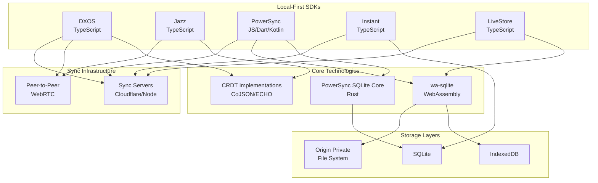

# Project Exploration: Local-First Software Ecosystem

## Overview

This exploration covers the local-first software ecosystem, examining projects that enable building applications that work offline by default, sync data peer-to-peer or through minimal infrastructure, and preserve user privacy and data ownership. The explored projects span multiple platforms and programming languages, providing SDKs and frameworks for building collaborative, real-time applications.

**Local-First Software Principles:**

1. **Data ownership**: Users own their data; it's stored locally on their devices
2. **Offline by default**: Applications work without network connectivity
3. **Peer-to-peer sync**: Devices sync directly when possible, minimizing server infrastructure
4. **Real-time collaboration**: Multiple users can work together simultaneously
5. **Conflict resolution**: Automatic merging of concurrent changes using CRDTs or similar techniques
6. **Privacy**: End-to-end encryption and user-controlled data sharing

## Directory Structure

```
/home/darkvoid/Boxxed/@formulas/src.localfirst/
├── dxos/                          # DXOS platform (TypeScript)
│   ├── packages/
│   │   ├── core/                  # Core protocols (agent, chain, echo, mesh)
│   │   ├── sdk/                   # Client SDKs
│   │   ├── cojson/                # CoJSON CRDT implementation
│   │   └── apps/                  # Example applications
│   └── docs/                      # Documentation
├── powersync-js/                  # PowerSync JavaScript SDKs
│   └── packages/
│       ├── common/                # Shared TypeScript implementation
│       ├── web/                   # Web SDK
│       ├── react-native/          # React Native SDK
│       ├── react/                 # React hooks
│       └── vue/                   # Vue composables
├── powersync.dart/                # PowerSync Dart/Flutter SDK
├── powersync-kotlin/              # PowerSync Kotlin SDK
├── powersync-service/             # PowerSync backend service
├── powersync-sqlite-core/         # SQLite extension (Rust)
├── wa-sqlite/                     # WebAssembly SQLite
├── jazz/                          # Jazz collaborative framework
│   └── packages/
│       ├── cojson/                # Core CRDT implementation
│       ├── jazz-tools/            # High-level toolkit
│       └── jazz-browser/          # Browser integration
├── instant/                       # Instant real-time backend
│   ├── client/                    # Client-side SDK
│   └── server/                    # Sync server (Clojure)
├── src.livestore/                 # LiveStore
│   └── livestore/
│       └── packages/@livestore/
│           ├── livestore/         # Core library
│           ├── sync-cf/           # Cloudflare sync
│           └── sqlite-wasm/       # SQLite WebAssembly
└── succulent/                     # (Frontend example)
    ├── frontend/
    └── backend/
```

## Architecture

### High-Level Diagram (Mermaid)



## DXOS Platform

**Location:** `/home/darkvoid/Boxxed/@formulas/src.localfirst/dxos/`

DXOS is a decentralized operating system for building local-first, collaborative applications. It provides a comprehensive toolkit for peer-to-peer collaboration without central sync servers.

### Key Components

**ECHO (Eventually Consistent Hierarchical Object Store):**
- Peer-to-peer graph database
- Supports multiple concurrent writers
- Offline-first with latent offline writers
- Uses feed-based replication with epochs for compression

**HALO (Identity Protocol):**
- Decentralized identity management
- Public/private key pair-based authentication
- Device and client management
- No password required

**MESH (Networking Layer):**
- Peer-to-peer networking via WebRTC
- Signaling services for peer discovery
- Supports intermediaries for NAT traversal

### Architecture Highlights

```
Client Architecture:
┌─────────────────────────────────────────┐
│            DXOS Application             │
├─────────────────────────────────────────┤
│  ECHO (Object Store) │  HALO (Identity) │
├─────────────────────────────────────────┤
│           MESH (Networking)             │
├─────────────────────────────────────────┤
│   OPFS / IndexedDB (Local Storage)      │
└─────────────────────────────────────────┘
```

**Sync Protocol:**
- Messages ordered by timeframes (monotonic sequence numbers)
- Epochs provide sync points for consensus
- Snapshots enable compression and quick bootstrapping
- Control feeds separate identity/space messages from data

**Key Files:**
- `packages/core/echo/` - ECHO implementation
- `packages/core/mesh/` - Networking layer
- `packages/sdk/client/` - Client SDK
- `docs/content/guide/` - Documentation

## PowerSync Family

**Locations:**
- JavaScript: `/home/darkvoid/Boxxed/@formulas/src.localfirst/powersync-js/`
- Dart: `/home/darkvoid/Boxxed/@formulas/src.localfirst/powersync.dart/`
- Kotlin: `/home/darkvoid/Boxxed/@formulas/src.localfirst/powersync-kotlin/`
- Service: `/home/darkvoid/Boxxed/@formulas/src.localfirst/powersync-service/`
- SQLite Core: `/home/darkvoid/Boxxed/@formulas/src.localfirst/powersync-sqlite-core/`

PowerSync is a sync engine for building local-first apps with instantly-responsive UI/UX. It syncs between SQLite on the client-side and Postgres or MongoDB on the server-side.

### Architecture

```
┌──────────────────┐         ┌──────────────────┐
│   Client (SQLite)│◄───────►│  PowerSync Server│
│   - IndexedDB    │  Sync   │  - Postgres      │
│   - OPFS         │  Stream │  - MongoDB       │
│   - File System  │         │  - MySQL (soon)  │
└──────────────────┘         └──────────────────┘
```

### SQLite Core (Rust)

The PowerSync SQLite extension provides:
- Custom SQLite functions for sync bucket management
- Schema management via `powersync_replace_schema()`
- Efficient change tracking and replication

**Key APIs:**
```sql
-- Load extension
.load powersync

-- Configure schemas
SELECT powersync_replace_schema('{"tables": [...]}');

-- Initialize
SELECT powersync_init();
```

### JavaScript SDK Structure

```
packages/
├── common/           # Shared sync implementation
├── web/              # Web-specific SDK
├── react-native/     # React Native SDK
├── react/            # React hooks integration
├── vue/              # Vue.js composables
├── tanstack-query/   # TanStack Query integration
└── attachments/      # File attachment handling
```

### Sync Protocol

PowerSync uses a streaming sync bucket protocol:
1. Client connects via HTTP stream or WebSocket
2. Server sends change buckets as NDJSON
3. Client applies changes to local SQLite
4. Client uploads local changes to server

## wa-sqlite

**Location:** `/home/darkvoid/Boxxed/@formulas/src.localfirst/wa-sqlite/`

wa-sqlite is a WebAssembly build of SQLite with experimental support for writing SQLite virtual filesystems and virtual table modules entirely in JavaScript.

### Key Features

1. **WebAssembly SQLite:** Full SQLite compiled to WebAssembly
2. **Virtual Filesystems (VFS):**
   - IndexedDB VFS for persistent browser storage
   - Origin Private File System (OPFS) VFS
   - Custom VFS implementations possible

3. **Virtual Table Modules:**
   - JavaScript array access as virtual tables
   - Custom data source integration

### Architecture

```
┌─────────────────────────────────────┐
│         JavaScript Application      │
├─────────────────────────────────────┤
│     SQLite JavaScript API Wrapper   │
├─────────────────────────────────────┤
│    WebAssembly SQLite Library       │
├─────────────────────────────────────┤
│  Virtual Filesystem (VFS) Layer     │
│  ┌──────────┬──────────┬─────────┐  │
│  │ IndexedDB│  OPFS    │ Memory  │  │
│  └──────────┴──────────┴─────────┘  │
└─────────────────────────────────────┘
```

### Usage Example

```javascript
import SQLiteESMFactory from 'wa-sqlite/dist/wa-sqlite.mjs';
import * as SQLite from 'wa-sqlite';

async function hello() {
  const module = await SQLiteESMFactory();
  const sqlite3 = SQLite.Factory(module);
  const db = await sqlite3.open_v2('myDB');
  await sqlite3.exec(db, `SELECT 'Hello, world!'`, (row, columns) => {
    console.log(row);
  });
  await sqlite3.close(db);
}
```

### Virtual Filesystem Implementation

The IndexedDB VFS stores file blocks with negative offsets as keys:

```javascript
// Block storage format
{
  path: string,
  offset: number,  // negative of position
  data: Uint8Array
}
```

## Jazz Framework

**Location:** `/home/darkvoid/Boxxed/@formulas/src.localfirst/jazz/`

Jazz is an open-source toolkit for building apps with distributed state. It uses CoJSON (Collaborative JSON) as its core CRDT implementation.

### CoJSON CRDT Implementation

CoJSON provides:
- Collaborative JSON data structures (CoMap, CoList, CoStream)
- Permission management through Groups
- Cryptographic signing and encryption
- Peer-to-peer sync protocol

### Core Concepts

**CoValues:**
- `CoMap`: Collaborative map with CRDT merge semantics
- `CoList`: Collaborative list with conflict resolution
- `CoStream`: Append-only collaborative stream
- `Group`: Permission scope for members

**Sync Protocol:**

```typescript
type SyncMessage =
  | LoadMessage      // Request to load a CoValue
  | KnownStateMessage // Share known state
  | NewContentMessage // Send new transactions
  | DoneMessage;      // Sync complete

type Transaction =
  | PrivateTransaction   // Encrypted changes
  | TrustingTransaction; // Plaintext changes
```

### Permission System

Jazz uses a role-based permission system:
- `reader`: Can read CoValues
- `writer`: Can write to CoValues
- `admin`: Can manage group membership
- Invite roles for delegation

**Group Management:**
```typescript
const group = localNode.createGroup();
group.addMember(account, "writer");
group.addMember(EVERYONE, "reader");
```

### Storage

- IndexedDB for browser persistence
- SQLite for Node.js/mobile
- In-memory for testing

## Instant

**Location:** `/home/darkvoid/Boxxed/@formulas/src.localfirst/instant/`

Instant is a client-side database that makes it easy to build real-time and collaborative apps like Notion or Figma.

### Architecture

```
┌─────────────────┐         ┌─────────────────┐
│   React Client  │◄───────►│  Sync Server    │
│   - Query Cache │  WebSocket │  - Clojure   │
│   - IndexedDB   │         │  - Postgres    │
└─────────────────┘         └─────────────────┘
```

### Key Features

1. **Relational Queries (InstaQL):**
```javascript
db.useQuery({
  users: {
    posts: {
      comments: {}
    }
  }
});
```

2. **Transaction-based Mutations:**
```javascript
db.transact(tx.messages[id()].update(message));
```

3. **Optimistic Updates:** Automatic rollback on conflict

4. **Ephemeral Updates:** Presence, cursors, typing indicators

### Storage

- Triple store in Postgres (server)
- IndexedDB cache (client)
- AsyncStorage (React Native)

## LiveStore

**Location:** `/home/darkvoid/Boxxed/@formulas/src.localfirst/src.livestore/`

LiveStore is a client-centric data layer with a reactive embedded SQLite database powered by real-time sync via event-sourcing.

### Architecture

```
┌──────────────────────────────────────────┐
│          React/Vue Component             │
├──────────────────────────────────────────┤
│   Reactive Query Layer (SQLite)          │
├──────────────────────────────────────────┤
│   Event-Sourced Sync Engine              │
├──────────────────────────────────────────┤
│   SQLite (via wa-sqlite)                 │
│   - IndexedDB / OPFS                     │
└──────────────────────────────────────────┘
```

### Key Features

1. **Full SQLite Support:** Raw SQL or query builder
2. **Event Sourcing:** All changes stored as events
3. **Custom Merge Conflicts:** Developer-defined resolution
4. **Multi-Platform:** Web, mobile, server, desktop

### Data Flow

1. Data changes committed to store
2. Change events persisted locally
3. Events synced across clients
4. Materializers apply events to database
5. Query results update reactively

### Sync Providers

- Cloudflare Workers sync
- Electric SQL sync
- Custom sync providers

## Key Insights

### Local-First Software Principles

1. **User Data Ownership:** All explored projects store data locally first, giving users control over their information.

2. **Offline-First Design:** Applications work without network connectivity, syncing when available.

3. **Minimal Infrastructure:** Peer-to-peer protocols reduce or eliminate server requirements.

4. **Privacy by Default:** End-to-end encryption and local storage protect user data.

### Sync Protocols and Conflict Resolution

**DXOS/ECHO:**
- Feed-based replication with hash-linked messages
- Timeframes provide partial ordering
- Epochs for compression and sync points
- Snapshot exchange for bootstrapping

**Jazz/CoJSON:**
- Transaction-based sync with session logs
- Known state exchange for delta sync
- Signature verification for authenticity
- Private (encrypted) and trusting (plaintext) transactions

**PowerSync:**
- Streaming sync buckets
- Change Data Capture (CDC) from Postgres
- Conflict resolution via sync rules

**Instant:**
- Optimistic updates with automatic rollback
- Triple store with datalog-based queries
- CEL-powered permission system

### CRDT Implementations

**CoJSON (Jazz):**
- CoMap: LWW (Last-Writer-Wins) for scalar values
- CoList: Insert-only with unique IDs
- Automatic merge based on session IDs and timestamps
- Permission-aware CRDTs with encryption

**ECHO (DXOS):**
- Event-sourced object store
- Model-specific merge semantics
- Timeframe-based ordering
- Snapshot-based compression

### SQLite in the Browser

**wa-sqlite:**
- Full SQLite via WebAssembly
- Custom VFS implementations:
  - IndexedDB for persistence
  - OPFS for performance
  - Memory for temporary data
- Virtual table modules for JavaScript integration

**PowerSync SQLite Core:**
- Rust-based SQLite extension
- Custom sync functions
- Schema management
- Efficient change tracking

### Real-Time Collaboration Patterns

**Presence and Ephemeral Data:**
- Instant: Built-in presence and topics
- Jazz: CoStream for ephemeral updates
- DXOS: Separate control feeds

**Query Patterns:**
- GraphQL-like (InstaQL, ECHO)
- SQL-based (PowerSync, LiveStore)
- Datalog-based (Instant)

**UI Integration:**
- React hooks across all platforms
- Vue composables (PowerSync, LiveStore)
- React Native support (PowerSync, Jazz)
- Solid.js support (LiveStore)

### Technology Comparison

| Project | Language | Storage | Sync | CRDT |
|---------|----------|---------|------|------|
| DXOS | TypeScript | OPFS/IndexedDB | P2P WebRTC | Custom (ECHO) |
| Jazz | TypeScript | IndexedDB/SQLite | P2P | CoJSON |
| PowerSync | TS/Dart/Kotlin | SQLite | Client-Server | Sync Rules |
| Instant | TypeScript | IndexedDB | Client-Server | Triple Store |
| LiveStore | TypeScript | SQLite (Wasm) | Client-Server | Event Sourcing |
| wa-sqlite | JavaScript/Wasm | IndexedDB/OPFS | N/A | N/A |

### Recommendations

1. **For P2P collaboration:** DXOS or Jazz
2. **For SQL-based apps:** PowerSync or LiveStore
3. **For simple real-time:** Instant
4. **For SQLite in browser:** wa-sqlite
5. **For Flutter/Dart:** PowerSync Dart SDK
6. **For Kotlin/Android:** PowerSync Kotlin SDK

## Sources

- DXOS Documentation: https://docs.dxos.org
- PowerSync Documentation: https://docs.powersync.com
- wa-sqlite Repository: https://github.com/powersync-ja/wa-sqlite
- Jazz Documentation: https://jazz.tools
- Instant Documentation: https://instantdb.com
- LiveStore Documentation: https://docs.livestore.dev
