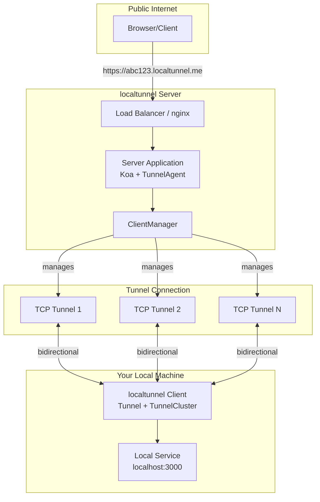
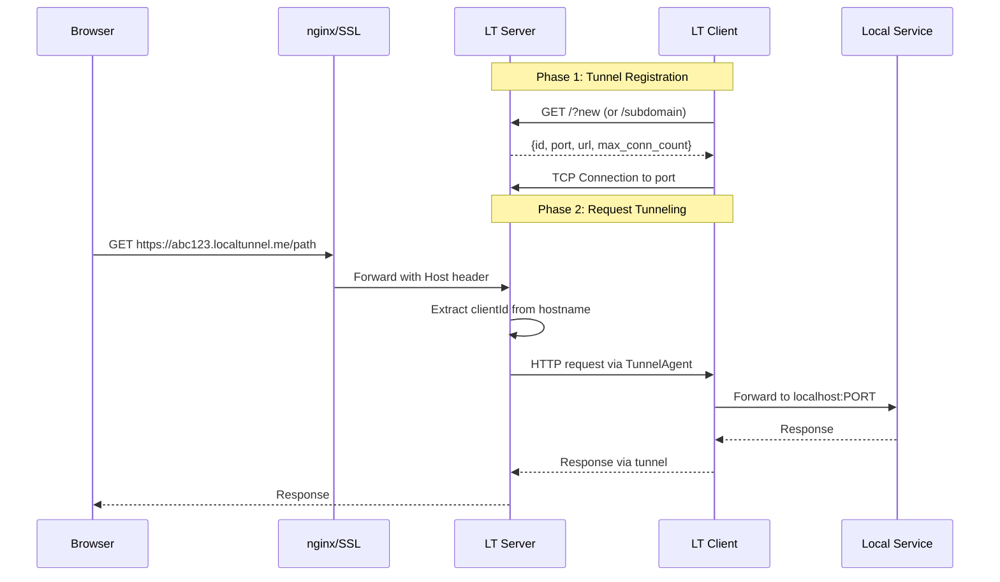
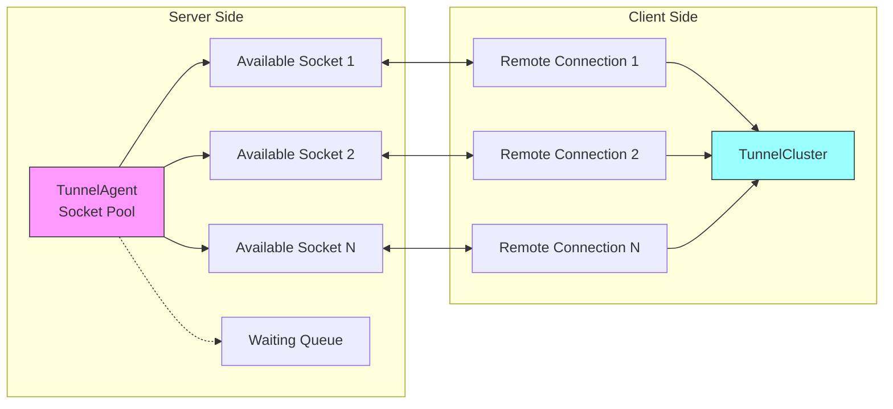
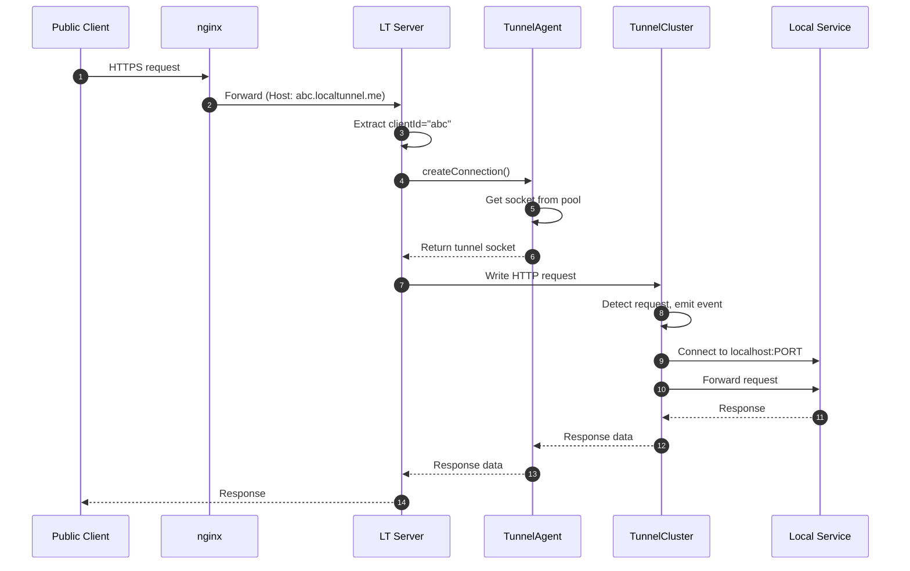
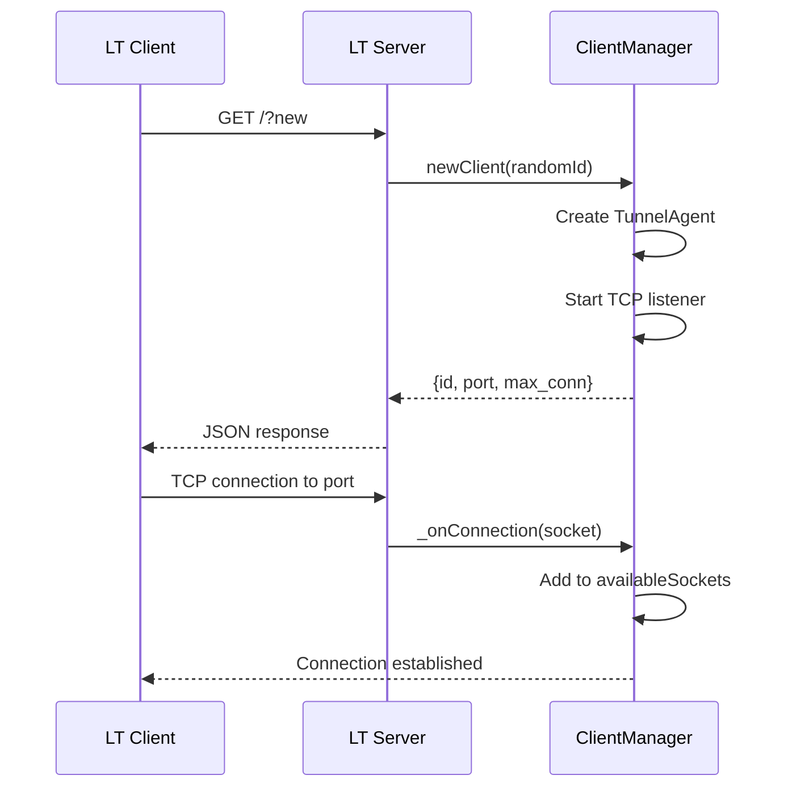

# Project Exploration: localtunnel

## Overview

localtunnel is a localhost tunneling service that exposes local development servers to the public internet, providing an open-source alternative to ngrok. The system works by establishing persistent TCP connections from a client running on your local machine to a central server, which then forwards incoming public requests back through the tunnel to your localhost service.

The codebase contains four distinct components: a Node.js client library (`localtunnel/`), a Node.js server implementation (`server/`), a Go client library (`go-localtunnel/`), and nginx configuration for production deployment (`nginx/`). This exploration covers all four components, explaining how they work together to create secure, bidirectional tunnels between public URLs and local services.

## Repository

- **Location:** `/home/darkvoid/Boxxed/@formulas/Others/src.localtunnel`
- **Remote:** N/A - not a git repository (source copies from multiple upstream repos)
- **Primary Languages:** JavaScript (Node.js), Go
- **License:** MIT (Node.js components), MPLv2 (Go component)

## Directory Structure

```
/home/darkvoid/Boxxed/@formulas/Others/src.localtunnel/
├── localtunnel/                          # Node.js client library
│   ├── bin/
│   │   └── lt.js                         # CLI entry point
│   ├── lib/
│   │   ├── Tunnel.js                     # Main tunnel client class
│   │   ├── TunnelCluster.js              # Connection multiplexing manager
│   │   └── HeaderHostTransformer.js      # HTTP Host header rewriter
│   ├── localtunnel.js                    # Module entry point (API)
│   ├── localtunnel.spec.js               # Test suite
│   ├── package.json                      # Dependencies: axios, debug, yargs
│   ├── LICENSE                           # MIT License
│   ├── README.md                         # Usage documentation
│   ├── CHANGELOG.md                      # Version history (up to 2.0.2)
│   └── yarn.lock
│
├── server/                               # Node.js server implementation
│   ├── bin/
│   │   └── server                        # Server CLI entry point
│   ├── lib/
│   │   ├── Client.js                     # Per-client request handler
│   │   ├── ClientManager.js              # Manages multiple tunnel clients
│   │   ├── TunnelAgent.js                # HTTP Agent for socket pooling
│   │   ├── Client.test.js                # Client tests
│   │   ├── ClientManager.test.js         # Manager tests
│   │   └── TunnelAgent.test.js           # Agent tests
│   ├── server.js                         # Main server factory (Koa-based)
│   ├── server.test.js                    # Integration tests
│   ├── package.json                      # Dependencies: koa, book, tldjs
│   ├── LICENSE                           # MIT License
│   ├── README.md                         # Server setup guide
│   └── Dockerfile                        # Alpine-based container
│
├── go-localtunnel/                       # Go client implementation
│   ├── localtunnel.go                    # LocalTunnel struct and forwarder
│   ├── listener.go                       # net.Listener implementation
│   ├── conn.go                           # Connection wrapper with buffering
│   ├── options.go                        # Configuration options
│   ├── addr.go                           # net.Addr implementation
│   ├── errors.go                         # Error definitions
│   ├── util.go                           # Atomic counter utility
│   ├── doc.go                            # Package documentation
│   ├── localtunnel_test.go               # Go tests
│   ├── LICENSE                           # MPLv2 License
│   └── README.md                         # Go usage examples
│
└── nginx/                                # Production nginx configuration
    ├── nginx.conf                        # Main nginx configuration
    ├── site.conf                         # Virtual host with SSL/HTTP2
    ├── Dockerfile                        # nginx:alpine based image
    ├── README.md                         # Deployment instructions
    └── .dockerignore
```

## Architecture

### High-Level System Architecture



### Tunnel Connection Flow



### Connection Multiplexing



## Component Breakdown

### localtunnel Client (Node.js)

#### Tunnel (`lib/Tunnel.js`)
- **Location:** `localtunnel/lib/Tunnel.js`
- **Purpose:** Main client class that establishes the tunnel connection
- **Dependencies:** axios (HTTP requests), events.EventEmitter, TunnelCluster
- **Key Features:**
  - Promise-based API with callback compatibility
  - Automatic reconnection on tunnel death
  - Event emission for 'url', 'error', 'close', and 'request'
  - Support for multiple concurrent tunnels (max_conn)

The Tunnel class handles the initial registration with the server, obtaining tunnel metadata (ID, port, URL), then delegates to TunnelCluster to maintain active connections.

#### TunnelCluster (`lib/TunnelCluster.js`)
- **Location:** `localtunnel/lib/TunnelCluster.js`
- **Purpose:** Manages groups of tunnel connections for connection pooling
- **Dependencies:** net, tls, fs, HeaderHostTransformer
- **Key Features:**
  - Creates TCP connections to the remote server
  - Pipes remote connections to local HTTP/HTTPS server
  - Supports both HTTP and HTTPS local targets
  - Automatically reconnects on connection death
  - Emits 'open', 'dead', 'error', and 'request' events

The cluster opens multiple parallel tunnels (up to max_conn) to handle concurrent requests efficiently.

#### HeaderHostTransformer (`lib/HeaderHostTransformer.js`)
- **Location:** `localtunnel/lib/HeaderHostTransformer.js`
- **Purpose:** Stream transformer that rewrites HTTP Host headers
- **Dependencies:** stream.Transform
- **Key Features:**
  - Replaces Host header with custom local_host value
  - Single-pass transformation (becomes passthrough after first match)
  - Enables tunneling to hostname-based local services

#### CLI (`bin/lt.js`)
- **Location:** `localtunnel/bin/lt.js`
- **Purpose:** Command-line interface for quick tunnel setup
- **Key Options:**
  - `--port` (required): Local port to expose
  - `--subdomain`: Request specific subdomain
  - `--local-host`: Tunnel to different hostname
  - `--local-https`: Enable HTTPS local target
  - `--open`: Open URL in browser
  - `--print-requests`: Log incoming requests

### localtunnel Server (Node.js)

#### Server Factory (`server.js`)
- **Location:** `server/server.js`
- **Purpose:** Creates the main HTTP server using Koa framework
- **Dependencies:** Koa, koa-router, tldjs, ClientManager
- **Key Features:**
  - Extracts client ID from subdomain using TLD parsing
  - Routes requests to appropriate client handler
  - REST API for status and tunnel management
  - WebSocket upgrade support

The server listens on a configurable port and uses subdomain-based routing to direct traffic to the correct tunnel client.

#### ClientManager (`lib/ClientManager.js`)
- **Location:** `server/lib/ClientManager.js`
- **Purpose:** Manages the lifecycle of tunnel clients
- **Dependencies:** human-readable-ids, Client, TunnelAgent
- **Key Features:**
  - Creates unique client IDs (human-readable)
  - Prevents duplicate ID registration
  - Tracks statistics (active tunnels)
  - Handles client cleanup on close

#### Client (`lib/Client.js`)
- **Location:** `server/lib/Client.js`
- **Purpose:** Handles individual client request/response routing
- **Dependencies:** http, pump, events.EventEmitter
- **Key Features:**
  - Grace timeout for client connection
  - HTTP request forwarding via TunnelAgent
  - WebSocket upgrade handling
  - Error handling and cleanup

#### TunnelAgent (`lib/TunnelAgent.js`)
- **Location:** `server/lib/TunnelAgent.js`
- **Purpose:** Custom HTTP Agent for socket pooling
- **Dependencies:** http.Agent, net.createServer
- **Key Features:**
  - Maintains pool of available tunnel sockets
  - Queues connection requests when no sockets available
  - Enforces max socket limits per client
  - Emits 'online'/'offline' events based on connectivity

The TunnelAgent is the core innovation - it extends Node's http.Agent to use incoming tunnel connections instead of creating outbound connections.

### go-localtunnel (Go)

#### LocalTunnel (`localtunnel.go`)
- **Location:** `go-localtunnel/localtunnel.go`
- **Purpose:** Main tunnel forwarder struct
- **Key Features:**
  - Simple New() constructor
  - Automatic bidirectional forwarding
  - URL() method for public endpoint
  - Clean Close() method

#### Listener (`listener.go`)
- **Location:** `go-localtunnel/listener.go`
- **Purpose:** Implements net.Listener interface
- **Key Features:**
  - Registers tunnel with server (HTTP GET)
  - Maintains multiple proxy goroutines
  - Context-based cancellation
  - Atomic connection counting
  - Automatic reconnection with exponential backoff

The Listener abstraction allows the Go implementation to integrate directly with Go's http.Server:

```go
listener, _ := localtunnel.Listen(localtunnel.Options{})
server := http.Server{Handler: myHandler}
server.Serve(listener)
```

#### Connection Wrapper (`conn.go`)
- **Location:** `go-localtunnel/conn.go`
- **Purpose:** Wraps net.Conn with buffering for Accept() semantics
- **Key Features:**
  - Single-byte buffer for peek operations
  - sync.Once for single close signaling
  - Mutex-protected read operations

## Entry Points

### Node.js Client

| Entry Point | File | Description |
|-------------|------|-------------|
| CLI Command | `localtunnel/bin/lt.js` | `lt --port 3000` |
| Module API | `localtunnel/localtunnel.js` | `require('localtunnel')` |

**CLI Flow:**
1. Parse arguments with yargs
2. Call localtunnel() with options
3. Await tunnel establishment
4. Print URL, optionally open browser
5. Listen for request events if --print-requests

**API Flow:**
```javascript
const tunnel = await localtunnel({ port: 3000 });
console.log(tunnel.url);
tunnel.on('request', info => console.log(info));
tunnel.on('close', () => console.log('closed'));
```

### Node.js Server

| Entry Point | File | Description |
|-------------|------|-------------|
| CLI Command | `server/bin/server` | `node -r esm ./bin/server` |
| Module API | `server/server.js` | `import createServer` |

**Server Flow:**
1. Parse CLI options (port, address, domain, max-sockets)
2. Create server with CreateServer()
3. Listen on specified port/address
4. Handle requests via subdomain routing

### Go Client

| Entry Point | File | Description |
|-------------|------|-------------|
| Listener API | `go-localtunnel/listener.go` | `localtunnel.Listen()` |
| Forwarder API | `go-localtunnel/localtunnel.go` | `localtunnel.New()` |

**Go Flow (Listener):**
```go
listener, err := localtunnel.Listen(localtunnel.Options{
    Subdomain: "myapp",
    BaseURL:   "https://localtunnel.me",
})
http.Serve(listener, handler)
```

**Go Flow (Forwarder):**
```go
tunnel, err := localtunnel.New(8080, "localhost", localtunnel.Options{})
fmt.Println(tunnel.URL())
defer tunnel.Close()
```

## Data Flow

### Request Processing Sequence



### Tunnel Establishment



## External Dependencies

### Node.js Client (localtunnel)

| Dependency | Version | Purpose |
|------------|---------|---------|
| axios | 0.21.4 | HTTP client for tunnel registration |
| debug | 4.3.2 | Namespaced debugging output |
| openurl | 1.1.1 | Open URL in browser (--open flag) |
| yargs | 17.1.1 | CLI argument parsing |
| mocha | ~9.1.1 | Test framework (dev) |

### Node.js Server (server)

| Dependency | Version | Purpose |
|------------|---------|---------|
| koa | 2.5.1 | Web framework |
| koa-router | 7.4.0 | Routing middleware |
| book | 1.3.3 | Logging utility |
| debug | 3.1.0 | Debug output |
| tldjs | 2.3.1 | TLD/subdomain parsing |
| human-readable-ids | 1.0.3 | Generate readable IDs |
| pump | 3.0.0 | Stream piping with cleanup |
| optimist | 0.6.1 | CLI argument parsing |
| esm | 3.0.34 | ES modules support |
| mocha | 5.1.1 | Test framework (dev) |
| ws | 5.1.1 | WebSocket support (dev) |

### Go Client (go-localtunnel)

| Dependency | Purpose |
|------------|---------|
| context | Context-based cancellation |
| encoding/json | Server response parsing |
| net/http | Tunnel registration |
| sync | Mutex and condition variables |
| time | Reconnection backoff |

## Configuration

### Node.js Client Options

```javascript
{
  port: 3000,                    // Required: local port
  host: 'https://localtunnel.me', // Server URL
  subdomain: 'myapp',            // Requested subdomain
  local_host: 'myservice.local', // Host header override
  local_https: false,            // Tunnel to HTTPS server
  local_cert: '/path/cert.pem',  // Certificate for HTTPS
  local_key: '/path/key.pem',    // Private key
  local_ca: '/path/ca.pem',      // CA for self-signed
  allow_invalid_cert: false,     // Skip cert validation
}
```

### Node.js Server Options

```javascript
{
  port: 80,                      // Listen port
  address: '0.0.0.0',            // Bind address
  secure: false,                 // Enable HTTPS
  domain: 'lt.example.com',      // Base domain (if subdomain)
  max_sockets: 10,               // Max tunnels per client
}
```

### Go Client Options

```go
localtunnel.Options{
    Subdomain:      "myapp",
    BaseURL:        "https://localtunnel.me",
    MaxConnections: 10,
    Log:            log.New(os.Stdout, "", 0),
}
```

### Environment Variables

| Variable | Component | Description |
|----------|-----------|-------------|
| PORT | Client | Local port (CLI shortcut) |
| NODE_ENV | Server | Set to 'production' |

## Testing

### Node.js Client Tests

- **File:** `localtunnel/localtunnel.spec.js`
- **Framework:** Mocha
- **Runner:** `yarn test` or `npm test`
- **Coverage:** Tunnel instantiation, connection handling, error scenarios

### Node.js Server Tests

- **Files:** `server/*.test.js`, `server/lib/*.test.js`
- **Framework:** Mocha with esm loader
- **Runner:** `npm test`
- **Test Areas:**
  - Client creation and lifecycle
  - ClientManager statistics
  - TunnelAgent socket pooling
  - Request routing

### Go Client Tests

- **File:** `go-localtunnel/localtunnel_test.go`
- **Framework:** Go testing package
- **Runner:** `go test`
- **Coverage:** Listener creation, connection handling, error cases

## Key Insights

### Architectural Highlights

1. **Reverse Connection Pattern:** The client initiates the connection to the server, not vice versa. This allows tunneling through NAT and firewalls without port forwarding configuration.

2. **Connection Pooling:** Multiple parallel TCP connections are maintained between client and server, allowing concurrent request handling without blocking.

3. **HTTP Agent Extension:** The server's TunnelAgent extends Node's http.Agent to use incoming tunnel connections instead of creating outbound ones - an elegant inversion of the typical HTTP client pattern.

4. **Subdomain Routing:** Client identification is derived from the Host header subdomain, eliminating the need for explicit client IDs in requests.

5. **Graceful Degradation:** Both client and server implement automatic reconnection logic with exponential backoff for resilience.

### Node.js vs Go Implementation Comparison

| Aspect | Node.js | Go |
|--------|---------|-----|
| **API Style** | EventEmitter + Promise | net.Listener interface |
| **Concurrency** | Event loop + multiple sockets | Goroutines per connection |
| **Integration** | Module import | http.Server.Serve() |
| **Connection Mgmt** | TunnelCluster manages sockets | proxy() goroutines |
| **Complexity** | More moving parts | Simpler, fewer files |

The Go implementation is notably more concise, leveraging Go's built-in net.Listener abstraction to integrate seamlessly with the standard library HTTP server.

### Security Considerations

1. **No Authentication:** The default implementation has no authentication - anyone who knows your subdomain can access your tunnel.

2. **Host Header Injection:** The HeaderHostTransformer modifies Host headers, which could be exploited if the local service trusts this header.

3. **Certificate Validation:** The `allow_invalid_cert` option disables TLS verification for local HTTPS targets.

4. **Subdomain Enumeration:** Human-readable IDs are predictable, making subdomain enumeration trivial.

### Production Deployment Notes

- The nginx configuration includes SSL termination with HTTP/2 support
- TLS 1.0, 1.1, and 1.2 are enabled (consider disabling 1.0/1.1)
- Worker connections set to 10000 for high concurrency
- Server should run behind a reverse proxy for SSL termination
- Docker images provided for both server and nginx

## Open Questions

1. **Caching Proxy:** The code references `cached_url` in the client, but the server doesn't appear to implement this. What proxy servers support this feature?

2. **WebSocket Scalability:** How does the system handle high volumes of concurrent WebSocket connections? The current socket pooling may become a bottleneck.

3. **Rate Limiting:** There's no visible rate limiting in the server code. How is abuse prevented in production deployments?

4. **IPv6 Support:** The nginx config includes IPv6 listeners, but is the tunnel protocol itself IPv6-capable end-to-end?

5. **Authentication Extension:** What would be required to add authentication to prevent unauthorized access to tunnels?

6. **Metrics/Monitoring:** The server has a `/api/status` endpoint, but what observability tools integrate with localtunnel for production monitoring?