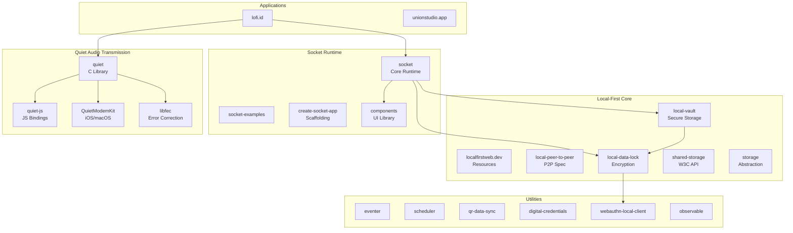
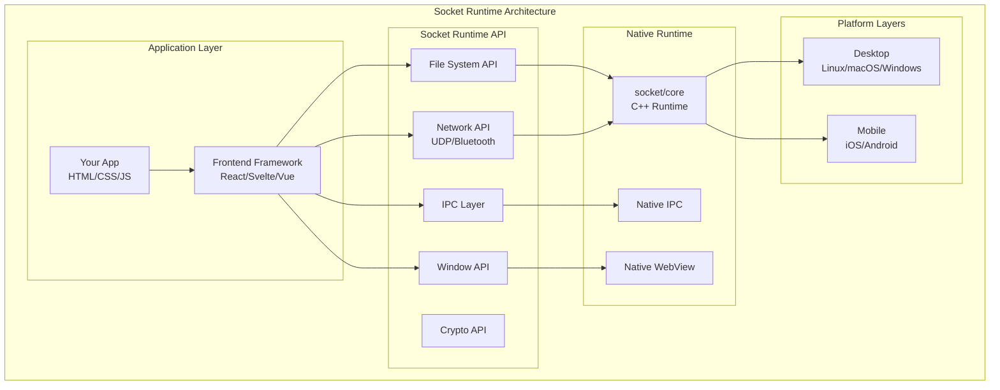
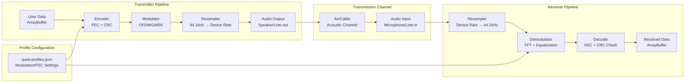
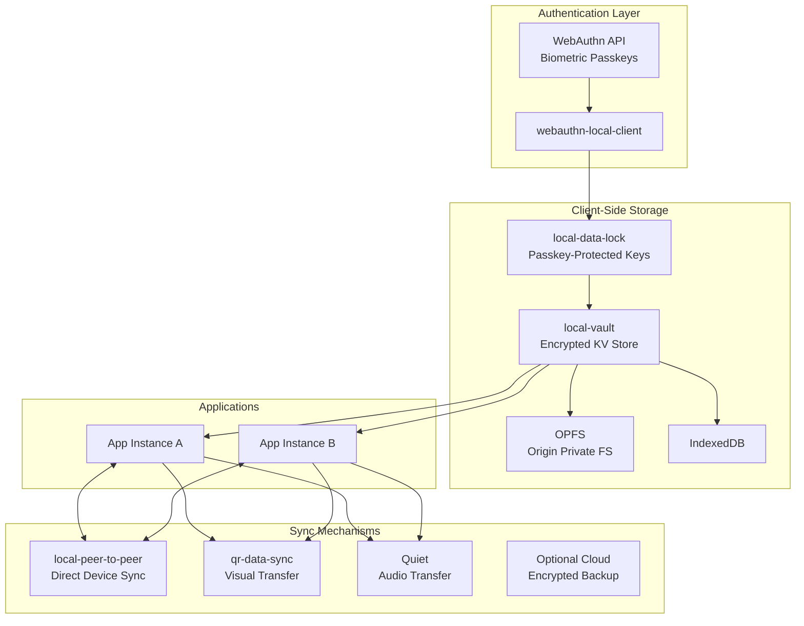

# Project Exploration: Lofi Local-First Software Ecosystem

## Overview

This repository contains a comprehensive collection of 30+ projects related to **local-first software development**, **peer-to-peer (P2P) networking**, and **audio-based data transmission**. The projects are organized under the "lofi" (local-first) movement, which emphasizes building applications where data is co-located with its UI, works offline, synchronizes between clients, and gives users ownership of their data.

The ecosystem spans several categories:

1. **Core Local-First Infrastructure**: Storage abstractions, encryption, and shared storage APIs
2. **Socket Runtime**: A cross-platform runtime for building desktop/mobile apps with web technologies and native P2P capabilities
3. **Quiet Project**: Audio-based data transmission using ultrasonic and audible sound waves
4. **UI Components**: Web components and reactive libraries for building local-first interfaces
5. **Utilities**: Event handling, scheduling, QR sync, digital credentials, and authentication

This collection represents a comprehensive approach to local-first development, from low-level audio modulation (Quiet) to high-level application frameworks (Socket Runtime) to secure local storage (local-vault, local-data-lock).

## Repository

- **Location:** `/home/darkvoid/Boxxed/@formulas/Others/src.lofi`
- **Remote:** N/A - not a git repository (appears to be a mirror or submodule collection)
- **Primary Languages:** JavaScript, TypeScript, C, Swift
- **License:** Varies by project (MIT, BSD, Apache)

## Directory Structure

```
src.lofi/
├── CORE LOCAL-FIRST PROJECTS
│   ├── localfirstweb.dev/          # Local-first web development resources/directory
│   ├── local-peer-to-peer/         # P2P networking API specification (W3C draft)
│   ├── local-data-lock/            # Encryption/decryption with WebAuthn passkeys
│   ├── local-vault/                # Encrypted key-value storage with biometric auth
│   ├── shared-storage/             # W3C Shared Storage API specification
│   └── storage/                    # Storage abstraction (@byojs/storage)
│
├── SOCKET RUNTIME ECOSYSTEM
│   ├── socket/                     # Main Socket Runtime (cross-platform app framework)
│   ├── socket-examples/            # Example Socket applications
│   ├── socket-service-worker-examples/
│   ├── socket-service-worker-weather-example/
│   ├── create-socket-app/          # Scaffolding tool for Socket apps
│   ├── components/                 # UI component library (Tonic-based)
│   ├── tonic/                      # Web component framework
│   ├── modal/                      # Modal dialog component
│   └── toggler/                    # Toggle switch component
│
├── QUIET AUDIO TRANSMISSION ECOSYSTEM
│   ├── quiet/                      # Core C library for audio data transmission
│   ├── quiet-js/                   # JavaScript/Emscripten bindings for Quiet
│   ├── QuietModemKit/              # iOS/macOS framework for Quiet
│   ├── libfec/                     # Forward error correction library
│   └── libcorrect/                 # Error correction library
│
├── UTILITIES & TOOLS
│   ├── eventer/                    # Event handling utilities
│   ├── scheduler/                  # Task scheduling
│   ├── qr-data-sync/               # QR code-based data synchronization
│   ├── digital-credentials/        # Digital credential specification
│   ├── webauthn-local-client/      # WebAuthn local authentication
│   └── observable/                 # Reactive observable library (W3C spec)
│
└── APPLICATIONS
    ├── lofi.id/                    # Main lofi application
    └── unionstudio.app/            # Studio application
```

## Architecture

### High-Level Ecosystem Diagram



### Socket P2P Connection Architecture



### Quiet Audio Data Transmission Pipeline



### Local-First Sync Architecture



## Component Breakdown

### Socket Runtime

**Location:** `socket/`

**Purpose:** Cross-platform runtime for building desktop and mobile applications using web technologies (HTML, CSS, JavaScript) with native capabilities including P2P networking, file system access, and more.

**Key Features:**
- Zero external dependencies
- Native WebView rendering per platform
- Full Node.js-like API compatibility (fs, http, crypto, dgram, etc.)
- Built-in P2P capabilities (Bluetooth, UDP)
- Secure sandboxed JavaScript environment

**Entry Points:**
- `socket/src/app/app.cc` - Main application entry
- `socket/src/cli/cli.cc` - Command-line interface
- `socket/api/index.js` - JavaScript API surface

**Dependencies:**
| Dependency | Purpose |
|------------|---------|
| libsodium | Cryptographic operations |
| libuv | Async I/O (platform-dependent) |
| WebKitGTK/WKWebView | Native WebView rendering |
| PortAudio | Audio I/O (optional) |

### Quiet (Audio Data Transmission)

**Location:** `quiet/`

**Purpose:** C library for transmitting data through sound waves, supporting both audible and ultrasonic transmission across air or cable connections.

**Architecture Components:**

| Component | File | Purpose |
|-----------|------|---------|
| Encoder | `src/encoder.c` | Encodes data into audio samples |
| Decoder | `src/decoder.c` | Decodes audio samples to data |
| Modulator | `src/modulator.c` | Modulates signal onto carrier frequency |
| Demodulator | `src/demodulator.c` | Demodulates received signal |
| Ring Buffer | `src/ring*.c` | Lock-free ring buffers for audio I/O |
| Profiles | `quiet-profiles.json` | Configuration presets |

**Transmission Profiles:**
- **cable-*:** Full-spectrum profiles for 3.5mm cable transmission (~64 kbps)
- **ultrasonic-*:** Above 16kHz, inaudible to humans (~7 kbps)
- **robust:** Error-resistant profiles for noisy environments

**Error Correction Options:**
- Convolutional codes (various rates)
- Reed-Solomon codes
- Block codes (Hamming, Golay, SEC-DED)

**Dependencies:**
| Dependency | Purpose |
|------------|---------|
| liquid-dsp | Software-defined radio processing |
| libfec | Forward error correction |
| libjansson | JSON parsing for profiles |
| PortAudio | Sound card I/O (optional) |
| libsndfile | WAV file I/O (optional) |

### QuietModemKit (iOS/macOS)

**Location:** `QuietModemKit/`

**Purpose:** iOS/macOS framework wrapping the Quiet C library for native Apple platform integration.

**Key Classes:**
- `QMFrameTransmitter` - Audio data transmitter
- `QMFrameReceiver` - Audio data receiver
- `QMTransmitterConfig` / `QMReceiverConfig` - Configuration
- `QMSocket` / `QMUdpSocket` / `QMTcpSocket` - Network abstraction

### Local Data Lock

**Location:** `local-data-lock/`

**Purpose:** Encryption/decryption library using cryptographic keys protected by WebAuthn biometric passkeys.

**Key API:**
```javascript
// Register new local account with passkey
var key = await getLockKey({ addNewPasskey: true });

// Encrypt data
var encData = await lockData({ hello: "World!" }, key);

// Decrypt data
var data = await unlockData(encData, key);

// Sign and verify
var sig = signData(data, key);
var valid = verifySignature(data, key, sig);
```

**Storage Adapters:** IndexedDB (default), LocalStorage, SessionStorage, Cookie, OPFS

### Local Vault

**Location:** `local-vault/`

**Purpose:** Encrypted key-value storage built on top of Local Data Lock.

**Key Features:**
- Multiple storage adapters (IDB, LocalStorage, OPFS, Cookie)
- Biometric passkey protection via WebAuthn
- Automatic key caching with configurable lifetime

**Dependencies:**
| Dependency | Purpose |
|------------|---------|
| @lo-fi/local-data-lock | Encryption key management |
| @byojs/storage | Storage abstraction layer |
| idb-keyval | IndexedDB convenience |

### Components (UI Library)

**Location:** `components/`

**Purpose:** Collection of web components built with Tonic framework for local-first application UIs.

**Available Components:**
- accordion, badge, button, chart, checkbox
- dialog, form, icon, input, loader
- panel, popover, profile-image, progress-bar
- range, relative-time, router, select, split
- sprite, tabs, textarea, toaster, toggle, tooltip
- windowed (virtualized lists)

**Theme System:** CSS custom properties for light/dark theming

## Entry Points and Execution Flows

### Socket App Execution Flow

1. **App Initialization:**
   - `ssc build` compiles app with Socket Runtime
   - Native binary bundles WebView + JavaScript + `socket.ini` config

2. **Runtime Startup:**
   - `app.cc` initializes native runtime
   - Creates WebView instance
   - Loads application JavaScript

3. **API Access:**
   - JavaScript imports from `socket:` protocol
   - IPC layer routes requests to native implementations
   - Results returned via promises/events

### Quiet Transmission Flow

1. **Transmitter Setup:**
   ```javascript
   Quiet.init({
     profilesPrefix: "/",
     memoryInitializerPrefix: "/",
     libfecPrefix: "/"
   });

   Quiet.addReadyCallback(() => {
     var tx = Quiet.transmitter({ profile: "ultrasonic-experimental" });
     tx.transmit(Quiet.str2ab("Hello, World!"));
   });
   ```

2. **Encoding Pipeline:**
   - Data split into frames
   - FEC encoding applied
   - Modulation (OFDM/GMSK/PSK/QAM)
   - Resampling to device rate
   - Audio playback

3. **Receiver Setup:**
   ```javascript
   Quiet.receiver({
     profile: "ultrasonic-experimental",
     onReceive: (payload) => {
       console.log(Quiet.ab2str(payload));
     }
   });
   ```

4. **Decoding Pipeline:**
   - Microphone input captured
   - Resampling to 44.1kHz
   - Demodulation (FFT, equalization)
   - FEC decoding
   - CRC verification
   - Data delivered to callback

### Local-First Data Flow

1. **Initial Setup:**
   ```javascript
   import { getLockKey, lockData, unlockData } from "@lo-fi/local-data-lock";

   // Register with biometric
   const key = await getLockKey({
     addNewPasskey: true,
     username: "user@example.com",
     displayName: "User Name"
   });
   ```

2. **Write Path:**
   - Application calls `lockData(data, key)`
   - Key retrieved from cache or via WebAuthn
   - Data encrypted with libsodium
   - Stored in vault (IDB/LocalStorage/OPFS)

3. **Read Path:**
   - Application calls `unlockData(encData, key)`
   - Key retrieved from cache or via WebAuthn
   - Data decrypted
   - JSON parsed (optional)
   - Returned to application

## External Dependencies

### Core Dependencies

| Project | Primary Dependencies | Purpose |
|---------|---------------------|---------|
| socket | libsodium, libuv, WebKit | Crypto, async I/O, WebView |
| quiet | liquid-dsp, libfec, libjansson | DSP, error correction, JSON |
| quiet-js | emscripten | C→JavaScript compilation |
| QuietModemKit | CMake, liquid-dsp, libcorrect | Build system, DSP |
| local-data-lock | @lo-fi/webauthn-local-client | WebAuthn API |
| local-vault | @lo-fi/local-data-lock, @byojs/storage | Encryption, storage |
| components | @socketsupply/tonic | Web component base |

### JavaScript/TypeScript Dependencies

```json
{
  "socket": {
    "devDependencies": ["acorn", "typescript", "standard"],
    "optionalDependencies": ["@socketsupply/latica"]
  },
  "local-data-lock": {
    "dependencies": ["@byojs/storage", "@lo-fi/webauthn-local-client"],
    "devDependencies": ["terser", "micromatch"]
  },
  "qr-data-sync": {
    "external": ["qrcode.js"]
  }
}
```

## Configuration

### Socket Configuration (`socket.ini`)

```ini
[app]
name = MyApp
bundle = com.example.myapp

[window]
width = 1200
height = 800
resizable = true

[network]
p2p = true
bluetooth = true
```

### Quiet Profiles (`quiet-profiles.json`)

```json
{
  "ultrasonic-experimental": {
    "ofdmopt": { ... },
    "modopt": { "center_rads": 0.87 },
    "mod_scheme": "qpsk",
    "inner_fec_scheme": "conv_12_7",
    "outer_fec_scheme": "reed_solomon_223_255"
  },
  "cable-fast": {
    "mod_scheme": "qask64",
    "inner_fec_scheme": "conv_12_9"
  }
}
```

### Local Data Lock Configuration

```javascript
import { configure } from "@lo-fi/local-data-lock";

configure({
  cacheLifetime: 30 * 60 * 1000,  // 30 minutes
  accountStorage: "idb"           // or "local-storage", "cookie", "opfs"
});
```

## Testing

### Socket Testing

```bash
npm test                    # Full test suite
npm run test:runtime-core   # Runtime core tests
npm run test:ios-simulator  # iOS simulator tests
npm run test:android        # Android emulator tests
```

Test structure: `test/src/` contains TAP-format tests for all APIs

### Quiet Testing

```bash
cd quiet/build
make test                   # C test suite
```

Test files:
- `tests/integration.c` - End-to-end encoding/decoding
- `tests/ring_atomic.c` - Lock-free ring buffer tests
- `tests/ring_blocking.c` - Blocking ring buffer tests

### Local-First Libraries

```bash
npm test                    # Starts local HTTP server
# Visit http://localhost:8080 for interactive tests
```

Note: Tests require manual interaction (biometric auth cannot be automated)

## Key Insights

### Socket Runtime

1. **Zero Dependencies:** Socket Runtime has minimal external dependencies, making it smaller and faster than Electron (typically ~10MB vs ~150MB)

2. **Native APIs:** Implements Node.js-compatible APIs natively in C++, not through bundling Node.js

3. **P2P First:** Bluetooth and UDP APIs are first-class citizens, enabling local-first and P2P architectures

4. **Security Model:** JavaScript runs in a sandboxed environment without direct file system or network access - all operations go through audited native APIs

### Quiet Audio Transmission

1. **Profile Flexibility:** The JSON profile system allows tuning modulation schemes, error correction, and carrier frequencies without recompilation

2. **Emscripten Port:** The JavaScript version is a direct compilation of the C library, ensuring feature parity

3. **Ultrasonic Capability:** Near-ultrasonic profiles (17+ kHz) enable inaudible data transmission for better UX

4. **Error Resilience:** Multiple FEC schemes and CRC checking provide robust transmission even in noisy environments

5. **Browser Compatibility:** Transmitter works on all modern browsers; receiver requires getUserMedia support (not available on Safari)

### Local-First Storage

1. **Passkey Security:** Cryptographic keys are never stored on disk - they're extracted from WebAuthn passkeys only when needed

2. **Key Caching:** Keys are cached in memory for configurable time periods (default 30 minutes) to balance security and UX

3. **Adapter Pattern:** Storage adapter abstraction allows using IndexedDB, LocalStorage, OPFS, or cookies interchangeably

4. **Biometric Auth:** FaceID, TouchID, or device PIN protects all encryption/decryption operations

### Architecture Patterns

1. **Worklet Isolation:** Shared Storage and similar APIs use isolated worklet environments to prevent data leakage

2. **Write-Anywhere, Read-Restricted:** Local-first storage APIs allow writing from any context but restrict reading to controlled environments

3. **Privacy Budgets:** APIs like Shared Storage implement privacy budgets to prevent tracking abuse

## Open Questions

1. **Socket Runtime Adoption:** How does Socket Runtime compare to Tauri or Electron in terms of real-world adoption and ecosystem maturity?

2. **Quiet Performance:** What are the real-world throughput and error rates for ultrasonic transmission in various environments (quiet room, noisy cafe, etc.)?

3. **P2P Sync Strategy:** How do the P2P sync mechanisms handle conflict resolution when multiple devices modify the same data?

4. **WebAuthn Limitations:** What are the limitations of WebAuthn for local-only authentication (e.g., cross-device recovery scenarios)?

5. **OPFS Support:** What is the current browser support status for Origin Private File System, and how does local-vault handle fallback?

6. **Quiet Mobile Performance:** How does audio transmission perform on mobile devices with varying audio hardware quality and sample rates?

7. **Service Worker Integration:** How deeply is Service Worker integration implemented in the Socket Runtime for offline-first capabilities?

## Related Resources

- **Local-First Web:** https://localfirstweb.dev - Curated resources for local-first development
- **W3C Specs:** Several projects in this collection are W3C specifications (shared-storage, observable, local-peer-to-peer, digital-credentials)
- **Socket Runtime:** https://socketsupply.co - Cross-platform app runtime
- **Quiet Project:** https://github.com/quiet/quiet - Audio data transmission library

---

*This exploration covers the lofi ecosystem as of 2026-03-20. The projects represent a comprehensive approach to local-first software development, from low-level audio transmission to high-level application frameworks.*
