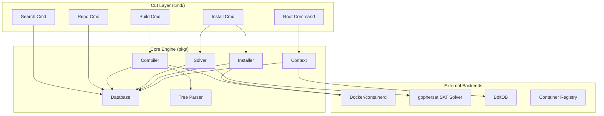
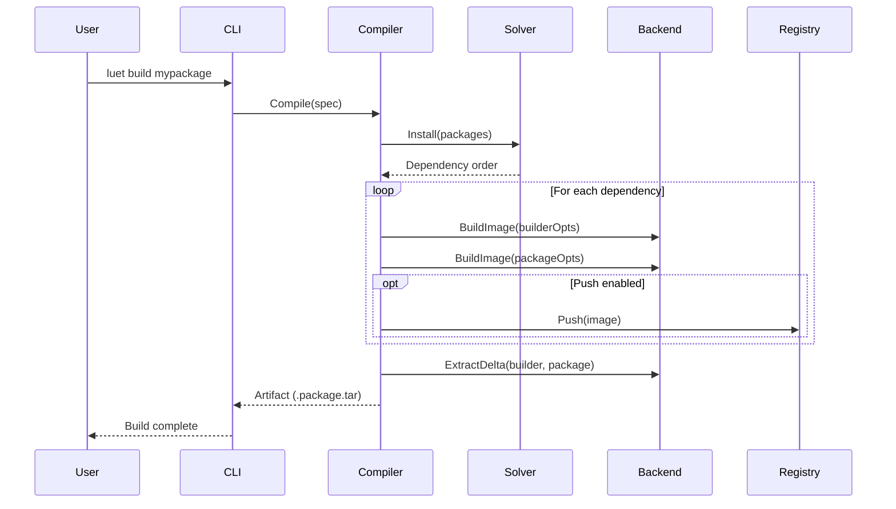
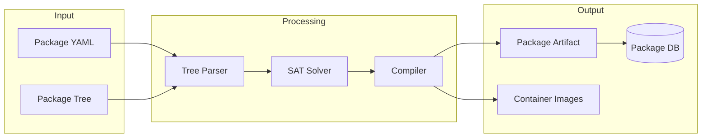

# Project Exploration: luet

## Overview

**luet** is a container-based package manager written in Go. It uses Docker (and other container runtimes) to build packages, making it suitable for "from scratch" environments with zero dependencies. The tool is designed for Edge computing, IoT embedded devices, and Linux From Scratch installations.

Key characteristics:
- **Container-based builds**: Uses Docker/img/containerd to build packages from container images
- **SAT-based dependency solving**: Encodes package requirements into boolean formulas solved by gophersat
- **Reinforcement learning**: Optional Q-learning agent for conflict resolution
- **Zero-dependency installer**: Single statically-compiled binary
- **Layered packages**: Can build packages as container layers
- **Collections support**: Templated package definitions and collections

The project draws heavy inspiration from Gentoo's portage tree hierarchy and uses SAT solving techniques from the OPIUM research paper for dependency resolution.

## Repository

- **Location:** `/home/darkvoid/Boxxed/@formulas/src.rust/src.Containers/luet`
- **Remote:** git@github.com:mudler/luet.git
- **Primary Language:** Go (golang 1.23+)
- **License:** GPLv3

## Directory Structure

```
luet/
├── cmd/                          # CLI command definitions (Cobra commands)
│   ├── root.go                   # Root command setup
│   ├── build.go                  # luet build command
│   ├── install.go                # luet install command
│   ├── search.go                 # luet search command
│   ├── repo/                     # Repository management subcommands
│   ├── tree/                     # Tree operations (bump, validate, images)
│   ├── database/                 # Database operations
│   ├── helpers/                  # CLI helpers
│   └── util/                     # Utility functions (config, system)
├── pkg/                          # Core library packages
│   ├── api/                      # API definitions and core types
│   │   ├── core/
│   │   │   ├── context/          # Application context (logger, config, GC)
│   │   │   ├── types/            # Core types (Package, Solver, Repository)
│   │   │   ├── image/            # Image manipulation (extract, delta, cache)
│   │   │   ├── logger/           # Logging abstraction
│   │   │   ├── template/         # Go template rendering
│   │   │   ├── config/           # Config protection (etc-style)
│   │   │   └── bus/              # Event bus for plugins
│   │   └── client/               # Remote client operations
│   ├── compiler/                 # Package compilation engine
│   │   ├── compiler.go           # Main compiler logic
│   │   ├── buildtree.go          # Dependency tree building
│   │   ├── imagehashtree.go      # Image hash computation
│   │   └── backend/              # Build backends (docker, img)
│   ├── solver/                   # SAT dependency solver
│   │   ├── solver.go             # Main solver implementation
│   │   ├── decoder.go            # SAT model decoding
│   │   ├── explainer.go          # Conflict explanation
│   │   └── resolver.go           # Q-learning resolver
│   ├── database/                 # Package database implementations
│   │   ├── database_boltdb.go    # BoltDB persistent storage
│   │   ├── database_mem.go       # In-memory database
│   │   └── migrations.go         # DB schema migrations
│   ├── tree/                     # Package tree parsing
│   │   ├── parser.go             # YAML package spec parser
│   │   ├── collection.go         # Collection handling
│   │   └── compiler_recipe.go    # Build recipe compilation
│   ├── installer/                # Package installation logic
│   │   ├── installer.go          # Main installer
│   │   ├── finalizer.go          # Post-install finalization
│   │   └── client/               # Install clients (docker, http, local)
│   ├── helpers/                  # Utility helpers
│   │   ├── archive.go            # Archive/tar handling
│   │   ├── docker/               # Docker utilities
│   │   ├── file/                 # File operations
│   │   └── references.go         # Image reference handling
│   ├── versioner/                # Version comparison (semver, deb)
│   └── spectooling/              # Package spec utilities
├── docs/                         # Documentation (Hugo site)
├── tests/                        # Test fixtures and integration tests
├── contrib/                      # Configuration examples
├── .github/workflows/            # CI/CD pipelines
├── Dockerfile                    # Base image definition
├── Makefile                      # Build targets
├── go.mod                        # Go module dependencies
└── .goreleaser.yml               # Release automation
```

## Architecture

### High-Level Diagram



### Component Breakdown

#### 1. Context (`pkg/api/core/context/`)

- **Location:** `pkg/api/core/context/context.go`
- **Purpose:** Central application context holding logger, config, garbage collector, and annotations
- **Dependencies:** None (foundational)
- **Dependents:** All components

Key features:
```go
type Context struct {
    types.Logger
    context.Context
    types.GarbageCollector
    Config      *types.LuetConfig
    NoSpinner   bool
    annotations map[string]interface{}
}
```

#### 2. Package Types (`pkg/api/core/types/`)

- **Location:** `pkg/api/core/types/package.go`
- **Purpose:** Core data structures for packages, databases, and type definitions
- **Key Interfaces:**
  - `PackageDatabase` - Storage abstraction
  - `PackageSet` - Package collection operations
  - `PackageSolver` - Dependency resolution

Package structure:
```go
type Package struct {
    Name             string
    Version          string
    Category         string
    PackageRequires  []*Package
    PackageConflicts []*Package
    Provides         []*Package
    Hidden           bool
    Annotations      map[PackageAnnotation]string
    Labels           map[string]string
    // ... metadata fields
}
```

#### 3. Compiler (`pkg/compiler/`)

- **Location:** `pkg/compiler/compiler.go`
- **Purpose:** Main build engine that compiles packages from container images
- **Dependencies:** tree parser, backend (docker/img), solver
- **Dependents:** CLI build command

Key workflow:
1. Parse package spec (definition.yaml)
2. Compute dependency tree via solver
3. Build intermediate images (builder + package)
4. Generate delta between images
5. Create compressed artifact (.package.tar)

Build strategies:
- **Delta**: Default - computes diff between builder and final image
- **Unpacked**: Extracts entire container as package
- **Virtual**: Empty packages for meta-packages

#### 4. Solver (`pkg/solver/`)

- **Location:** `pkg/solver/solver.go`
- **Purpose:** SAT-based dependency resolution
- **Dependencies:** gophersat, package database
- **Dependents:** Compiler, installer

SAT encoding approach:
- Each package is encoded as a boolean variable
- Requires become implications: `A → B` (if A installed, B must be)
- Conflicts become exclusions: `A → ¬B` (if A installed, B cannot be)
- Version selectors use ALO/AMO (At Least/At Most One) constraints

Solvers available:
- **Simple**: Basic SAT solving
- **Q-learning**: Reinforcement learning for conflict resolution

Key methods:
```go
Install(packages)      // Return assertions for installation
Uninstall(packages)    // Return packages to remove
Upgrade()              // Compute system upgrade
BuildFormula()         // Build SAT formula from requirements
```

#### 5. Database (`pkg/database/`)

- **Location:** `pkg/database/database_boltdb.go`, `database_mem.go`
- **Purpose:** Persistent (BoltDB) and in-memory package storage
- **Dependencies:** BoltDB, package types

Two implementations:
- **BoltDB**: File-based key-value store for installed packages
- **In-Memory**: Temporary database for solver operations

#### 6. Tree Parser (`pkg/tree/`)

- **Location:** `pkg/tree/parser.go`, `collection.go`
- **Purpose:** Parse package definitions from YAML files
- **Dependencies:** Template engine, versioner

Package spec format:
```yaml
name: mypackage
version: 1.0.0
category: mycategory
requires:
  - category: deps
    name: dep1
    version: ">=1.0"
steps:
  - FROM alpine:latest
  - RUN echo "build"
```

## Entry Points

### Main CLI Entry Point

- **File:** `cmd/main.go` → `cmd/root.go`
- **Description:** Cobra-based CLI application
- **Flow:**
  1. `Execute()` called from main
  2. RootCmd initialized with PersistentPreRun hooks
  3. Context created with config loading
  4. Plugin bus initialized
  5. Subcommand dispatched
  6. PersistentPostRun triggers cleanup (tmp dir removal)

### Build Flow



## Data Flow



## External Dependencies

| Dependency | Version | Purpose |
|------------|---------|---------|
| github.com/crillab/gophersat | v1.3.2 | SAT solver for dependency resolution |
| github.com/containerd/containerd | v1.7.27 | Container image manipulation |
| github.com/google/go-containerregistry | v0.14.0 | OCI image handling |
| github.com/docker/docker | v26.1.5 | Docker backend support |
| github.com/spf13/cobra | v1.6.1 | CLI framework |
| github.com/spf13/viper | v1.8.1 | Configuration management |
| github.com/ecooper/qlearning | v0.0.0-20160612200101 | Reinforcement learning resolver |
| go.etcd.io/bbolt | v1.3.10 | Embedded key-value database |
| github.com/asottile/dockerfile | v3.1.0 | Dockerfile parsing |
| github.com/Masterminds/sprig/v3 | v3.2.1 | Template functions |

## Configuration

### Environment Variables

Prefix: `LUET_`

- `LUET_CONFIG` - Path to configuration file
- `LUET_ROOT` - Luet root directory
- `LUET_SYSTEM_ROOT` - System root path
- `LUET_TEMPDIRBASE` - Temporary directory base

### Configuration File (`luet.yaml`)

```yaml
system:
  rootfs: "/"
  database_path: "var/db"
  pkgs_cache_path: "var/db/packages"

general:
  concurrency: 4
  fatal_warns: false

repositories:
  - name: "myrepo"
    type: "docker"
    url: "quay.io/myorg/myrepo"
    priority: 10

solver:
  type: "simple"  # or "qlearning"
```

### Build Options

Packages can specify build options in their spec:
- `image`: Base image for from-scratch builds
- `base_image`: Inherit from another package image
- `steps`: Dockerfile-style build steps
- `includes/excludes`: Files to include/exclude from package
- `unpacked`: If true, extract entire container

## Testing

### Test Strategy

- **Unit Tests**: Ginkgo/Gomega BDD framework throughout `pkg/`
- **Integration Tests**: Shell-based tests in `tests/integration/`
- **Fixtures**: Test data in `tests/fixtures/`

### Running Tests

```bash
# Run unit tests
make test

# Run with coverage
make coverage

# Run integration tests
make test-integration

# Run tests in Docker (isolated)
make test-docker
```

### Test Coverage Areas

- Compiler backend (docker, img)
- Solver SAT encoding and decoding
- Database operations (BoltDB, in-memory)
- Package spec parsing and templating
- Image extraction and delta computation

## Key Insights

1. **SAT Encoding is Central**: The entire dependency resolution revolves around converting package requirements into boolean formulas solved by gophersat. Each package becomes a variable, requires become implications, and conflicts become exclusions.

2. **Image-Based Build Caching**: Packages are identified by content hashes. The compiler computes build and package image hashes from the dependency tree, allowing remote registry caching and skipping rebuilds.

3. **Two-Phase Image Build**: Each package produces two images:
   - **Builder Image**: Contains build dependencies
   - **Package Image**: Contains final build steps
   This enables layer sharing and build reproducibility.

4. **Delta-Based Artifacts**: Instead of shipping full container images, luet computes the filesystem delta between builder and package images, creating minimal tarball artifacts.

5. **Plugin Architecture**: An event bus (`pkg/api/core/bus/`) allows plugins to hook into build events (pre-build, post-build) for extending functionality.

6. **Gentoo-Inspired Design**: The package atom format (`category/name-version`), USE flags, and tree structure all mirror Gentoo's portage system.

7. **Q-Learning for Conflicts**: When SAT solving fails, a Q-learning agent can be used to find approximate solutions by learning which packages to relax constraints for.

## Open Questions

1. **Hash Tree Computation**: How exactly does the `imagehashtree.go` compute content hashes that remain stable across builds?

2. **Multi-Stage Copy**: The `resolveMultiStageImages` function handles multi-stage Docker builds - what are the exact use cases for this feature?

3. **Config Protect**: The `config_protect` annotation is mentioned but not deeply explored - how does it handle configuration file merging like Gentoo's config-protect?

4. **Repository Backends**: What repository types are supported beyond "docker"? (HTTP, local, S3?)

5. **Plugin Protocol**: How do external plugins communicate with the main luet binary? (gRPC, stdin/stdout, events?)
