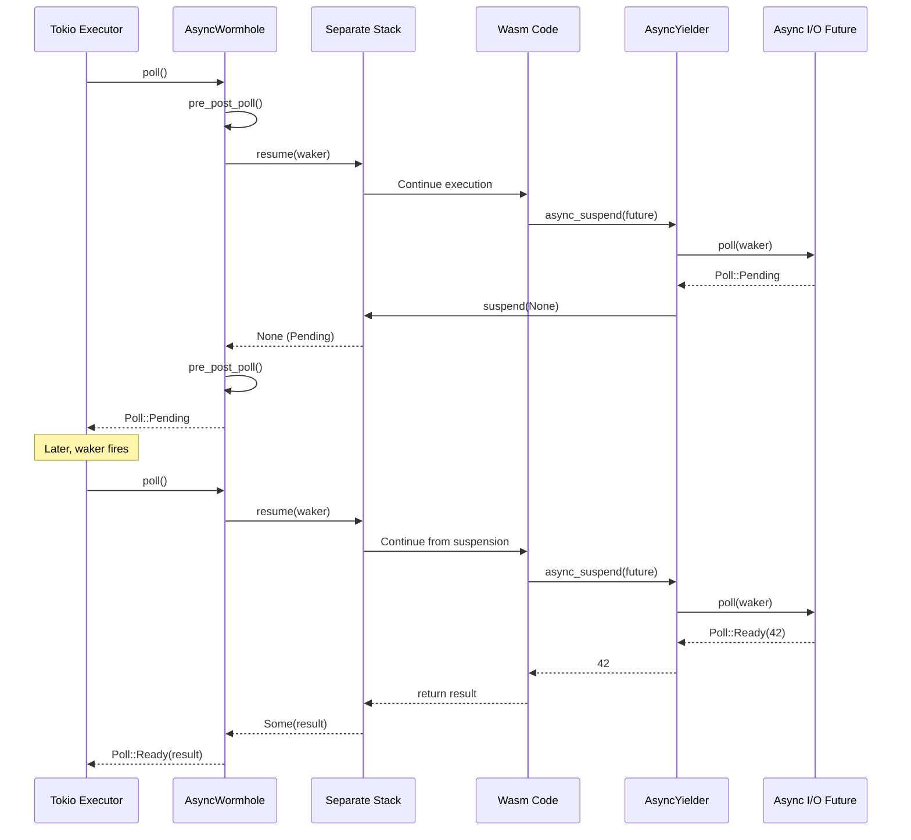

# Project Exploration: async-wormhole

## Overview

`async-wormhole` solves a fundamental problem in lunatic's architecture: how to call `.await` on async Rust futures from within synchronous WebAssembly code. Since Wasm modules are compiled ahead of time (or JIT-compiled), the Rust compiler cannot transform them into state machines. This crate creates a separate stack for executing the Wasm code, allowing it to be suspended at any point when an async operation is pending, and resumed when the result is ready.

This is the mechanism that allows lunatic host functions (e.g., network I/O, sleep, message receive) to be async under the hood while appearing synchronous to the Wasm guest.

## Repository

- **Location:** `/home/darkvoid/Boxxed/@formulas/src.rust/src.lunatic/async-wormhole`
- **Remote:** `https://github.com/bkolobara/async-wormhole/`
- **Primary Language:** Rust
- **License:** Apache-2.0 / MIT

## Directory Structure

```
async-wormhole/
  Cargo.toml              # Workspace: async-wormhole + switcheroo
  src/
    lib.rs                # AsyncWormhole, AsyncYielder
  switcheroo/             # Stack switching primitive (sub-crate)
    src/
      lib.rs              # Generator, Yielder, stack switching
      arch/               # Platform-specific assembly
  tests/                  # Integration tests
  benches/                # Performance benchmarks
  examples/               # Usage examples
```

## Architecture



### Key Types

#### AsyncWormhole
A `Future` implementation that wraps a `Generator` from the `switcheroo` crate. When polled, it resumes execution on the separate stack. When the closure inside calls `async_suspend()`, execution is suspended and the future returns `Poll::Pending`.

The `pre_post_poll` hook is called before entering and after leaving the separate stack, enabling thread-local storage swapping (critical for Wasmtime's Store which uses TLS).

#### AsyncYielder
Passed into the closure running on the separate stack. Provides `async_suspend()` which takes any `impl Future`, polls it in a loop, and yields back to the executor whenever the inner future is pending.

#### switcheroo (sub-crate)
The low-level stack switching primitive. Provides `Generator` (cooperative coroutine) and `Yielder` (suspend point) abstractions, implemented with platform-specific assembly for x86_64, aarch64, etc. Uses `EightMbStack` or custom stack allocations.

## Key Insights

- This crate is what makes lunatic's "synchronous guest, async host" model possible. Without it, Wasm guest code would need to be async-aware, which is not feasible for pre-compiled modules.
- The `pre_post_poll` mechanism is essential for thread safety: Wasmtime stores thread-local state that must be swapped when crossing stack boundaries.
- Stack allocation uses guard pages for safety -- the `switcheroo` crate sets up memory-protected regions to detect stack overflow.
- The crate uses `unsafe` extensively (stack switching is inherently unsafe) but encapsulates it behind a safe Future interface.
- This was a novel approach at the time of development; similar concepts later appeared in other runtimes (e.g., wasmtime's own fiber-based async support).
