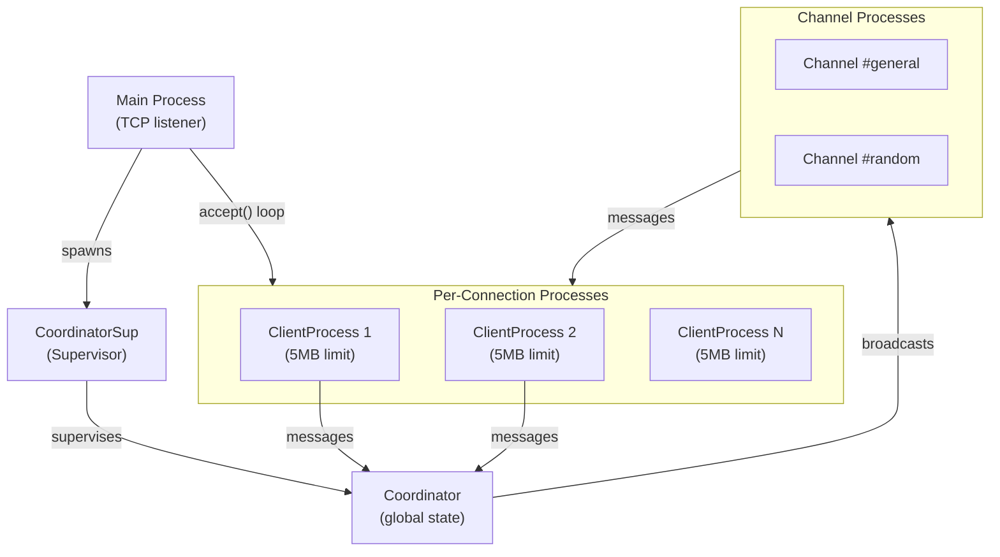

# Project Exploration: chat (lunatic.chat)

## Overview

`telnet-chat` is a fully-featured telnet chat server built on lunatic, demonstrating the runtime's actor model in a real-world application. Users connect via telnet, join channels, send messages, and see a TUI (terminal user interface) rendered with escape sequences. Each connection runs in its own sandboxed lunatic process with configurable memory limits (5 MB per client).

The project serves as both a showcase and reference implementation for lunatic's process architecture, supervisors, process configuration, and the `AbstractProcess` pattern.

## Repository

- **Location:** `/home/darkvoid/Boxxed/@formulas/src.rust/src.lunatic/chat`
- **Remote:** `https://github.com/lunatic-solutions/chat`
- **Primary Language:** Rust
- **License:** MIT

## Directory Structure

```
chat/
  Cargo.toml                # Package: telnet-chat v0.1.0
  Cargo.lock
  Readme.md
  assets/
    ss.png                  # Screenshot
    diagram.png             # Architecture diagram
  src/
    main.rs                 # Entry point: binds TCP, spawns clients
    client.rs               # ClientProcess: per-connection actor
    coordinator.rs          # CoordinatorSup: supervised global coordinator
    channel.rs              # Channel management (join, leave, broadcast)
    telnet.rs               # Telnet protocol handling
    ui/                     # TUI rendering (escape sequences, diff-based updates)
  templates/                # Askama HTML templates (if any)
```

## Architecture

### Process Model



### Key Components

1. **Main Process**: Binds a TCP listener (default port 2323), creates a `CoordinatorSup` supervisor registered under the name "coordinator", then loops accepting connections. Each accepted `TcpStream` spawns a `ClientProcess` with a 5MB memory limit.

2. **CoordinatorSup**: A supervisor process that restarts the global coordinator if it crashes. All dependent processes (clients, channels) are linked to the coordinator; if it dies, everything is torn down and restarted cleanly.

3. **ClientProcess**: Implements `AbstractProcess`. Holds the current render state (TUI buffer). Responds to two kinds of inputs:
   - Telnet commands from the TCP stream (user typing)
   - Messages from channels (new chat messages, user join/leave notifications)

   Uses diff-based rendering: only escape sequences that change the terminal state are sent back.

4. **Channel**: Manages the list of subscribers for a chat room. Broadcasts messages to all connected clients.

5. **Telnet Module**: Parses the telnet protocol, handling escape sequences, line editing, and terminal negotiation.

6. **UI Module**: Renders the TUI using escape sequences. Maintains a render buffer and computes minimal diffs.

### Sandboxing

The application demonstrates lunatic's process configuration API:
```rust
let mut client_conf = ProcessConfig::new().unwrap();
client_conf.set_max_memory(5_000_000);        // 5 MB per client
client_conf.set_can_spawn_processes(true);     // Allow sub-processes
```

This ensures a misbehaving client cannot consume unlimited memory or crash the entire server.

## Dependencies

| Crate | Version | Purpose |
|-------|---------|---------|
| lunatic | 0.14 | Runtime SDK |
| serde | 1.0 | Serialization for messages |
| askama | 0.12 | Template engine |
| tui | 0.19 | Terminal UI primitives |
| itertools | 0.11 | Iterator combinators |
| numtoa | 0.2 | Number-to-ASCII conversion |
| clap | 4.3 | CLI argument parsing |
| chrono | 0.4 | Timestamps |
| anyhow | 1 | Error handling |

## Ecosystem Role

This is lunatic's flagship demo application. It concretely demonstrates:
- One process per connection with memory isolation
- Supervisors for fault tolerance
- Process registry for global state
- Linked processes for coordinated shutdown
- The `AbstractProcess` pattern from `lunatic-rs`
- Real TCP networking through lunatic's host APIs

The architecture closely mirrors what you would build in Erlang/OTP with GenServer + Supervisor, proving that lunatic delivers on its "Erlang for Rust" promise.
