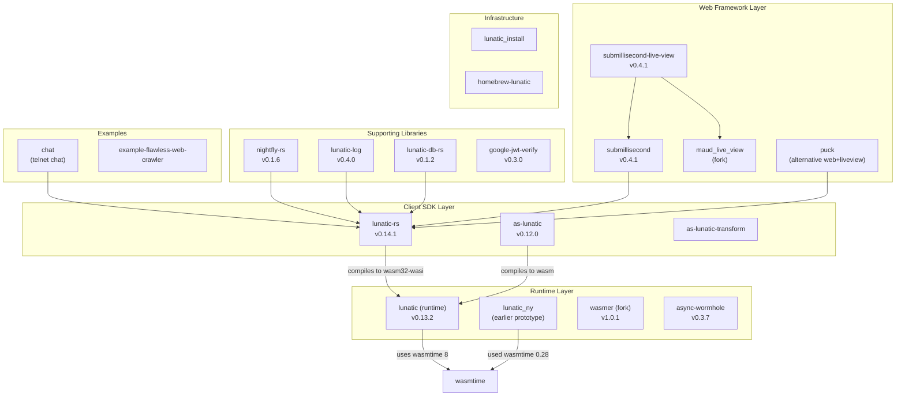
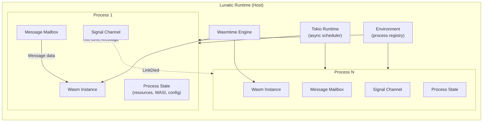
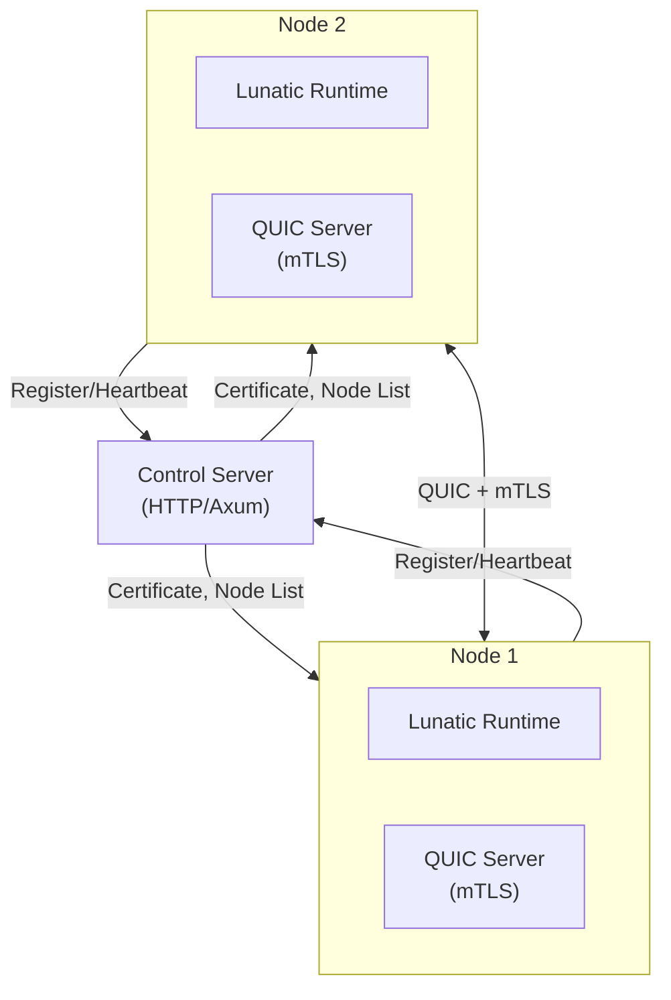

# Project Exploration: Lunatic Ecosystem

## Overview

Lunatic is an Erlang-inspired actor platform built on WebAssembly. Its core thesis is that WebAssembly's memory isolation model, combined with actor-model concurrency, can deliver the fault tolerance and massive concurrency guarantees of the BEAM VM (Erlang/Elixir) to any language that compiles to Wasm -- primarily Rust. Processes in lunatic are lightweight, sandboxed, and communicate exclusively through message passing. Each process runs inside its own Wasm instance with configurable memory and compute limits, making it impossible for one process to corrupt another's state.

The ecosystem spans a runtime (the lunatic VM itself), client SDKs (Rust, AssemblyScript), a web framework (submillisecond), LiveView implementations, HTTP clients, database drivers, distributed clustering support, and supporting infrastructure (installer, Homebrew formula). It also includes a forked copy of Wasmer (v1.0.1) from before the project migrated to Wasmtime as its execution engine.

The overall vision was a "platform" rather than just a runtime: applications compiled to `wasm32-wasi` and executed via `lunatic run`, with `cargo test` integration, distributed multi-node clustering via QUIC, and a control plane for orchestration.

## Repository

- **Location:** `/home/darkvoid/Boxxed/@formulas/src.rust/src.lunatic/`
- **Remote:** Multiple repositories under `github.com/lunatic-solutions/`
- **Primary Language:** Rust
- **License:** Apache-2.0 / MIT (dual-licensed)

## Ecosystem Map

## Sub-Project Deep Dives

| Sub-Project | Document | Description |
|-------------|----------|-------------|
| lunatic (runtime) | [lunatic-exploration.md](./lunatic-exploration.md) | The core WebAssembly actor runtime |
| lunatic-rs | [lunatic-rs-exploration.md](./lunatic-rs-exploration.md) | Rust SDK for building lunatic apps |
| async-wormhole | [async-wormhole-exploration.md](./async-wormhole-exploration.md) | Stack-switching for async across FFI |
| submillisecond | [submillisecond-exploration.md](./submillisecond-exploration.md) | Web framework for lunatic |
| submillisecond-live-view | [submillisecond-live-view-exploration.md](./submillisecond-live-view-exploration.md) | LiveView for submillisecond |
| nightfly-rs | [nightfly-rs-exploration.md](./nightfly-rs-exploration.md) | HTTP client for lunatic |
| lunatic-db-rs | [lunatic-db-rs-exploration.md](./lunatic-db-rs-exploration.md) | Database drivers (MySQL, Redis) |
| lunatic-log-rs | [lunatic-log-rs-exploration.md](./lunatic-log-rs-exploration.md) | Logging library |
| puck | [puck-exploration.md](./puck-exploration.md) | Alternative web framework + LiveView |
| maud_live_view | [maud-live-view-exploration.md](./maud-live-view-exploration.md) | Maud HTML macro fork for LiveView |
| as-lunatic | [as-lunatic-exploration.md](./as-lunatic-exploration.md) | AssemblyScript bindings |
| as-lunatic-transform | [as-lunatic-transform-exploration.md](./as-lunatic-transform-exploration.md) | AssemblyScript compiler transform |
| lunatic_ny | [lunatic-ny-exploration.md](./lunatic-ny-exploration.md) | Earlier runtime prototype |
| wasmer | [wasmer-exploration.md](./wasmer-exploration.md) | Wasmer fork (historical) |
| chat | [chat-exploration.md](./chat-exploration.md) | Telnet chat example |
| example-flawless-web-crawler | [flawless-crawler-exploration.md](./flawless-crawler-exploration.md) | Web crawler example |
| google-jwt-verify | [google-jwt-verify-exploration.md](./google-jwt-verify-exploration.md) | JWT verification library |
| lunatic_install | [lunatic-install-exploration.md](./lunatic-install-exploration.md) | Installation scripts |
| homebrew-lunatic | [homebrew-lunatic-exploration.md](./homebrew-lunatic-exploration.md) | Homebrew formula |
| Rust Revision | [rust-revision.md](./rust-revision.md) | How to reproduce the lunatic architecture in Rust |

## Architecture

### Core Execution Model

The lunatic runtime implements an actor model where each actor is a WebAssembly process:

### Signal System

Processes communicate through a signal system inspired by Erlang:

- **Message** - Opaque data messages delivered to the mailbox
- **Kill** - Immediately terminates the process
- **Link/UnLink** - Bidirectional failure propagation
- **LinkDied** - Notification when a linked process dies
- **DieWhenLinkDies** - Toggle for trap_exit behavior
- **Monitor/StopMonitoring/ProcessDied** - Unidirectional observation

### Distributed Architecture

Nodes register with a control server, receive TLS certificates, and communicate via QUIC with mutual TLS. Process spawning and message passing work transparently across node boundaries.

### Host API Surface

The runtime exposes host functions to Wasm guests through wasmtime's linker:

| API Crate | Namespace | Purpose |
|-----------|-----------|---------|
| lunatic-process-api | Process management | Spawn, kill, link processes |
| lunatic-messaging-api | Message passing | Send/receive serialized messages |
| lunatic-networking-api | TCP/UDP/TLS/DNS | Network I/O |
| lunatic-timer-api | Timers | Sleep, timeouts |
| lunatic-registry-api | Named processes | Register/lookup by name |
| lunatic-distributed-api | Distribution | Spawn on remote nodes |
| lunatic-wasi-api | WASI | File system, environment |
| lunatic-sqlite-api | SQLite | Database operations |
| lunatic-error-api | Error handling | Anyhow error management |
| lunatic-metrics-api | Metrics | Prometheus metrics |
| lunatic-version-api | Version info | Runtime version query |
| lunatic-trap-api | Trap handling | Catch Wasm traps |

### Process Configuration & Sandboxing

Each process is configured via `DefaultProcessConfig`:
- **max_memory** - Upper bound on Wasm linear memory (default 4GB)
- **max_fuel** - Compute budget in units of 100k instructions
- **can_compile_modules** - Permission to compile new Wasm modules
- **can_create_configs** - Permission to create child configurations
- **can_spawn_processes** - Permission to spawn sub-processes
- **preopened_dirs** - WASI filesystem access (with path ancestor validation)
- **command_line_arguments / environment_variables** - WASI environment

## Key Insights

- Lunatic achieves Erlang-like fault isolation by leveraging WebAssembly's memory sandboxing rather than OS process isolation. Each process gets a separate Wasm instance with its own linear memory.
- The `async-wormhole` crate is a critical piece of infrastructure: it enables `.await` calls inside non-async (Wasm JIT-generated) code by using stack switching (via the `switcheroo` crate). This is how host async operations (network I/O) are transparently available to synchronous Wasm guest code.
- The runtime uses Tokio as its async executor with a biased `select!` loop that prioritizes signal handling over computation, ensuring kill signals and link notifications are processed promptly.
- The Rust SDK (`lunatic-rs`) provides an idiomatic API with `Process`, `AbstractProcess`, `Supervisor`, `Mailbox`, and `Protocol` types that closely mirror Erlang/OTP concepts.
- The project evolved from an earlier prototype (`lunatic_ny`) using Wasmtime 0.28 with a monolithic architecture to a well-factored workspace with 20+ internal crates in the final version.
- Distributed mode uses QUIC (via quinn) with mTLS for node-to-node communication, with a central control server for certificate issuance and node discovery.
- The `submillisecond` web framework is lunatic-native: it spawns a new process per HTTP connection, achieving true isolation between requests.
- LiveView implementations (submillisecond-live-view, puck_liveview) follow the Phoenix LiveView pattern -- server-rendered HTML with WebSocket-driven updates -- but running on lunatic processes instead of Erlang processes.

## Open Questions

- The project appears to be archived/unmaintained (last significant activity circa 2023). What is the current state of the ecosystem?
- The `ARCHITECTURE.md` in the main runtime is just "# TODO" -- the architecture was never formally documented.
- How does the distributed mode handle network partitions and split-brain scenarios? The control server appears to be a single point of failure.
- What is the relationship between `lunatic_ny` and the final `lunatic` runtime? The former appears to be an earlier prototype with a different plugin system.
- The Wasmer fork (v1.0.1) is quite old -- was it used in production, or was it purely for experimentation before migrating to Wasmtime?
