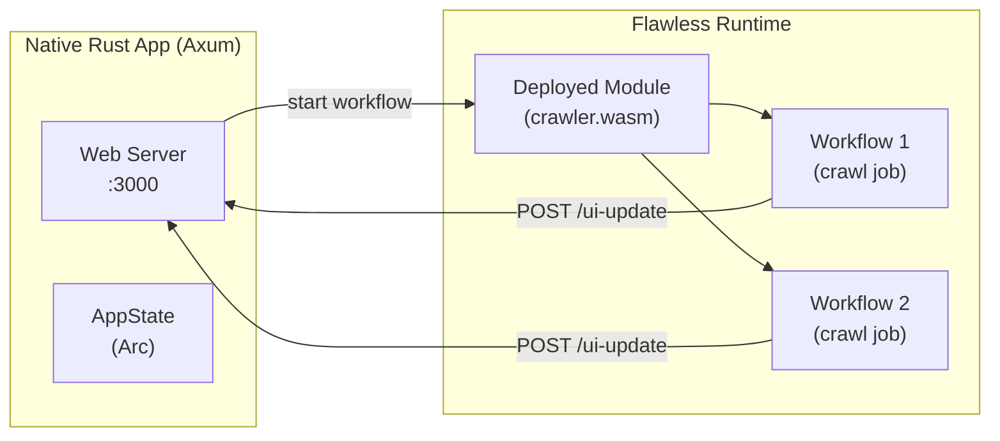

# Project Exploration: example-flawless-web-crawler

## Overview

This is an example project demonstrating how to integrate Flawless workflows (the commercial successor to open-source lunatic) into native Rust applications. It implements a web crawler where the web UI is a standard Axum + HTMX application, but the actual crawling logic runs as a Flawless workflow -- a durable, resumable computation unit that survives crashes and restarts.

Note: This project targets the Flawless platform rather than the open-source lunatic runtime. It uses `flawless-utils` and `flawless-http` crates instead of `lunatic-rs`.

## Repository

- **Location:** `/home/darkvoid/Boxxed/@formulas/src.rust/src.lunatic/example-flawless-web-crawler`
- **Remote:** `https://github.com/lunatic-solutions/example-flawless-web-crawler`
- **Primary Language:** Rust
- **License:** Not specified

## Directory Structure

```
example-flawless-web-crawler/
  Cargo.toml                # Workspace root
  Cargo.lock
  Readme.md
  build.rs                  # Build script (compiles workflow module)
  src/
    main.rs                 # Axum web server (UI + API)
  templates/
    index.html              # HTMX-based UI template
    list.html               # Job progress template
  assets/
    styles.css              # CSS
    crawler-screenshot.png  # Screenshot
  workflows/
    crawler/
      Cargo.toml            # Workflow crate
      src/
        lib.rs              # Crawler workflow logic
```

## Architecture

### Two-Component Design



### Web Server (src/main.rs)

A standard Axum application with routes:
- `GET /` - Index page (HTMX)
- `POST /new-job` - Starts a new crawl workflow
- `GET /list` - Returns current job progress as HTML (polled by HTMX)
- `POST /ui-update` - Receives progress updates from running workflows

The server deploys the crawler module to a local Flawless server at startup, then starts workflows by calling `module.start::<crawler::start_crawler>(Job { id, url })`.

### Crawler Workflow (workflows/crawler/src/lib.rs)

Annotated with `#[workflow("crawl")]`, the crawler:
1. Takes a URL as input
2. Fetches the page via `flawless_http::get()`
3. Extracts `<a>` links using the `select` crate
4. Tracks visited URLs in a `HashSet`
5. Limits crawl depth to 64 pages (`MAX_CRAWL_SIZE`)
6. Reports progress back to the UI via HTTP POST to `/ui-update`
7. Sleeps 300ms between steps for UI visibility

The key value proposition: if the workflow crashes mid-crawl, the Flawless runtime can resume it from the last checkpoint, providing durable execution guarantees.

### Status Reporting

The workflow sends `UpdateUI` structs with status variants:
- `Request` - HTTP request in progress
- `Parse` - Parsing HTML
- `Done` - URL processed
- `Error` - Request failed

## Dependencies

### Root Package
| Crate | Version | Purpose |
|-------|---------|---------|
| crawler | path | Workflow crate |
| flawless-utils | 1.0.0-beta.3 | Flawless integration |
| tokio | 1 (full) | Async runtime for Axum |
| axum | 0.7 | Web framework |
| askama | 0.12 | Template engine |
| serde | 1 | Serialization |

### Workflow Package
Uses `flawless`, `flawless-http`, `select`, `serde`, `serde_json`, `log`.

## Ecosystem Role

This project represents the commercial evolution of the lunatic ecosystem into Flawless. It demonstrates the workflow-as-a-module pattern where:
- Application logic (web UI) runs natively
- Unreliable work (web crawling) runs as a durable Flawless workflow
- Communication happens via HTTP between the two

It is tangentially related to the open-source lunatic runtime, sharing the same organization and philosophy (WebAssembly-based isolation, fault tolerance) but targeting the Flawless commercial platform rather than the open-source lunatic VM.
