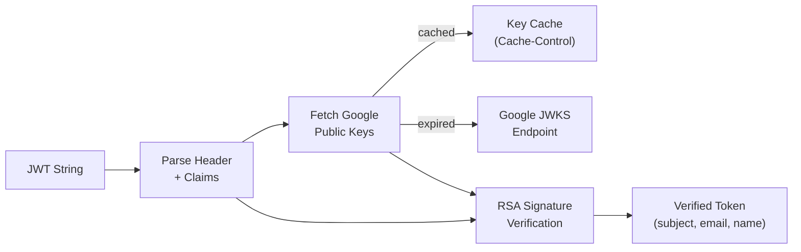

# Project Exploration: google-jwt-verify

## Overview

`google-jwt-verify` is a Rust library for verifying Google JSON Web Tokens (JWTs). It handles fetching Google's public keys, caching them according to HTTP Cache-Control headers, verifying token signatures using RSA, and extracting user claims (subject, email, name). Most verification calls avoid HTTP requests by using cached keys.

This is a fork/copy included in the lunatic ecosystem, likely used by lunatic applications that need Google OAuth/Sign-In verification.

## Repository

- **Location:** `/home/darkvoid/Boxxed/@formulas/src.rust/src.lunatic/google-jwt-verify`
- **Remote:** `https://github.com/fuchsnj/google-jwt-verify`
- **Primary Language:** Rust
- **License:** MIT / Apache-2.0

## Directory Structure

```
google-jwt-verify/
  Cargo.toml                # Package v0.3.0
  README.md
  src/
    lib.rs                  # Crate root, base64 utility
    client.rs               # Client struct (main API entry point)
    token.rs                # Token, IdPayload, RequiredClaims
    unverified_token.rs     # Pre-verification token parsing
    algorithm.rs            # Supported algorithms (RS256)
    error.rs                # Error types
    header.rs               # JWT header parsing
    jwk.rs                  # JSON Web Key (JWK) structures
    key_provider.rs         # Google public key fetching + caching
    test.rs                 # Unit tests
```

## Architecture

### Verification Flow



### Key Components

1. **Client**: Main entry point. Created with a Google client ID. Calls `verify_id_token(&token)` to verify and return a `Token`.

2. **KeyProvider**: Fetches Google's public JWK keys from the JWKS endpoint. Caches keys based on the `Cache-Control` header's `max-age` directive, so most verifications are local.

3. **UnverifiedToken**: Parses a JWT string into its header, claims, and signature components without verifying. Handles base64url decoding.

4. **Token / IdPayload / RequiredClaims**: The verified result. `RequiredClaims` includes `iss` (issuer), `sub` (subject/user ID), `aud` (audience/client ID), `exp` (expiration). `IdPayload` includes optional fields like `email`, `name`, `picture`.

5. **Algorithm**: Supports RS256 (RSA PKCS1 SHA-256), which is what Google uses.

6. **JWK**: JSON Web Key structures for parsing Google's public key response.

### Features

- `default = ["blocking"]` - Uses `reqwest/blocking` for synchronous key fetching
- `async` - Enables `async-trait` for async key fetching

## Dependencies

| Crate | Version | Purpose |
|-------|---------|---------|
| openssl | 0.10.28 | RSA signature verification |
| base64 | 0.11.0 | Base64url decoding |
| serde / serde_json / serde_derive | 1.0 | JSON parsing |
| reqwest | 0.10.4 | HTTP client for fetching keys |
| headers | 0.3.1 | HTTP header parsing (Cache-Control) |
| async-trait (optional) | 0.1.42 | Async key provider trait |

## Ecosystem Role

This is a utility library included in the lunatic ecosystem for applications that need Google Sign-In / OAuth verification. It is not lunatic-specific (it uses `reqwest` for HTTP, not `nightfly`), suggesting it was either used before lunatic-native HTTP clients existed, or is included as a reference/dependency for authentication examples.

The library could be adapted to use lunatic's networking stack by replacing the `reqwest`-based key provider with one using `nightfly` or lunatic's raw TCP/TLS APIs.
