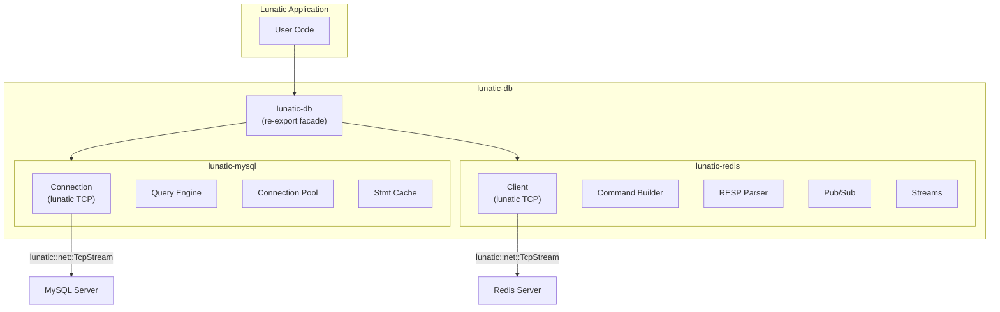

# Project Exploration: lunatic-db-rs

## Overview

`lunatic-db` is a collection of database drivers adapted to work on the lunatic runtime. It provides MySQL and Redis clients that use lunatic's TCP networking APIs instead of standard Rust async runtimes (tokio/async-std). The drivers are largely ports of established Rust database libraries (`rust-mysql-simple` for MySQL, `redis-rs` for Redis) with internal networking code replaced to use lunatic's host functions.

## Repository

- **Location:** `/home/darkvoid/Boxxed/@formulas/src.rust/src.lunatic/lunatic-db-rs`
- **Remote:** `https://github.com/lunatic-solutions/lunatic-db`
- **Primary Language:** Rust
- **License:** Apache-2.0 / MIT

## Directory Structure

```
lunatic-db-rs/
  Cargo.toml                # Workspace root: lunatic-db v0.1.2
  Cargo.lock
  README.md
  src/                      # Re-export crate (facade)
  examples/                 # (referenced from root Cargo.toml)
  lunatic-mysql/
    Cargo.toml              # lunatic-mysql v0.1.1
    build.rs
    src/
      lib.rs                # MySQL client library root
      buffer_pool/          # Connection buffer pooling
        disabled.rs
        enabled.rs
        mod.rs
      conn/                 # Connection management
        mod.rs
        opts/               # Connection options (TLS configs)
          mod.rs
          native_tls_opts.rs
          rustls_opts.rs
        binlog_stream.rs    # Binary log stream
        local_infile.rs     # LOAD DATA LOCAL INFILE
        pool.rs             # Connection pooling
        queryable.rs        # Query trait
        query_result.rs     # Result sets
        query.rs            # Query execution
        stmt_cache.rs       # Prepared statement cache
        stmt.rs             # Prepared statements
        transaction.rs      # Transaction support
      error/                # Error types
        mod.rs
        tls/
      io/                   # I/O layer (lunatic TCP)
        mod.rs
        tcp.rs              # TCP transport using lunatic
        tls/
  lunatic-redis/
    Cargo.toml              # lunatic-redis v0.1.3
    src/
      lib.rs                # Redis client library root
      client.rs             # Redis client
      connection.rs         # Connection management (lunatic TCP)
      cmd.rs                # Command builder
      commands/             # Redis command implementations
        macros.rs
        mod.rs
      parser.rs             # RESP protocol parser
      pipeline.rs           # Pipelined commands
      pubsub.rs             # Pub/Sub support
      script.rs             # Lua scripting
      streams.rs            # Redis Streams
      geo.rs                # Geospatial commands
      types.rs              # Redis value types
      acl.rs                # ACL commands
      cluster.rs            # Cluster support (partial)
      cluster_client.rs
      cluster_pipeline.rs
      cluster_routing.rs
      macros.rs             # Helper macros
      r2d2.rs               # Connection pool (r2d2-style)
    examples/
      basic.rs
      queues.rs
      set-mget.rs
      pub-sub.rs
      streams.rs
      geospatial.rs
      scan.rs
    tests/
      parser.rs
      test_types.rs
      test_streams.rs
```

## Architecture

### Design Pattern

Both drivers follow the same strategy: take an established, well-tested Rust database client and replace its transport layer to use lunatic's networking primitives.



### MySQL Driver (lunatic-mysql)

Based on `rust-mysql-simple` (https://github.com/blackbeam/rust-mysql-simple):
- Full query execution with prepared statements
- Statement caching
- Connection pooling with buffer pool
- Transaction support
- Binary log streaming
- Local infile loading
- TLS support stubs (native-tls and rustls options)
- Uses `mysql_common` for protocol parsing

Key difference from upstream: the `io/tcp.rs` module replaces standard `TcpStream` with `lunatic::net::TcpStream`, making all I/O go through lunatic's host networking API.

### Redis Driver (lunatic-redis)

Based on `redis-rs` (https://github.com/redis-rs/redis-rs):
- Full RESP protocol implementation
- Command builder with all standard Redis commands
- Pub/Sub with subscription management
- Redis Streams support
- Geospatial functions
- Lua scripting via EVALSHA
- ACL commands
- Pipeline support
- Cluster support (partial, in progress)
- Connection scanning (SCAN, SSCAN, HSCAN, ZSCAN)

### Features

The root `lunatic-db` crate uses feature flags:
- `default = ["mysql", "redis"]`
- `mysql` - Enables lunatic-mysql
- `redis` - Enables lunatic-redis

## Dependencies

### lunatic-mysql
| Crate | Version | Purpose |
|-------|---------|---------|
| lunatic | 0.12 | Runtime SDK (networking) |
| mysql_common | 0.29.1 | MySQL protocol implementation |
| bufstream | ~0.1 | Buffered stream |
| flate2 | 1.0 | Compression |
| lru | 0.7 | LRU cache for statements |

### lunatic-redis
| Crate | Version | Purpose |
|-------|---------|---------|
| lunatic | 0.12.0 | Runtime SDK (networking) |
| combine | 4.6 | Parser combinators (RESP) |
| url | 2.1 | Redis URL parsing |
| itoa / ryu | 1.0 | Number formatting |
| sha1_smol (optional) | 1.0 | Script hashing |

## Ecosystem Role

These drivers are essential for building production lunatic applications that need database access. Since lunatic processes cannot use standard Rust async runtimes (tokio/async-std) directly, database drivers must be adapted to use lunatic's networking primitives. This project provides that adaptation layer for MySQL and Redis, two of the most widely-used databases.

The API surface intentionally mirrors the upstream libraries (`redis-rs`, `rust-mysql-simple`) to minimize the learning curve for Rust developers already familiar with those crates.

### Known Limitations (from README)

- MySQL: Limited testing, no TLS in practice
- Redis: Test utilities need rewriting, no automatic reconnection, multiplexing needs validation, cluster support incomplete
- Both: Targets `wasm32-wasi` only
