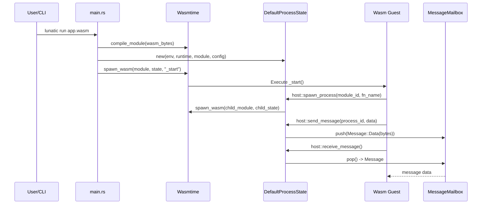

# Project Exploration: lunatic (Runtime)

## Overview

The lunatic runtime is the core of the ecosystem -- an actor platform built on WebAssembly. It compiles to a binary called `lunatic` that executes Wasm modules, providing Erlang-style lightweight processes with sandboxed memory, message passing, process linking, supervision, networking, and distributed clustering. Version 0.13.2 uses Wasmtime 8 as the Wasm execution engine and Tokio as the async runtime.

The runtime also ships a `cargo-lunatic` binary for integration with Cargo's test runner, allowing `cargo test` to work transparently with Wasm targets.

## Repository

- **Location:** `/home/darkvoid/Boxxed/@formulas/src.rust/src.lunatic/lunatic`
- **Remote:** `https://github.com/lunatic-solutions/lunatic`
- **Primary Language:** Rust
- **License:** Apache-2.0 OR MIT

## Directory Structure

```
lunatic/
  Cargo.toml                    # Workspace root + main binary/library
  Cargo.lock
  deny.toml                     # cargo-deny configuration
  src/
    main.rs                     # Entry point: lunatic binary
    cargo_lunatic.rs            # Entry point: cargo-lunatic binary
    lib.rs                      # Library: exports DefaultProcessConfig, DefaultProcessState
    config.rs                   # DefaultProcessConfig (memory, fuel, permissions, WASI)
    state.rs                    # DefaultProcessState (all resource contexts)
    mode/
      mod.rs                    # Mode dispatcher
      execution.rs              # CLI subcommand routing (clap)
      run.rs                    # `lunatic run <file.wasm>` mode
      node.rs                   # `lunatic node` mode (distributed)
      control.rs                # `lunatic control` mode (control server)
      cargo_test.rs             # `cargo test` integration
      common.rs                 # Shared run_wasm logic
      config.rs                 # `lunatic config` mode
      app.rs                    # `lunatic app` mode
      deploy/                   # `lunatic deploy` mode
        mod.rs
        artefact.rs
        build.rs
      init.rs                   # `lunatic init` mode
      login.rs                  # `lunatic login` mode
  crates/
    hash-map-id/                # HashMap<u64, T> with auto-incrementing keys
    lunatic-common-api/         # Common host function API utilities
    lunatic-control/            # Control server logic
    lunatic-control-axum/       # Control server HTTP (Axum-based)
    lunatic-control-submillisecond/  # Control server HTTP (submillisecond-based, disabled)
    lunatic-distributed/        # Node-to-node distributed communication
    lunatic-distributed-api/    # Host functions for distributed operations
    lunatic-error-api/          # Host functions for error handling
    lunatic-messaging-api/      # Host functions for message passing
    lunatic-metrics-api/        # Host functions for metrics
    lunatic-networking-api/     # Host functions for TCP/UDP/TLS/DNS
    lunatic-process/            # Core process, signal, mailbox abstractions
    lunatic-process-api/        # Host functions for process management
    lunatic-registry-api/       # Host functions for named process registry
    lunatic-sqlite-api/         # Host functions for SQLite
    lunatic-stdout-capture/     # Stdout/stderr capture for processes
    lunatic-timer-api/          # Host functions for timers
    lunatic-trap-api/           # Host functions for trap catching
    lunatic-version-api/        # Host functions for version info
    lunatic-wasi-api/           # WASI host function bridge
  wat/                          # WebAssembly text format test fixtures
  benches/                      # Benchmarks
  examples/                     # Example Wasm modules
```

## Architecture

### High-Level Diagram

```mermaid
graph TB
    subgraph Binary["lunatic binary"]
        MAIN["main.rs"]
        MODES["Mode Router"]
        RUN["run mode"]
        NODE["node mode"]
        CONTROL["control mode"]
        DEPLOY["deploy mode"]
        TEST["cargo_test mode"]
    end

    subgraph Library["lunatic_runtime library"]
        CONFIG["DefaultProcessConfig"]
        STATE["DefaultProcessState"]
    end

    subgraph Crates["Internal Crates"]
        PROCESS["lunatic-process<br/>(core abstractions)"]
        MESSAGING["lunatic-messaging-api"]
        NETWORKING["lunatic-networking-api"]
        DISTRIBUTED["lunatic-distributed"]
        DIST_API["lunatic-distributed-api"]
        REGISTRY["lunatic-registry-api"]
        TIMER["lunatic-timer-api"]
        WASI["lunatic-wasi-api"]
        SQLITE["lunatic-sqlite-api"]
        ERROR["lunatic-error-api"]
        PROCESS_API["lunatic-process-api"]
        TRAP["lunatic-trap-api"]
        METRICS["lunatic-metrics-api"]
        VERSION["lunatic-version-api"]
        CONTROL_LIB["lunatic-control"]
        CONTROL_AXUM["lunatic-control-axum"]
        HASHMAP["hash-map-id"]
        COMMON["lunatic-common-api"]
        STDOUT["lunatic-stdout-capture"]
    end

    MAIN --> MODES
    MODES --> RUN
    MODES --> NODE
    MODES --> CONTROL
    MODES --> DEPLOY
    MODES --> TEST

    STATE --> PROCESS
    STATE --> MESSAGING
    STATE --> NETWORKING
    STATE --> DISTRIBUTED
    STATE --> REGISTRY
    STATE --> TIMER
    STATE --> WASI
    STATE --> SQLITE
    STATE --> ERROR
    STATE --> PROCESS_API
    STATE --> TRAP
    STATE --> METRICS
    STATE --> VERSION

    NODE --> DISTRIBUTED
    CONTROL --> CONTROL_LIB
    CONTROL --> CONTROL_AXUM
```



### Component Breakdown

#### lunatic-process (Core)
- **Location:** `crates/lunatic-process/`
- **Purpose:** Defines the fundamental `Process`, `Signal`, `WasmProcess`, `NativeProcess`, `Environment`, `MessageMailbox`, `Message`, and `ProcessState` abstractions. Contains the core execution loop that handles signal dispatch with biased `tokio::select!`.
- **Key types:**
  - `Process` trait -- `fn id() -> u64` + `fn send(signal: Signal)`
  - `Signal` enum -- Message, Kill, Link, UnLink, LinkDied, DieWhenLinkDies, Monitor, StopMonitoring, ProcessDied
  - `WasmProcess` / `NativeProcess` -- concrete process types
  - `ProcessState` trait -- abstracts process state for the runtime
  - `spawn_wasm()` -- creates a Wasm process from a compiled module
  - `spawn()` -- creates a native Rust closure process

#### DefaultProcessState (Glue)
- **Location:** `src/state.rs`
- **Purpose:** Implements all the context traits required by every host API crate, wiring together resources (TCP listeners, UDP sockets, DNS iterators, TLS connections, timers, errors, configs, modules, SQLite connections). This is the concrete type that flows through the wasmtime `Store`.
- **Dependencies:** Every `*-api` crate
- **Key design:** Uses the `HashMapId` crate to manage resource handles as integer IDs that are passed to/from Wasm guests.

#### lunatic-distributed
- **Location:** `crates/lunatic-distributed/`
- **Purpose:** Node-to-node communication using QUIC with mTLS. Handles registration with the control server, certificate generation, process spawning on remote nodes.
- **Sub-modules:** `control/` (client for control server), `distributed/` (peer-to-peer client/server), `quic/` (QUIC transport via quinn), `congestion/` (congestion control)

#### lunatic-control / lunatic-control-axum
- **Location:** `crates/lunatic-control/`, `crates/lunatic-control-axum/`
- **Purpose:** The control plane server for distributed mode. Manages node registration, certificate issuance, environment/module distribution. The Axum variant provides the HTTP API.

## Entry Points

### `lunatic` binary (main.rs)
- **File:** `src/main.rs`
- **Flow:**
  1. Detects if `run` is implied (backward compat with v0.12 syntax)
  2. Detects if invoked via `cargo test` by checking `CARGO_MANIFEST_DIR` and path patterns
  3. Routes to `cargo_test::test()` or `execution::execute()`
  4. `execution::execute()` uses clap to dispatch to subcommands: `run`, `node`, `control`, `deploy`, `init`, `login`, `config`, `app`

### `lunatic run` (run.rs)
- **File:** `src/mode/run.rs`
- **Flow:**
  1. Creates a Wasmtime runtime with default config (async support + fuel metering)
  2. Creates a `LunaticEnvironments` instance
  3. Calls `run_wasm()` which compiles the Wasm file, creates a `DefaultProcessState`, and spawns the initial process

### `lunatic node` (node.rs)
- **File:** `src/mode/node.rs`
- **Flow:**
  1. Generates a UUID node name and TLS certificate
  2. Registers with the control server via HTTP
  3. Creates QUIC client with mTLS
  4. Starts the distributed node server (QUIC listener)
  5. Optionally runs a Wasm module
  6. Handles graceful shutdown on Ctrl+C

## Data Flow



## External Dependencies

| Dependency | Version | Purpose |
|------------|---------|---------|
| wasmtime | 8 | WebAssembly execution engine |
| wasmtime-wasi | 8 | WASI implementation |
| tokio | 1.28 | Async runtime |
| clap | 4.0 | CLI argument parsing |
| reqwest | 0.11 | HTTP client (for control server) |
| dashmap | 5.4 | Concurrent HashMap |
| serde/serde_json | 1.0 | Serialization |
| uuid | 1.1 | Node identification |
| anyhow | 1.0 | Error handling |
| metrics | 0.20.1 | Metrics collection |
| metrics-exporter-prometheus | 0.11.0 | Prometheus export (optional) |
| log/env_logger | 0.4/0.9 | Logging |

## Configuration

- **Environment variables:** `RUST_LOG` for log levels, `CARGO_MANIFEST_DIR` for test detection
- **CLI flags:** `--dir` (filesystem access), `--bench` (benchmark mode), `--prometheus` (metrics)
- **Process config:** Programmatic via `DefaultProcessConfig` (memory limits, fuel, permissions)
- **WASI:** preopened directories, env vars, command line args passed through to guest

## Testing

- Uses `cargo test` with Wasmtime integration
- Test fixtures in `wat/` directory (WebAssembly text format)
- Import signature matching test ensures all host function signatures align
- Benchmarks using criterion

## Key Insights

- The `DefaultProcessState` struct is the single most important type -- it implements ~15 context traits and holds all per-process resources. This is the "god object" pattern, but it is necessary because wasmtime stores require a single state type.
- Resource handles are integer IDs managed by `HashMapId`, a simple HashMap<u64, T> with auto-incrementing keys. This is how Wasm guests reference host resources (TCP connections, timers, etc).
- The biased `select!` in the process loop ensures signals (Kill, LinkDied) are always processed before computation advances, preventing zombie processes.
- Memory limits are enforced via wasmtime's `ResourceLimiter` trait, not through custom instrumentation.
- The `can_spawn_processes`, `can_compile_modules`, and `can_create_configs` flags create a capability-based security model where parent processes can restrict children.
