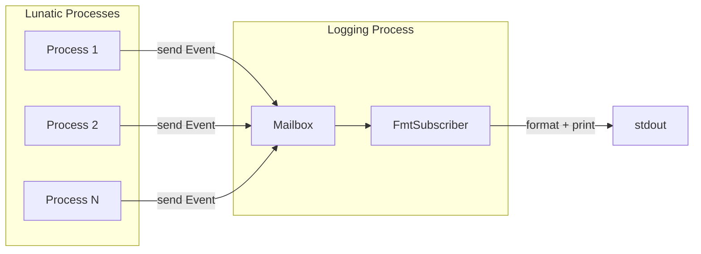

# Project Exploration: lunatic-log-rs

## Overview

`lunatic-log` is a logging library specifically designed for lunatic Rust applications. Standard Rust logging solutions (the `log` crate, `tracing`) rely on global static variables initialized once at application startup. This does not work in lunatic because each process gets its own memory space -- there is no shared mutable global state. `lunatic-log` solves this by running a log subscriber as a dedicated lunatic process that receives log events via message passing.

## Repository

- **Location:** `/home/darkvoid/Boxxed/@formulas/src.rust/src.lunatic/lunatic-log-rs`
- **Remote:** `https://github.com/lunatic-solutions/lunatic-log-rs`
- **Primary Language:** Rust
- **License:** Apache-2.0 / MIT

## Directory Structure

```
lunatic-log-rs/
  Cargo.toml                # Package: lunatic-log v0.4.0
  deny.toml                 # cargo-deny config
  Readme.md
  src/
    lib.rs                  # Core: init, Event, logging process lookup
    level.rs                # Log levels (Error, Warn, Info, Debug, Trace)
    macros.rs               # error!, warn!, info!, debug!, trace! macros
    metadata.rs             # Metadata struct (level, file, line, module)
    subscriber.rs           # Subscriber trait
    subscriber/
      fmt.rs                # FmtSubscriber (formatted output)
  examples/
    (referenced in docs)
```

## Architecture

### Process-Based Logging



### Key Components

1. **`init(subscriber)`**: Spawns a subscriber process, registers it under `LoggingProcessID` in the lunatic process registry, and caches the process handle in process-local storage. Panics if called twice.

2. **`Event`**: A serializable struct containing:
   - `message: String` - The formatted log message
   - `metadata: Metadata` - Level, file path, line number, module path

3. **`Subscriber` trait**: Defines `enabled(&self, metadata: &Metadata) -> bool` and `event(&self, event: &Event)`. The default implementation is `FmtSubscriber`.

4. **`FmtSubscriber`**: Configurable formatted output. Supports:
   - Level filtering (`LevelFilter`)
   - Pretty printing (with colors via `yansi`)
   - Timestamp formatting (via `chrono`)

5. **Process-local caching**: Each process lazily looks up the logging process handle using `process_local!` storage. The lookup state is:
   - `NotLookedUp` - First access; performs registry lookup
   - `NotPresent` - Registry lookup failed; logging is silently disabled
   - `Present(Process<Event>)` - Cached handle; subsequent logs are fast

6. **Logging macros**: `error!`, `warn!`, `info!`, `debug!`, `trace!` -- each macro looks up the logging process, constructs an `Event` with metadata, and sends it via message passing.

### Why Not `log` or `tracing`?

Standard logging crates use `static` variables:
```rust
// log crate: global static logger
static LOGGER: &dyn Log = &NopLogger;
```

In lunatic, each process has its own Wasm instance with separate linear memory. A `static` in Process A is invisible to Process B. Reinitializing the logger in every process is impractical and error-prone.

`lunatic-log` instead uses lunatic's process registry (a shared, cross-process namespace) to find the logging process from any process.

## Dependencies

| Crate | Version | Purpose |
|-------|---------|---------|
| lunatic | 0.13 | Runtime SDK (processes, mailbox, registry) |
| serde | 1.0 | Serialization for Event messages |
| chrono | 0.4 | Timestamp formatting |
| yansi | 0.5.1 | Terminal colors |

## Ecosystem Role

This library is the standard logging solution for lunatic applications. It is used by `nightfly-rs` and other lunatic ecosystem crates. The pattern it establishes -- using a dedicated process for cross-cutting concerns that would normally use global state -- is a fundamental lunatic architectural pattern. Any service that needs to aggregate data from many processes (metrics, tracing, logging) should follow this model.

The library targets `wasm32-wasi` exclusively, as indicated by its docs.rs configuration.
