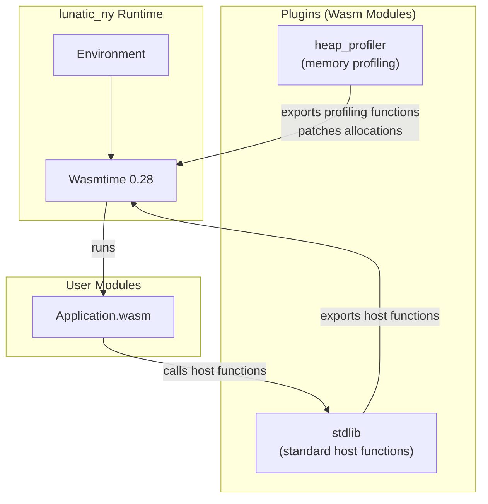

# Project Exploration: lunatic_ny

## Overview

`lunatic_ny` is an earlier prototype/rewrite of the lunatic runtime, described in its README as "A complete rewrite of lunatic with: No unsafe code, Plugin architecture." It uses Wasmtime 0.28 (from git, pre-release) and represents an intermediate stage in the evolution of the lunatic runtime -- after the initial proof-of-concept but before the final well-factored workspace architecture of lunatic v0.13.

The "ny" likely refers to "new" (ny is "new" in some Scandinavian languages), signaling this was the "new lunatic" at the time.

## Repository

- **Location:** `/home/darkvoid/Boxxed/@formulas/src.rust/src.lunatic/lunatic_ny`
- **Primary Language:** Rust
- **License:** Not specified (likely same as main lunatic: Apache-2.0 / MIT)

## Directory Structure

```
lunatic_ny/
  Cargo.toml                # Package: lunatic_ny v0.1.0
  Cargo.lock
  Readme.md
  build.rs                  # Build script (compiles WAT files)
  src/
    main.rs                 # CLI entry point
    lib.rs                  # Crate root: Environment, EnvConfig
    config.rs               # EnvConfig (environment configuration)
    environment.rs          # Environment (process registry + module store)
    module.rs               # Wasm module compilation and patching
    message.rs              # Message types for inter-process communication
    plugin.rs               # Plugin system
    process.rs              # ProcessHandle (signal/message sending)
    state.rs                # Process state (WASI, resources)
    api/
      mod.rs                # Host API registration
      macros.rs             # Macro helpers for host function definitions
      error.rs              # Error management host functions
      mailbox.rs            # Message receive host functions
      networking.rs         # TCP/DNS host functions
      plugin.rs             # Plugin-related host functions
      process.rs            # Process spawn/kill host functions
      wasi.rs               # WASI integration
  plugins/
    heap_profiler/          # Heap profiling plugin
      Cargo.toml
      src/
        lib.rs
        api.rs              # Host functions for heap profiling
        patch.rs            # Wasm module patching for profiling
    stdlib/                 # Standard library plugin
      Cargo.toml
      src/
        lib.rs
  benches/
    benchmark.rs
  wat/                      # WebAssembly Text format test files
```

## Architecture

### Core Concepts

The runtime is organized around these abstractions:

1. **Environment**: The top-level container that holds a registry of processes and compiled modules. Created with an `EnvConfig` for resource limits.

2. **Plugin**: A Wasm module that can export host functions for other modules to use. This is the key architectural difference from the final lunatic: rather than hardcoding all host APIs in Rust, they can be provided by Wasm plugins.

3. **ProcessHandle**: A handle for sending signals and messages to a spawned process. Supports `Kill`, `Message`, and link-related signals.

4. **Module**: Wasm module compilation with optional patching (e.g., the heap profiler patches allocation calls).

5. **State**: Per-process state including WASI context and resource handles.

### Plugin System

The plugin architecture was the main innovation of `lunatic_ny`:



The two included plugins are:

- **stdlib**: Provides the standard lunatic host functions (process management, networking, messaging). In the final lunatic runtime, these were moved back to native Rust code.

- **heap_profiler**: A profiling plugin that patches Wasm module allocation functions to track memory usage. It demonstrates the power of the plugin approach -- adding observability without modifying application code.

### Host API Surface

The API module provides host functions organized by concern:
- `process.rs` - Spawn, kill, link processes
- `mailbox.rs` - Message receive operations
- `networking.rs` - TCP connections, DNS resolution
- `error.rs` - Error handling
- `plugin.rs` - Plugin loading/management
- `wasi.rs` - WASI integration

### Key Design Decisions

- **No unsafe code**: The README explicitly states this as a goal. The final lunatic runtime could not maintain this guarantee due to performance requirements.
- **Plugin architecture**: Host functions delivered via Wasm modules rather than hardcoded. This was ultimately not carried forward to the final runtime, likely due to complexity and performance overhead.
- **Wasmtime 0.28**: Uses an early version from git, before Wasmtime stabilized many of its APIs.
- **Monolithic crate**: Unlike the final lunatic (20+ workspace crates), this is a single crate with workspace members only for plugins.

## Dependencies

| Crate | Version | Purpose |
|-------|---------|---------|
| wasmtime | 0.28 (git) | Wasm execution engine |
| wasmtime-wasi | 0.28 (git) | WASI implementation |
| wasmparser | 0.79 | Wasm binary parsing |
| wasm-encoder | 0.5 | Wasm binary generation (for patching) |
| tokio | 1.7 | Async runtime |
| uuid | 0.8 | Process IDs |
| anyhow | 1.0 | Error handling |
| clap | 3.0.0-beta.2 | CLI parsing |
| paste | 1.0 | Macro helper |
| env_logger + log | 0.9/0.4 | Logging |

## Ecosystem Role

`lunatic_ny` is a historical artifact -- an intermediate design between the initial lunatic proof-of-concept and the final v0.13 runtime. Its plugin architecture was an interesting experiment that explored making the runtime more extensible, but the approach was ultimately abandoned in favor of hardcoded Rust host functions in the final version (likely for performance and simplicity).

The heap profiler plugin demonstrates that Wasm module patching is a viable approach for observability tooling, an idea that could be revisited independently of the plugin system.
