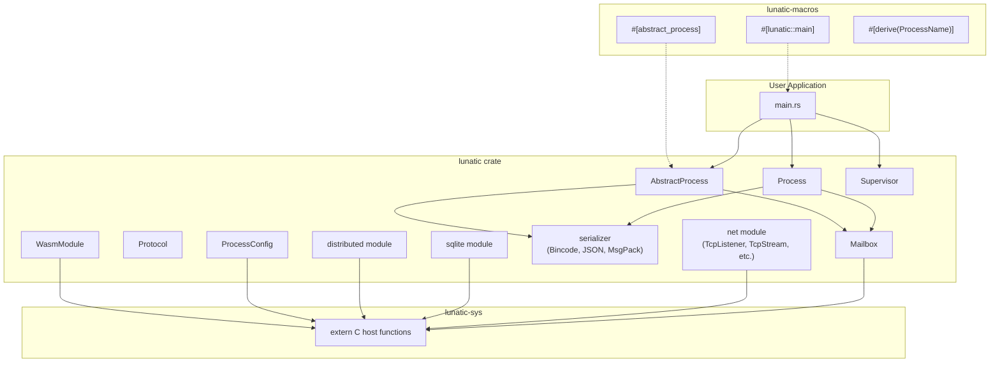

# Project Exploration: lunatic-rs (Rust SDK)

## Overview

`lunatic-rs` (published as the `lunatic` crate on crates.io) is the primary Rust SDK for building applications that run on the lunatic runtime. It provides idiomatic Rust abstractions over the lunatic host API: processes, mailboxes, supervisors, abstract processes (stateful actors), distributed process spawning, networking, SQLite access, and more. Applications using this crate compile to `wasm32-wasi` and are executed by the lunatic runtime.

The crate is structured as a workspace with three sub-crates: `lunatic-macros` (proc macros for `#[lunatic::main]`, `#[abstract_process]`), `lunatic-sys` (raw FFI bindings to host functions), and `lunatic-test` (test macro).

## Repository

- **Location:** `/home/darkvoid/Boxxed/@formulas/src.rust/src.lunatic/lunatic-rs`
- **Remote:** `https://github.com/lunatic-solutions/lunatic-rs`
- **Primary Language:** Rust
- **License:** Apache-2.0 / MIT

## Directory Structure

```
lunatic-rs/
  Cargo.toml                    # Main crate + workspace
  src/
    lib.rs                      # Public API surface
    config.rs                   # ProcessConfig (guest-side)
    error.rs                    # LunaticError
    macros.rs                   # process_local! macro
    mailbox.rs                  # Mailbox, Signal types
    module.rs                   # WasmModule (compile/load modules)
    process_local.rs            # ProcessLocal storage
    process_name.rs             # ProcessName derive trait
    tag.rs                      # Message tags
    ap/                         # AbstractProcess (stateful actors)
      mod.rs                    # AbstractProcess trait
      builder.rs                # ProcessRef builder
      handlers.rs               # Message/request handlers
      lifecycles.rs             # Init/terminate lifecycle
      messages.rs               # Message routing
      tag.rs                    # Tag-based dispatch
    distributed.rs              # Distributed process operations
    function/
      mod.rs                    # Function-based process types
      process.rs                # Process<M> type
      reference.rs              # ProcessRef for remote processes
    host/
      mod.rs                    # Host function module
      api.rs                    # Raw FFI declarations (extern "C")
    net/
      mod.rs                    # Networking module
      tcp_listener.rs           # TcpListener
      tcp_stream.rs             # TcpStream
      tls_listener.rs           # TlsListener
      tls_stream.rs             # TlsStream
      udp.rs                    # UdpSocket
      resolver.rs               # DNS resolver
    panic.rs                    # Panic handler
    protocol.rs                 # Protocol (typed message exchange)
    serializer.rs               # Bincode/JSON/MsgPack/Protobuf serializers
    supervisor.rs               # Supervisor process
    test.rs                     # Test utilities
    time.rs                     # Timer/sleep
    metrics.rs                  # Metrics API
    sqlite/                     # SQLite client
      mod.rs
      client.rs
      query.rs
      value.rs
      error.rs
  lunatic-macros/               # Proc macros sub-crate
  lunatic-sys/                  # Raw FFI bindings sub-crate
  lunatic-test/                 # Test macro sub-crate
  tests/                        # Integration tests
  benches/                      # Serializer benchmarks
  examples/                     # Usage examples
```

## Architecture

### High-Level Diagram



### Key Abstractions

#### Process<M>
A handle to a running process that accepts messages of type `M`. Created via `Process::spawn()` or `Process::spawn_link()`. The generic parameter `M` constrains what message types the process can receive.

#### AbstractProcess
A trait for building stateful actors with structured message handling. Provides `init()`, `terminate()`, `handle_message()`, and `handle_request()` lifecycle methods. The `#[abstract_process]` macro generates the boilerplate.

#### Supervisor
A process that supervises children and restarts them on failure. Implements the OTP supervisor pattern. Supports `one_for_one`, `one_for_all`, and `rest_for_one` restart strategies (through the configuration).

#### Mailbox<M>
The receive end of a process's message channel. Supports `receive()` (blocking), `receive_timeout()`, and tag-based selective receive.

#### Serializer
Pluggable serialization for messages. Defaults to bincode, with optional JSON (`json_serializer` feature), MessagePack (`msgpack_serializer` feature), and Protobuf (`protobuf_serializer` feature) support.

## Entry Points

### Process Spawning
```
Process::spawn(|mailbox| { /* process body */ })
Process::spawn_link(|mailbox| { /* linked process body */ })
```

### Abstract Process
```
MyActor::link().start(init_args, None)
```

### Application Entry
```
#[lunatic::main]
fn main(mailbox: Mailbox<()>) { ... }
```

## External Dependencies

| Dependency | Version | Purpose |
|------------|---------|---------|
| serde | 1.0 | Serialization framework |
| bincode | 1.3 | Default message serialization |
| serde_json | 1.0 | Optional JSON serialization |
| rmp-serde | 1.1 | Optional MessagePack serialization |
| protobuf | 3.1 | Optional Protobuf serialization |
| thiserror | 1.0 | Error type derivation |
| paste | 1.0 | Macro utilities |
| lunatic-sqlite-api | 0.13 | SQLite FFI bindings |

## Key Insights

- The `Resource` trait (`fn id() -> u64`, `unsafe fn from_id(id: u64) -> Self`) is the fundamental bridge between guest and host. Every host resource (TCP socket, process handle, timer) is represented as a u64 ID in Wasm linear memory.
- Message passing requires serialization because processes have isolated memory. The serializer choice impacts performance significantly -- bincode is fastest but not human-readable.
- `ProcessLocal` provides thread-local-like storage scoped to a lunatic process, since Wasm modules are single-threaded and standard `thread_local!` does not work as expected.
- The `host::api` module contains raw `extern "C"` function declarations that map 1:1 to the host functions registered by the runtime's `*-api` crates.
- `Process::spawn` takes a closure but actually serializes the closure's captured state across the process boundary -- closures must be `Serialize + Deserialize`.
