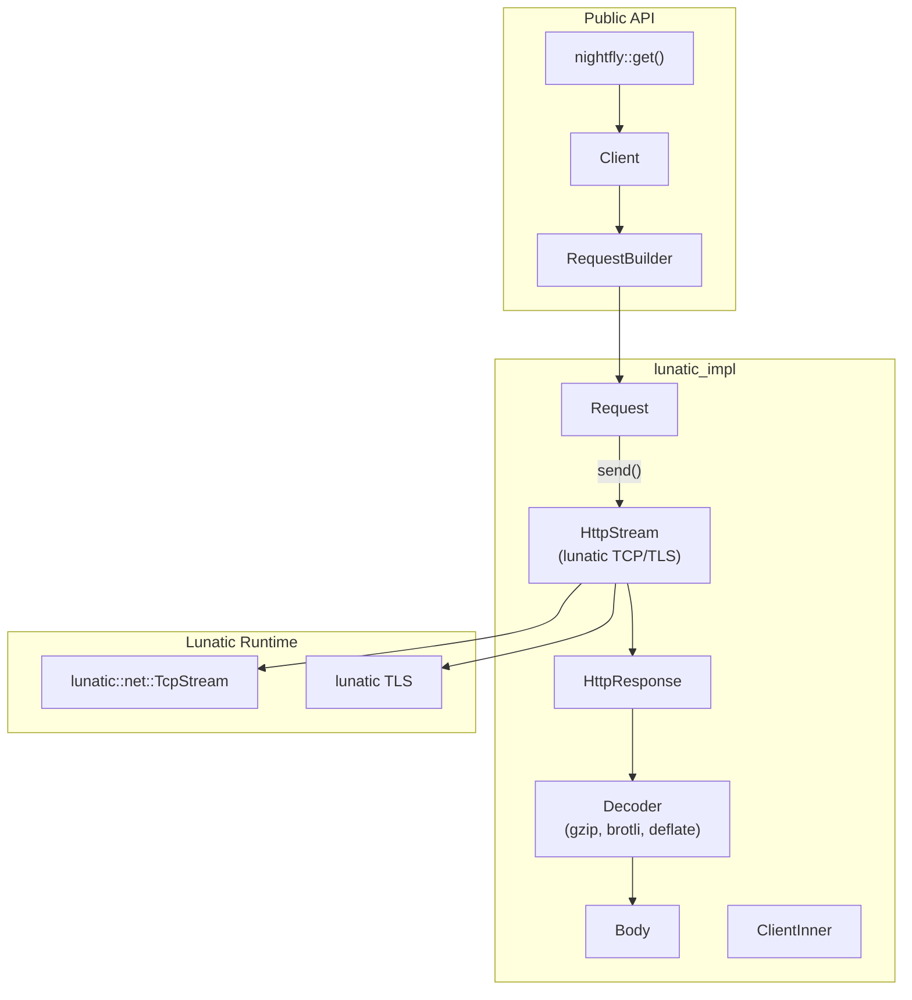

# Project Exploration: nightfly-rs

## Overview

`nightfly` is an HTTP client library for the lunatic runtime, designed as a port of `reqwest` adapted to use lunatic's networking primitives instead of tokio/hyper. It provides an ergonomic, batteries-included HTTP client with support for JSON, forms, cookies, redirects, compression (gzip, brotli, deflate), chunked responses, and TLS via lunatic's native TLS implementation.

The API mirrors `reqwest` closely, making it familiar to Rust developers while being fully compatible with lunatic's process-per-connection model.

## Repository

- **Location:** `/home/darkvoid/Boxxed/@formulas/src.rust/src.lunatic/nightfly-rs`
- **Remote:** `https://github.com/SquattingSocrates/nightfly`
- **Primary Language:** Rust
- **License:** MIT / Apache-2.0

## Directory Structure

```
nightfly-rs/
  Cargo.toml                # Package: nightfly v0.1.6
  CHANGELOG.md
  README.md
  src/
    lib.rs                  # Crate root: re-exports, get() shortcut
    error.rs                # Error types (thiserror-based)
    into_url.rs             # IntoUrl trait
    response.rs             # ResponseBuilderExt trait
    redirect.rs             # Redirect policy
    cookie.rs               # Cookie support (optional)
    tls.rs                  # TLS types (Certificate, Identity)
    util.rs                 # Utilities
    version.rs              # HTTP version selection
    lunatic_impl/
      mod.rs                # Lunatic-specific implementation root
      body.rs               # Request/response body types
      request.rs            # Request + RequestBuilder
      response.rs           # HttpResponse
      client/
        mod.rs              # Client struct
        builder.rs          # ClientBuilder
      decoder.rs            # Response decompression (gzip, brotli, deflate)
      http_stream.rs        # Raw HTTP over lunatic TCP/TLS streams
      upgrade.rs            # Connection upgrade support
  tests/
    blocking.rs
    cookie.rs
    gzip.rs
    brotli.rs
    deflate.rs
    chunked.rs
  examples/
    blocking.rs
    json_dynamic.rs
    json_typed.rs
    form.rs
    simple.rs
```

## Architecture

### Layered Design



### Key Components

1. **Client**: Reusable, cloneable, serializable HTTP client. Maintains configuration (headers, redirect policy, cookies, timeouts). Created via `Client::new()` or `ClientBuilder`.

2. **RequestBuilder**: Fluent API for constructing requests:
   ```rust
   client.post("http://example.com")
       .json(&payload)
       .header("Authorization", "Bearer ...")
       .send()
   ```

3. **HttpStream**: The core transport layer. Uses `lunatic::net::TcpStream` for plain HTTP and lunatic's native TLS for HTTPS. Handles raw HTTP/1.1 request/response framing (via `httparse`).

4. **Decoder**: Transparent response decompression. Supports:
   - gzip (via `flate2`)
   - brotli (via `brotli`)
   - deflate (via `flate2`)
   - Identity (passthrough)

5. **Redirect handling**: Configurable redirect policy with a default chain limit.

6. **Cookie store** (optional): Session cookie persistence using `cookie_store`.

7. **SerializableResponse**: Responses can be serialized with `serde`, enabling them to be sent between lunatic processes.

### Key Design Decisions

- **Synchronous API**: Unlike `reqwest` which is primarily async, nightfly's API is synchronous because lunatic processes are inherently concurrent. Each process can block on I/O without blocking other processes.
- **No hyper**: Instead of using hyper for HTTP framing, nightfly implements HTTP/1.1 directly using `httparse` for parsing and manual request/response serialization. This avoids the tokio dependency.
- **Serializable Client**: `Client` implements `Serialize`/`Deserialize`, allowing it to be passed between lunatic processes.

## Dependencies

| Crate | Version | Purpose |
|-------|---------|---------|
| lunatic | 0.13.1 | Runtime SDK (TCP, TLS) |
| lunatic-log | 0.4 | Logging |
| http | 0.2 | HTTP types (Method, StatusCode, HeaderMap) |
| httparse | 1.7.1 | HTTP/1.1 parsing |
| url | 2.2 | URL parsing |
| serde | 1.0 | Serialization |
| serde_json | 1.0 | JSON body support |
| serde_urlencoded | 0.7.1 | Form encoding |
| bytes | 1.0 | Byte buffer management |
| encoding_rs | 0.8.31 | Character encoding |
| mime | 0.3.16 | MIME types |
| flate2 | 1.0.24 | gzip/deflate decompression |
| brotli | 3.3.4 | Brotli decompression |
| base64 | 0.13 | Base64 encoding |
| thiserror | 1.0 | Error types |
| tower-service | 0.3 | Service trait |
| percent-encoding | 2.2.0 | URL encoding |

### Optional Dependencies
| Crate | Feature | Purpose |
|-------|---------|---------|
| cookie / cookie_store | `cookies` | Cookie jar |
| proc-macro-hack | `cookies` | Macro support |
| mime_guess | `multipart` | MIME detection (WIP) |

## Working Features

- JSON, text, and bytes for request/response bodies
- Decompression (brotli, gzip, deflate)
- Redirect handling
- Cookies
- Chunked responses
- Multiple open TCP streams per client
- Timeouts

## In Progress / Missing

- Response piping (requires chunk-encoding)
- Connection pooling
- Proxy handling
- Upgrade, SOCKS5, WebSockets
- Custom DNS resolver

## Ecosystem Role

`nightfly` is the primary HTTP client for lunatic applications. Since lunatic processes cannot use `reqwest` (which depends on tokio), any lunatic application needing to make outbound HTTP requests uses nightfly. It is a dependency of the `submillisecond` test suite and referenced across the ecosystem.

The library's reqwest-compatible API surface means existing Rust code can be ported to lunatic with minimal changes -- typically just replacing `reqwest::` with `nightfly::` in imports.
