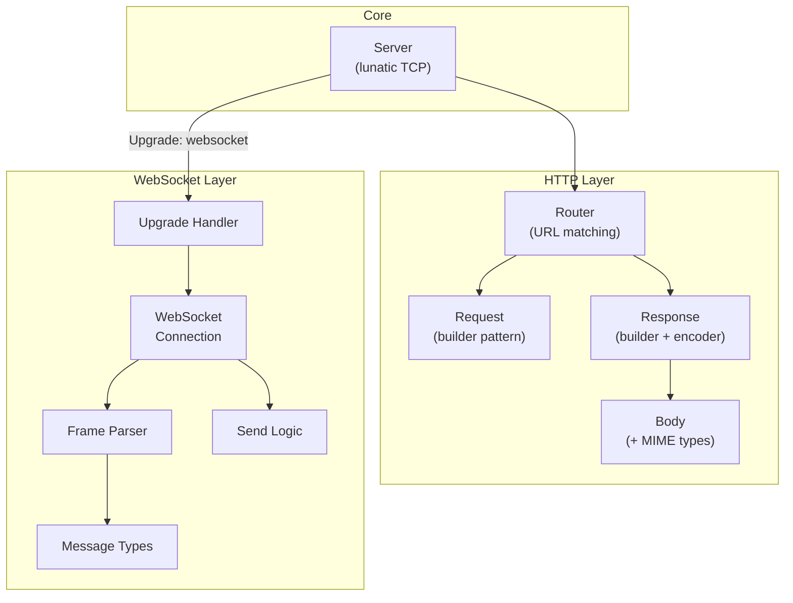
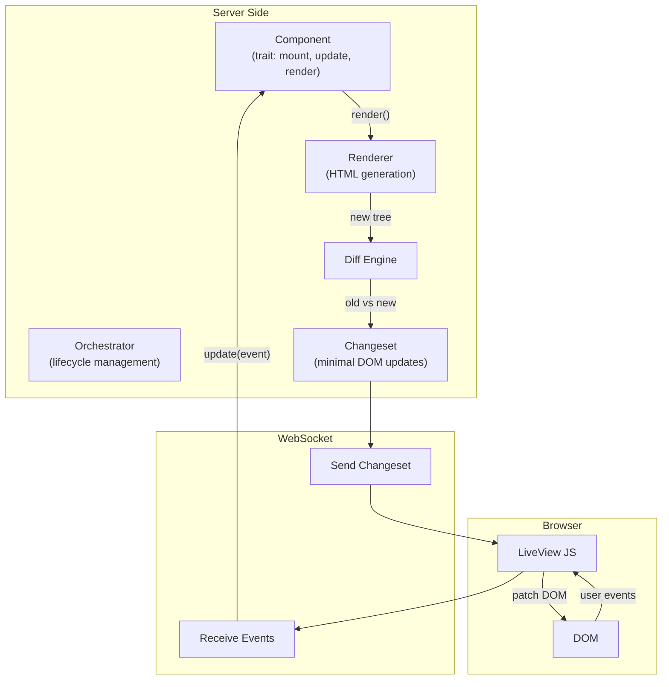

# Project Exploration: puck

## Overview

Puck is an experimental HTTP library and LiveView framework for the lunatic virtual machine. Named after the mischievous fairy in Shakespeare's "A Midsummer Night's Dream," it prioritizes fast compile times, correctness, and security over raw performance. It provides a complete web stack: HTTP request/response handling, routing, WebSocket support, and a LiveView implementation for server-rendered interactive UIs.

Puck is an alternative to `submillisecond` + `submillisecond-live-view` in the lunatic ecosystem, taking a different architectural approach.

## Repository

- **Location:** `/home/darkvoid/Boxxed/@formulas/src.rust/src.lunatic/puck`
- **Primary Language:** Rust
- **License:** MIT / Apache-2.0

## Directory Structure

```
puck/
  Cargo.toml                # Workspace root
  README.md
  CODE_OF_CONDUCT.md
  bors.toml                 # Bors merge bot config
  autobahn/                 # WebSocket compliance tests (Autobahn)
  scripts/                  # Build/test scripts
  examples/
    list/                   # List example app
    chat/                   # Chat example app
  puck/
    Cargo.toml              # puck v0.1.0
    src/
      lib.rs                # Crate root
      body/
        mime.rs             # MIME type handling
        mod.rs              # Request/response body
      core/
        mod.rs              # Core server logic
        router/
          match_url.rs      # URL pattern matching
          mod.rs            # Router implementation
      request/
        builder.rs          # Request builder
        mod.rs              # Request type
      response/
        builder.rs          # Response builder
        encoder.rs          # Response encoding (chunked, etc.)
        mod.rs              # Response type
      ws/
        frame.rs            # WebSocket frame parsing
        message.rs          # WebSocket message types
        mod.rs              # WebSocket module root
        send.rs             # WebSocket send logic
        upgrade.rs          # HTTP-to-WebSocket upgrade
        websocket.rs        # WebSocket connection handler
      regressions/
        mod.rs              # Regression tests
  puck_liveview/
    Cargo.toml              # puck_liveview v0.1.0
    src/
      lib.rs                # LiveView crate root
      init.rs               # LiveView initialization
      client/
        mod.rs              # Client-side communication
        send_changeset.rs   # Send DOM changesets over WebSocket
      component/
        mod.rs              # Component trait/lifecycle
      dom/
        mod.rs              # DOM representation
        event.rs            # DOM events
        listener.rs         # Event listeners
        element/
          mod.rs            # DOM element types
          orchestrator.rs   # Element lifecycle management
          render.rs         # Rendering logic
          diff/
            mod.rs          # DOM diffing algorithm
            test_diffing.rs # Diffing tests
            changeset/
              mod.rs        # Changeset types
              apply.rs      # Apply changesets to DOM
              instruction_serializer.rs  # Serialize diff instructions
      html/
        mod.rs              # HTML parsing/conversion
        id.rs               # Element ID management
        tree/               # HTML tree structure
        snapshots/          # Insta snapshot tests
      regressions/
        mod.rs              # Regression tests
```

## Architecture

### puck (HTTP Library)



Key features:
- **Router**: URL pattern matching with parameter extraction
- **WebSocket**: Full RFC 6455 implementation with Autobahn compliance testing
- **Request/Response**: Builder-pattern APIs
- **Response encoding**: Supports chunked transfer encoding

### puck_liveview (LiveView Framework)



The LiveView implementation includes:
- **Component trait**: Defines `mount`, `update`, and `render` lifecycle methods
- **DOM representation**: Full DOM tree with element types, events, and listeners
- **Diff engine**: Computes minimal changesets between old and new DOM trees
- **Changeset serialization**: Serializes diff instructions for efficient WebSocket transmission
- **HTML parsing**: Converts HTML strings to the internal DOM tree representation
- **Snapshot testing**: Uses Insta for DOM conversion snapshot tests
- **Fuzz testing**: Optional fuzzcheck support for the DOM diffing logic

### HTML Rendering

Uses `malvolio` (a Rust HTML generation library) instead of Maud. This is a key difference from `submillisecond-live-view` which uses the `maud_live_view` fork.

## Dependencies

### puck
| Crate | Version | Purpose |
|-------|---------|---------|
| lunatic | 0.9.1 | Runtime SDK |
| httparse | 1.7.1 | HTTP parsing |
| url | 2.2.2 | URL handling |
| sha-1 | 0.10.0 | WebSocket handshake |
| base64 | 0.13.0 | WebSocket handshake |
| byteorder | 1.4.3 | WebSocket frame parsing |
| anyhow | 1.0.58 | Error handling |
| thiserror | 1.0.31 | Error types |
| serde | 1.0.138 | Serialization |
| log | 0.4.17 | Logging |

### puck_liveview
| Crate | Version | Purpose |
|-------|---------|---------|
| puck | path | HTTP + WebSocket |
| lunatic | 0.9.1 | Runtime SDK |
| malvolio | 0.3.1 (git) | HTML generation |
| serde / serde_json | 1.0 | Serialization |
| derive_builder | 0.11.2 | Builder pattern |
| fuzzcheck (optional) | 0.12.0 | Fuzz testing |

## Ecosystem Role

Puck represents an alternative approach to web development on lunatic, compared to `submillisecond`:

| Aspect | submillisecond | puck |
|--------|---------------|------|
| HTTP parsing | Custom | httparse |
| HTML templates | Maud (proc macro) | malvolio (builder API) |
| LiveView diffing | Template-based | DOM tree diffing |
| Compile times | Slower (proc macros) | Faster (goal) |
| Maturity | More features | More experimental |
| lunatic version | 0.14 | 0.9.1 |

Puck is notable for its WebSocket compliance testing (Autobahn test suite) and its fuzz-tested DOM diffing algorithm, showing a focus on correctness. However, it targets an older version of lunatic (0.9.1) and appears to have been less actively developed than the submillisecond stack.
