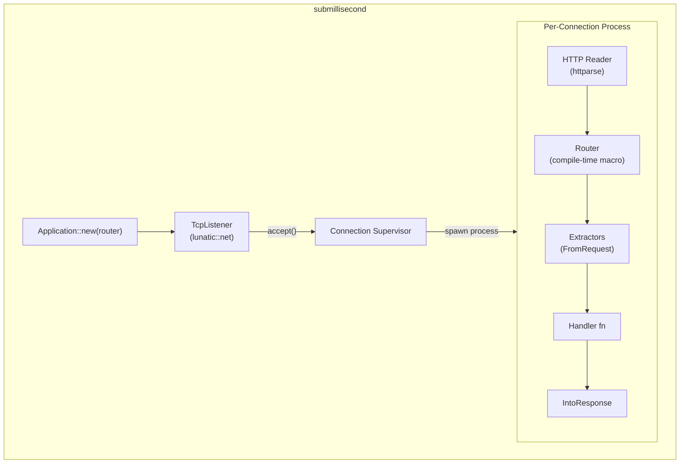

# Project Exploration: submillisecond

## Overview

Submillisecond is a web framework designed specifically for the lunatic runtime. It leverages lunatic's lightweight process model to spawn a new process for every incoming HTTP connection, providing true isolation between requests. The framework features a compile-time router macro, request extractors (similar to Axum), middleware, guards, WebSocket support, cookie handling, template rendering (via Askama), and JSON support. It is named for its goal of sub-millisecond response times.

## Repository

- **Location:** `/home/darkvoid/Boxxed/@formulas/src.rust/src.lunatic/submillisecond`
- **Remote:** `https://github.com/lunatic-solutions/submillisecond`
- **Primary Language:** Rust
- **License:** Apache-2.0 / MIT

## Directory Structure

```
submillisecond/
  Cargo.toml                      # Main crate + workspace
  src/
    lib.rs                        # Public API, re-exports
    app.rs                        # Application struct (server binding)
    core.rs                       # Body type
    error.rs                      # Error types
    guard.rs                      # Guard trait (route protection)
    handler.rs                    # Handler trait (fn -> response)
    json.rs                       # JSON extractor/response
    macros.rs                     # Internal helper macros
    params.rs                     # Route parameters
    reader.rs                     # HTTP request parsing
    request.rs                    # RequestContext (carries request + next_handler)
    response.rs                   # Response type
    response/
      into_response.rs            # IntoResponse trait
      into_response_parts.rs      # IntoResponseParts trait
    extract.rs                    # FromRequest trait
    extract/
      body.rs                     # Body extractor
      header_map.rs               # Headers extractor
      host.rs                     # Host extractor
      json.rs                     # JSON extractor
      method.rs                   # Method extractor
      params.rs                   # Params extractor
      path.rs                     # Path extractor with deserialization
      path/de.rs                  # Path deserializer
      query.rs                    # Query string extractor
      rejection.rs                # Extraction rejection types
      request.rs                  # Full request extractor
      route.rs                    # Route extractor
      splat.rs                    # Splat (wildcard) extractor
      state.rs                    # State extractor
      string.rs                   # String extractor
      vec.rs                      # Vec<u8> extractor
    cookies.rs                    # Cookie handling
    defaults.rs                   # Default handlers (404, etc.)
    session.rs                    # Session management
    state.rs                      # Shared state
    supervisor.rs                 # Connection supervisor
    template.rs                   # Askama template response
    typed_header.rs               # Typed header extractor
    websocket.rs                  # WebSocket upgrade handler
  submillisecond_macros/          # Proc macro crate (router! macro)
  static/                         # Static file serving
  tests/                          # Integration tests
  benches/                        # Performance benchmarks
  examples/                       # Usage examples
```

## Architecture



### Key Design Decisions

- **Process-per-connection:** Each TCP connection spawns a new lunatic process. This provides complete memory isolation between requests -- a panic in one handler cannot affect other connections.
- **Compile-time routing:** The `router!` macro generates a match tree at compile time, avoiding runtime route resolution overhead.
- **Extractor pattern:** Handlers take any number of arguments that implement `FromRequest`, similar to Axum's extractor model.
- **Middleware as handlers:** Middleware is just a handler that calls `req.next_handler()` to continue the chain.

## Features

| Feature | Crate | Description |
|---------|-------|-------------|
| `cookies` | cookie, serde_json | Cookie parsing and management |
| `json` | serde_json | JSON request/response |
| `logging` | lunatic-log, ansi_term | Request logging (default on) |
| `query` | serde_urlencoded | Query string parsing |
| `template` | askama | Template rendering |
| `websocket` | tungstenite, sha1, base64ct | WebSocket upgrade |

## Key Insights

- The framework is tightly coupled to the lunatic runtime -- it uses `lunatic::net::TcpListener`, not `std::net` or Tokio. This means it cannot run outside lunatic.
- HTTP parsing is done manually with `httparse` rather than using `hyper`, keeping the dependency tree small and Wasm-compatible.
- The `Supervisor` wraps the TCP accept loop, automatically restarting it if the listener process crashes.
- The router macro is in a separate proc-macro crate (`submillisecond_macros`) which generates match arms at compile time for the defined routes.
