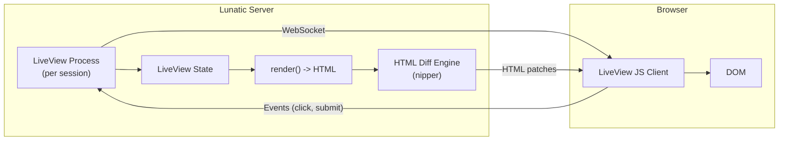

# Project Exploration: submillisecond-live-view

## Overview

Submillisecond LiveView is a Phoenix LiveView-inspired library that provides rich, real-time user experiences with server-rendered HTML over WebSocket connections. It runs on the submillisecond web framework and lunatic runtime, with each LiveView session backed by a lunatic process. State changes on the server trigger HTML diffs that are pushed to the client, where a JavaScript library patches the DOM.

The library uses the `maud-live-view` crate (a fork of Maud) for HTML templating with `html!` macros, and handles event binding, form handling, and live navigation.

## Repository

- **Location:** `/home/darkvoid/Boxxed/@formulas/src.rust/src.lunatic/submillisecond-live-view`
- **Remote:** `https://github.com/lunatic-solutions/submillisecond-live-view`
- **Primary Language:** Rust (server), JavaScript (client)
- **License:** MIT / Apache-2.0

## Directory Structure

```
submillisecond-live-view/
  Cargo.toml                    # Main crate
  src/
    lib.rs                      # LiveView trait, public API
    ...                         # LiveView implementation
  dist/                         # Compiled JavaScript client bundle
  web/                          # JavaScript source (LiveView client)
  static/                       # Static assets
  examples/                     # Usage examples (counter, todo, etc.)
  tests/                        # Integration tests
```

## Architecture



### LiveView Trait

The core abstraction. Users implement this trait on their state type:

- `type Events` -- tuple of event handler types
- `mount(uri, socket)` -- initialize state
- `render(&self) -> Rendered` -- produce HTML from current state

Events are typed structs that implement deserialization, triggered by HTML attributes like `lv-click="increment"`.

## External Dependencies

| Dependency | Version | Purpose |
|------------|---------|---------|
| submillisecond | 0.4.0 | Web framework (with cookies + websocket) |
| lunatic | 0.13 | Runtime (with json_serializer) |
| maud-live-view | 0.24.3 | HTML templating with diff support |
| nipper | 0.1 | HTML diffing |
| tungstenite | 0.19 | WebSocket protocol |
| serde/serde_json | 1.0 | State serialization |
| jwt/hmac/sha2 | various | Session token signing |
| slotmap | 1.0 | Session storage |

## Key Insights

- Each LiveView session runs as a separate lunatic process with its own isolated state. If a session crashes, it does not affect other users.
- The `liveview_js` feature (default on) bundles a JavaScript client that handles DOM patching, event binding, and WebSocket management.
- HTML diffing is performed server-side using the `nipper` crate (CSS selector-based HTML manipulation) to compute minimal patches.
- Session security uses JWT tokens with HMAC-SHA256 signing, with a `const-random` compile-time secret.
- The pattern closely mirrors Phoenix LiveView: initial HTTP render, then WebSocket upgrade for subsequent interactions.
