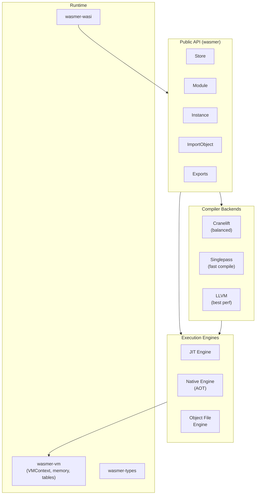

# Project Exploration: wasmer (lunatic fork)

## Overview

This is a fork of Wasmer v1.0.1, a WebAssembly runtime, included in the lunatic ecosystem. Wasmer enables running WebAssembly modules outside of browsers with near-native performance, supporting multiple compiler backends (Cranelift, Singlepass, LLVM) and execution engines (JIT, Native/AOT).

This specific version (v1.0.1) was the Wasm execution engine used by an earlier version of lunatic before the project migrated to Wasmtime. The fork was preserved as a historical artifact.

## Repository

- **Location:** `/home/darkvoid/Boxxed/@formulas/src.rust/src.lunatic/wasmer`
- **Remote:** Originally `https://github.com/wasmerio/wasmer`
- **Primary Language:** Rust
- **License:** MIT

## Directory Structure

```
wasmer/
  Cargo.toml                # Workspace: wasmer-workspace v1.0.1
  Cargo.lock
  README.md
  Makefile                  # Build automation
  build.rs                  # Test generation
  Xargo.toml                # Cross-compilation config
  SECURITY.md
  CONTRIBUTING.md
  ATTRIBUTIONS.md
  lib/
    api/                    # wasmer (public API crate)
    compiler/               # wasmer-compiler (compiler framework)
    compiler-cranelift/     # Cranelift backend
    compiler-singlepass/    # Singlepass backend (fast compilation)
    compiler-llvm/          # LLVM backend (best optimization)
    engine/                 # wasmer-engine (execution engine abstraction)
    engine-jit/             # JIT execution engine
    engine-native/          # Native/AOT execution engine
    engine-object-file/     # Object file engine
    vm/                     # wasmer-vm (runtime VM internals)
    wasmer-types/           # Type definitions
    wasi/                   # wasmer-wasi (WASI implementation)
    wasi-experimental-io-devices/  # Experimental I/O
    emscripten/             # Emscripten compatibility
    cache/                  # Module caching
    c-api/                  # C API bindings
    cli/                    # CLI binary
    derive/                 # Derive macros
    middlewares/            # Compiler middlewares (e.g., metering)
    object/                 # Object file utilities
    deprecated/             # Deprecated APIs (excluded)
  examples/
    early_exit.rs
    engine_jit.rs
    engine_native.rs
    engine_headless.rs
    engine_cross_compilation.rs
    compiler_singlepass.rs
    compiler_cranelift.rs
    compiler_llvm.rs
    exports_function.rs
    exports_global.rs
    exports_memory.rs
    imports_function.rs
    imports_global.rs
    imports_function_env.rs
    tunables_limit_memory.rs
    wasi.rs
    wasi_pipes.rs
    table.rs
    memory.rs
    instance.rs
    errors.rs
    hello_world.rs
    metering.rs
    imports_exports.rs
  tests/
    lib/
      wast/                 # WebAssembly spec test runner
      test-generator/       # Test generation utilities
      engine-dummy/         # Dummy engine for testing
    integration/
      cli/                  # CLI integration tests
  benches/
    static_and_dynamic_functions.rs
  docs/
  fuzz/
  scripts/
  assets/
```

## Architecture

### Layered Architecture



### Key Crates

1. **wasmer** (lib/api): The public API. Provides `Store`, `Module`, `Instance`, `ImportObject`, typed `Function`, `Memory`, `Global`, `Table` types. This is what users interact with.

2. **wasmer-compiler**: Framework for compiler backends. Defines the `Compiler` trait.

3. **Compiler backends**:
   - **Cranelift**: Good balance of compile speed and runtime performance
   - **Singlepass**: Very fast compilation, suitable for untrusted code (linear-time compilation)
   - **LLVM**: Best runtime performance, slowest compilation

4. **wasmer-engine**: Execution engine abstraction. Defines how compiled code is loaded and executed.

5. **Engine implementations**:
   - **JIT**: Compiles and runs in-memory
   - **Native**: Produces shared libraries (.so/.dylib/.dll) for AOT execution
   - **Object File**: Produces object files for linking

6. **wasmer-vm**: Low-level VM internals -- VMContext, linear memory management, table management, trap handling.

7. **wasmer-wasi**: WASI (WebAssembly System Interface) implementation.

8. **wasmer-middlewares**: Compiler middlewares like metering (instruction counting).

### Feature System

The workspace uses an extensive feature flag system:
- Compiler selection: `cranelift`, `singlepass`, `llvm`
- Engine selection: `jit`, `native`, `object-file`
- Functionality: `wasi`, `emscripten`, `cache`, `middlewares`
- Testing: `test-singlepass`, `test-cranelift`, `test-llvm`, `test-native`, `test-jit`

## Why This Fork Exists

Early versions of lunatic used Wasmer as its Wasm execution engine. The lunatic runtime would:
1. Compile user Wasm modules using Wasmer's compiler
2. Create instances with imported host functions (lunatic's process/networking/messaging API)
3. Run each lunatic process as a Wasmer instance

The migration to Wasmtime occurred because:
- Wasmtime's async support (fuel-based, epoch-based interruption) better suited lunatic's cooperative scheduling
- Wasmtime's component model and WASI evolution aligned with lunatic's goals
- The Bytecode Alliance's (Wasmtime's steward) focus on security and correctness

This fork at v1.0.1 is preserved as a historical reference but is not used by the final lunatic runtime.

## Dependencies (Key)

| Crate | Purpose |
|-------|---------|
| cranelift-* | Cranelift compiler infrastructure |
| llvm-sys | LLVM bindings (for LLVM backend) |
| target-lexicon | Target triple handling |
| wasmparser | Wasm binary parsing |
| region | Memory protection (mmap) |

## Ecosystem Role

This is a historical dependency. The final lunatic runtime (v0.13) uses Wasmtime 8, not Wasmer. This fork is preserved in the lunatic source collection as documentation of the project's evolution. It demonstrates the pluggable nature of Wasm execution engines -- lunatic's architecture was portable enough to migrate from Wasmer to Wasmtime.

For anyone studying Wasm runtime design, this v1.0.1 snapshot shows Wasmer's architecture at the point where it introduced the pluggable compiler/engine system, which was a significant architectural improvement over earlier monolithic versions.
