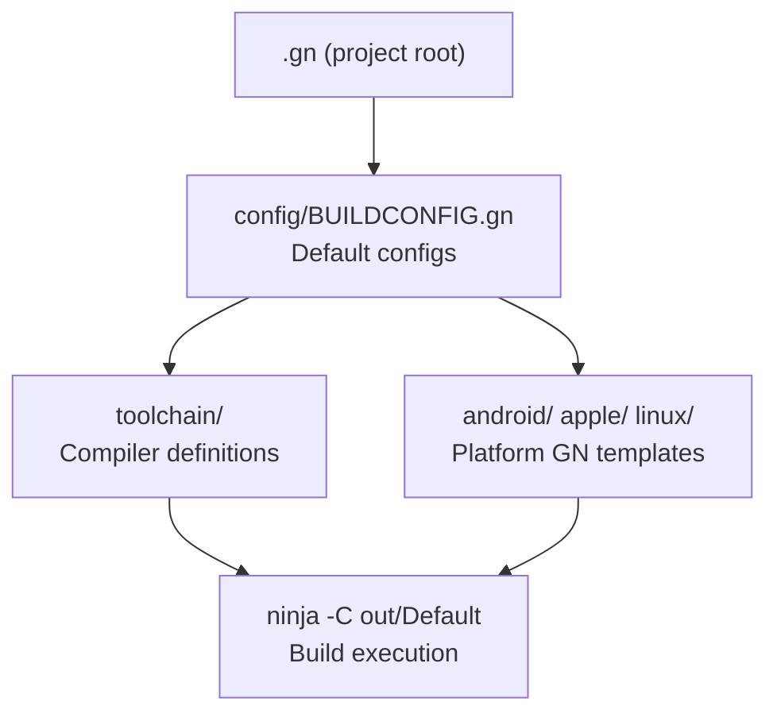

# Project Exploration: Buildroot

## Overview

Buildroot is the GN/Ninja build toolset for the Lynx project, derived from Chromium's `build/` directory. It provides multi-platform build configurations, toolchain definitions, and build templates that enable the C++ engine and other native components to be built consistently across Android, iOS, Linux, macOS, and Windows.

## Repository

- **Location:** `/home/darkvoid/Boxxed/@formulas/src.rust/src.lynxfamily/buildroot`
- **Remote:** https://github.com/lynx-family/buildroot
- **Primary Language:** GN, Python
- **License:** Apache 2.0

## Directory Structure

```
buildroot/
  android/                 # Android-specific GN templates and scripts
  apple/                   # Apple (iOS/macOS) GN templates
  config/                  # Common GN configs and BUILDCONFIG.gn
  clang/                   # Clang compiler configuration
  common.croc              # Common definitions
  toolchain/               # GN toolchain definitions (compilers, linkers)
  secondary/               # Overlay BUILD.gn files for sub-repos
  *.py                     # Python build helper scripts
```

## Architecture



## Key Insights

- Directly derived from Chromium's build system, so Chromium build knowledge transfers
- `BUILDCONFIG.gn` is automatically included in all BUILD.gn files across the project
- The `secondary/` directory allows adding BUILD.gn files to third-party repos without modifying them
- Python scripts handle host detection, SDK version checking, and build artifact management
- Supports cross-compilation via `target_cpu` and `target_os` GN args
