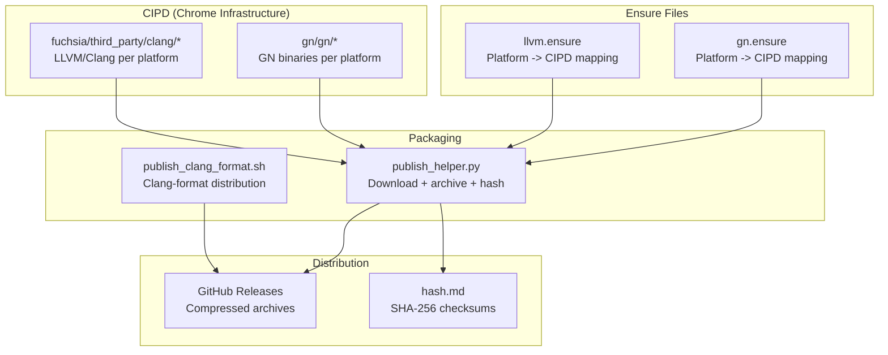

# Project Exploration: Buildtools

## Overview

Buildtools is the binary tool distribution repository for the Lynx project. It automates the collection, packaging, and publishing of essential build tools -- specifically GN (Generate Ninja) and LLVM/Clang -- required to build Lynx's native C++ components. The tools are fetched from Google's CIPD (Chrome Infrastructure Package Deployer), packaged as compressed archives, and published as GitHub Releases for deterministic, reproducible builds.

## Repository

- **Location:** `/home/darkvoid/Boxxed/@formulas/src.rust/src.lynxfamily/buildtools`
- **Remote:** https://github.com/lynx-family/buildtools
- **Primary Language:** Python, Shell
- **License:** Apache 2.0

## Directory Structure

```
buildtools/
  gn.ensure            # CIPD ensure file for GN binary
  llvm.ensure          # CIPD ensure file for LLVM/Clang binaries
  publish_helper.py    # Python script for packaging and hashing
  publish_clang_format.sh  # Shell script for clang-format publishing
  README.md
  LICENSE
  NOTICE
  SECURITY.md
```

## Architecture



## Key Components

### GN Ensure File (gn.ensure)

Specifies GN binary packages from CIPD for five platform/architecture combinations:
- `darwin-arm64` (macOS Apple Silicon)
- `darwin-x86_64` (macOS Intel)
- `linux-arm64` (Linux ARM)
- `linux-x86_64` (Linux Intel)
- `windows-x86_64` (Windows)

All pinned to git revision `cc28efe62ef0c2fb32455f414a29c4a55bb7fbc4`.

### LLVM Ensure File (llvm.ensure)

Specifies LLVM/Clang toolchain packages from CIPD (Fuchsia's clang builds) for four platform/architecture combinations:
- `darwin-arm64`
- `darwin-x86_64`
- `linux-arm64`
- `linux-x86_64`

All pinned to git revision `020d2fb7711d70e296f19d83565f8d93d2cfda71`. No Windows LLVM build is provided.

### Publish Helper (publish_helper.py)

A Python script that orchestrates the packaging process:

1. **`process_cipd_packages(ensure_files)`**: For each ensure file:
   - Runs `cipd ensure` to download the binaries to local directories
   - Parses the `@Subdir` directives to find output paths
   - Creates `.tar.gz` archives of each platform's tools

2. **`generate_hash_file()`**: Generates `hash.md` containing SHA-256 checksums of all `buildtools-*` archive files for integrity verification.

3. **`read_ensure_file()`**: Parses CIPD ensure files to extract `@Subdir` target directories.

### Clang-Format Publishing (publish_clang_format.sh)

Separate script for distributing the `clang-format` binary used by tools-shared for C++ code formatting.

## CIPD Package Sources

The tools are sourced from two CIPD namespaces:
- **`gn/gn/*`**: The GN meta-build system (generates Ninja files)
- **`fuchsia/third_party/clang/*`**: LLVM/Clang toolchain from Google's Fuchsia project

These are the same build tools used by Chromium, Fuchsia, and other Google open-source projects, ensuring Lynx's native build uses battle-tested toolchains.

## Build Tool Matrix

| Tool | darwin-arm64 | darwin-x86_64 | linux-arm64 | linux-x86_64 | windows-x86_64 |
|------|:---:|:---:|:---:|:---:|:---:|
| GN | Yes | Yes | Yes | Yes | Yes |
| LLVM/Clang | Yes | Yes | Yes | Yes | No |

## Role in the Lynx Ecosystem

Buildtools ensures that every Lynx developer and CI system uses identical, pinned versions of GN and Clang. This is critical because:

1. **GN** generates the Ninja build files for the C++ engine (lynx/core) based on BUILD.gn files from buildroot
2. **Clang** compiles the C++ engine code with consistent behavior across platforms
3. **Version pinning** via git revision hashes prevents "works on my machine" build issues
4. **GitHub Releases distribution** avoids requiring developers to set up CIPD themselves

Habitat (the dependency manager) downloads these pre-packaged tools as part of `hab sync`, so individual developers never interact with CIPD directly.

## Key Insights

- The repository contains no actual tool source code -- it is purely a packaging and distribution mechanism
- CIPD ensure files use a declarative format: service URL, paranoid mode, and subdir-to-package mappings
- The Fuchsia project's Clang builds are used rather than building LLVM from source, saving significant CI time
- No Windows LLVM/Clang build is provided, suggesting Windows native development may not be a primary target (or uses MSVC)
- The SHA-256 hash generation provides supply chain security for downloaded tool archives
- This is analogous to `aspect-build/rules_js` or similar toolchain distribution patterns in Bazel ecosystems
