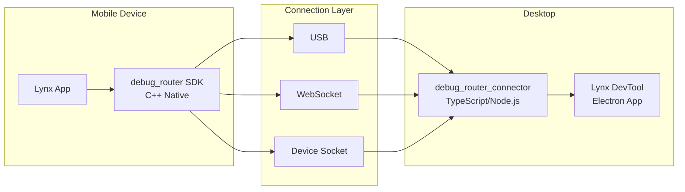

# Project Exploration: DebugRouter

## Overview

DebugRouter is the debugging infrastructure for the Lynx ecosystem. It provides a stable connection layer between mobile apps running Lynx and the Lynx DevTool desktop application. It supports multiple connection methods (USB, WebSocket, local/remote device sockets) and allows custom protocol registration, making it useful not only for Lynx debugging but also as a foundation for cross-platform testing frameworks.

The project ships two products: `debug_router` (a native C++ SDK for Android, iOS, Windows, and POSIX systems) and `debug_router_connector` (a TypeScript npm package for connecting to and communicating with debug_router instances).

## Repository

- **Location:** `/home/darkvoid/Boxxed/@formulas/src.rust/src.lynxfamily/debug-router`
- **Remote:** https://github.com/lynx-family/debug-router
- **Primary Language:** C++, TypeScript
- **License:** Apache 2.0

## Directory Structure

```
debug-router/
  debug_router/              # Native SDK (C++)
    Android/                 # Android JNI bindings
    iOS/                     # iOS Obj-C bindings
    Common/                  # Cross-platform C++ core
    native/                  # Native transport layer
  debug_router_connector/    # TypeScript connector package
    src/                     # TypeScript source
    scripts/                 # Build scripts
    third_party/             # Vendored dependencies
  remote_debug_driver/       # Remote debugging driver
  test/                      # End-to-end tests
  third_party/               # Third-party dependencies
  tools/                     # Development tools
  BUILD.gn                   # GN build file
  config.gni                 # Build configuration
  DEPS                       # Habitat dependencies
  DebugRouter.podspec        # CocoaPods spec for iOS
```

## Architecture



### Key Design

- **Unified TypeScript Interface:** A single set of test/debug code works across Android, iOS, Windows, and POSIX platforms
- **Protocol Extensibility:** Custom protocols can be registered and invoked through the connector
- **Bidirectional Messaging:** Full duplex communication for real-time debugging

## Entry Points

### Mobile (debug_router SDK)
- Embedded in the Lynx app via Android Gradle or iOS CocoaPods
- Registers with the engine's inspector hooks

### Desktop (debug_router_connector)
- `npm install && npm run build` to compile
- Discovers connected devices and establishes debug sessions

## Key Insights

- The architecture cleanly separates the native transport (C++) from the protocol handling (TypeScript)
- USB connection support is critical for iOS debugging where WebSocket may not be available
- The extensible protocol system makes this usable beyond Lynx for any cross-platform testing scenario
- CocoaPods and GN dual build support mirrors the Lynx core pattern
