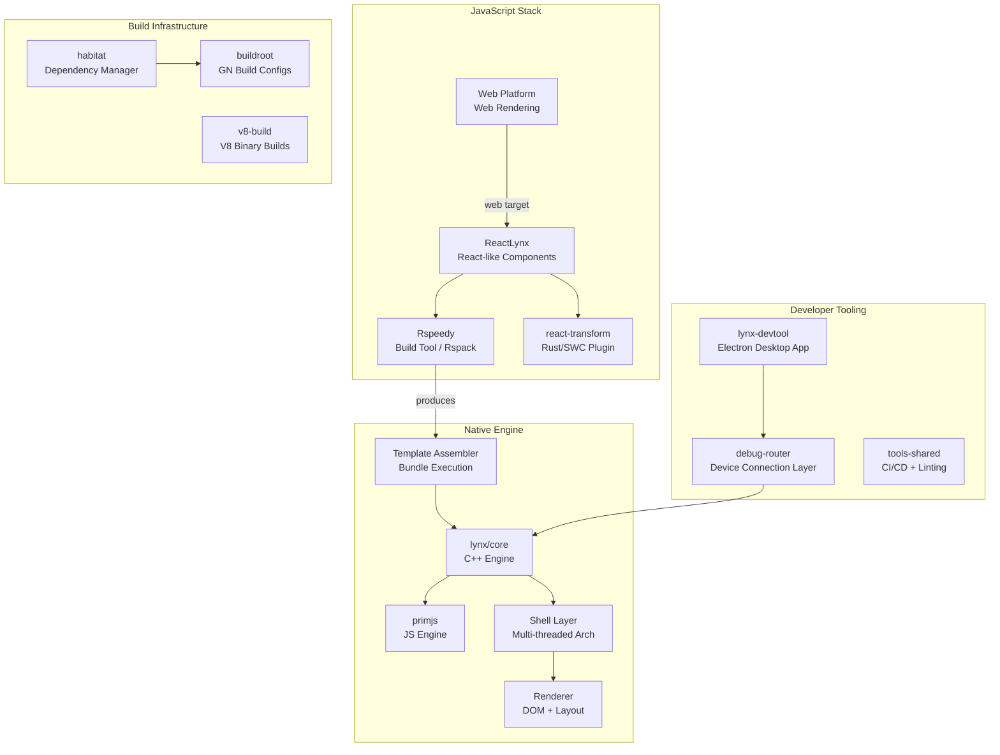
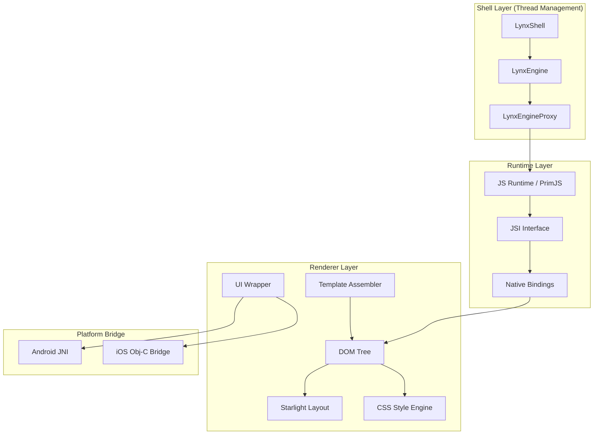
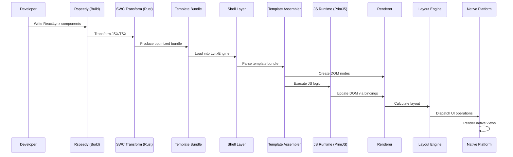

# Project Exploration: Lynx Family

## Overview

Lynx is a family of open-source technologies that empowers developers to use existing web skills (CSS, React) to create truly native UIs for mobile (Android, iOS) and web from a single codebase. The project emphasizes performance at scale through a multithreaded C++ core engine, a custom JavaScript engine (PrimJS), and a modern JavaScript toolchain (lynx-stack) built around React and Rspack/SWC.

The Lynx family is not a single monolithic repository but an ecosystem of 14 specialized repositories, each handling a distinct concern -- from the core rendering engine written in C++ to build tooling, debugging infrastructure, dependency management, and documentation. The architecture follows a "write once, render anywhere" philosophy where a React-like component tree is compiled into a platform-neutral template bundle, then rendered natively on each platform by the C++ core engine.

The ecosystem targets iOS 10+ and Android 5.0+ (API 21+), with web rendering supported through a separate web-platform package. The build system uses GN/Ninja (Chromium-style) for the native layer and pnpm workspaces with Rspack for the JavaScript layer.

## Repository

- **Location:** `/home/darkvoid/Boxxed/@formulas/src.rust/src.lynxfamily`
- **Remote:** https://github.com/lynx-family (multi-repo organization)
- **Primary Languages:** C++ (core engine), TypeScript/JavaScript (toolchain, devtools), Rust (SWC transforms), Python (build tooling)
- **License:** Apache 2.0

## Ecosystem Directory Structure

```
src.lynxfamily/
  lynx/                          # Core C++ rendering engine (the heart of Lynx)
  lynx-stack/                    # JavaScript toolchain: ReactLynx, Rspeedy, web-platform
  primjs/                        # Custom JS engine (QuickJS fork with GC, template interpreter)
  debug-router/                  # Debug infrastructure: USB/WebSocket device connections
  lynx-devtool/                  # Electron-based desktop debugging application
  lynx-examples/                 # Official example gallery (30+ examples)
  lynx-repro/                    # Minimal reproducible example template
  lynx-website/                  # Documentation site (lynxjs.org)
  habitat/                       # Dependency management CLI tool (Python)
  buildroot/                     # GN/Ninja build configurations (Chromium-derived)
  buildtools/                    # Binary build tools (GN, Clang, Ninja)
  tools-shared/                  # Shared CI/CD tooling, linters, formatters
  v8-build/                      # V8 engine build scripts for Lynx integration
  integrating-lynx-demo-projects/ # Platform integration demo apps (Android/iOS)
```

## Architecture

### High-Level Ecosystem Diagram



### Core Engine Architecture (lynx/core)



## Sub-Project Deep Dives

Each sub-project has a dedicated exploration document:

| Sub-Project | Document | Description |
|-------------|----------|-------------|
| lynx | [lynx-exploration.md](./lynx-exploration.md) | Core C++ rendering engine |
| lynx-stack | [lynx-stack-exploration.md](./lynx-stack-exploration.md) | JavaScript toolchain (ReactLynx, Rspeedy, Web Platform) |
| primjs | [primjs-exploration.md](./primjs-exploration.md) | Custom JavaScript engine |
| debug-router | [debug-router-exploration.md](./debug-router-exploration.md) | Debug infrastructure |
| lynx-devtool | [lynx-devtool-exploration.md](./lynx-devtool-exploration.md) | Desktop debugging app |
| habitat | [habitat-exploration.md](./habitat-exploration.md) | Dependency management tool |
| buildroot | [buildroot-exploration.md](./buildroot-exploration.md) | GN/Ninja build system |
| buildtools | [buildtools-exploration.md](./buildtools-exploration.md) | Build tool binaries |
| lynx-examples | [lynx-examples-exploration.md](./lynx-examples-exploration.md) | Example gallery |
| lynx-repro | [lynx-repro-exploration.md](./lynx-repro-exploration.md) | Reproducible example template |
| lynx-website | [lynx-website-exploration.md](./lynx-website-exploration.md) | Documentation site |
| tools-shared | [tools-shared-exploration.md](./tools-shared-exploration.md) | Shared CI/CD tooling |
| v8-build | [v8-build-exploration.md](./v8-build-exploration.md) | V8 engine build scripts |
| integrating-lynx-demo-projects | [integrating-lynx-demo-projects-exploration.md](./integrating-lynx-demo-projects-exploration.md) | Platform integration demos |

## Rust Revision

See [rust-revision.md](./rust-revision.md) for a comprehensive plan to reproduce the Lynx core functionality in Rust.

## Data Flow: From React Component to Native Pixel



## Key Architectural Decisions

1. **Chromium-style Build System (GN/Ninja):** The native layer uses GN for build graph generation and Ninja for execution, inherited from Chromium. This enables fine-grained dependency tracking and fast incremental builds across platforms.

2. **Custom JS Engine (PrimJS):** Rather than embedding V8 everywhere, Lynx uses PrimJS (a QuickJS fork) with a tracing GC, template interpreter with stack caching, and full CDP debugging support. V8 is available as an alternative runtime.

3. **Multi-threaded Shell Architecture:** The shell layer manages thread coordination between the UI thread, JS runtime thread, and layout thread via an actor-based message passing system with operation queues.

4. **Template Assembler (TASM):** Components are pre-compiled into a binary template format that can be rapidly assembled into DOM trees without full JS parsing at runtime.

5. **Dual Renderer Approach:** Starlight handles layout computation while platform-specific renderers (Android/iOS/Web) handle actual drawing, enabling true native rendering.

6. **Rust in the Toolchain:** The SWC-based transform plugin for ReactLynx is written in Rust, providing sub-second build times for JSX transformation, CSS scoping, tree shaking, and worklet extraction.

## Key Insights

- Lynx is architecturally similar to React Native but diverges significantly by using a Chromium-inspired C++ core with GN/Ninja builds rather than a JavaScript bridge
- The ecosystem has clear separation: native engine (C++), JS toolchain (TS/Rust), and infrastructure (Python) each in their own repositories
- PrimJS is a deeply modified QuickJS with performance improvements of ~28% over vanilla QuickJS (Octane benchmark)
- The template assembler pattern pre-compiles React components into efficient binary bundles, avoiding runtime JSX parsing
- The project uses Habitat (a custom tool) for monorepo-style dependency management across separate git repositories
- Web rendering is handled as a separate "platform" target, not through WebView embedding

## Open Questions

- What is the exact binary format of the template bundle produced by TASM?
- How does the Starlight layout engine differ from Yoga (used by React Native)?
- What is the migration path for existing React Native apps to Lynx?
- How does the worklet system (main-thread JS execution) interact with the shell threading model?
